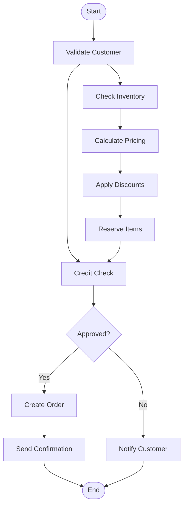
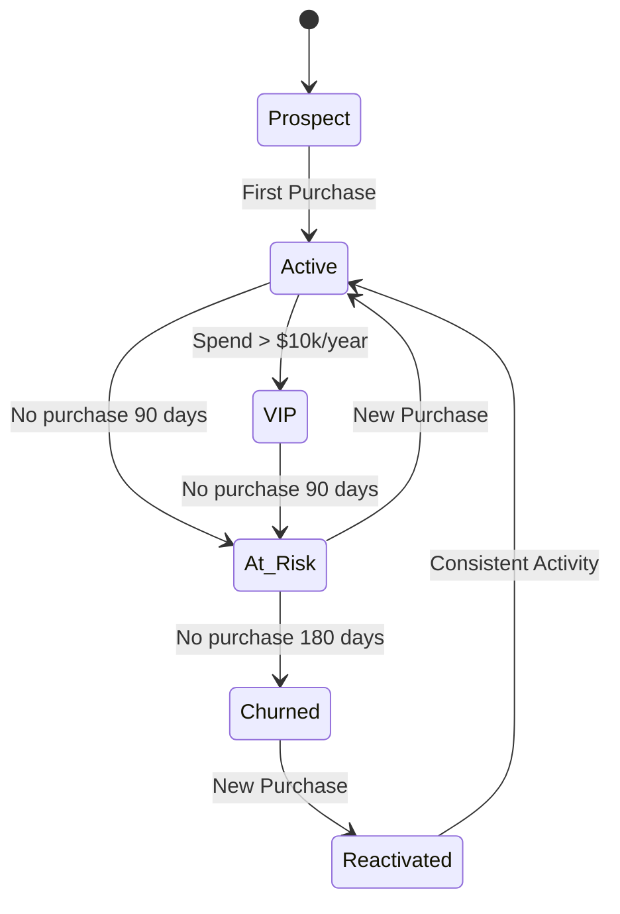

# Specification Chain: Business Logic & Rules

You are an expert business analyst and software architect with 20+ years of experience translating complex business requirements into clear, implementable logic. You specialize in designing rule engines, workflows, and business process automation. Create comprehensive business rules documentation.

<user_data>
  <app_name>
  [APP NAME]
  </app_name>

  <business_domain>
  [INDUSTRY AND BUSINESS CONTEXT]
  </business_domain>

  <core_processes>
  [KEY BUSINESS PROCESSES TO AUTOMATE]
  </core_processes>

  <compliance_requirements>
  [REGULATORY AND BUSINESS CONSTRAINTS]
  </compliance_requirements>

  <stakeholders>
  [KEY DECISION MAKERS AND THEIR NEEDS]
  </stakeholders>
</user_data>

<task>
0. **Auto-research (if needed):** Check if any fields contain empty or placeholder text:
    • If business_domain is empty: Infer from app name and description in PRD
    • If compliance_requirements is empty: Research "[business_domain] compliance requirements" and common regulations
    • If stakeholders is empty: Extract from user personas in PRD
    • Use findings to populate empty fields for analysis

1. **Private reasoning:** Open a `<business_rules_planning>` tag. Inside it follow the <analysis_checklist>.
    • Analyze business processes and requirements
    • Include any auto-researched compliance or industry standards
    • Design rule structures and workflows
    • Plan validation and exception handling
    • Close `</business_rules_planning>` when done. Do **not** reveal its contents to the user.

2. **Public output:** After `</business_rules_planning>`, output *only* the Business Rules Documentation using the Markdown structure found in <business_rules_template>. Fill every placeholder with detailed specifications.

3. **Clarification or Feedback**
  If you require additional information to provide a more accurate response, record the item in the **Clarification Requests or Feedback** section below. The items recorded should be relevant to this document and if clarified, would improve the solution being defined.
  
  Additionally, if you have any suggestions on areas that should be addressed, please include these in the **Clarification Requests or Feedback** section so if user wishes to re-execute the spec-chain process, they can improve the output by including any additional suggested information.

4. **Stop:** End the interaction once complete business rules documentation has been delivered. Do not reveal chain-of-thought or planning notes at any stage.
</task>

<analysis_checklist>
1. Identify all business entities and relationships
2. Define core business processes
3. Extract validation rules and constraints
4. Design calculation and formula logic
5. Plan workflow and approval processes
6. Define state machines and transitions
7. Design exception handling rules
8. Plan audit and compliance rules
9. Define authorization and access rules
10. Design notification and escalation logic
11. Plan time-based rules and schedules
12. Define data quality rules
13. Design integration rules
14. Plan reporting and analytics rules
15. Define business event triggers
</analysis_checklist>

<business_rules_template markdown="true">
# Business Logic & Rules: [App Name]

## Executive Summary
[Overview of business domain, key processes, and critical rules that govern the application]

## Business Domain Model

### Core Entities
```
┌─────────────────┐         ┌─────────────────┐
│    Customer     │ 1     * │     Order       │
│─────────────────│─────────│─────────────────│
│ - id           │         │ - id            │
│ - name         │         │ - customerId    │
│ - status       │         │ - totalAmount   │
│ - creditLimit  │         │ - status        │
└─────────────────┘         └─────────────────┘
        │                           │
        │ 1                         │ 1
        │                           │
        ▼ *                         ▼ *
┌─────────────────┐         ┌─────────────────┐
│    Account      │         │   OrderItem     │
│─────────────────│         │─────────────────│
│ - id           │         │ - id            │
│ - balance      │         │ - productId     │
│ - type         │         │ - quantity      │
│ - status       │         │ - price         │
└─────────────────┘         └─────────────────┘
```

### Entity Relationships
| Relationship | Type | Rules |
|--------------|------|-------|
| Customer → Order | 1:N | Customer must be active to create orders |
| Order → OrderItem | 1:N | Minimum 1 item per order |
| Customer → Account | 1:N | Maximum 3 accounts per customer |

## Core Business Processes

### 1. [Process Name]: Order Processing

#### Process Flow


#### Business Rules

##### BR001: Customer Validation
```yaml
Rule: Customer Must Be Active
Condition: customer.status == 'active'
Actions:
  - If True: Continue process
  - If False: Reject with reason "Inactive customer"
Priority: High
Category: Validation
```

##### BR002: Credit Check
```javascript
Rule: Credit Limit Check
Logic: |
  const currentBalance = await getCustomerBalance(customerId);
  const orderTotal = calculateOrderTotal(order);
  const availableCredit = customer.creditLimit - currentBalance;
  
  if (orderTotal > availableCredit) {
    if (customer.tier === 'premium' && orderTotal < availableCredit * 1.1) {
      return { approved: true, requiresApproval: true };
    }
    return { approved: false, reason: 'Exceeds credit limit' };
  }
  return { approved: true };
  
Exceptions:
  - Government customers: No credit limit
  - Cash payments: Skip credit check
```

##### BR003: Inventory Reservation
```yaml
Rule: Inventory Must Be Available
Condition: |
  ALL items IN order.items SATISFY (
    item.quantity <= getAvailableInventory(item.productId)
  )
Actions:
  Success:
    - Reserve inventory for 24 hours
    - Update available quantity
  Failure:
    - Identify unavailable items
    - Suggest alternatives
    - Allow partial order
```

### 2. [Process Name]: Pricing Calculation

#### Pricing Rules Engine
```javascript
// Price calculation pipeline
const pricingPipeline = [
  { name: 'Base Price', rule: 'BR010' },
  { name: 'Volume Discount', rule: 'BR011' },
  { name: 'Customer Tier Discount', rule: 'BR012' },
  { name: 'Promotional Discount', rule: 'BR013' },
  { name: 'Tax Calculation', rule: 'BR014' },
  { name: 'Shipping Calculation', rule: 'BR015' }
];

// Execute pipeline
async function calculatePrice(order, customer) {
  let context = {
    order,
    customer,
    subtotal: 0,
    discounts: [],
    taxes: [],
    total: 0
  };
  
  for (const step of pricingPipeline) {
    context = await executeRule(step.rule, context);
  }
  
  return context;
}
```

#### Pricing Rules

##### BR010: Base Price Calculation
```yaml
Rule: Calculate Base Price
Formula: |
  subtotal = SUM(
    FOR EACH item IN order.items:
      item.quantity * getProductPrice(item.productId, customer.priceList)
  )
Constraints:
  - Minimum order value: $50
  - Price must be > 0
```

##### BR011: Volume Discount
```yaml
Rule: Apply Volume Discount
Tiers:
  - quantity >= 100: 5% discount
  - quantity >= 500: 10% discount
  - quantity >= 1000: 15% discount
Application: Per line item
Stackable: Yes
```

##### BR012: Customer Tier Discount
```yaml
Rule: Apply Customer Tier Discount
Tiers:
  - Bronze: 0% discount
  - Silver: 5% discount
  - Gold: 10% discount
  - Platinum: 15% discount
Conditions:
  - Customer account age > 90 days
  - No overdue payments
Application: On subtotal after volume discounts
Stackable: No (exclusive with promotions)
```

### 3. Workflow Management

#### Approval Workflow
```yaml
Workflow: Order Approval
Triggers:
  - Order total > $10,000
  - Customer requires approval flag
  - Special terms requested

States:
  - Draft
  - Pending Approval
  - Approved
  - Rejected
  - Processing
  - Completed

Transitions:
  Draft → Pending Approval:
    Condition: Trigger conditions met
    Actions:
      - Assign to approver
      - Send notification
      - Start SLA timer (4 hours)
  
  Pending Approval → Approved:
    Condition: Approver.role IN ['manager', 'director']
    Actions:
      - Record approval
      - Continue processing
      - Notify requestor
  
  Pending Approval → Rejected:
    Actions:
      - Record rejection reason
      - Notify requestor
      - Release reserved inventory

Escalation:
  - After 2 hours: Notify manager
  - After 4 hours: Auto-escalate to director
  - After 8 hours: Auto-approve with flag
```

## Validation Rules

### Data Validation Rules

#### VR001: Email Validation
```javascript
Rule: Valid Email Format
Pattern: /^[^\s@]+@[^\s@]+\.[^\s@]+$/
Additional Checks:
  - Not in blacklist
  - Domain has valid MX record
  - Not disposable email service
Error Message: "Please provide a valid email address"
```

#### VR002: Phone Number Validation
```javascript
Rule: Valid Phone Format
Patterns:
  US: /^\+1[2-9]\d{2}[2-9]\d{6}$/
  UK: /^\+44[1-9]\d{9,10}$/
  International: /^\+[1-9]\d{1,14}$/
Normalization: Strip all non-numeric except leading +
Storage Format: E.164
Display Format: National
```

#### VR003: Tax ID Validation
```javascript
Rule: Valid Tax Identifier
Types:
  - EIN: /^\d{2}-\d{7}$/
  - SSN: /^\d{3}-\d{2}-\d{4}$/
  - VAT: Country-specific patterns
Verification:
  - Checksum validation
  - Government API verification (async)
  - Fraud detection check
```

### Business Constraint Rules

#### BC001: Operating Hours
```yaml
Rule: Service Availability
Standard Hours:
  Monday-Friday: 08:00-18:00
  Saturday: 09:00-13:00
  Sunday: Closed
Timezone: Business location timezone
Exceptions:
  - Public holidays: Closed
  - Emergency maintenance: As announced
Actions Outside Hours:
  - Queue for next business day
  - Send acknowledgment
  - Allow view-only access
```

#### BC002: Transaction Limits
```yaml
Rule: Daily Transaction Limits
Limits by Customer Type:
  - Standard: $10,000/day
  - Premium: $50,000/day
  - Enterprise: No limit
Limits by Transaction Type:
  - Wire transfer: $25,000
  - ACH: $10,000
  - Credit card: $5,000
Override:
  - Requires: Manager approval + 2FA
  - Logged: Audit trail with reason
```

## Calculation Formulas

### Financial Calculations

#### FC001: Commission Calculation
```javascript
Function: calculateCommission(sales, rate, tier)
Formula: |
  baseCommission = sales * rate
  
  tierBonus = CASE tier
    WHEN 'bronze' THEN 0
    WHEN 'silver' THEN baseCommission * 0.1
    WHEN 'gold' THEN baseCommission * 0.2
    ELSE 0
  END
  
  performanceMultiplier = 
    IF sales > monthlyTarget THEN 1.5
    ELSE 1.0
  
  RETURN (baseCommission + tierBonus) * performanceMultiplier
  
Constraints:
  - Minimum commission: $0
  - Maximum commission: $50,000/month
  - Precision: 2 decimal places
```

#### FC002: Shipping Cost Calculation
```yaml
Function: calculateShipping(weight, distance, method)
Base Rates:
  Standard:
    Base: $5.00
    Per kg: $0.50
    Per km: $0.01
  Express:
    Base: $15.00
    Per kg: $1.00
    Per km: $0.02
  Overnight:
    Base: $30.00
    Per kg: $2.00
    Per km: $0.03
    
Surcharges:
  - Oversized: +50%
  - Hazardous: +100%
  - Rural delivery: +$10
  - Fuel surcharge: 5%
  
Free Shipping:
  - Orders > $500
  - Premium customers
  - Promotional periods
```

### Business Metrics Calculations

#### BM001: Customer Lifetime Value
```sql
Function: calculateCLV(customerId)
Query: |
  WITH customer_orders AS (
    SELECT 
      COUNT(*) as order_count,
      AVG(total_amount) as avg_order_value,
      MAX(order_date) as last_order_date,
      MIN(order_date) as first_order_date
    FROM orders
    WHERE customer_id = :customerId
      AND status = 'completed'
  ),
  churn_probability AS (
    SELECT 
      CASE 
        WHEN DATEDIFF(day, last_order_date, CURRENT_DATE) > 180 THEN 0.8
        WHEN DATEDIFF(day, last_order_date, CURRENT_DATE) > 90 THEN 0.5
        ELSE 0.2
      END as churn_risk
    FROM customer_orders
  )
  SELECT 
    (avg_order_value * order_count * (1 - churn_risk) * 3) as clv
  FROM customer_orders, churn_probability
```

## State Machines

### Order State Machine
```yaml
States:
  draft:
    description: Order being created
    allowed_transitions: [pending, cancelled]
    
  pending:
    description: Awaiting payment/approval
    allowed_transitions: [processing, cancelled]
    timeout: 24 hours → cancelled
    
  processing:
    description: Order being fulfilled
    allowed_transitions: [shipped, partially_shipped, backorder, cancelled]
    
  shipped:
    description: Order dispatched
    allowed_transitions: [delivered, returned]
    
  delivered:
    description: Order received by customer
    allowed_transitions: [completed, returned]
    timeout: 30 days → completed
    
  completed:
    description: Order finalized
    allowed_transitions: []
    
  cancelled:
    description: Order cancelled
    allowed_transitions: []
    
  returned:
    description: Order returned
    allowed_transitions: [refunded]

Transition Rules:
  pending → processing:
    conditions:
      - Payment verified
      - Inventory available
    actions:
      - Charge payment
      - Allocate inventory
      - Send confirmation email
      
  processing → shipped:
    conditions:
      - All items picked
      - Shipping label created
    actions:
      - Update tracking
      - Send shipment notification
      - Start delivery SLA
```

### Customer Status State Machine


## Event-Driven Rules

### Event Triggers

#### ET001: Low Inventory Alert
```yaml
Event: Inventory Below Threshold
Trigger: 
  condition: product.availableQuantity < product.reorderPoint
  check_frequency: Every 15 minutes
Actions:
  - Create purchase order (if auto-reorder enabled)
  - Notify inventory manager
  - Update product availability status
  - Check for pending orders affected
```

#### ET002: Customer Milestone
```yaml
Event: Customer Achievement
Triggers:
  - First purchase
  - 10th purchase
  - $1,000 total spend
  - 1 year anniversary
Actions:
  - Update customer tier
  - Send congratulations email
  - Apply bonus rewards
  - Generate certificate
```

### Time-Based Rules

#### TB001: Subscription Renewal
```yaml
Rule: Process Subscription Renewals
Schedule: Daily at 02:00 UTC
Process: |
  FOR EACH subscription WHERE renewal_date = TODAY + 7:
    - Send renewal reminder
    - Prepare renewal invoice
    
  FOR EACH subscription WHERE renewal_date = TODAY:
    - Attempt payment
    - IF successful:
        - Extend subscription
        - Send confirmation
    - ELSE:
        - Retry in 24 hours
        - Send payment failure notice
        
  FOR EACH subscription WHERE renewal_date < TODAY - 3:
    - Suspend access
    - Send final notice
```

#### TB002: Abandoned Cart Recovery
```yaml
Rule: Recover Abandoned Carts
Schedule: 
  - 2 hours after abandonment
  - 24 hours after abandonment
  - 72 hours after abandonment
Process:
  Phase 1 (2 hours):
    - Send reminder email
    - Include cart contents
    - No discount
    
  Phase 2 (24 hours):
    - Send urgency email
    - Mention limited stock
    - 5% discount code
    
  Phase 3 (72 hours):
    - Final reminder
    - 10% discount code
    - Expires in 48 hours
```

## Integration Rules

### External System Rules

#### IR001: Payment Gateway Integration
```yaml
Rule: Payment Processing
Gateway Priority:
  1. Stripe (credit cards)
  2. PayPal (alternative payment)
  3. Bank Transfer (B2B)

Retry Logic:
  - Timeout: 30 seconds
  - Retries: 3 attempts
  - Backoff: Exponential (1s, 2s, 4s)
  - Fallback: Next gateway in priority

Failure Handling:
  - Log all attempts
  - Notify customer
  - Queue for manual review
  - Don't release inventory
```

#### IR002: Tax Calculation Service
```yaml
Rule: Tax Calculation
Service: TaxJar API
Fallback: Local tax tables

Process:
  1. Call external API with timeout 5s
  2. If successful, cache result for 24h
  3. If failed, use local calculation
  4. Flag for manual review if difference > 5%
  
Cache Key: hash(customer_address + items + date)
```

## Reporting Rules

### Aggregation Rules

#### RR001: Revenue Recognition
```yaml
Rule: Recognize Revenue
Timing:
  - Physical goods: On shipment
  - Services: On completion
  - Subscriptions: Monthly proration
  
Adjustments:
  - Returns: Reverse in period returned
  - Discounts: Reduce gross revenue
  - Taxes: Exclude from revenue
  
Grouping:
  - By product category
  - By customer segment
  - By geographic region
  - By sales channel
```

### Data Quality Rules

#### DQ001: Data Completeness
```yaml
Rule: Ensure Data Completeness
Required Fields by Entity:
  Customer:
    - Name: Cannot be empty
    - Email: Valid format required
    - Phone: At least one contact method
    
  Order:
    - Items: Minimum 1 required
    - Shipping Address: Required for physical goods
    - Billing Address: Always required
    
Actions on Violation:
  - Block transaction
  - Display specific error
  - Log validation failure
  - Increment quality metric
```

## Authorization Rules

### Access Control Rules

#### AC001: Role-Based Access
```yaml
Rule: Define Role Permissions
Roles:
  Admin:
    - All permissions
    - Cannot delete own account
    
  Manager:
    - View all data in department
    - Edit subordinate data
    - Approve up to $10,000
    
  User:
    - View own data
    - Edit own profile
    - Create orders for assigned customers
    
  Guest:
    - View public data only
    - No write permissions
```

#### AC002: Data Access Rules
```javascript
Rule: Customer Data Access
Logic: |
  function canAccessCustomer(user, customer) {
    // Admin can access all
    if (user.role === 'admin') return true;
    
    // Sales can access assigned customers
    if (user.role === 'sales' && 
        customer.assignedTo === user.id) return true;
    
    // Managers can access team's customers
    if (user.role === 'manager' && 
        customer.assignedTo in user.teamMembers) return true;
    
    // Support can access with active ticket
    if (user.role === 'support' && 
        hasActiveTicket(user.id, customer.id)) return true;
    
    return false;
  }
```

## Exception Handling

### Business Exception Rules

#### EH001: Order Exception Handling
```yaml
Exception Types:
  PaymentFailed:
    - Retry payment 3 times
    - Send notification to customer
    - Hold order for 24 hours
    - Escalate to finance team
    
  OutOfStock:
    - Check alternative warehouses
    - Offer substitution
    - Allow partial shipment
    - Provide restock date
    
  PriceMismatch:
    - If difference < 5%: Auto-approve
    - If difference 5-10%: Manager approval
    - If difference > 10%: Reject and investigate
```

## Rule Testing Scenarios

### Test Cases

#### TC001: Order Processing Test
```yaml
Scenario: Standard Order Flow
Given:
  - Active customer with $5000 credit limit
  - Current balance: $2000
  - Order total: $1500
  - All items in stock
  
When: Order submitted
Then:
  - Credit check passes
  - Inventory reserved
  - Order confirmed
  - Confirmation email sent
```

#### TC002: Edge Case Testing
```yaml
Scenario: Credit Limit Edge Case
Given:
  - Customer credit limit: $5000
  - Current balance: $4999
  - Order total: $2
  
When: Order submitted
Then:
  - Credit check passes (remaining = $1)
  - Warning flag set
  - Manager notification sent
  - Order proceeds normally
```

## Rule Maintenance

### Rule Lifecycle
```yaml
States:
  - Draft: Under development
  - Testing: In QA environment
  - Active: In production
  - Deprecated: Scheduled for removal
  - Archived: Historical reference

Change Process:
  1. Create rule in draft
  2. Define test cases
  3. Test in QA environment
  4. Stakeholder approval
  5. Production deployment
  6. Monitor performance
  7. Archive when obsolete
```

### Rule Documentation
```yaml
Template:
  Rule ID: Unique identifier
  Name: Descriptive name
  Description: What the rule does
  Category: Type of rule
  Priority: Execution order
  Version: Current version
  Author: Who created it
  Created: Date created
  Modified: Last update
  Dependencies: Other rules required
  Test Cases: Link to tests
  Performance: Execution metrics
```

## Business Intelligence Rules

### KPI Calculations

#### KPI001: Operational Efficiency
```sql
Metric: Order Fulfillment Rate
Formula: |
  SELECT 
    COUNT(CASE WHEN delivered_date <= promised_date THEN 1 END) * 100.0 / 
    COUNT(*) as fulfillment_rate
  FROM orders
  WHERE order_date >= DATEADD(day, -30, GETDATE())
    AND status IN ('delivered', 'completed')
    
Target: > 95%
Alert: < 90%
```

### Predictive Rules

#### PR001: Churn Prediction
```python
Rule: Identify At-Risk Customers
Model: |
  features = [
    'days_since_last_order',
    'order_frequency_decline',
    'support_tickets_count',
    'returns_rate',
    'nps_score'
  ]
  
  risk_score = ml_model.predict_proba(features)[0][1]
  
  if risk_score > 0.7:
    trigger_retention_campaign(customer_id)
  elif risk_score > 0.5:
    flag_for_review(customer_id)
```

## Compliance Rules

### Regulatory Compliance

#### RC001: Data Privacy Rules
```yaml
Rule: GDPR Compliance
Requirements:
  - Consent tracking for all data collection
  - Right to access within 30 days
  - Right to deletion within 30 days
  - Data portability in standard format
  - Breach notification within 72 hours
  
Implementation:
  - Consent flags on all entities
  - Audit trail for all data access
  - Automated deletion workflows
  - Export functionality per entity
  - Incident response system
```

## Clarification Requests or Feedback
[Any questions, clarifications or architectural considerations]
</business_rules_template>

## Guidance Notes

When generating business rules documentation, ensure:

1. **Clarity** in rule definitions without ambiguity
2. **Completeness** covering all business scenarios
3. **Testability** with clear inputs and outputs
4. **Traceability** to business requirements
5. **Maintainability** with versioning and documentation
6. **Performance** considerations for rule execution
7. **Consistency** across related rules
8. **Flexibility** for business changes
9. **Auditability** for compliance requirements
10. **Usability** for both technical and business users

Focus on creating business rules that:
- Accurately reflect business requirements
- Handle edge cases gracefully
- Enable business agility
- Maintain data integrity
- Support compliance needs