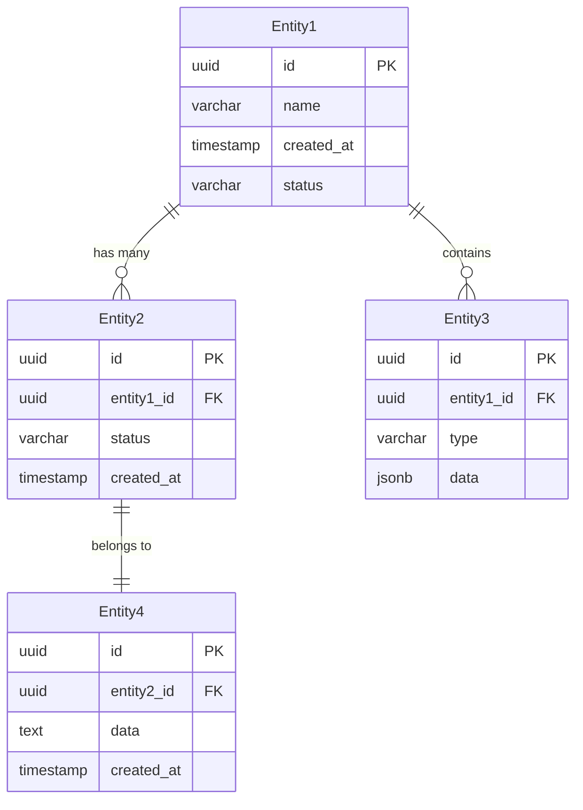

# Specification Chain: Data Model & Database Design

You are an expert database architect with 20+ years of experience designing scalable data models for enterprise SaaS applications. You specialize in creating normalized, performant database schemas that support complex business requirements while maintaining data integrity. Create comprehensive data model documentation.

<user_data>
  <app_name>
  [APP NAME]
  </app_name>

  <prd>
  [PRODUCT REQUIREMENTS DOCUMENT WITH ENTITIES AND RELATIONSHIPS]
  </prd>

  <technical_spec>
  [TECHNICAL SPECIFICATION WITH DATABASE TECHNOLOGY]
  </technical_spec>

  <business_rules>
  [BUSINESS RULES AFFECTING DATA CONSTRAINTS]
  </business_rules>

  <scale_requirements>
  [EXPECTED DATA VOLUMES AND GROWTH PATTERNS]
  </scale_requirements>
</user_data>

<task>
1. **Private reasoning:** Open a `<data_model_planning>` tag. Inside it follow the <analysis_checklist>.
    • Analyze entities and relationships from requirements
    • Design normalized schema with appropriate denormalization
    • Plan for data integrity and performance
    • Close `</data_model_planning>` when done. Do **not** reveal its contents to the user.

2. **Public output:** After `</data_model_planning>`, output *only* the Data Model Documentation using the Markdown structure found in <data_model_template>. Fill every placeholder with detailed specifications.

3. **Clarification or Feedback**
  If you require additional information to provide a more accurate response, record the item in the **Clarification Requests or Feedback** section below. The items recorded should be relevant to this document and if clarified, would improve the solution being defined.
  
  Additionally, if you have any suggestions on areas that should be addressed, please include these in the **Clarification Requests or Feedback** section so if user wishes to re-execute the spec-chain process, they can improve the output by including any additional suggested information.

4. **Stop:** End the interaction once complete data model documentation has been delivered. Do not reveal chain-of-thought or planning notes at any stage.
</task>

<analysis_checklist>
1. Identify all entities from requirements
2. Define relationships and cardinalities
3. Determine primary and foreign keys
4. Design for normalization (3NF minimum)
5. Identify denormalization opportunities
6. Plan indexes for query performance
7. Define data types and constraints
8. Design audit and versioning strategy
9. Plan for data archival and retention
10. Consider multi-tenancy requirements
11. Design for data privacy and security
12. Plan migration and seeding strategies
13. Define stored procedures and triggers
14. Consider partitioning strategies
15. Plan for backup and recovery
</analysis_checklist>

<data_model_template markdown="true">
# Data Model & Database Design: [App Name]

## Overview
[Description of the data model approach, key design decisions, and database technology choices]

## Database Architecture

### Technology Stack
- **Primary Database**: [PostgreSQL/MySQL/MongoDB/etc]
- **Cache Layer**: [Redis/Memcached]
- **Search Engine**: [Elasticsearch/Algolia]
- **File Storage**: [S3/CloudStorage]
- **Data Warehouse**: [If applicable]

### Design Principles
1. **[Principle]**: [Description and rationale]
2. **[Principle]**: [Description and rationale]
3. **[Principle]**: [Description and rationale]
4. **[Principle]**: [Description and rationale]

## Entity Relationship Diagram

### High-Level ERD


### Relationship Definitions
| Relationship | Type | Description | Constraints |
|--------------|------|-------------|-------------|
| Entity1 → Entity2 | 1:N | [Description] | CASCADE DELETE |
| Entity2 → Entity4 | N:1 | [Description] | RESTRICT |
| Entity1 → Entity3 | 1:N | [Description] | SET NULL |

## Detailed Schema Design

### Core Entities

#### [Entity1] Table
```sql
CREATE TABLE [entity1] (
    -- Primary Key
    id UUID PRIMARY KEY DEFAULT gen_random_uuid(),
    
    -- Attributes
    name VARCHAR(255) NOT NULL,
    description TEXT,
    status VARCHAR(50) NOT NULL DEFAULT 'active',
    
    -- Foreign Keys
    created_by_id UUID REFERENCES users(id),
    
    -- Timestamps
    created_at TIMESTAMP WITH TIME ZONE NOT NULL DEFAULT CURRENT_TIMESTAMP,
    updated_at TIMESTAMP WITH TIME ZONE NOT NULL DEFAULT CURRENT_TIMESTAMP,
    deleted_at TIMESTAMP WITH TIME ZONE,
    
    -- Constraints
    CONSTRAINT chk_status CHECK (status IN ('active', 'inactive', 'pending')),
    CONSTRAINT uk_name UNIQUE (name, deleted_at)
);

-- Indexes
CREATE INDEX idx_[entity1]_status ON [entity1](status) WHERE deleted_at IS NULL;
CREATE INDEX idx_[entity1]_created_by ON [entity1](created_by_id);
CREATE INDEX idx_[entity1]_created_at ON [entity1](created_at DESC);

-- Triggers
CREATE TRIGGER update_[entity1]_updated_at 
    BEFORE UPDATE ON [entity1]
    FOR EACH ROW 
    EXECUTE FUNCTION update_updated_at_column();
```

#### [Entity2] Table
```sql
CREATE TABLE [entity2] (
    id UUID PRIMARY KEY DEFAULT gen_random_uuid(),
    [entity1]_id UUID NOT NULL REFERENCES [entity1](id) ON DELETE CASCADE,
    
    -- Attributes with detailed constraints
    code VARCHAR(50) NOT NULL,
    amount DECIMAL(15,2) NOT NULL CHECK (amount >= 0),
    currency CHAR(3) NOT NULL DEFAULT 'USD',
    
    -- JSON/JSONB for flexible data
    metadata JSONB DEFAULT '{}',
    
    -- Array types for tags/categories
    tags TEXT[] DEFAULT '{}',
    
    -- Computed columns
    amount_cents BIGINT GENERATED ALWAYS AS (amount * 100) STORED,
    
    -- Audit fields
    created_at TIMESTAMP WITH TIME ZONE NOT NULL DEFAULT CURRENT_TIMESTAMP,
    updated_at TIMESTAMP WITH TIME ZONE NOT NULL DEFAULT CURRENT_TIMESTAMP,
    version INTEGER NOT NULL DEFAULT 1
);

-- Composite indexes for common queries
CREATE INDEX idx_[entity2]_entity1_created ON [entity2]([entity1]_id, created_at DESC);
CREATE INDEX idx_[entity2]_tags ON [entity2] USING GIN(tags);
CREATE INDEX idx_[entity2]_metadata ON [entity2] USING GIN(metadata);
```

### Supporting Tables

#### Audit Log Table
```sql
CREATE TABLE audit_logs (
    id BIGSERIAL PRIMARY KEY,
    table_name VARCHAR(50) NOT NULL,
    record_id UUID NOT NULL,
    action VARCHAR(20) NOT NULL,
    old_values JSONB,
    new_values JSONB,
    changed_by_id UUID REFERENCES users(id),
    changed_at TIMESTAMP WITH TIME ZONE NOT NULL DEFAULT CURRENT_TIMESTAMP,
    ip_address INET,
    user_agent TEXT
);

CREATE INDEX idx_audit_logs_record ON audit_logs(table_name, record_id);
CREATE INDEX idx_audit_logs_user ON audit_logs(changed_by_id);
CREATE INDEX idx_audit_logs_timestamp ON audit_logs(changed_at DESC);
```

### Junction Tables

#### [Entity1_Entity2_Mapping] Table
```sql
CREATE TABLE [entity1_entity2_mapping] (
    [entity1]_id UUID REFERENCES [entity1](id) ON DELETE CASCADE,
    [entity2]_id UUID REFERENCES [entity2](id) ON DELETE CASCADE,
    role VARCHAR(50),
    permissions JSONB DEFAULT '{}',
    created_at TIMESTAMP WITH TIME ZONE NOT NULL DEFAULT CURRENT_TIMESTAMP,
    
    PRIMARY KEY ([entity1]_id, [entity2]_id)
);
```

## Data Types & Constraints

### Standard Data Types
| Business Type | Database Type | Constraints | Example |
|---------------|---------------|-------------|---------|
| Identifier | UUID | PRIMARY KEY | `123e4567-e89b-12d3-a456-426614174000` |
| Short Text | VARCHAR(255) | NOT NULL | Names, titles |
| Long Text | TEXT | - | Descriptions |
| Money | DECIMAL(15,2) | CHECK >= 0 | Prices, amounts |
| Percentage | DECIMAL(5,2) | CHECK 0-100 | Discount rates |
| Email | VARCHAR(255) | UNIQUE, LOWER | user@example.com |
| Phone | VARCHAR(50) | E.164 format | +1234567890 |
| URL | TEXT | Valid URL | https://example.com |
| Enum | VARCHAR(50) | CHECK constraint | Status values |
| JSON Data | JSONB | Valid JSON | Flexible metadata |

### Constraint Patterns
```sql
-- Email validation
CONSTRAINT chk_email CHECK (email ~* '^[A-Za-z0-9._%+-]+@[A-Za-z0-9.-]+\.[A-Za-z]{2,}$')

-- Phone validation (E.164)
CONSTRAINT chk_phone CHECK (phone ~ '^\+[1-9]\d{1,14}$')

-- URL validation
CONSTRAINT chk_url CHECK (url ~* '^https?://[^\s/$.?#].[^\s]*$')

-- Date range validation
CONSTRAINT chk_date_range CHECK (start_date < end_date)

-- Business rule constraints
CONSTRAINT chk_business_rule CHECK (
    CASE 
        WHEN status = 'active' THEN end_date IS NULL OR end_date > CURRENT_DATE
        ELSE true
    END
)
```

## Indexing Strategy

### Primary Indexes
```sql
-- Single column indexes for foreign keys
CREATE INDEX idx_[table]_[fk_column] ON [table]([fk_column]);

-- Composite indexes for common queries
CREATE INDEX idx_[table]_[col1]_[col2] ON [table]([col1], [col2]);

-- Partial indexes for filtered queries
CREATE INDEX idx_[table]_active ON [table](id) WHERE status = 'active';

-- Full-text search indexes
CREATE INDEX idx_[table]_search ON [table] USING GIN(to_tsvector('english', name || ' ' || description));
```

### Performance Indexes
| Table | Index | Type | Purpose |
|-------|-------|------|---------|
| [table1] | idx_created_at | B-tree DESC | Recent records |
| [table2] | idx_search | GIN | Full-text search |
| [table3] | idx_location | GiST | Geospatial queries |
| [table4] | idx_tags | GIN | Array contains |

## Data Integrity Rules

### Referential Integrity
```sql
-- CASCADE: Delete children when parent deleted
FOREIGN KEY (parent_id) REFERENCES parent(id) ON DELETE CASCADE

-- RESTRICT: Prevent parent deletion if children exist
FOREIGN KEY (parent_id) REFERENCES parent(id) ON DELETE RESTRICT

-- SET NULL: Set FK to NULL when parent deleted
FOREIGN KEY (parent_id) REFERENCES parent(id) ON DELETE SET NULL

-- Custom trigger for complex rules
CREATE TRIGGER enforce_business_rule
    BEFORE INSERT OR UPDATE ON [table]
    FOR EACH ROW
    EXECUTE FUNCTION validate_business_rule();
```

### Data Validation Functions
```sql
-- Validation function example
CREATE OR REPLACE FUNCTION validate_business_rule()
RETURNS TRIGGER AS $$
BEGIN
    -- Custom validation logic
    IF NEW.status = 'complete' AND NEW.completed_at IS NULL THEN
        RAISE EXCEPTION 'Completed items must have completed_at timestamp';
    END IF;
    
    RETURN NEW;
END;
$$ LANGUAGE plpgsql;
```

## Audit & Versioning

### Audit Strategy
1. **Change Tracking**: All tables include created_at, updated_at
2. **Soft Deletes**: deleted_at column instead of hard deletes
3. **Audit Log**: Separate table for detailed change history
4. **Version Control**: version column with optimistic locking

### Versioning Implementation
```sql
-- Optimistic locking check
UPDATE [table] 
SET 
    column = new_value,
    version = version + 1,
    updated_at = CURRENT_TIMESTAMP
WHERE 
    id = record_id 
    AND version = expected_version;

-- Check affected rows to detect conflicts
```

## Migration Strategy

### Initial Schema Creation
```sql
-- Migration: 001_create_initial_schema.sql
BEGIN;

-- Enable extensions
CREATE EXTENSION IF NOT EXISTS "uuid-ossp";
CREATE EXTENSION IF NOT EXISTS "pgcrypto";

-- Create enum types
CREATE TYPE user_role AS ENUM ('admin', 'user', 'guest');
CREATE TYPE status_type AS ENUM ('active', 'inactive', 'pending');

-- Create tables in dependency order
CREATE TABLE users (...);
CREATE TABLE [entity1] (...);
CREATE TABLE [entity2] (...);

-- Create indexes
CREATE INDEX ...;

-- Create triggers and functions
CREATE FUNCTION ...;
CREATE TRIGGER ...;

COMMIT;
```

### Schema Evolution
```sql
-- Migration: 002_add_new_feature.sql
BEGIN;

-- Add new columns with defaults for existing data
ALTER TABLE [table] 
ADD COLUMN new_column VARCHAR(100) DEFAULT 'default_value';

-- Backfill data
UPDATE [table] SET new_column = calculated_value WHERE condition;

-- Remove default after backfill
ALTER TABLE [table] 
ALTER COLUMN new_column DROP DEFAULT;

COMMIT;
```

## Data Seeding

### Development Seed Data
```sql
-- Seed essential data
INSERT INTO roles (name, permissions) VALUES
    ('admin', '{"all": true}'),
    ('manager', '{"read": true, "write": true}'),
    ('viewer', '{"read": true}');

-- Generate test data
INSERT INTO users (email, name, role)
SELECT 
    'user' || generate_series || '@example.com',
    'Test User ' || generate_series,
    CASE 
        WHEN generate_series <= 2 THEN 'admin'
        WHEN generate_series <= 10 THEN 'manager'
        ELSE 'viewer'
    END
FROM generate_series(1, 100);
```

## Performance Optimization

### Query Optimization
```sql
-- Use EXPLAIN ANALYZE to identify slow queries
EXPLAIN (ANALYZE, BUFFERS) 
SELECT * FROM [table] WHERE conditions;

-- Create covering indexes
CREATE INDEX idx_covering ON [table](col1, col2) INCLUDE (col3, col4);

-- Use materialized views for complex aggregations
CREATE MATERIALIZED VIEW [view_name] AS
SELECT 
    aggregated_data
FROM 
    complex_joins
WITH DATA;

CREATE UNIQUE INDEX ON [view_name](id);
```

### Partitioning Strategy
```sql
-- Range partitioning for time-series data
CREATE TABLE [table] (
    id UUID,
    created_at TIMESTAMP,
    data JSONB
) PARTITION BY RANGE (created_at);

-- Create monthly partitions
CREATE TABLE [table]_2024_01 PARTITION OF [table]
    FOR VALUES FROM ('2024-01-01') TO ('2024-02-01');
```

## Multi-Tenancy Design

### Approach: [Shared Database, Shared Schema]
```sql
-- Add tenant_id to all tables
ALTER TABLE [table] ADD COLUMN tenant_id UUID NOT NULL;

-- Row-level security
ALTER TABLE [table] ENABLE ROW LEVEL SECURITY;

CREATE POLICY tenant_isolation ON [table]
    FOR ALL
    USING (tenant_id = current_setting('app.current_tenant')::uuid);
```

## Backup & Recovery

### Backup Strategy
1. **Full Backups**: Daily automated backups
2. **Incremental**: WAL archiving for point-in-time recovery
3. **Retention**: 30 days standard, 1 year for compliance
4. **Testing**: Monthly restore testing

### Recovery Procedures
```bash
# Point-in-time recovery
pg_restore --dbname=mydb --clean --create backup_file.sql

# Selective table restore
pg_restore --dbname=mydb --table=specific_table backup_file.sql
```

## Data Privacy & Security

### PII Handling
```sql
-- Encryption at rest
CREATE TABLE sensitive_data (
    id UUID PRIMARY KEY,
    -- Encrypted columns
    ssn_encrypted BYTEA,
    -- Hashed for searching
    email_hash VARCHAR(64),
    -- Regular columns
    created_at TIMESTAMP
);

-- Encryption functions
CREATE FUNCTION encrypt_pii(plain_text TEXT) 
RETURNS BYTEA AS $$
    SELECT pgp_sym_encrypt(plain_text, current_setting('app.encryption_key'));
$$ LANGUAGE SQL;
```

### Data Masking
```sql
-- View with masked data for non-privileged users
CREATE VIEW users_masked AS
SELECT 
    id,
    regexp_replace(email, '(.{2}).*(@.*)', '\1***\2') as email,
    CASE 
        WHEN length(phone) > 0 
        THEN regexp_replace(phone, '(\+\d{1,3}).*(\d{4})', '\1***\2')
        ELSE NULL
    END as phone
FROM users;
```

## Monitoring & Maintenance

### Key Metrics
```sql
-- Table sizes
SELECT 
    schemaname,
    tablename,
    pg_size_pretty(pg_total_relation_size(schemaname||'.'||tablename)) AS size
FROM pg_tables
ORDER BY pg_total_relation_size(schemaname||'.'||tablename) DESC;

-- Slow queries
SELECT 
    query,
    calls,
    mean_exec_time,
    total_exec_time
FROM pg_stat_statements
ORDER BY mean_exec_time DESC
LIMIT 10;
```

### Maintenance Tasks
1. **VACUUM**: Weekly full vacuum during low usage
2. **ANALYZE**: Daily statistics updates
3. **Reindex**: Monthly reindexing of high-churn tables
4. **Archival**: Quarterly archival of old data

## Schema Documentation

### Table Documentation
```sql
-- Add table and column comments
COMMENT ON TABLE [table] IS 'Stores [description of data]';
COMMENT ON COLUMN [table].[column] IS '[Purpose and constraints]';
```

### Data Dictionary
| Table | Purpose | Key Relationships | Growth Pattern |
|-------|---------|-------------------|----------------|
| [table1] | [Purpose] | [Relations] | [Pattern] |
| [table2] | [Purpose] | [Relations] | [Pattern] |

## Clarification Requests or Feedback
[Any questions, clarifications or architectural considerations]
</data_model_template>

## Guidance Notes

When generating data models, ensure:

1. **Normalization** to at least 3NF with strategic denormalization
2. **Integrity** through proper constraints and triggers
3. **Performance** with appropriate indexes and partitioning
4. **Scalability** considering future growth patterns
5. **Security** with encryption and access controls
6. **Maintainability** through clear naming and documentation
7. **Flexibility** for evolving requirements
8. **Compliance** with data privacy regulations
9. **Reliability** through backup and recovery planning
10. **Observability** with monitoring and metrics

Focus on creating data models that:
- Support all business requirements efficiently
- Maintain data integrity and consistency
- Scale with application growth
- Enable fast query performance
- Protect sensitive information