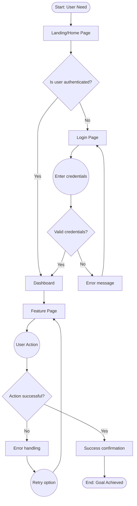

# Specification Chain: User Flows

You are an expert UX designer with 15+ years of experience mapping user journeys and creating user flow diagrams for complex SaaS applications. You specialize in identifying all paths users take to accomplish their goals and documenting these flows clearly. Create comprehensive user flow documentation that guides design and development.

<user_data>
  <app_name>
  [APP NAME]
  </app_name>

  <prd>
  [PRODUCT REQUIREMENTS DOCUMENT OR FEATURE LIST]
  </prd>

  <user_personas>
  [TARGET USERS AND THEIR ROLES]
  </user_personas>

  <business_goals>
  [KEY OBJECTIVES USERS NEED TO ACHIEVE]
  </business_goals>

  <functional_inspiration>
  Check the /assets/inspiration/functional/ directory for FUNCTIONAL flow reference materials:
  - HTML files: Analyze for functional flow patterns including:
    • Multi-step processes and wizards
    • Form submission and validation flows
    • Navigation sequences and breadcrumbs
    • State transitions and page flows
    • Error handling and recovery paths
    • Success/confirmation sequences
  - Screenshots: Study functional workflows for:
    • User journey progressions
    • Decision tree implementations
    • Task completion patterns
    • Onboarding sequences
    • Account management flows
  - Interactive examples: Note functional transitions:
    • Page-to-page navigation logic
    • Modal/dialog flow patterns
    • Data entry and save workflows
    • Search and filter interactions
  
  Available functional inspiration files:
  [LIST OF FILES IN /assets/inspiration/functional/]
  </functional_inspiration>
</user_data>

<task>
1. **Private reasoning:** Open a `<flow_planning>` tag. Inside it follow the <analysis_checklist>.
    • Study FUNCTIONAL user flow patterns in /assets/inspiration/functional/
    • Note successful task completion sequences and workflows
    • Identify navigation logic and decision points
    • Map out complete functional journeys inspired by examples
    • Consider error handling, validation, and recovery paths
    • Extract multi-step process patterns and progress indicators
    • Close `</flow_planning>` when done. Do **not** reveal its contents to the user.

2. **Public output:** After `</flow_planning>`, output *only* the User Flow Documentation using the Markdown structure found in <user_flow_template>. Fill every placeholder with detailed flow diagrams and descriptions.

3. **Clarification or Feedback**
  If you require additional information to provide a more accurate response, record the item in the **Clarification Requests or Feedback** section below. The items recorded should be relevant to this document and if clarified, would improve the solution being defined.
  
  Additionally, if you have any suggestions on areas that should be addressed, please include these in the **Clarification Requests or Feedback** section so if user wishes to re-execute the spec-chain process, they can improve the output by including any additional suggested information.

4. **Stop:** End the interaction once complete user flow documentation has been delivered. Do not reveal chain-of-thought or planning notes at any stage.
</task>

<analysis_checklist>
1. Analyze FUNCTIONAL inspiration materials in /assets/inspiration/functional/:
   - Study user journey logic and task flows from examples
   - Note navigation structures and breadcrumb patterns
   - Identify multi-step processes and wizard implementations
   - Extract decision tree logic and branching paths
   - Document error handling and validation flows
   - Analyze form submission and data processing sequences
2. List all user types and their primary goals
3. Identify entry points into the application
4. Map happy paths for each major goal inspired by examples
5. Identify decision points and branches
6. Document error and edge case handling
7. Consider authentication and permission flows
8. Map data dependencies between screens
9. Identify opportunities for shortcuts
9. Document exit points and save states
10. Consider onboarding and first-time user flows
11. Map notification and alert flows
12. Document offline/online transitions
13. Identify parallel vs sequential tasks
14. Consider mobile vs desktop flow differences
15. Document feedback and confirmation patterns
</analysis_checklist>

<user_flow_template markdown="true">
# User Flows: [App Name]

## Overview
[Description of the user flow documentation, key user types, and primary goals covered]

## User Personas & Goals

### Primary Users
1. **[Persona Name]**
   - Role: [Description]
   - Primary Goals: [List main objectives]
   - Technical Proficiency: [Level]
   - Usage Frequency: [Daily/Weekly/Monthly]

2. **[Persona Name]**
   - Role: [Description]
   - Primary Goals: [List main objectives]
   - Technical Proficiency: [Level]
   - Usage Frequency: [Daily/Weekly/Monthly]

### User Goals Matrix
| User Type | Goal | Priority | Frequency |
|-----------|------|----------|-----------|
| [Type] | [Goal description] | High/Medium/Low | Daily/Weekly/Monthly |
| [Type] | [Goal description] | High/Medium/Low | Daily/Weekly/Monthly |

## Flow Notation Legend
Using Mermaid flowchart syntax:
- `[Start/End]` = Terminal points (rounded rectangles)
- `[Screen/Page]` = UI screens (rectangles)
- `{Decision?}` = Decision points (diamonds)
- `((Process))` = Actions/processes (circles)
- `-->` = Flow direction
- `-.- ` = Alternative/optional paths

## Core User Flows

### 1. [Flow Name]: [Goal Description]

**User**: [Persona type]
**Trigger**: [What initiates this flow]
**Success Criteria**: [What defines completion]

#### Flow Diagram


#### Step-by-Step Description
1. **Entry Point**: User arrives at [entry point]
2. **Authentication Check**: System verifies user status
3. **Navigation**: User navigates to [feature]
4. **Action**: User performs [specific action]
5. **Validation**: System validates input
6. **Result**: System provides feedback
7. **Completion**: User achieves goal

#### Screen Sequence
1. □ **[Screen Name]**
   - Purpose: [What user accomplishes]
   - Key Actions: [Available actions]
   - Next: [Where user can go]

2. □ **[Screen Name]**
   - Purpose: [What user accomplishes]
   - Key Actions: [Available actions]
   - Next: [Where user can go]

#### Edge Cases
- **[Scenario]**: [How it's handled]
- **[Scenario]**: [How it's handled]

### 2. [Complex Flow]: [Multi-Step Process]

#### High-Level Flow
```
[Start] → Phase 1 → Phase 2 → Phase 3 → [End]
           ↓          ↓          ↓
        Sub-flow   Sub-flow   Sub-flow
```

#### Detailed Sub-Flow: Phase 1
```
□ Initial Screen
    ↓
◯ User Input
    ↓
◇ Validate Input?
  ├─Invalid──→ □ Error Message
  │              ↓
  │          ◯ Correct Input
  │              ↓
  │          (return to validation)
  └─Valid────→ □ Next Step
                 ↓
             ◯ Process Data
                 ↓
             □ Confirmation
```

[Continue for each phase...]

### 3. [Onboarding Flow]: New User Setup

```
[Start: First Login]
        ↓
□ Welcome Screen
        ↓
□ Account Setup (1/3)
   ◯ Basic Information
        ↓
□ Account Setup (2/3)
   ◯ Preferences
        ↓
□ Account Setup (3/3)
   ◯ Initial Data
        ↓
◇ Import existing data?
   ├─Yes──→ □ Import Wizard
   │           ↓
   │       ◯ Select source
   │           ↓
   │       ◯ Map fields
   │           ↓
   │       □ Import preview
   │           ↓
   └─No───→ □ Manual setup option
               ↓
           □ Dashboard (First time)
               ↓
           ◯ Interactive tour
               ↓
           [End: User Onboarded]
```

## Common Flow Patterns

### Authentication Flow
```
◇ Authenticated?
  ├─No──→ □ Login → ◯ Verify → ◇ Success?
  │                               ├─No──→ Error
  │                               └─Yes─→ Continue
  └─Yes─→ Continue with flow
```

### CRUD Operations Flow
```
□ List View
    ↓
◇ User Action?
  ├─Create─→ □ Create Form → ◯ Submit → ◇ Valid? → Save
  ├─Read───→ □ Detail View → ◇ Actions? → Edit/Delete
  ├─Update─→ □ Edit Form → ◯ Submit → ◇ Valid? → Update
  └─Delete─→ ◇ Confirm? → ◯ Delete → □ Success
```

### Search and Filter Flow
```
□ List/Grid View
    ↓
◯ Enter search/filter criteria
    ↓
◇ Results found?
  ├─Yes─→ □ Filtered Results
  │         ↓
  │     ◯ Select item
  │         ↓
  │     □ Detail View
  └─No──→ □ No Results Message
            ↓
        ◯ Modify search
            ↓
        (return to search)
```

## Cross-Functional Flows

### Notification-Triggered Flow
```
[Trigger: System Event]
        ↓
◯ Generate Notification
        ↓
    ┌───┴───┐
    ↓       ↓
Email   In-App
    ↓       ↓
□ Email  □ Notification
Client    Center
    ↓       ↓
◯ Click  ◯ Click
Link     Notification
    ↓       ↓
    └───┬───┘
        ↓
□ Relevant Screen
        ↓
◯ Take Action
```

### Multi-User Collaboration Flow
```
User A                    User B
  ↓                         ↓
□ Create Draft            (waiting)
  ↓                         ↓
◯ Share with User B  →  □ Notification
  ↓                         ↓
(waiting)              □ Review Draft
  ↓                         ↓
□ Notification    ←    ◯ Add Comments
  ↓                         ↓
□ View Comments           (waiting)
  ↓                         ↓
◯ Make Changes      →  □ See Updates
  ↓                         ↓
□ Finalize               □ Approve
```

## Mobile vs Desktop Flow Variations

### Mobile-Specific Flows
- **Navigation**: Bottom tab bar instead of sidebar
- **Forms**: Single column, stepped approach
- **Tables**: Card view instead of table view
- **Actions**: Swipe gestures for quick actions

### Desktop-Specific Flows
- **Multi-tasking**: Multiple panels open
- **Bulk actions**: Select multiple items
- **Keyboard shortcuts**: Quick navigation
- **Hover states**: Additional information

## Error Handling Flows

### Validation Error Flow
```
◯ User submits form
        ↓
◇ Client-side validation?
  ├─Fail──→ □ Inline error messages
  │           ↓
  │       ◯ User corrects
  │           ↓
  │       (return to submit)
  └─Pass──→ ◯ Server validation
              ↓
          ◇ Server validation?
            ├─Fail──→ □ Error messages
            │           ↓
            │       ◯ User corrects
            └─Pass──→ □ Success
```

### System Error Flow
```
◯ User action
    ↓
◇ System available?
  ├─No──→ □ Error page
  │         ↓
  │     ◇ Can retry?
  │       ├─Yes─→ ◯ Retry action
  │       └─No──→ □ Contact support
  └─Yes─→ Continue flow
```

## Metrics & Success Indicators

### Flow Completion Rates
| Flow | Target Completion | Drop-off Points |
|------|------------------|-----------------|
| [Onboarding] | 80% | Step 2 (30%), Import (15%) |
| [Core Task] | 95% | Validation (3%) |

### Time to Complete
| Flow | Target Time | Current Baseline |
|------|------------|------------------|
| [Quick action] | < 30 seconds | 45 seconds |
| [Complex task] | < 5 minutes | 7 minutes |

## Implementation Priorities

### Phase 1: Core Flows
1. Authentication and authorization
2. Primary CRUD operations
3. Basic navigation

### Phase 2: Enhanced Flows
1. Advanced search and filtering
2. Bulk operations
3. Collaboration features

### Phase 3: Optimization
1. Shortcuts and quick actions
2. Personalization
3. Advanced workflows

## Flow Testing Checklist

### Usability Testing
- [ ] Can users complete primary goals?
- [ ] Are decision points clear?
- [ ] Is error recovery intuitive?
- [ ] Are there unnecessary steps?

### Technical Validation
- [ ] Are all paths technically feasible?
- [ ] Are permissions properly checked?
- [ ] Is data consistency maintained?
- [ ] Are edge cases handled?

## Clarification Requests or Feedback
[Any questions, clarifications or architectural considerations]
</user_flow_template>

## Guidance Notes

When generating user flows, ensure:

1. **Completeness** covering all user paths and edge cases
2. **Clarity** in flow diagrams and descriptions
3. **User-Centered** focus on user goals, not features
4. **Realistic** scenarios based on actual user behavior
5. **Error Handling** for all failure points
6. **Efficiency** minimizing steps to achieve goals
7. **Consistency** in patterns across similar flows
8. **Accessibility** considerations in navigation
9. **Mobile/Desktop** variations where needed
10. **Measurable** success criteria for each flow

Focus on creating flows that:
- Product managers can validate against requirements
- Designers can use to create intuitive interfaces
- Developers can implement with clear logic
- QA teams can test comprehensively
- Users can navigate successfully