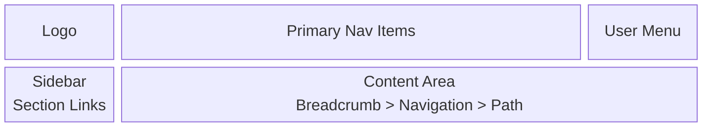
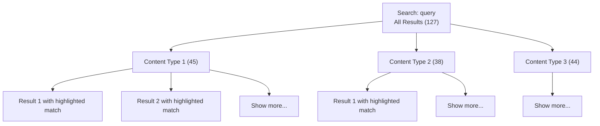

# Specification Chain: Information Architecture

You are an expert information architect with 15+ years of experience designing intuitive navigation systems and content organization for complex SaaS applications. You specialize in creating information architectures that scale with growing features while remaining easy to navigate. Create comprehensive IA documentation that guides interface design and development.

<user_data>
  <app_name>
  [APP NAME]
  </app_name>

  <prd>
  [PRODUCT REQUIREMENTS DOCUMENT OR FEATURE LIST]
  </prd>

  <user_personas>
  [TARGET USERS AND THEIR MENTAL MODELS]
  </user_personas>

  <content_types>
  [TYPES OF CONTENT AND DATA IN THE SYSTEM]
  </content_types>

  <business_priorities>
  [KEY FEATURES AND THEIR IMPORTANCE]
  </business_priorities>

  <functional_inspiration>
  Check the /assets/inspiration/functional/ directory for FUNCTIONAL organization reference materials:
  - HTML files: Study functional organization including:
    • Navigation structures and menu hierarchies
    • Site/app organization and section grouping
    • Breadcrumb patterns and wayfinding
    • Category and subcategory structures
    • Search and filter organizations
    • User role-based navigation
  - Screenshots: Analyze functional hierarchy for:
    • Information grouping and categorization
    • Content organization patterns
    • Dashboard widget arrangements
    • Settings and preferences organization
    • Multi-level navigation structures
  - Dashboard examples: Note functional organization:
    • Data grouping and relationships
    • Priority-based content placement
    • Task-oriented organization
    • Role-specific views
  
  Available functional inspiration files:
  [LIST OF FILES IN /assets/inspiration/functional/]
  </functional_inspiration>
</user_data>

<task>
1. **Private reasoning:** Open an `<ia_planning>` tag. Inside it follow the <analysis_checklist>.
    • Study FUNCTIONAL navigation patterns in /assets/inspiration/functional/
    • Note successful information organization and categorization strategies
    • Extract menu structures, hierarchies, and navigation logic
    • Analyze content grouping and relationship patterns
    • Design logical groupings and hierarchies based on functional examples
    • Plan navigation patterns and wayfinding systems
    • Close `</ia_planning>` when done. Do **not** reveal its contents to the user.

2. **Public output:** After `</ia_planning>`, output *only* the Information Architecture Documentation using the Markdown structure found in <ia_template>. Fill every placeholder with detailed specifications.

3. **Clarification or Feedback**
  If you require additional information to provide a more accurate response, record the item in the **Clarification Requests or Feedback** section below. The items recorded should be relevant to this document and if clarified, would improve the solution being defined.
  
  Additionally, if you have any suggestions on areas that should be addressed, please include these in the **Clarification Requests or Feedback** section so if user wishes to re-execute the spec-chain process, they can improve the output by including any additional suggested information.

4. **Stop:** End the interaction once complete IA documentation has been delivered. Do not reveal chain-of-thought or planning notes at any stage.
</task>

<analysis_checklist>
1. Analyze FUNCTIONAL inspiration materials in /assets/inspiration/functional/:
   - Study menu structures and navigation patterns
   - Note content organization strategies
   - Identify successful hierarchy models
   - Extract dashboard organization patterns
2. Inventory all features and content types
3. Identify user mental models and expectations
4. Group related functionality inspired by examples
5. Design primary navigation structure
5. Plan secondary and utility navigation
6. Consider search and filtering needs
7. Design URL structure and naming
8. Plan breadcrumb hierarchies
9. Consider progressive disclosure
10. Design for findability
11. Plan permission-based visibility
12. Consider mobile navigation constraints
13. Design for future growth
14. Plan cross-linking strategies
15. Consider internationalization needs
</analysis_checklist>

<ia_template markdown="true">
# Information Architecture: [App Name]

## Overview
[Description of the IA approach, principles, and key design decisions]

## IA Principles

1. **[Principle Name]**: [Description of principle and its application]
2. **[Principle Name]**: [Description of principle and its application]
3. **[Principle Name]**: [Description of principle and its application]
4. **[Principle Name]**: [Description of principle and its application]

## User Mental Models

### [Persona 1]
- **Primary Goals**: [What they want to accomplish]
- **Mental Model**: [How they think about the system]
- **Key Paths**: [Most important navigation routes]
- **Terminology**: [Preferred labels and language]

### [Persona 2]
- **Primary Goals**: [What they want to accomplish]
- **Mental Model**: [How they think about the system]
- **Key Paths**: [Most important navigation routes]
- **Terminology**: [Preferred labels and language]

## Site Map

### High-Level Structure

```mermaid
flowchart TD
    App["[App Name]"] --> Dashboard
    App --> Section1["Primary Section 1"]
    App --> Section2["Primary Section 2"]
    App --> Section3["Primary Section 3"]
    App --> Reports["Reports & Analytics"]
    App --> Settings
    App --> Help["Help & Support"]
    
    Dashboard --> Overview
    Dashboard --> Recent["Recent Activity"]
    Dashboard --> Quick["Quick Actions"]
    
    Section1 --> Sub11["Subsection 1.1"]
    Section1 --> Sub12["Subsection 1.2"]
    Section1 --> Sub13["Subsection 1.3"]
    
    Section2 --> Sub21["Subsection 2.1"]
    Section2 --> Sub22["Subsection 2.2"]
    Section2 --> Sub23["Subsection 2.3"]
    
    Section3 --> Sub31["Subsection 3.1"]
    Section3 --> Sub32["Subsection 3.2"]
    
    Reports --> Report1["Report Type 1"]
    Reports --> Report2["Report Type 2"]
    Reports --> Custom["Custom Reports"]
    
    Settings --> Account["Account Settings"]
    Settings --> Team["Team Management"]
    Settings --> Integrations
    Settings --> Billing
    
    Help --> Documentation
    Help --> Tutorials
    Help --> Contact["Contact Support"]
```


### Detailed Navigation Structure

#### Primary Navigation
1. **Dashboard**
   - Purpose: Central hub for overview and quick access
   - Priority: Highest
   - Icon: [Icon suggestion]
   - Mobile: Visible

2. **[Section Name]**
   - Purpose: [Primary function]
   - Priority: [High/Medium/Low]
   - Icon: [Icon suggestion]
   - Mobile: [Visible/Hidden/Condensed]
   - Subsections:
     - [Subsection]: [Purpose]
     - [Subsection]: [Purpose]

[Continue for all primary sections...]

#### Secondary Navigation
- **User Menu**
  - Profile
  - Preferences
  - Notifications
  - Sign Out

- **Utility Menu**
  - Search
  - Help
  - Feedback
  - What's New

#### Contextual Navigation
- Breadcrumbs: [Home > Section > Subsection > Page]
- Related Links: [Contextual suggestions]
- Quick Actions: [Context-specific actions]

## URL Structure

### URL Patterns
```
/                                    # Dashboard
/[section]/                         # Section landing
/[section]/[subsection]/           # Subsection
/[section]/[subsection]/[id]/      # Detail view
/[section]/[subsection]/new/       # Create new
/[section]/[subsection]/[id]/edit/ # Edit existing

# Examples:
/projects/                         # Projects list
/projects/active/                  # Filtered view
/projects/123/                     # Project detail
/projects/123/tasks/               # Project tasks
/projects/new/                     # New project
```

### URL Design Principles
- Human-readable and predictable
- Hierarchical structure matching navigation
- Consistent patterns across sections
- SEO-friendly where applicable
- Support for filters via query parameters

## Navigation Patterns

### Desktop Navigation


### Mobile Navigation

```mermaid
block-beta
  columns 4
  A["≡"]:1
  B["Logo"]:2
  C["🔍 👤"]:1
  D["Content Area"]:4
  E["🏠"]:1
  F["📊"]:1
  G["📁"]:1
  H["⚙️"]:1
```


### Progressive Disclosure
1. **Level 1**: Primary sections visible
2. **Level 2**: Subsections on hover/click
3. **Level 3**: Page-specific actions
4. **Level 4**: Advanced options in menus

## Content Organization

### Content Types & Locations
| Content Type | Primary Location | Secondary Access |
|--------------|------------------|------------------|
| [Type 1] | [Navigation path] | [Alternative path] |
| [Type 2] | [Navigation path] | [Alternative path] |
| [Type 3] | [Navigation path] | [Alternative path] |

### Taxonomy & Metadata

#### Categories
- **[Category 1]**: [Description and usage]
- **[Category 2]**: [Description and usage]
- **[Category 3]**: [Description and usage]

#### Tags
- Purpose: [How tags are used]
- User-generated: [Yes/No]
- Predefined options: [List if applicable]

#### Filters
- **Global Filters**: [Available everywhere]
- **Section Filters**: [Context-specific]
- **Smart Filters**: [Saved filter combinations]

## Search Architecture

### Search Scope
- **Global Search**: All content types
- **Section Search**: Limited to current section
- **Advanced Search**: Multiple criteria

### Search Results Organization


### Search Filters
- Content Type
- Date Range
- Author/Owner
- Status
- Custom Attributes

## Permission-Based Architecture

### Role-Based Visibility
| Section | Admin | Manager | User | Guest |
|---------|-------|---------|------|-------|
| Dashboard | Full | Full | Limited | None |
| [Section 1] | Full | Full | Read | None |
| [Section 2] | Full | Edit | Read | None |
| Settings | Full | Limited | Personal | None |

### Adaptive Navigation
- Hide unavailable sections
- Disable without permission
- Show upgrade prompts
- Permission-based quick actions

## Mobile IA Considerations

### Mobile-First Sections
Priority order for mobile navigation:
1. [Most used feature]
2. [Second most used]
3. [Third most used]
4. [Fourth most used]
5. More... (everything else)

### Mobile-Specific Patterns
- Bottom tab navigation for primary actions
- Hamburger menu for secondary options
- Gesture-based navigation where appropriate
- Contextual actions in headers

## Growth & Scalability

### IA Extension Points
1. **New Features**: Add as subsections when related
2. **New Modules**: Create new primary sections
3. **Integrations**: Dedicated section or distributed
4. **Advanced Features**: Progressive disclosure

### Future Considerations
- [ ] Multi-tenant navigation needs
- [ ] Marketplace/plugin architecture
- [ ] Personalized navigation
- [ ] AI-driven suggestions

## Navigation Labels

### Primary Navigation Labels
| Section | Label | Mobile Label | Icon |
|---------|-------|--------------|------|
| Dashboard | Dashboard | Home | 🏠 |
| [Section] | [Full name] | [Short name] | [Icon] |

### Terminology Glossary
| System Term | User-Facing Label | Description |
|-------------|-------------------|-------------|
| [Term 1] | [Label 1] | [What it means] |
| [Term 2] | [Label 2] | [What it means] |

## Wayfinding Elements

### Breadcrumbs
Format: `Home > Section > Subsection > Current Page`
- Always present on desktop
- Collapsible on mobile
- Clickable for navigation

### Page Titles
- Clear, descriptive titles
- Include context when needed
- Match navigation labels
- Support for subtitles

### Status Indicators
- Current location highlighting
- Progress indicators for workflows
- Unread/new content badges
- Activity indicators

## Cross-Linking Strategy

### Related Content
- Automatic suggestions based on context
- Manual related links
- Recently accessed items
- Frequently accessed together

### Quick Actions
From any page, users can:
- Create new [primary content]
- Access recent items
- Search within context
- Switch between related items

## Implementation Guidelines

### Navigation Components
1. **Persistent Elements**: Always visible
2. **Contextual Elements**: Page-specific
3. **Responsive Elements**: Adapt to viewport
4. **Accessible Elements**: Keyboard navigable

### Performance Considerations
- Lazy load secondary navigation
- Cache navigation state
- Preload likely next destinations
- Minimize navigation depth

## Success Metrics

### Navigation Effectiveness
- **Task Completion Rate**: >90%
- **Time to Find**: <30 seconds
- **Navigation Errors**: <5%
- **Search Reliance**: <20%

### IA Health Indicators
- Bounce rate from navigation
- Click depth to content
- Search query analysis
- User feedback on findability

## Testing & Validation

### Card Sorting Results
[Summary of card sorting exercises if conducted]

### Tree Testing Results
[Summary of tree testing if conducted]

### Navigation Testing Checklist
- [ ] All content findable within 3 clicks
- [ ] Labels clear to target users
- [ ] Mobile navigation functional
- [ ] Search returns relevant results
- [ ] Permissions properly restrict access

## Clarification Requests or Feedback
[Any questions, clarifications or architectural considerations]
</ia_template>

## Guidance Notes

When generating information architecture, ensure:

1. **User-Centered** organization based on mental models
2. **Scalable** structure that accommodates growth
3. **Findable** content through multiple paths
4. **Clear** labeling that users understand
5. **Consistent** patterns throughout the system
6. **Flexible** enough for different user types
7. **Mobile-Optimized** for smaller screens
8. **Accessible** navigation for all users
9. **Performant** without deep hierarchies
10. **Testable** with clear success metrics

Focus on creating an IA that:
- Users can navigate intuitively
- Scales with new features
- Supports different user journeys
- Minimizes cognitive load
- Enables efficient task completion