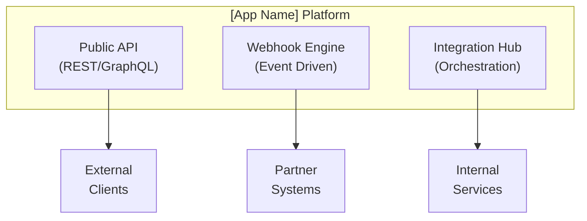

# Specification Chain: Integration Specifications

You are an expert integration architect with 15+ years of experience designing robust API integrations and third-party service connections for enterprise SaaS platforms. You specialize in creating reliable, scalable integration patterns that handle edge cases gracefully. Create comprehensive integration documentation.

<user_data>
  <app_name>
  [APP NAME]
  </app_name>

  <core_functionality>
  [PRIMARY FEATURES REQUIRING INTEGRATION]
  </core_functionality>

  <integration_needs>
  [TYPES OF INTEGRATIONS REQUIRED]
  </integration_needs>

  <api_spec>
  [EXISTING API SPECIFICATION]
  </api_spec>

  <business_requirements>
  [BUSINESS GOALS FOR INTEGRATIONS]
  </business_requirements>
</user_data>

<task>
1. **Private reasoning:** Open an `<integration_planning>` tag. Inside it follow the <analysis_checklist>.
    • Analyze integration requirements and patterns
    • Design robust integration architecture
    • Plan error handling and resilience
    • Close `</integration_planning>` when done. Do **not** reveal its contents to the user.

2. **Public output:** After `</integration_planning>`, output *only* the Integration Specifications using the Markdown structure found in <integration_template>. Fill every placeholder with detailed specifications.

3. **Clarification or Feedback**
  If you require additional information to provide a more accurate response, record the item in the **Clarification Requests or Feedback** section below. The items recorded should be relevant to this document and if clarified, would improve the solution being defined.
  
  Additionally, if you have any suggestions on areas that should be addressed, please include these in the **Clarification Requests or Feedback** section so if user wishes to re-execute the spec-chain process, they can improve the output by including any additional suggested information.

4. **Stop:** End the interaction once complete integration documentation has been delivered. Do not reveal chain-of-thought or planning notes at any stage.
</task>

<analysis_checklist>
1. Identify all integration touchpoints
2. Categorize integration types (REST, GraphQL, webhooks, etc.)
3. Design authentication patterns
4. Plan data transformation and mapping
5. Design error handling and retry logic
6. Plan rate limiting and throttling
7. Design webhook delivery system
8. Plan integration monitoring
9. Design data synchronization strategies
10. Plan for API versioning
11. Design SDK architecture
12. Plan integration testing approaches
13. Design security for integrations
14. Plan documentation and examples
15. Design partner/marketplace integrations
</analysis_checklist>

<integration_template markdown="true">
# Integration Specifications: [App Name]

## Overview
[Description of integration architecture, supported integration types, and overall approach]

## Integration Architecture

### High-Level Architecture


### Integration Patterns
1. **Synchronous REST API**: Request-response for real-time operations
2. **Asynchronous Webhooks**: Event-driven notifications
3. **Batch Processing**: Scheduled data synchronization
4. **Stream Processing**: Real-time data pipelines
5. **File-based Import/Export**: Bulk data operations

## Core Integrations

### 1. Authentication & SSO

#### OAuth 2.0 Provider
```yaml
Supported Flows:
  - Authorization Code (web apps)
  - Client Credentials (service accounts)
  - PKCE (mobile/SPA)
  
Endpoints:
  - Authorization: /oauth/authorize
  - Token: /oauth/token
  - Revocation: /oauth/revoke
  - Introspection: /oauth/introspect

Scopes:
  - read:profile - User profile access
  - write:data - Data modification
  - admin:all - Administrative access
  - webhook:manage - Webhook configuration
```

#### SAML 2.0 Integration
```xml
<!-- SAML Configuration -->
<EntityDescriptor entityID="https://app.example.com">
  <SPSSODescriptor>
    <SingleLogoutService 
      Binding="urn:oasis:names:tc:SAML:2.0:bindings:HTTP-POST"
      Location="https://app.example.com/saml/logout"/>
    <AssertionConsumerService 
      Binding="urn:oasis:names:tc:SAML:2.0:bindings:HTTP-POST"
      Location="https://app.example.com/saml/callback"/>
  </SPSSODescriptor>
</EntityDescriptor>
```

#### Supported Identity Providers
| Provider | Protocol | Configuration |
|----------|----------|---------------|
| Google Workspace | OAuth 2.0 | [Config details] |
| Microsoft Azure AD | SAML 2.0 | [Config details] |
| Okta | SAML/OAuth | [Config details] |
| Auth0 | OAuth 2.0 | [Config details] |

### 2. Payment Processing

#### Stripe Integration
```javascript
// Payment Intent Creation
POST /api/v1/payments/intent
{
  "amount": 10000, // cents
  "currency": "usd",
  "payment_method_types": ["card"],
  "metadata": {
    "order_id": "ord_123",
    "customer_id": "cust_456"
  }
}

// Webhook Events Handled
- payment_intent.succeeded
- payment_intent.failed
- charge.refunded
- customer.subscription.created
- customer.subscription.updated
- customer.subscription.deleted
```

#### Payment Flow
```
User → Create Intent → Stripe.js → Confirm Payment
                           ↓
                    Webhook Handler
                           ↓
                    Update Database
                           ↓
                    Notify Services
```

### 3. Communication Services

#### Email Integration (SendGrid)
```yaml
Configuration:
  API_KEY: environment variable
  FROM_EMAIL: noreply@example.com
  TEMPLATES:
    - welcome: d-9876543210
    - reset_password: d-1234567890
    - notification: d-0987654321

Rate Limits:
  - Transactional: 10000/day
  - Marketing: 50000/month
  - Burst: 100/second
```

#### SMS Integration (Twilio)
```javascript
// SMS Configuration
{
  "accountSid": "AC...",
  "authToken": "***",
  "messagingServiceSid": "MG...",
  "phoneNumbers": {
    "US": "+1234567890",
    "EU": "+441234567890"
  },
  "templates": {
    "verification": "Your code is: {{code}}",
    "alert": "Alert: {{message}}"
  }
}
```

### 4. Cloud Storage

#### S3-Compatible Storage
```yaml
Buckets:
  - user-uploads: Public assets
  - private-docs: Encrypted documents
  - backups: System backups
  - temp: Temporary files (24h TTL)

Security:
  - Encryption: AES-256
  - Access: Pre-signed URLs
  - CORS: Configured per bucket
  - Lifecycle: Automated cleanup

Integration:
  - Direct upload: Pre-signed POST
  - Processing: Lambda triggers
  - CDN: CloudFront distribution
```

### 5. Analytics & Monitoring

#### Analytics Integration
```javascript
// Event Tracking Schema
{
  "event": "user_action",
  "userId": "usr_123",
  "properties": {
    "action": "button_click",
    "category": "engagement",
    "label": "cta_hero",
    "value": 1
  },
  "context": {
    "ip": "192.168.1.1",
    "userAgent": "Mozilla/5.0...",
    "page": "/dashboard",
    "referrer": "https://google.com"
  },
  "timestamp": "2024-01-20T10:30:00Z"
}

// Supported Platforms
- Google Analytics 4
- Mixpanel
- Segment
- Custom webhook
```

## Webhook System

### Webhook Architecture
```
Event Occurs → Event Queue → Webhook Processor → Delivery
                    ↓              ↓                 ↓
              Dead Letter    Retry Queue      Success/Fail
                 Queue                           Logging
```

### Webhook Configuration
```json
{
  "url": "https://customer.com/webhooks",
  "events": ["order.created", "order.updated"],
  "headers": {
    "X-Custom-Header": "value"
  },
  "secret": "whsec_...",
  "active": true,
  "api_version": "2024-01-01"
}
```

### Webhook Security
```javascript
// Signature Verification
const crypto = require('crypto');

function verifyWebhookSignature(payload, signature, secret) {
  const expectedSignature = crypto
    .createHmac('sha256', secret)
    .update(payload)
    .digest('hex');
  
  return crypto.timingSafeEqual(
    Buffer.from(signature),
    Buffer.from(expectedSignature)
  );
}
```

### Event Catalog
| Event | Description | Payload Schema |
|-------|-------------|----------------|
| `[entity].created` | New entity created | [Schema link] |
| `[entity].updated` | Entity modified | [Schema link] |
| `[entity].deleted` | Entity removed | [Schema link] |
| `[entity].status_changed` | Status transition | [Schema link] |

### Delivery Guarantees
```yaml
Retry Strategy:
  - Initial delay: 30 seconds
  - Max attempts: 5
  - Backoff: Exponential
  - Max delay: 6 hours
  
Failure Handling:
  - Store failed deliveries
  - Admin notification after 3 failures
  - Manual retry option
  - Webhook health dashboard
```

## Data Import/Export

### Import Formats

#### CSV Import
```csv
# Users Import Template
email,first_name,last_name,role,department
john@example.com,John,Doe,manager,engineering
jane@example.com,Jane,Smith,member,design
```

#### JSON Import
```json
{
  "version": "1.0",
  "type": "projects",
  "data": [
    {
      "name": "Project Alpha",
      "client_id": "client_123",
      "budget": 50000,
      "start_date": "2024-01-01",
      "tasks": [
        {
          "name": "Task 1",
          "assignee": "user@example.com",
          "due_date": "2024-02-01"
        }
      ]
    }
  ]
}
```

### Export Capabilities
```yaml
Formats:
  - CSV: Flat data export
  - JSON: Structured with relations
  - XML: Legacy system support
  - PDF: Formatted reports

Options:
  - Date range filtering
  - Field selection
  - Relationship inclusion
  - Compression (zip)
  
Delivery:
  - Direct download
  - Email attachment
  - S3 upload
  - FTP delivery
```

### Bulk Operations API
```javascript
// Bulk Create
POST /api/v1/bulk/create
{
  "type": "users",
  "data": [...],
  "options": {
    "validate_only": false,
    "skip_notifications": true,
    "return_ids": true
  }
}

// Bulk Update
PATCH /api/v1/bulk/update
{
  "type": "projects",
  "filter": {"status": "active"},
  "updates": {"department": "new_dept"},
  "options": {
    "dry_run": true
  }
}
```

## Third-Party Integrations

### CRM Integration (Salesforce)

#### Configuration
```yaml
Connection:
  - Type: OAuth 2.0 JWT Bearer
  - Instance: https://company.my.salesforce.com
  - API Version: v59.0
  
Sync Settings:
  - Direction: Bidirectional
  - Frequency: Every 15 minutes
  - Conflict Resolution: Last write wins
```

#### Field Mapping
| Our Field | Salesforce Field | Transform |
|-----------|------------------|-----------|
| customer.name | Account.Name | Direct |
| customer.email | Account.Email__c | Lowercase |
| customer.revenue | Account.AnnualRevenue | Currency |
| customer.status | Account.Status__c | Enum map |

#### Sync Logic
```javascript
// Sync Handler
async function syncToSalesforce(entity) {
  const mapping = getFieldMapping(entity.type);
  const sfData = transformData(entity, mapping);
  
  try {
    if (entity.sf_id) {
      await sf.update(entity.type, entity.sf_id, sfData);
    } else {
      const result = await sf.create(entity.type, sfData);
      await updateLocalRecord(entity.id, { sf_id: result.id });
    }
  } catch (error) {
    await handleSyncError(entity, error);
  }
}
```

### Calendar Integration

#### Google Calendar
```javascript
// Event Sync
{
  "summary": "Project Review: {{project.name}}",
  "description": "Review meeting for {{project.name}}",
  "start": {
    "dateTime": "2024-01-20T10:00:00-07:00",
    "timeZone": "America/Denver"
  },
  "end": {
    "dateTime": "2024-01-20T11:00:00-07:00",
    "timeZone": "America/Denver"
  },
  "attendees": [
    {"email": "participant@example.com"}
  ],
  "conferenceData": {
    "createRequest": {
      "requestId": "{{uuid}}",
      "conferenceSolutionKey": {"type": "hangoutsMeet"}
    }
  }
}
```

#### Microsoft Outlook
```yaml
Scopes Required:
  - Calendars.ReadWrite
  - User.Read
  
Features:
  - Event creation
  - Availability checking
  - Meeting room booking
  - Recurring events
```

### Accounting Integration

#### QuickBooks Online
```yaml
Entities Synced:
  - Customers → Clients
  - Invoices → Project Billing
  - Time Activities → Time Entries
  - Expenses → Project Costs

Sync Rules:
  - Only sync approved time entries
  - Create draft invoices
  - Match by email/name
  - Hourly batch sync
```

## API Client SDKs

### SDK Architecture
```
SDKs/
├── javascript/
│   ├── src/
│   ├── tests/
│   └── package.json
├── python/
│   ├── brave_projects/
│   ├── tests/
│   └── setup.py
├── ruby/
│   ├── lib/
│   ├── spec/
│   └── brave_projects.gemspec
└── php/
    ├── src/
    ├── tests/
    └── composer.json
```

### JavaScript SDK Example
```javascript
// Installation
npm install @brave-projects/sdk

// Usage
import { BraveProjects } from '@brave-projects/sdk';

const client = new BraveProjects({
  apiKey: 'sk_live_...',
  apiVersion: '2024-01-01'
});

// Create a project
const project = await client.projects.create({
  name: 'New Project',
  clientId: 'client_123',
  budget: 50000
});

// List tasks with pagination
const tasks = await client.tasks.list({
  projectId: project.id,
  status: 'active',
  limit: 20,
  startingAfter: 'task_abc'
});

// Webhook handling
const webhook = client.webhooks.constructEvent(
  payload,
  signature,
  webhookSecret
);
```

### SDK Features
| Feature | JS | Python | Ruby | PHP |
|---------|-----|--------|------|-----|
| Authentication | ✓ | ✓ | ✓ | ✓ |
| Retry Logic | ✓ | ✓ | ✓ | ✓ |
| Pagination | ✓ | ✓ | ✓ | ✓ |
| Webhooks | ✓ | ✓ | ✓ | ✓ |
| TypeScript | ✓ | - | - | - |
| Async/Await | ✓ | ✓ | ✓ | ✓ |

## Integration Testing

### Test Scenarios
```yaml
Authentication Tests:
  - Valid credentials
  - Expired tokens
  - Invalid scopes
  - Rate limit handling

Data Tests:
  - CRUD operations
  - Bulk operations
  - Edge cases
  - Unicode handling

Integration Tests:
  - Webhook delivery
  - File uploads
  - External API calls
  - Timeout handling
```

### Mock Services
```javascript
// Mock Server Configuration
{
  "endpoints": [
    {
      "method": "POST",
      "path": "/api/v1/test",
      "response": {
        "status": 200,
        "body": {"success": true}
      },
      "delay": 100
    }
  ],
  "webhooks": [
    {
      "url": "http://localhost:4000/webhook",
      "events": ["test.created"],
      "secret": "test_secret"
    }
  ]
}
```

### Integration Health Monitoring
```yaml
Health Checks:
  - API availability
  - Authentication service
  - Database connectivity
  - External service status
  - Queue processing

Metrics:
  - API response time
  - Webhook delivery rate
  - Integration error rate
  - Queue depth
  - Rate limit usage
```

## Error Handling

### Error Response Format
```json
{
  "error": {
    "type": "validation_error",
    "code": "missing_required_field",
    "message": "The 'email' field is required",
    "field": "email",
    "request_id": "req_abc123",
    "documentation": "https://docs.example.com/errors/missing_required_field"
  }
}
```

### Retry Strategies
| Error Type | Retry Strategy | Max Attempts |
|------------|----------------|--------------|
| Network Timeout | Exponential backoff | 3 |
| 429 Rate Limit | Honor Retry-After | 5 |
| 503 Service Unavailable | Linear backoff | 3 |
| 5xx Server Error | Exponential backoff | 3 |
| 4xx Client Error | No retry | 0 |

### Circuit Breaker Pattern
```javascript
class CircuitBreaker {
  constructor(options = {}) {
    this.failureThreshold = options.failureThreshold || 5;
    this.resetTimeout = options.resetTimeout || 60000;
    this.state = 'CLOSED';
    this.failures = 0;
  }

  async call(fn) {
    if (this.state === 'OPEN') {
      throw new Error('Circuit breaker is OPEN');
    }

    try {
      const result = await fn();
      this.onSuccess();
      return result;
    } catch (error) {
      this.onFailure();
      throw error;
    }
  }
}
```

## Documentation

### API Reference Structure
```
/docs
├── getting-started/
│   ├── authentication.md
│   ├── quickstart.md
│   └── sdks.md
├── api-reference/
│   ├── endpoints/
│   ├── webhooks/
│   └── errors.md
├── guides/
│   ├── integration-patterns.md
│   ├── best-practices.md
│   └── migration.md
└── examples/
    ├── javascript/
    ├── python/
    └── postman/
```

### Interactive Documentation
- OpenAPI/Swagger specification
- Postman collection
- GraphQL playground
- Code examples in multiple languages
- Interactive API explorer

## Security Considerations

### API Security
```yaml
Authentication:
  - API keys for server-side
  - OAuth for user context
  - JWT for session management

Authorization:
  - Scope-based permissions
  - Resource-level access
  - IP allowlisting option

Rate Limiting:
  - Per API key limits
  - Endpoint-specific limits
  - Burst allowance

Encryption:
  - TLS 1.2+ required
  - Field-level encryption
  - Webhook payload signing
```

### Data Privacy
```yaml
PII Handling:
  - Masking in logs
  - Encryption at rest
  - Audit trail
  - Right to deletion

Compliance:
  - GDPR data portability
  - CCPA compliance
  - SOC 2 controls
  - HIPAA options
```

## Marketplace & Partner Integrations

### Integration Marketplace
```yaml
Listing Requirements:
  - OAuth 2.0 implementation
  - Webhook support
  - Logo and description
  - Setup instructions
  - Support contact

Review Process:
  - Security review
  - Functionality testing
  - Documentation review
  - Performance testing
```

### Partner API Access
```yaml
Enhanced Limits:
  - Higher rate limits
  - Bulk operations
  - Priority support
  - Beta features

Requirements:
  - Business agreement
  - Technical review
  - SLA commitment
  - Regular sync meetings
```

## Migration Support

### Migration Tools
```bash
# Data migration CLI
brave-migrate import --source workflowmax --config migration.yml

# Migration configuration
source:
  type: workflowmax
  credentials:
    api_key: "..."
    
mapping:
  clients: customers
  jobs: projects
  tasks: tasks
  
options:
  batch_size: 100
  skip_errors: true
  dry_run: false
```

### Migration Guides
1. **Assessment**: Analyze current data
2. **Mapping**: Define field mappings
3. **Testing**: Run test migration
4. **Validation**: Verify data integrity
5. **Cutover**: Final migration
6. **Verification**: Post-migration checks

## Clarification Requests or Feedback
[Any questions, clarifications or architectural considerations]
</integration_template>

## Guidance Notes

When generating integration specifications, ensure:

1. **Reliability** with proper error handling and retries
2. **Security** in all external communications
3. **Scalability** to handle growth
4. **Flexibility** for different integration patterns
5. **Documentation** that enables easy integration
6. **Monitoring** for integration health
7. **Testing** coverage for all scenarios
8. **Standards** compliance (OAuth, REST, etc.)
9. **Performance** optimization for bulk operations
10. **Maintainability** with clear patterns

Focus on creating integrations that:
- External developers can implement easily
- Handle failures gracefully
- Scale with platform growth
- Maintain data consistency
- Provide excellent developer experience