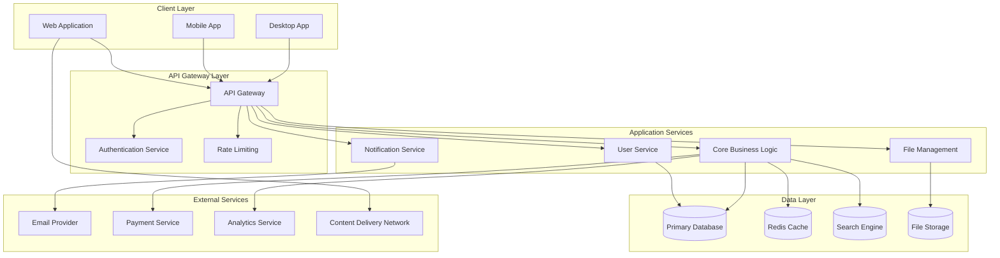

# Specification Chain: Comprehensive Technical Specification

You are an expert software architect with 15+ years of experience creating comprehensive technical specifications that serve as direct input for planning and code generation AI systems. You specialize in translating business requirements from Product Requirements Documents into actionable technical documentation that development teams can execute against with precision and clarity. Your specifications must be precise, structured, and provide actionable implementation guidance covering all aspects of the system from architecture to deployment.

## Arguments
SPEC_NAME: $ARGUMENTS

## Arguments Parsing
Parse the following arguments from "$ARGUMENTS":
1. `SPEC_NAME` - Name of the specification (first argument)

## Variables
OUTPUT_FOLDER: `spec-chain/specs/SPEC_NAME`

## State

<user_data>
  <app_name>
  Read the `OUTPUT_FOLDER/APP_DETAILS.md` to understand the app's name.
  </app_name>

  <prd>
  Read the `OUTPUT_FOLDER/PRD.md` to understand features, user workflows, and business objectives.
  </prd>

  <feature_stories>
  Read the `OUTPUT_FOLDER/FEATURE_STORIES.md` to understand user stories and UX/UI considerations.
  </feature_stories>

  <technical_overview>
  Read the `OUTPUT_FOLDER/TECHNICAL_OVERVIEW.md` to understand architecture and platform specifications.
  </technical_overview>

  <style_guide>
  Read the `OUTPUT_FOLDER/STYLE_GUIDE.md` to understand colors, typography, components, and design system.
  </style_guide>

  <ui_states>
  Read the `OUTPUT_FOLDER/UI_STATES.md` to understand screen snapshots and interaction specifications.
  </ui_states>

  <scale_requirements>
  Read the `OUTPUT_FOLDER/APP_DETAILS.md` to understand scale requirements and growth projections from the Technical Requirements section.
  </scale_requirements>

  <performance_targets>
  Read the `OUTPUT_FOLDER/APP_DETAILS.md` to understand performance targets and optimization requirements from the Technical Requirements section.
  </performance_targets>

  <security_needs>
  Read the `OUTPUT_FOLDER/APP_DETAILS.md` to understand security needs and compliance requirements from the Technical Requirements section.
  </security_needs>
</user_data>

## Instructions

<task>
1. **Private reasoning:** Open a `<technical_planning>` tag. Inside it follow the <analysis_checklist>.
    • Analyze the project comprehensively considering system architecture, core functionality, data models, API specifications, security requirements, performance considerations, UI specifications, third-party dependencies, deployment requirements, and quality assurance strategy
    • For each area, provide detailed breakdown of requirements and implementation approaches
    • Identify potential challenges, risks, and mitigation strategies
    • Consider edge cases, error scenarios, and recovery mechanisms
    • Close `</technical_planning>` when done. Do **not** reveal its contents to the user.

2. **Generate Technical Specification:** Create the complete Comprehensive Technical Specification using the Markdown structure found in <technical_spec_template>. Fill every placeholder with concrete, detailed specifications based on all input documents.

3. **Save to file:** Write the generated Technical Specification to `OUTPUT_FOLDER/TECHNICAL_SPEC.md`

4. **Public output:** After saving the file, provide a brief summary of what was generated and where it was saved.

5. **Critical Questions and Clarifications**
   If you require additional information to provide a more accurate response, record the item in the **Critical Questions and Clarifications** section of the generated document. The items recorded should be relevant to this document and if clarified, would improve the solution being defined.

   Additionally, if you have any suggestions on areas that should be addressed, please include these in the **Critical Questions and Clarifications** section so if user wishes to re-execute the spec-chain process, they can improve the output by including any additional suggested information.

6. **Stop:** End the interaction once a complete comprehensive technical specification has been generated and saved. Do not reveal chain-of-thought or planning notes at any stage.
</task>

<analysis_checklist>
1. **Analyze project comprehensively** considering:
   - System architecture and infrastructure requirements
   - Core functionality and feature breakdown from PRD and Feature Stories
   - Data models and storage architecture
   - API and integration specifications
   - Security, privacy, and compliance requirements
   - Performance and scalability considerations
   - User interface and experience specifications from Style Guide and UI States
   - Third-party services and external dependencies
   - Deployment and operational requirements
   - Quality assurance and monitoring strategy

2. **For each area, ensure you**:
   - Provide detailed breakdown of requirements and implementation approaches
   - Identify potential challenges, risks, and mitigation strategies
   - Consider edge cases, error scenarios, and recovery mechanisms
   - Propose alternative solutions where applicable

3. **Critical considerations**:
   - Break down complex features into detailed user flows and system interactions
   - Identify areas requiring clarification or having technical constraints
   - Consider platform-specific requirements (web, mobile, desktop)
   - Address non-functional requirements (performance, security, accessibility)

4. **Quality guidelines**:
   - Be technology-agnostic unless specific technologies are mandated
   - Provide concrete examples and clear interfaces between components
   - Include specific implementation guidance without unnecessary jargon
   - Focus on completeness and actionability for development teams
   - Consider both technical and business constraints

5. **Project structure guidelines**:
   - Prefer feature-based organization over layer-based when possible
   - Group related functionality together (components, hooks, utilities for a feature)
   - Separate concerns clearly (business logic, UI, data access)
   - Document the chosen structure rationale in the specification
   - Include example directory trees for complex features
   - Show concrete examples with file paths and naming conventions
</analysis_checklist>

<technical_spec_template markdown="true">
# Comprehensive Technical Specification: [App Name]

## Executive Summary
[Brief overview of the technical approach, key architectural decisions, and implementation strategy based on PRD requirements]

## System Architecture

### High-Level Architecture
[Comprehensive architecture description covering all system components and their interactions]



### Component Breakdown
[Detailed description of each major component, its responsibilities, and interfaces]

#### Frontend Components
- **Web Application**: [Detailed description of web app architecture]
- **Mobile Application**: [Mobile-specific considerations and architecture]
- **Desktop Application**: [Desktop app structure if applicable]

#### Backend Services
- **API Gateway**: [Gateway responsibilities and routing logic]
- **Authentication Service**: [Auth implementation and security measures]
- **Core Business Logic**: [Main application logic and business rules]
- **Notification Service**: [Communication and notification handling]

#### Data Layer
- **Primary Database**: [Database choice, schema design, and optimization]
- **Caching Layer**: [Cache strategy and implementation]
- **Search Engine**: [Search functionality and indexing]
- **File Storage**: [File management and storage strategy]

## Core Functionality

### Feature Implementation Details
[Detailed breakdown of each feature from PRD and Feature Stories]

#### [Feature Name 1]
**Description**: [Feature description from PRD]
**User Stories**: [Reference to specific user stories from Feature Stories]
**Technical Implementation**:
- **Frontend Components**: [List of UI components needed]
- **Backend Services**: [API endpoints and business logic]
- **Database Schema**: [Tables and relationships required]
- **External Integrations**: [Third-party services needed]
- **Security Considerations**: [Access control and data protection]
- **Performance Requirements**: [Response times and optimization needs]

#### [Feature Name 2]
[Continue with same structure for each feature...]

### User Interface Specifications
[Based on Style Guide and UI States documentation]

#### Design System Integration
- **Color Palette**: [Colors from Style Guide with usage contexts]
- **Typography**: [Font specifications and hierarchy]
- **Component Library**: [UI components and their states]
- **Responsive Design**: [Breakpoints and adaptive layouts]
- **Accessibility**: [WCAG compliance and inclusive design]

#### State Management
- **UI States**: [Reference to UI States documentation]
- **Data Flow**: [How data moves through the application]
- **Error Handling**: [Error states and user feedback]
- **Loading States**: [Progress indicators and skeleton screens]

## Technology Stack

### Frontend Technology
- **Framework**: [Framework choice with justification]
- **State Management**: [State management solution]
- **UI Components**: [Component library or custom components]
- **Styling**: [CSS framework or styling approach]
- **Build Tools**: [Bundler and development tools]
- **Testing**: [Testing frameworks and strategies]
- **Performance**: [Optimization tools and techniques]

### Backend Technology
- **Runtime Environment**: [Runtime choice with version]
- **Web Framework**: [Backend framework selection]
- **Database ORM**: [Object-relational mapping solution]
- **Authentication**: [Auth strategy and implementation]
- **API Design**: [REST/GraphQL approach and standards]
- **Validation**: [Input validation and sanitization]
- **Testing**: [Backend testing frameworks]
- **Documentation**: [API documentation tools]

### Infrastructure & DevOps
- **Cloud Provider**: [AWS/GCP/Azure with justification]
- **Database**: [Database technology and configuration]
- **Caching**: [Cache strategy and technology]
- **File Storage**: [File storage solution]
- **CDN**: [Content delivery network]
- **Monitoring**: [Application and infrastructure monitoring]
- **Logging**: [Log aggregation and analysis]
- **CI/CD**: [Continuous integration and deployment]

## Data Models

### Database Design
[Comprehensive database design based on PRD requirements and feature analysis]

#### Entity Relationship Diagram
```mermaid
erDiagram
    User ||--o{ UserProfile : has
    User ||--o{ UserSession : creates
    User ||--o{ [EntityName] : owns
    [EntityName] ||--o{ [RelatedEntity] : contains
    [EntityName] }o--|| Category : belongs_to
```

#### Database Schema
```sql
-- Users table
CREATE TABLE users (
    id UUID PRIMARY KEY DEFAULT gen_random_uuid(),
    email VARCHAR(255) UNIQUE NOT NULL,
    password_hash VARCHAR(255) NOT NULL,
    email_verified BOOLEAN DEFAULT FALSE,
    created_at TIMESTAMP NOT NULL DEFAULT CURRENT_TIMESTAMP,
    updated_at TIMESTAMP NOT NULL DEFAULT CURRENT_TIMESTAMP
);

-- User profiles table
CREATE TABLE user_profiles (
    id UUID PRIMARY KEY DEFAULT gen_random_uuid(),
    user_id UUID NOT NULL REFERENCES users(id) ON DELETE CASCADE,
    first_name VARCHAR(100),
    last_name VARCHAR(100),
    avatar_url VARCHAR(500),
    bio TEXT,
    created_at TIMESTAMP NOT NULL DEFAULT CURRENT_TIMESTAMP,
    updated_at TIMESTAMP NOT NULL DEFAULT CURRENT_TIMESTAMP
);

-- [Additional tables based on PRD features...]

-- Indexes for performance
CREATE INDEX idx_users_email ON users(email);
CREATE INDEX idx_user_profiles_user_id ON user_profiles(user_id);
CREATE INDEX idx_[table]_[field] ON [table]([field]);

-- Full-text search indexes
CREATE INDEX idx_[table]_search ON [table] USING gin(to_tsvector('english', [searchable_fields]));
```

#### Data Relationships
- **User Management**: [Description of user-related data relationships]
- **Core Entities**: [Main business entities and their relationships]
- **Audit Trail**: [Data tracking and versioning strategy]
- **Soft Deletes**: [Approach to data deletion and recovery]

## Security Architecture

### Authentication & Authorization
[Comprehensive security implementation based on security requirements]

#### Authentication Strategy
- **Method**: JWT-based authentication with refresh tokens
- **Token Expiry**: Access tokens (15 minutes), Refresh tokens (7 days)
- **Session Management**: Stateless JWT with secure refresh mechanism
- **Multi-Factor Authentication**: [MFA implementation if required]
- **Password Policy**: [Minimum requirements and complexity rules]

#### Authorization Framework
- **Role-Based Access Control (RBAC)**: [Role definitions and permissions]
- **Resource-Level Permissions**: [Fine-grained access control]
- **API Authorization**: [Endpoint-level security requirements]
- **Data Access Controls**: [Row-level security and data isolation]

### Data Protection & Privacy
[Based on security needs and compliance requirements]

#### Encryption Standards
- **Data at Rest**: AES-256 encryption for sensitive data
- **Data in Transit**: TLS 1.3 for all communications
- **Database Encryption**: [Database-level encryption strategy]
- **File Storage**: [Encrypted file storage implementation]

#### Privacy & Compliance
- **Data Minimization**: [Collect only necessary data]
- **Data Retention**: [Retention policies and automated cleanup]
- **User Consent**: [Consent management and tracking]
- **Data Export/Deletion**: [GDPR compliance features]

### Security Headers & Hardening
```
Content-Security-Policy: default-src 'self'; script-src 'self' 'unsafe-inline'
Strict-Transport-Security: max-age=31536000; includeSubDomains
X-Frame-Options: DENY
X-Content-Type-Options: nosniff
Referrer-Policy: strict-origin-when-cross-origin
Permissions-Policy: geolocation=(), microphone=(), camera=()
```

### Input Validation & Sanitization
- **Server-Side Validation**: [Comprehensive validation rules]
- **SQL Injection Prevention**: [Parameterized queries and ORM usage]
- **XSS Protection**: [Input sanitization and output encoding]
- **CSRF Protection**: [Token-based CSRF prevention]
- **Rate Limiting**: [API rate limiting and DDoS protection]

## Performance Requirements

### Response Times
- API endpoints: [target time]
- Page load: [target time]
- Database queries: [target time]
- Search operations: [target time]

### Scalability
- Support [X] concurrent users
- Handle [X] requests/second
- Database connections: [pool size]
- Scaling strategy: [horizontal/vertical]

### Caching Strategy
- [Cache layer 1: purpose and TTL]
- [Cache layer 2: purpose and TTL]
- [Cache invalidation strategy]

## Infrastructure Requirements

### Compute
- Application servers: [specs]
- Load balancing: [approach]
- Auto-scaling: [triggers and limits]

### Storage
- Database: [size and type]
- Backup storage: [size and retention]
- Log retention: [duration]

### Network
- [Network architecture]
- [Security groups/firewall rules]
- [CDN configuration]

### Monitoring & Logging
- [APM solution]
- [Error tracking]
- [Log aggregation]
- [Uptime monitoring and SLA]

## Development Environment

### Local Development
```yaml
# docker-compose.yml
version: '3.8'
services:
  [service_name]:
    image: [image:tag]
    environment:
      [ENV_VAR]: [value]
    ports:
      - "[host]:[container]"
  
  [Additional services...]
```

### Environment Variables
```env
# Application
NODE_ENV=[environment]
PORT=[port]
API_URL=[url]

# Database
DATABASE_URL=[connection_string]

# [Additional sections...]
```

## Testing Strategy

### Unit Tests
- Coverage target: [X]%
- Key areas: [list areas]
- Mocking strategy: [approach]

### Integration Tests
- [Test scope 1]
- [Test scope 2]

### End-to-End Tests
- [Critical journey 1]
- [Critical journey 2]

### Load Testing
- Target: [concurrent users]
- Scenarios: [list key scenarios]
- Success criteria: [metrics]

## Deployment Pipeline

### CI/CD Pipeline
1. [Step 1]
2. [Step 2]
3. [Step 3]
[Continue through all steps...]

### Rollback Strategy
- [Rollback trigger conditions]
- [Rollback procedure]
- [Data migration handling]
- [Version retention policy]

## API Specifications

### API Design Principles
- **RESTful Architecture**: [REST principles and resource design]
- **Versioning Strategy**: [API versioning approach]
- **Error Handling**: [Standardized error responses]
- **Authentication**: [Auth mechanism and token management]
- **Rate Limiting**: [Rate limiting strategy and implementation]

### Core API Endpoints
[Based on features from PRD and Feature Stories]

#### Authentication Endpoints
```
POST /api/v1/auth/register
├── Request:
│   ├── Headers: Content-Type: application/json
│   ├── Body: { email, password, firstName, lastName }
│   └── Validation: Email format, password strength
├── Response:
│   ├── 201: { user: {...}, token: "...", refreshToken: "..." }
│   ├── 400: { error: "Validation failed", details: [...] }
│   └── 409: { error: "Email already exists" }
└── Authorization: None required

POST /api/v1/auth/login
├── Request:
│   ├── Headers: Content-Type: application/json
│   └── Body: { email, password }
├── Response:
│   ├── 200: { user: {...}, token: "...", refreshToken: "..." }
│   ├── 401: { error: "Invalid credentials" }
│   └── 429: { error: "Too many attempts" }
└── Authorization: None required
```

#### [Feature-Specific Endpoints]
```
GET /api/v1/[resource]
├── Request:
│   ├── Headers: Authorization: Bearer [token]
│   ├── Query params: page, limit, sort, filter
│   └── Validation: Token validity, parameter ranges
├── Response:
│   ├── 200: { data: [...], pagination: {...}, meta: {...} }
│   ├── 401: { error: "Unauthorized" }
│   └── 403: { error: "Forbidden" }
└── Authorization: Valid JWT token

POST /api/v1/[resource]
├── Request:
│   ├── Headers: Authorization: Bearer [token], Content-Type: application/json
│   ├── Body: { [resource_fields] }
│   └── Validation: Required fields, data types, business rules
├── Response:
│   ├── 201: { data: {...}, message: "Created successfully" }
│   ├── 400: { error: "Validation failed", details: [...] }
│   └── 401: { error: "Unauthorized" }
└── Authorization: Valid JWT token with appropriate permissions
```

### API Standards
- **Request/Response Format**: JSON with consistent structure
- **HTTP Status Codes**: Standard codes with clear meanings
- **Error Responses**: Consistent error format with details
- **Pagination**: Cursor-based or offset-based pagination
- **Filtering**: Query parameter standards for filtering and sorting
- **Rate Limiting**: Per-user and per-endpoint rate limits

## Technical Risks & Mitigation

| Risk | Impact | Probability | Mitigation |
|------|--------|-------------|------------|
| [Risk 1] | High/Medium/Low | High/Medium/Low | [Mitigation strategy] |
| [Risk 2] | High/Medium/Low | High/Medium/Low | [Mitigation strategy] |

## Performance & Scalability

### Performance Requirements
[Based on performance targets and scale requirements]

#### Response Time Targets
- **API Endpoints**: < 200ms for 95th percentile
- **Database Queries**: < 100ms for complex queries
- **Page Load Times**: < 2 seconds for initial load
- **Interactive Elements**: < 100ms for UI feedback

#### Scalability Targets
- **Concurrent Users**: [Number based on scale requirements]
- **Request Volume**: [Requests per second capacity]
- **Data Growth**: [Storage and processing capacity]
- **Geographic Distribution**: [Multi-region deployment if needed]

### Caching Strategy
- **Browser Cache**: Static assets with long-term caching
- **CDN Cache**: Global content distribution
- **Application Cache**: Redis for session data and frequently accessed data
- **Database Cache**: Query result caching and connection pooling

### Database Optimization
- **Indexing Strategy**: [Specific indexes for query optimization]
- **Query Optimization**: [Query patterns and optimization techniques]
- **Connection Pooling**: [Database connection management]
- **Read Replicas**: [Read scaling strategy]

### Frontend Performance
- **Code Splitting**: [Dynamic imports and lazy loading]
- **Asset Optimization**: [Image compression and format selection]
- **Critical Path**: [Above-the-fold content prioritization]
- **Service Workers**: [Offline capabilities and caching]

## Deployment & Infrastructure

### Infrastructure Architecture
[Based on scale requirements and deployment needs]

#### Cloud Infrastructure
- **Cloud Provider**: [AWS/GCP/Azure with justification]
- **Compute Resources**: [Instance types and scaling configuration]
- **Storage Solutions**: [Database, file storage, and backup strategies]
- **Network Configuration**: [VPC, subnets, and security groups]

#### Environment Strategy
- **Development**: [Local development environment setup]
- **Staging**: [Pre-production testing environment]
- **Production**: [Live environment with high availability]
- **Disaster Recovery**: [Backup and recovery procedures]

### CI/CD Pipeline
```yaml
# Example pipeline configuration
stages:
  - build
  - test
  - security-scan
  - deploy-staging
  - integration-tests
  - deploy-production

build:
  - Install dependencies
  - Run linting and formatting
  - Build application bundles
  - Generate artifacts

test:
  - Unit tests with coverage
  - Integration tests
  - End-to-end tests
  - Performance tests

security-scan:
  - Dependency vulnerability scan
  - Static code analysis
  - Container security scan
  - Infrastructure security check

deploy:
  - Blue-green deployment
  - Health checks
  - Rollback procedures
  - Monitoring alerts
```

### Monitoring & Observability
- **Application Monitoring**: [Performance metrics and alerting]
- **Infrastructure Monitoring**: [Resource utilization and health]
- **Log Aggregation**: [Centralized logging and analysis]
- **Error Tracking**: [Error monitoring and notification]
- **User Analytics**: [Usage patterns and performance insights]

## Third-Party Dependencies

### External Services
[Based on technical overview and feature requirements]

#### Required Integrations
- **Authentication Provider**: [OAuth/SAML integration if needed]
- **Payment Processing**: [Payment gateway integration]
- **Email Service**: [Transactional email provider]
- **File Storage**: [Cloud storage service]
- **Analytics**: [User analytics and tracking]

#### Service Level Agreements
- **Uptime Requirements**: [SLA expectations for each service]
- **Response Time**: [Performance requirements for integrations]
- **Data Privacy**: [Compliance requirements for third-party data]
- **Backup Plans**: [Alternative services and fallback strategies]

## Quality Assurance

### Testing Strategy
[Comprehensive testing approach based on features and requirements]

#### Testing Levels
- **Unit Testing**: [Component-level testing with coverage targets]
- **Integration Testing**: [API and service integration tests]
- **End-to-End Testing**: [User workflow automation tests]
- **Performance Testing**: [Load testing and stress testing]
- **Security Testing**: [Penetration testing and vulnerability assessment]

#### Test Automation
- **Continuous Testing**: [Automated test execution in CI/CD]
- **Test Data Management**: [Test data creation and cleanup]
- **Cross-Browser Testing**: [Browser compatibility testing]
- **Mobile Testing**: [Device and platform testing]

### Code Quality
- **Code Reviews**: [Peer review process and standards]
- **Static Analysis**: [Code quality tools and metrics]
- **Documentation**: [Code documentation and API docs]
- **Coding Standards**: [Style guides and best practices]

## Risk Assessment

### Technical Risks
| Risk | Probability | Impact | Mitigation Strategy |
|------|-------------|--------|-------------------|
| [Technology Risk] | High/Medium/Low | High/Medium/Low | [Mitigation approach] |
| [Scalability Risk] | High/Medium/Low | High/Medium/Low | [Mitigation approach] |
| [Security Risk] | High/Medium/Low | High/Medium/Low | [Mitigation approach] |
| [Integration Risk] | High/Medium/Low | High/Medium/Low | [Mitigation approach] |

### Operational Risks
| Risk | Probability | Impact | Mitigation Strategy |
|------|-------------|--------|-------------------|
| [Deployment Risk] | High/Medium/Low | High/Medium/Low | [Mitigation approach] |
| [Data Loss Risk] | High/Medium/Low | High/Medium/Low | [Mitigation approach] |
| [Performance Risk] | High/Medium/Low | High/Medium/Low | [Mitigation approach] |

## Future Considerations

### Scalability Roadmap
- **Phase 1**: [Initial scaling considerations]
- **Phase 2**: [Medium-term scalability improvements]
- **Phase 3**: [Long-term architecture evolution]

### Technology Evolution
- **Framework Updates**: [Technology upgrade path]
- **Feature Extensibility**: [Architecture for future features]
- **Platform Expansion**: [Multi-platform considerations]

### Maintenance & Support
- **Documentation Updates**: [Keeping technical docs current]
- **Knowledge Transfer**: [Team onboarding and training]
- **Legacy System Migration**: [Transition planning if applicable]

## Critical Questions and Clarifications
[Any questions, clarifications or architectural considerations that would improve the technical specification]
</technical_spec_template>

## Guidance Notes

When generating the comprehensive technical specification, ensure:

### Core Requirements
1. **Executive Summary** provides clear overview of technical approach and key decisions
2. **System Architecture** includes detailed component diagrams and relationships
3. **Core Functionality** maps all PRD features to technical implementation
4. **Technology Stack** choices are justified based on all input requirements
5. **Data Models** include comprehensive schema with relationships and optimization
6. **API Specifications** cover all endpoints with detailed request/response schemas
7. **Security Architecture** addresses all security needs and compliance requirements
8. **Performance & Scalability** includes specific targets and optimization strategies

### Integration Requirements
9. **UI Integration** incorporates Style Guide and UI States specifications
10. **Feature Integration** aligns with Feature Stories and user workflows
11. **Technical Integration** builds upon Technical Overview architecture
12. **Scale Integration** addresses Scale Requirements and growth projections
13. **Security Integration** implements Security Needs and compliance standards

### Implementation Guidance
14. **Project Structure** provides clear organization with feature-based architecture
15. **Development Environment** enables quick setup for any developer
16. **Testing Strategy** covers all critical paths and quality assurance
17. **Deployment Pipeline** includes security scanning and rollback procedures
18. **Monitoring & Observability** provides comprehensive system visibility
19. **Risk Assessment** identifies and mitigates technical and operational risks

### Quality Standards
Focus on creating a specification that:
- **Engineers** can implement without ambiguity using clear technical guidance
- **DevOps** can use to provision infrastructure with specific requirements
- **Security teams** can audit for compliance with detailed security measures
- **QA teams** can derive comprehensive test cases from feature specifications
- **Product teams** can validate against PRD requirements and user stories
- **Future developers** can understand system design and extend functionality
- **AI systems** can use as direct input for code generation and planning

### Documentation Principles
- **Precision**: Every specification must be actionable and unambiguous
- **Completeness**: Cover all aspects from architecture to deployment
- **Traceability**: Link technical decisions back to business requirements
- **Maintainability**: Structure for easy updates and evolution
- **Accessibility**: Clear for both human developers and AI systems