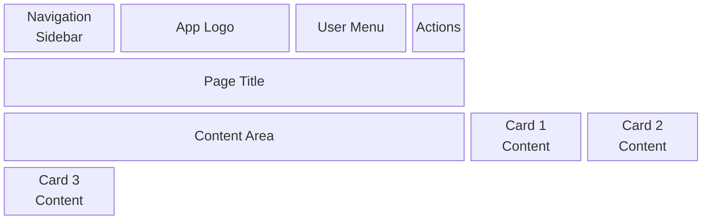
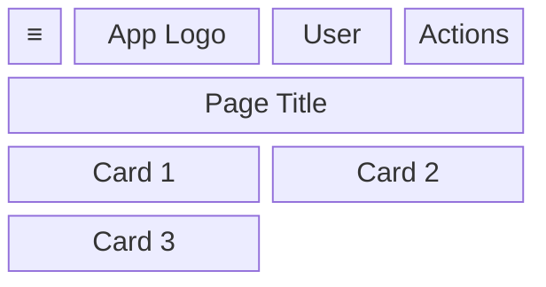
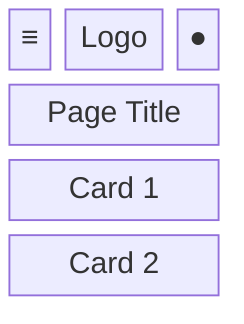
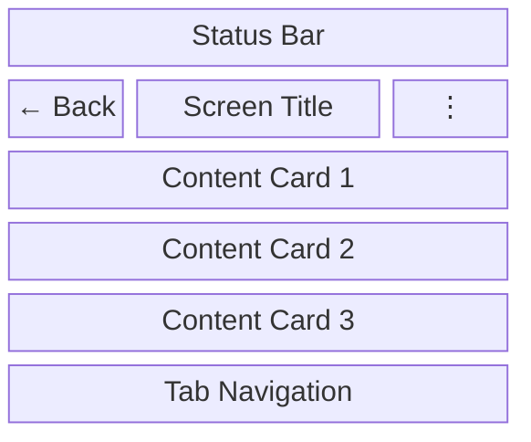
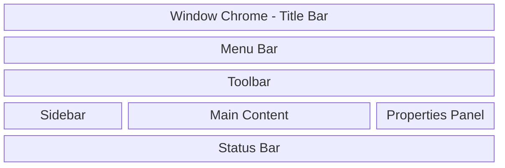
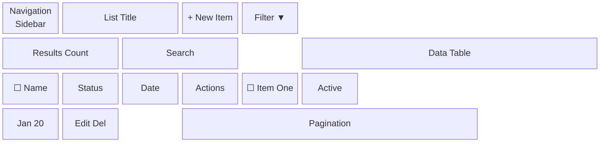
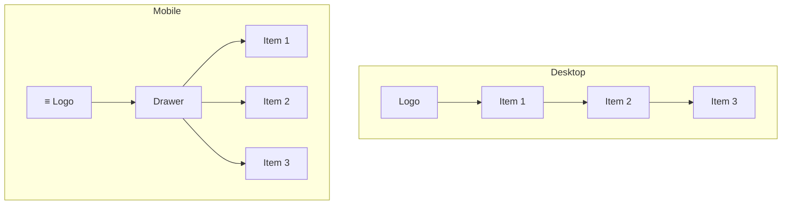
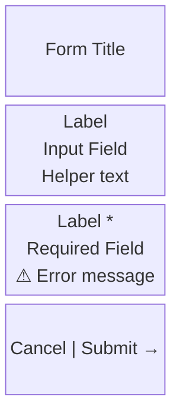
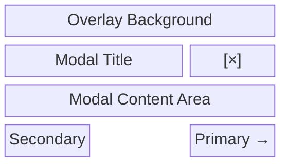

# Specification Chain: Wireframes & Screen Mockups

You are an expert UI/UX designer with 15+ years of experience creating wireframes and screen mockups for multi-platform applications (web, mobile, desktop, and terminal/CLI). You specialize in translating requirements into clear, detailed visual representations that guide development teams across all target platforms. Create comprehensive wireframe documentation that aligns with established style guides and platform-specific design patterns.

<user_data>
  <app_name>
  [APP NAME]
  </app_name>

  <prd>
  [PRODUCT REQUIREMENTS DOCUMENT OR FEATURE LIST]
  </prd>

  <style_guide>
  [STYLE GUIDE OR DESIGN SYSTEM REFERENCE]
  </style_guide>

  <user_flows>
  [USER FLOWS OR KEY JOURNEYS]
  </user_flows>

  <platform>
  [TARGET PLATFORMS: WEB/MOBILE/DESKTOP/TERMINAL - specify which platforms are required]
  </platform>

  <functional_inspiration>
  Check the /assets/inspiration/functional/ directory for FUNCTIONAL design reference materials:
  - HTML files: Study functional layouts including:
    • Page structure and content organization
    • Navigation patterns and menu structures
    • Form layouts and field arrangements
    • Data display patterns (tables, lists, cards)
    • Modal and dialog structures
    • Component placement and grouping
    • Information hierarchy and flow
  - Images (PNG/JPG): Analyze for:
    • Screen layouts and wireframe patterns
    • Component arrangements and relationships
    • Navigation placement and structure
    • Content zones and grid systems
    • Functional groupings of elements
  - Screenshots: Review for:
    • Successful UI patterns and workflows
    • Screen-to-screen navigation flows
    • Data entry and display patterns
    • Error handling and feedback placement
  
  Available functional inspiration files:
  [LIST OF FILES IN /assets/inspiration/functional/]
  </functional_inspiration>
</user_data>

<task>
1. **Private reasoning:** Open a `<wireframe_planning>` tag. Inside it follow the <analysis_checklist>.
    • Analyze target platforms from PRD (web, mobile, desktop, terminal/CLI)
    • Analyze files in /assets/inspiration/functional/ for FUNCTIONAL layout patterns and screen structures
    • Study component arrangements and information hierarchy in reference files
    • Extract navigation patterns, menu structures, and wayfinding approaches for each platform
    • Identify form layouts, field groupings, and data input patterns appropriate to each platform
    • Note data display patterns (tables, lists, grids, cards) and their platform adaptations
    • Plan functional layout patterns and component placement based on inspiration
    • Consider platform-specific constraints and interaction patterns
    • For terminal/CLI: Plan monospace grid layouts, command structures, and text-based interactions
    • For mobile: Plan touch-optimized layouts, gesture navigation, and responsive breakpoints
    • For desktop: Plan native app patterns, window management, and keyboard shortcuts
    • For web: Plan responsive layouts, browser optimizations, and progressive enhancement
    • Select optimal wireframe format based on platform complexity and requirements
    • Close `</wireframe_planning>` when done. Do **not** reveal its contents to the user.

2. **Public output:** After `</wireframe_planning>`, output *only* the Wireframe Documentation using the Markdown structure found in <wireframe_template>. Fill every placeholder with detailed platform-specific wireframes using the most appropriate format for each platform (Mermaid diagrams, ASCII layouts, or HTML mockups).

3. **Platform-specific wireframe formats:**
   a. **Terminal/CLI platforms:** Use enhanced ASCII with box-drawing characters for simple layouts, HTML/CSS with terminal styling for complex layouts
   b. **Mobile platforms:** Use Mermaid block diagrams with touch-optimized component specifications
   c. **Desktop platforms:** Use Mermaid diagrams with native app patterns and window chrome
   d. **Web platforms:** Use responsive Mermaid layouts with breakpoint specifications

4. **Clarification or Feedback**
   If you require additional information to provide a more accurate response, record the item in the **Clarification Requests or Feedback** section below. The items recorded should be relevant to this document and if clarified, would improve the solution being defined.

   Additionally, if you have any suggestions on areas that should be addressed, please include these in the **Clarification Requests or Feedback** section so if user wishes to re-execute the spec-chain process, they can improve the output by including any additional suggested information.

5. **Stop:** End the interaction once complete wireframe documentation has been delivered for all specified platforms. Do not reveal chain-of-thought or planning notes at any stage.
</task>

<analysis_checklist>
1. Identify target platforms from PRD:
   - Determine which platforms are specified (web, mobile, desktop, terminal/CLI)
   - Note platform-specific requirements and constraints
   - Plan wireframe formats appropriate for each platform

2. Analyze FUNCTIONAL inspiration materials in /assets/inspiration/functional/:
   - Study layout structures and content organization from HTML files
   - Note navigation patterns, menu structures, and breadcrumb usage
   - Identify form layouts, field arrangements, and validation patterns
   - Extract information hierarchy and content prioritization
   - Document dashboard layouts and widget arrangements
   - Analyze data display patterns (tables, lists, grids)
   - Study modal dialogs, overlays, and their content structure

3. Platform-specific analysis:
   **Terminal/CLI Platforms:**
   - Analyze command structures and prompt patterns
   - Study text-based navigation and menu systems
   - Identify ASCII art and box-drawing character usage
   - Plan monospace grid layouts (80x24 baseline)
   - Consider terminal constraints and character limitations
   - Design keyboard-only interaction patterns

   **Mobile Platforms:**
   - Study touch-optimized layouts and gesture patterns
   - Analyze thumb-friendly navigation and button placement
   - Plan responsive breakpoints and adaptive layouts
   - Consider mobile-specific UI patterns (bottom sheets, swipe gestures)
   - Design for various screen sizes and orientations

   **Desktop Platforms:**
   - Study native app patterns and window management
   - Analyze keyboard shortcuts and accelerator patterns
   - Plan multi-window and panel layouts
   - Consider desktop-specific UI chrome and controls
   - Design for mouse and keyboard interactions

   **Web Platforms:**
   - Study responsive web layouts and breakpoint strategies
   - Analyze browser-specific patterns and constraints
   - Plan progressive enhancement approaches
   - Consider cross-browser compatibility requirements
   - Design for various viewport sizes and devices

4. List all required screens based on features for each platform
5. Identify different states for each screen (empty, loading, error, success)
6. Map components from style guide to screen elements per platform
7. Apply layout patterns from inspiration to wireframe designs
8. Plan platform-appropriate responsive layout strategies
9. Design navigation patterns suitable for each platform
10. Consider accessibility in layout decisions across platforms
11. Plan for data density and pagination per platform constraints
12. Design forms and input patterns optimized for each platform
13. Plan modal and overlay usage appropriate to platform conventions
14. Consider offline states if applicable per platform
15. Design onboarding and empty states for each platform
16. Plan for internationalization space across platforms
17. Consider loading and transition states per platform capabilities
18. Design error handling displays appropriate to each platform
19. Plan for user feedback mechanisms suitable for each platform
20. Select optimal wireframe format based on platform complexity:
    - Simple layouts (≤3 components): Enhanced ASCII with box-drawing
    - Medium complexity (4-8 components): HTML/CSS with platform styling
    - Complex layouts (>8 components): HTML with CSS Grid/Flexbox
    - State demonstrations: HTML with JavaScript state management
</analysis_checklist>

<wireframe_template markdown="true">
# Wireframes & Screen Mockups: [App Name]

## Overview
[Brief description of the wireframe documentation scope and approach]

## Design Principles
- **Grid System**: [Description of grid/layout system per platform]
- **Platform Strategy**: [Approach for each target platform - web, mobile, desktop, terminal]
- **Component Usage**: [How components from style guide are applied across platforms]
- **Accessibility**: [Key accessibility considerations for each platform]
- **Interaction Patterns**: [Platform-specific interaction and navigation patterns]

## Platform-Specific Considerations

### Web Platform
- **Responsive Breakpoints**: [Desktop, tablet, mobile breakpoints]
- **Browser Compatibility**: [Target browser support]
- **Progressive Enhancement**: [Core functionality and enhanced features]

### Mobile Platform
- **Touch Targets**: [Minimum sizes and spacing requirements]
- **Gesture Navigation**: [Swipe, pinch, tap patterns]
- **Screen Orientations**: [Portrait and landscape considerations]

### Desktop Platform
- **Window Management**: [Multi-window and panel layouts]
- **Keyboard Shortcuts**: [Primary accelerators and navigation]
- **Native Patterns**: [Platform-specific UI conventions]

### Terminal/CLI Platform
- **Grid Constraints**: [80x24 baseline, responsive variations]
- **Character Set**: [ASCII, box-drawing, ANSI color support]
- **Keyboard Navigation**: [Arrow keys, tab, enter patterns]
- **Command Structure**: [Prompt patterns and command syntax]

## Screen Inventory

### Core Screens
1. [Screen Name] - [Purpose]
2. [Screen Name] - [Purpose]
3. [Screen Name] - [Purpose]
[Continue for all screens...]

### Modal/Overlay Screens
1. [Modal Name] - [Purpose]
2. [Modal Name] - [Purpose]
[Continue for all modals...]

## Detailed Wireframes

### 1. [Screen Name] - Multi-Platform Views

**Purpose**: [What this screen accomplishes]
**User Access**: [Who can access and when]
**Key Features**: [Main functionality]
**Target Platforms**: [List applicable platforms: Web, Mobile, Desktop, Terminal]

#### Web Platform Views

##### Desktop View (1280px)


##### Tablet View (768px)


##### Mobile View (375px)


#### Mobile Platform (Native App)


#### Desktop Platform (Native App)


#### Terminal/CLI Platform (80x24)
```
┌─────────────────────────────────────────────────────────────────────────────┐
│ [App Name] v1.0.0                                               [Status: OK] │
├─────────────────────────────────────────────────────────────────────────────┤
│                                                                             │
│  Main Menu:                                                                 │
│  ┌─────────────────────────────────────────────────────────────────────┐   │
│  │ 1. List Items                                                       │   │
│  │ 2. Create New Item                                                  │   │
│  │ 3. Search Items                                                     │   │
│  │ 4. Settings                                                         │   │
│  │ 5. Help                                                             │   │
│  │ 6. Exit                                                             │   │
│  └─────────────────────────────────────────────────────────────────────┘   │
│                                                                             │
│  Recent Activity:                                                           │
│  • Item "Sample 1" created                                                  │
│  • Item "Sample 2" updated                                                  │
│  • 3 items processed                                                        │
│                                                                             │
│                                                                             │
│                                                                             │
│                                                                             │
│                                                                             │
│                                                                             │
│ > Enter selection (1-6): _                                                  │
└─────────────────────────────────────────────────────────────────────────────┘
```

#### Platform-Specific Component Specifications

##### Web/Mobile Components
- **Navigation**: [Collapsible sidebar on desktop, hamburger on mobile]
- **Cards**: [Min height 120px, 16px padding, 8px border radius]
- **Spacing**: [24px between cards, 48px page margins]
- **Typography**: [H1 for page title, H3 for card headers]

##### Desktop Components
- **Window Chrome**: [Title bar, menu bar, toolbar specifications]
- **Panels**: [Resizable panels, splitter controls]
- **Keyboard Shortcuts**: [Accelerator key combinations]

##### Terminal Components
- **Grid Layout**: [80 columns × 24 rows baseline]
- **Box Drawing**: [Unicode box-drawing characters for borders]
- **Color Coding**: [ANSI color codes for status and highlighting]
- **Cursor**: [Block cursor for input areas, blinking animation]
- **Prompt**: [Command prompt format and positioning]

#### Interactive Elements by Platform

##### Web/Mobile Interactions
- **Touch Targets**: [Minimum 44px touch targets on mobile]
- **Hover States**: [Desktop hover effects and transitions]
- **Responsive Breakpoints**: [Layout changes at breakpoints]

##### Desktop Interactions
- **Context Menus**: [Right-click menu specifications]
- **Drag & Drop**: [Draggable elements and drop zones]
- **Window Management**: [Resize, minimize, maximize behaviors]

##### Terminal Interactions
- **Keyboard Navigation**: [Arrow keys, tab, enter behaviors]
- **Command Input**: [Command line editing and history]
- **Menu Selection**: [Number/letter selection patterns]

#### States by Platform

##### Universal States
- **Empty State**: [Description and layout per platform]
- **Loading State**: [Platform-appropriate loading indicators]
- **Error State**: [Error message placement and styling per platform]

##### Terminal-Specific States
- **Command Processing**: [Progress indicators using ASCII characters]
- **Help Mode**: [Overlay help screens with keyboard shortcuts]
- **Multi-pane**: [Split screen layouts for complex operations]

[Continue for each screen...]

### 2. [List View Screen]

**Purpose**: [Display and manage list of items]

#### Desktop View with Data Table


[Continue with responsive versions and specifications...]

## Common Patterns by Platform

### Navigation Patterns

#### Web/Mobile Navigation


#### Terminal Navigation
```
┌─ Main Menu ─────────────────────────────────────────────────────────────────┐
│                                                                             │
│  Select an option:                                                          │
│                                                                             │
│  [1] List Items          [4] Settings                                       │
│  [2] Create Item         [5] Help                                           │
│  [3] Search              [6] Exit                                           │
│                                                                             │
│  Use arrow keys or number keys to select, Enter to confirm                  │
│                                                                             │
└─────────────────────────────────────────────────────────────────────────────┘
```

### Form Patterns

#### Web/Mobile Form


#### Terminal Form
```
┌─ Create New Item ───────────────────────────────────────────────────────────┐
│                                                                             │
│  Name: [Sample Item Name________________]                                    │
│                                                                             │
│  Description:                                                               │
│  ┌─────────────────────────────────────────────────────────────────────┐   │
│  │This is a sample description that can span multiple lines and        │   │
│  │provides detailed information about the item being created.          │   │
│  └─────────────────────────────────────────────────────────────────────┘   │
│                                                                             │
│  Status: [Active ▼]                                                         │
│                                                                             │
│  [Tab] Next Field  [Shift+Tab] Previous  [Enter] Submit  [Esc] Cancel       │
│                                                                             │
└─────────────────────────────────────────────────────────────────────────────┘
```

### Modal/Dialog Patterns

#### Web/Mobile Modal


#### Terminal Dialog
```
┌─ Confirm Action ────────────────────────────────────────────────────────────┐
│                                                                             │
│  ⚠ Warning                                                                  │
│                                                                             │
│  Are you sure you want to delete this item?                                │
│  This action cannot be undone.                                             │
│                                                                             │
│  Item: "Sample Item Name"                                                   │
│  Created: 2024-01-20                                                        │
│                                                                             │
│                                                                             │
│  [Y] Yes, Delete    [N] No, Cancel    [Esc] Cancel                          │
│                                                                             │
└─────────────────────────────────────────────────────────────────────────────┘
```

### Data Display Patterns

#### Terminal List View
```
┌─ Items List ────────────────────────────────────────────────────────────────┐
│                                                                             │
│  ID   Name                    Status      Created     Actions               │
│  ──   ────                    ──────      ───────     ───────               │
│  001  Sample Item 1           Active      Jan 20      [E]dit [D]elete       │
│  002  Sample Item 2           Pending     Jan 19      [E]dit [D]elete       │
│  003  Sample Item 3           Complete    Jan 18      [E]dit [D]elete       │
│                                                                             │
│  Total: 3 items                                        Page 1 of 1          │
│                                                                             │
│  [↑↓] Navigate  [Enter] Select  [E] Edit  [D] Delete  [N] New  [Q] Quit      │
│                                                                             │
└─────────────────────────────────────────────────────────────────────────────┘
```

#### Terminal Command Interface
```
┌─ Command Interface ─────────────────────────────────────────────────────────┐
│                                                                             │
│  [app-name]$ list --status active                                          │
│  Found 2 active items:                                                     │
│    • Sample Item 1 (ID: 001)                                               │
│    • Sample Item 2 (ID: 002)                                               │
│                                                                             │
│  [app-name]$ create "New Item"                                             │
│  Creating item... ████████████████████████████████████████ 100%            │
│  ✓ Item "New Item" created successfully (ID: 004)                          │
│                                                                             │
│  [app-name]$ _                                                             │
│                                                                             │
│  [↑↓] Command History  [Tab] Auto-complete  [Ctrl+C] Cancel                 │
│                                                                             │
└─────────────────────────────────────────────────────────────────────────────┘
```

## Platform-Specific Responsive Behavior

### Web Platform Breakpoints
- **Desktop → Tablet (1024px)**: [Sidebar collapses, content reflows]
- **Tablet → Mobile (768px)**: [Navigation becomes drawer, single column layout]
- **Mobile → Small Mobile (375px)**: [Compact spacing, stacked elements]

### Component Adaptations by Platform

#### Web Platform Adaptations
| Component | Desktop (1280px+) | Tablet (768-1024px) | Mobile (375-768px) |
|-----------|-------------------|---------------------|-------------------|
| Navigation | Sidebar | Collapsible Sidebar | Hamburger Drawer |
| Data Table | Full Table | Horizontal Scroll | Card Stack |
| Forms | Multi-column | Single Column | Single Column |
| Cards Grid | 3-4 columns | 2 columns | 1 column |

#### Mobile Platform (Native App)
| Component | Phone Portrait | Phone Landscape | Tablet |
|-----------|----------------|-----------------|--------|
| Navigation | Bottom Tabs | Bottom Tabs | Side Tabs |
| Content | Single Column | Two Column | Multi-column |
| Modals | Full Screen | Centered | Centered |
| Lists | Single Column | Single Column | Two Column |

#### Desktop Platform (Native App)
| Component | Small Window | Medium Window | Large Window |
|-----------|--------------|---------------|--------------|
| Panels | Stacked | Side-by-side | Multi-panel |
| Toolbars | Compact | Standard | Extended |
| Content | Single Pane | Dual Pane | Multi-pane |
| Dialogs | Modal | Modal | Modal |

#### Terminal Platform Adaptations
| Screen Size | Layout | Columns | Rows | Adaptation Strategy |
|-------------|--------|---------|------|-------------------|
| 80x24 (Standard) | Single Pane | 80 | 24 | Full interface |
| 120x30 (Wide) | Multi-pane | 120 | 30 | Side-by-side panels |
| 40x12 (Narrow) | Compact | 40 | 12 | Simplified interface |
| Variable | Responsive | Auto | Auto | Dynamic layout |

### Platform-Specific Interaction Adaptations

#### Touch Adaptations (Mobile)
- **Minimum Touch Targets**: 44x44px
- **Gesture Support**: Swipe, pinch, long-press
- **Spacing**: Increased for thumb navigation
- **Feedback**: Haptic and visual feedback

#### Keyboard Adaptations (Desktop/Terminal)
- **Keyboard Shortcuts**: Full accelerator support
- **Tab Navigation**: Logical tab order
- **Focus Indicators**: Clear focus states
- **Accessibility**: Screen reader support

#### Terminal-Specific Adaptations
- **Character Grid**: Maintains monospace alignment
- **Color Support**: ANSI color codes
- **Cursor Management**: Block cursor for input
- **Scrolling**: Line-by-line or page-by-page

## Interaction Specifications

### Click/Tap Targets
- Minimum size: 44x44px (mobile), 32x32px (desktop)
- Spacing between targets: minimum 8px

### Hover States
- Buttons: [Brightness increase/color change]
- Links: [Underline/color change]
- Cards: [Shadow elevation]

### Focus States
- All interactive elements: 2px outline with 2px offset
- Tab order follows visual hierarchy

## Accessibility Considerations

### Screen Reader Flow
1. [Main navigation]
2. [Page title]
3. [Primary actions]
4. [Main content]
5. [Secondary actions]

### Keyboard Navigation
- Tab: Move forward through interactive elements
- Shift+Tab: Move backward
- Enter/Space: Activate buttons
- Arrow keys: Navigate within components

## Implementation Notes

### CSS Grid/Flexbox Strategy
- Main layout: CSS Grid
- Component layouts: Flexbox
- Card grids: CSS Grid with auto-fit

### Component Reusability
- [List of reusable patterns]
- [Component composition strategy]

### Performance Considerations
- Lazy load images below fold
- Virtual scrolling for long lists
- Skeleton screens during loading

## Clarification Requests or Feedback
[Any questions, clarifications or architectural considerations]
</wireframe_template>

## Guidance Notes

When generating multi-platform wireframes, ensure:

1. **Platform Consistency** with established style guides and platform conventions
2. **Visual Clarity** in layout and hierarchy appropriate to each platform
3. **Complete Coverage** of all states and edge cases across platforms
4. **Platform-Appropriate Responsiveness** for each target platform
5. **Universal Accessibility** built into all platform designs
6. **Clear Annotations** explaining platform-specific interactions and behaviors
7. **Realistic Content** using appropriate text lengths for each platform
8. **Platform-Specific Error States** designed according to platform conventions
9. **Contextual Empty States** that guide users appropriately per platform
10. **Stable Loading States** that maintain layout integrity across platforms

### Platform-Specific Wireframe Requirements

#### Web Platform Wireframes
- Use Mermaid block diagrams for responsive layouts
- Include breakpoint specifications and responsive behavior
- Show progressive enhancement patterns
- Document browser compatibility considerations

#### Mobile Platform Wireframes
- Use Mermaid diagrams with touch-optimized specifications
- Include gesture navigation patterns
- Show orientation adaptations
- Document platform-specific UI patterns (iOS/Android)

#### Desktop Platform Wireframes
- Use Mermaid diagrams with native app patterns
- Include window management and chrome specifications
- Show keyboard shortcut integrations
- Document platform-specific conventions (Windows/macOS/Linux)

#### Terminal/CLI Platform Wireframes
- Use enhanced ASCII with box-drawing characters for simple layouts
- Use HTML/CSS with terminal styling for complex layouts
- Include precise character grid specifications (80x24 baseline)
- Document keyboard navigation and command patterns
- Show ANSI color coding and cursor behaviors

### Wireframe Format Selection Guide

**Simple Layouts (≤3 components):**
- Web/Mobile/Desktop: Basic Mermaid block diagrams
- Terminal: Enhanced ASCII with box-drawing characters

**Medium Complexity (4-8 components):**
- Web/Mobile/Desktop: Detailed Mermaid diagrams with annotations
- Terminal: HTML/CSS with terminal styling

**Complex Layouts (>8 components):**
- Web/Mobile/Desktop: Mermaid with CSS Grid/Flexbox specifications
- Terminal: HTML with CSS Grid/Flexbox and terminal constraints

**State Demonstrations:**
- All Platforms: HTML with JavaScript state management examples

Focus on creating wireframes that:

- **Developers can implement** without ambiguity across all target platforms
- **Stakeholders can understand** and approve for each platform context
- **Users can navigate intuitively** according to platform conventions
- **Maintain consistency** within each platform while respecting platform differences
- **Scale appropriately** for each platform's constraints and capabilities
- **Demonstrate realistic interactions** appropriate to each platform's input methods
- **Show authentic platform behaviors** that users expect on each platform
- **Enable rapid prototyping** and validation across all target platforms