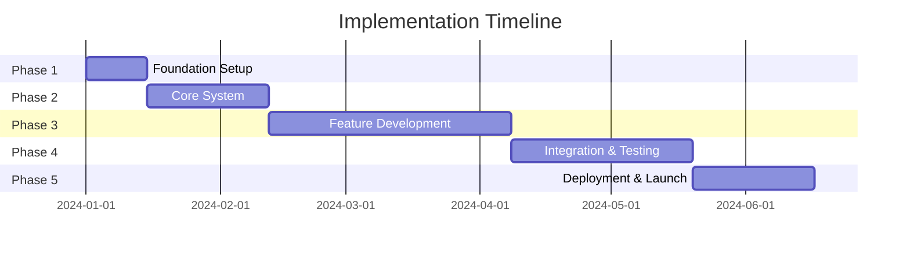

# Comprehensive Implementation Plan: BIG Live Portal

## Executive Summary
The BIG Live Portal implementation follows a phased approach over 6 months to deliver a Progressive Web Application that revolutionizes performing arts management. The plan emphasizes mobile-first development, early integration with critical external services (SharePoint, e-signature providers), and iterative feature releases to gather user feedback. By structuring development into 5 distinct phases - Foundation & Infrastructure, Core System Development, Feature Implementation, Integration & Testing, and Deployment & Launch - the team can deliver a production-ready platform supporting 1,000+ concurrent users with sub-500ms response times while maintaining 99.9% uptime. The implementation prioritizes risk mitigation through comprehensive testing, progressive rollout strategies, and continuous stakeholder engagement.

## Project Structure & Organization
The implementation leverages modern development practices with a microservices architecture, feature-based code organization, and automated deployment pipelines to ensure maintainability and scalability.

### Development Phases
- **Phase 1**: Foundation & Infrastructure Setup (Weeks 1-2)
- **Phase 2**: Core System Development (Weeks 3-6)
- **Phase 3**: Feature Implementation (Weeks 7-14)
- **Phase 4**: Integration & Testing (Weeks 15-20)
- **Phase 5**: Deployment & Launch (Weeks 21-24)

### Team Structure & Responsibilities
**Technical Lead**: Architecture decisions, code reviews, integration coordination, performance optimization
- **Frontend Developers (2)**: React PWA development, UI implementation, mobile optimization, offline functionality
- **Backend Developers (2)**: API development, microservices implementation, database design, external integrations
- **UI/UX Designer**: Design system maintenance, user research, prototype validation, accessibility compliance
- **DevOps Engineer (0.5)**: Infrastructure setup, CI/CD pipelines, monitoring configuration, deployment automation
- **QA Engineer (0.5)**: Test strategy, automated testing, performance testing, security validation

## Detailed Task Breakdown

### Phase 1: Foundation & Infrastructure Setup
**Duration**: 2 weeks
**Dependencies**: None (starting phase)
**Success Criteria**: Development environment operational, CI/CD pipeline functional, base infrastructure provisioned

#### 1.1 Development Environment Setup
**Priority**: Critical
**Estimated Effort**: 3 days
**Assigned To**: Technical Lead + DevOps Engineer
**Dependencies**: None

**Detailed Tasks**:
1. **Repository Setup**
   - Initialize Git repository with main/develop/feature branching strategy
   - Configure branch protection rules (require PR reviews, status checks)
   - Set up GitHub Projects for task management
   - Create initial monorepo structure with Lerna/Nx
   - Configure .gitignore, .editorconfig, and code formatting rules

2. **Development Tools Configuration**
   - Install and configure development environment setup script
   - Set up VS Code workspace with recommended extensions
   - Configure ESLint, Prettier, and TypeScript configurations
   - Set up Husky for pre-commit hooks (linting, formatting)
   - Create Docker Compose for local development services

3. **CI/CD Pipeline Setup**
   - Configure GitHub Actions for automated builds
   - Set up test runners for unit/integration/e2e tests
   - Configure code coverage reporting with Codecov
   - Set up automated dependency updates with Dependabot
   - Create deployment workflows for dev/staging/prod

**Acceptance Criteria**:
- [ ] Repository accessible with proper permissions
- [ ] Development environment setup completes in < 30 minutes
- [ ] CI/CD pipeline runs on every PR
- [ ] Code quality tools enforce standards automatically

#### 1.2 Infrastructure Provisioning
**Priority**: Critical
**Estimated Effort**: 4 days
**Assigned To**: DevOps Engineer
**Dependencies**: 1.1 Repository Setup

**Detailed Tasks**:
1. **Cloud Infrastructure Setup**
   - Provision Azure/AWS accounts with proper IAM roles
   - Set up Virtual Networks with proper security groups
   - Configure Application Gateway/Load Balancer
   - Provision AKS/EKS cluster for container orchestration
   - Set up Azure Container Registry/ECR

2. **Environment Configuration**
   - Create dev, staging, and production environments
   - Configure environment-specific variables in Key Vault/Secrets Manager
   - Set up SSL certificates with auto-renewal
   - Configure DNS entries and CDN endpoints
   - Implement infrastructure as code with Terraform

3. **Database and Storage Setup**
   - Provision PostgreSQL instances with read replicas
   - Configure Redis clusters for caching
   - Set up Elasticsearch cluster for search/logging
   - Configure Azure Blob/S3 buckets for file storage
   - Implement automated backup strategies

4. **Monitoring Infrastructure**
   - Set up Application Insights/CloudWatch
   - Configure log aggregation with proper retention
   - Set up alerting rules for critical metrics
   - Install APM agents for performance monitoring
   - Create infrastructure dashboards

**Acceptance Criteria**:
- [ ] All environments provisioned and accessible
- [ ] Databases accepting connections with SSL
- [ ] Monitoring capturing metrics and logs
- [ ] Automated backups verified working

#### 1.3 Security Foundation
**Priority**: Critical
**Estimated Effort**: 2 days
**Assigned To**: Technical Lead + DevOps Engineer
**Dependencies**: 1.2 Infrastructure Provisioning

**Detailed Tasks**:
1. **Security Baseline Configuration**
   - Configure Web Application Firewall rules
   - Set up DDoS protection
   - Implement network security policies
   - Configure secret rotation policies
   - Set up vulnerability scanning

2. **Access Control Setup**
   - Configure Azure AD/AWS IAM integration
   - Set up MFA for all administrative access
   - Implement least privilege access policies
   - Configure audit logging for all access
   - Set up privileged access management

**Acceptance Criteria**:
- [ ] Security scans show no critical vulnerabilities
- [ ] All administrative access requires MFA
- [ ] Audit logs capturing all access attempts
- [ ] Secrets properly stored and rotated

### Phase 2: Core System Development
**Duration**: 4 weeks
**Dependencies**: Phase 1 completion
**Success Criteria**: Authentication system operational, base API framework functional, core services implemented

#### 2.1 Authentication & Authorization System
**Priority**: Critical
**Estimated Effort**: 8 days
**Assigned To**: Backend Developer 1 + Frontend Developer 1
**Dependencies**: 1.2 Infrastructure Provisioning

**Detailed Tasks**:
1. **User Authentication Implementation**
   - Create user database schema with proper indexes
   - Implement registration API with email validation
   - Build login endpoint with JWT token generation
   - Implement password hashing with bcrypt (12 rounds)
   - Create refresh token mechanism with rotation

2. **Authorization Framework**
   - Implement role-based access control (RBAC) system
   - Create permission middleware for API endpoints
   - Build role management APIs
   - Implement resource-level access controls
   - Create authorization decorators/HOCs

3. **Security Hardening**
   - Implement rate limiting (5 attempts/minute)
   - Configure account lockout after 10 failed attempts
   - Set up CAPTCHA for suspicious activity
   - Implement session timeout with warnings
   - Add audit logging for all auth events

4. **Frontend Authentication Flow**
   - Create login/registration components
   - Implement AuthContext for state management
   - Build protected route components
   - Add session timeout warnings
   - Implement remember me functionality

**Acceptance Criteria**:
- [ ] Users can register with personal email
- [ ] Login works with <500ms response time
- [ ] Role-based permissions properly enforced
- [ ] Security measures prevent brute force attacks

#### 2.2 Core API Development
**Priority**: Critical
**Estimated Effort**: 6 days
**Assigned To**: Backend Developer 2
**Dependencies**: 2.1 Authentication System

**Detailed Tasks**:
1. **API Gateway Setup**
   - Configure Express.js with TypeScript
   - Implement request/response interceptors
   - Set up API versioning (v1)
   - Configure CORS policies
   - Implement request ID tracking

2. **Base Service Architecture**
   - Create base service class with common functionality
   - Implement dependency injection container
   - Set up service discovery mechanism
   - Configure inter-service communication
   - Implement circuit breaker pattern

3. **Database Layer**
   - Set up TypeORM/Prisma with migrations
   - Create base repository pattern
   - Implement connection pooling
   - Add query optimization middleware
   - Configure read/write splitting

4. **Caching Strategy**
   - Implement Redis caching layer
   - Create cache invalidation logic
   - Set up cache warming strategies
   - Configure session storage
   - Implement distributed locks

**Acceptance Criteria**:
- [ ] API responds to health checks
- [ ] Database migrations run automatically
- [ ] Caching reduces query load by >50%
- [ ] Service communication working reliably

#### 2.3 Frontend Foundation
**Priority**: Critical
**Estimated Effort**: 5 days
**Assigned To**: Frontend Developer 2
**Dependencies**: 1.1 Development Environment

**Detailed Tasks**:
1. **React Application Setup**
   - Initialize React 18 with TypeScript
   - Configure Vite for fast builds
   - Set up Redux Toolkit for state management
   - Implement React Query for server state
   - Configure React Router for navigation

2. **Design System Implementation**
   - Set up Material-UI v5 with custom theme
   - Create color palette and typography system
   - Build base component library
   - Implement responsive breakpoints
   - Add dark mode support structure

3. **PWA Configuration**
   - Configure service worker with Workbox
   - Set up offline caching strategies
   - Implement app manifest
   - Configure push notification support
   - Add install prompts

4. **Mobile Optimization**
   - Implement touch gesture support
   - Configure viewport and zoom settings
   - Add iOS/Android specific optimizations
   - Implement lazy loading for images
   - Configure performance budgets

**Acceptance Criteria**:
- [ ] PWA scores 90+ in Lighthouse
- [ ] Components render consistently across devices
- [ ] Offline mode shows cached content
- [ ] Build size under 200KB initial bundle

#### 2.4 Notification Service
**Priority**: High
**Estimated Effort**: 4 days
**Assigned To**: Backend Developer 1
**Dependencies**: 2.2 Core API Development

**Detailed Tasks**:
1. **Email Integration**
   - Configure SendGrid API integration
   - Create email template system
   - Implement transactional email queue
   - Add email tracking and analytics
   - Set up bounce/complaint handling

2. **SMS Integration**
   - Configure Twilio API integration
   - Implement SMS queue with retry logic
   - Add phone number validation
   - Configure international SMS support
   - Implement opt-out management

3. **Push Notifications**
   - Set up FCM/APNS integration
   - Implement push token management
   - Create notification preferences API
   - Add notification history tracking
   - Configure notification grouping

**Acceptance Criteria**:
- [ ] Emails deliver within 60 seconds
- [ ] SMS reaches 98%+ delivery rate
- [ ] Push notifications work on iOS/Android
- [ ] Users can manage preferences

### Phase 3: Feature Implementation
**Duration**: 8 weeks
**Dependencies**: Phase 2 completion
**Success Criteria**: All MVP features implemented and functional

#### 3.1 Digital Contract Management
**Priority**: Critical
**Estimated Effort**: 10 days
**Assigned To**: Full Stack Team
**Dependencies**: Core system operational

**User Stories Addressed**:
- Administrators upload and distribute contracts efficiently
- Artists receive and sign contracts on mobile devices
- Signed documents automatically sync to SharePoint

**Detailed Tasks**:
1. **Frontend Implementation**
   - Create ContractDashboard with data table and filters
   - Build drag-and-drop upload component with progress
   - Implement ContractViewer with pinch-to-zoom
   - Add bulk assignment interface
   - Create signature flow integration
   - Implement mobile-responsive contract list

2. **Backend Implementation**
   - Create contract upload API with file validation
   - Implement SharePoint Graph API integration
   - Build contract assignment workflow
   - Add e-signature webhook handlers
   - Create document versioning system
   - Implement secure download endpoints

3. **Integration & Testing**
   - Connect frontend to backend APIs
   - Test SharePoint synchronization
   - Validate e-signature flow end-to-end
   - Performance test bulk operations
   - Security test file upload/download
   - Cross-browser compatibility testing

**Acceptance Criteria**:
- [ ] 50 contracts uploadable in <2 minutes
- [ ] E-signature works on all mobile devices
- [ ] SharePoint sync completes within 30 seconds
- [ ] Bulk assignment handles 100+ artists
- [ ] Document preview loads in <3 seconds

#### 3.2 Mobile Expense Submission
**Priority**: Critical
**Estimated Effort**: 8 days
**Assigned To**: Full Stack Team
**Dependencies**: 3.1 Contract Management

**User Stories Addressed**:
- Artists capture receipts immediately after purchase
- Expense submission works offline
- Finance team processes claims efficiently

**Detailed Tasks**:
1. **Frontend Implementation**
   - Create camera capture component
   - Build receipt image editor with auto-crop
   - Implement expense form with smart defaults
   - Add offline queue with sync indicator
   - Create expense history view
   - Build approval interface for admins

2. **Backend Implementation**
   - Create expense submission API
   - Implement receipt image processing
   - Build Xero API integration
   - Add Hubdoc document upload
   - Create approval workflow engine
   - Implement expense analytics

3. **Integration & Testing**
   - Test camera functionality across devices
   - Validate offline/online sync
   - Test Xero category mapping
   - Verify image optimization
   - Load test with 1000+ receipts
   - Test approval workflow scenarios

**Acceptance Criteria**:
- [ ] Receipt capture works in low light
- [ ] Offline expenses sync within 30 seconds
- [ ] Image processing completes in <3 seconds
- [ ] Xero sync accurate to penny
- [ ] Bulk approval processes 50+ expenses

#### 3.3 Personal Schedule Dashboard
**Priority**: High
**Estimated Effort**: 6 days
**Assigned To**: Full Stack Team
**Dependencies**: Core notification service

**User Stories Addressed**:
- Artists view schedules across timezones
- Real-time updates for schedule changes
- Calendar export to personal apps

**Detailed Tasks**:
1. **Frontend Implementation**
   - Create calendar component with multiple views
   - Build event detail modal/bottom sheet
   - Implement timezone selector
   - Add swipe navigation for mobile
   - Create schedule notification UI
   - Build calendar export functionality

2. **Backend Implementation**
   - Create event management APIs
   - Implement WebSocket for real-time updates
   - Build timezone conversion logic
   - Add iCal export generation
   - Create notification triggers
   - Implement event acknowledgment

3. **Integration & Testing**
   - Test real-time updates across devices
   - Validate timezone conversions
   - Test calendar exports in multiple apps
   - Verify notification delivery
   - Performance test with 1000+ events
   - Test offline schedule viewing

**Acceptance Criteria**:
- [ ] Schedule loads in <1 second
- [ ] Real-time updates arrive <500ms
- [ ] Calendar exports work in Google/Apple
- [ ] Timezone changes handled correctly
- [ ] Offline mode shows cached events

#### 3.4 Administrative Control Panel
**Priority**: High
**Estimated Effort**: 8 days
**Assigned To**: Full Stack Team
**Dependencies**: All core features

**User Stories Addressed**:
- Administrators manage all platform aspects
- Real-time analytics and monitoring
- Bulk operations for efficiency

**Detailed Tasks**:
1. **Frontend Implementation**
   - Create admin dashboard with metrics
   - Build user management interface
   - Implement bulk operation tools
   - Add analytics visualizations
   - Create audit log viewer
   - Build system settings panel

2. **Backend Implementation**
   - Create admin-specific APIs
   - Implement analytics aggregation
   - Build bulk operation processors
   - Add audit logging system
   - Create report generation
   - Implement admin notifications

3. **Integration & Testing**
   - Test user CRUD operations
   - Validate bulk processing
   - Test analytics accuracy
   - Verify audit completeness
   - Performance test dashboards
   - Security test admin access

**Acceptance Criteria**:
- [ ] Dashboard loads in <2 seconds
- [ ] Bulk operations handle 1000+ records
- [ ] Analytics update real-time
- [ ] Audit logs capture all actions
- [ ] Reports generate in <10 seconds

### Phase 4: Integration & Testing
**Duration**: 6 weeks
**Dependencies**: Phase 3 completion
**Success Criteria**: All integrations stable, 90%+ test coverage, performance targets met

#### 4.1 External Service Integration
**Priority**: Critical
**Estimated Effort**: 10 days
**Assigned To**: Backend Team + Integration Specialist
**Dependencies**: Feature implementation

**Detailed Tasks**:
1. **SharePoint Integration Finalization**
   - Complete OAuth 2.0 consent flow
   - Implement document metadata sync
   - Add permission inheritance
   - Configure webhook subscriptions
   - Test with large document volumes
   - Handle API rate limiting

2. **Financial System Integration**
   - Finalize Xero API connection
   - Test expense synchronization
   - Implement error handling
   - Add reconciliation reports
   - Configure Hubdoc processing
   - Test multi-currency support

3. **E-Signature Integration**
   - Complete DocuSign/Adobe Sign setup
   - Test embedded signing flow
   - Configure webhook handlers
   - Add signature validation
   - Test bulk signature requests
   - Handle service downtime

**Acceptance Criteria**:
- [ ] SharePoint sync 99%+ reliable
- [ ] Financial data accurate to penny
- [ ] E-signatures legally compliant
- [ ] All integrations handle failures gracefully
- [ ] Rate limits properly managed

#### 4.2 Comprehensive Testing
**Priority**: Critical
**Estimated Effort**: 15 days
**Assigned To**: QA Engineer + Full Team
**Dependencies**: 4.1 Integration completion

**Detailed Tasks**:
1. **Automated Testing**
   - Write unit tests (>80% coverage)
   - Create integration test suites
   - Build end-to-end test scenarios
   - Implement visual regression tests
   - Add accessibility testing
   - Configure continuous testing

2. **Performance Testing**
   - Load test with 1000+ concurrent users
   - Test API response times
   - Validate database query performance
   - Test file upload/download speeds
   - Measure frontend performance
   - Test under peak season loads (3x)

3. **Security Testing**
   - Conduct penetration testing
   - Test authentication vulnerabilities
   - Validate data encryption
   - Test API security
   - Verify compliance requirements
   - Test role-based access

4. **User Acceptance Testing**
   - Recruit beta testers from target users
   - Create UAT test scenarios
   - Gather feedback systematically
   - Test on various devices
   - Validate offline functionality
   - Test real-world workflows

**Acceptance Criteria**:
- [ ] 90%+ automated test coverage
- [ ] All performance targets met
- [ ] Zero critical security issues
- [ ] 95%+ UAT scenario pass rate
- [ ] Accessibility WCAG 2.1 AA compliant

#### 4.3 Bug Fixing & Optimization
**Priority**: High
**Estimated Effort**: 10 days
**Assigned To**: Full Team
**Dependencies**: 4.2 Testing completion

**Detailed Tasks**:
1. **Critical Bug Resolution**
   - Fix all severity 1 issues
   - Address security vulnerabilities
   - Resolve integration failures
   - Fix mobile-specific bugs
   - Address performance bottlenecks

2. **Performance Optimization**
   - Optimize database queries
   - Implement additional caching
   - Reduce bundle sizes
   - Optimize image delivery
   - Improve API response times

3. **User Experience Polish**
   - Refine UI animations
   - Improve error messages
   - Enhance loading states
   - Polish mobile interactions
   - Optimize offline experience

**Acceptance Criteria**:
- [ ] Zero critical bugs remaining
- [ ] Performance targets exceeded by 10%
- [ ] User feedback incorporated
- [ ] Mobile experience smooth
- [ ] All integrations stable

### Phase 5: Deployment & Launch
**Duration**: 4 weeks
**Dependencies**: Phase 4 completion
**Success Criteria**: Successful production launch with initial customers

#### 5.1 Production Deployment Preparation
**Priority**: Critical
**Estimated Effort**: 5 days
**Assigned To**: DevOps Engineer + Technical Lead
**Dependencies**: All testing complete

**Detailed Tasks**:
1. **Production Environment Setup**
   - Configure production infrastructure
   - Set up production databases
   - Configure CDN for global delivery
   - Implement auto-scaling policies
   - Set up disaster recovery
   - Configure production monitoring

2. **Deployment Pipeline**
   - Create blue-green deployment
   - Configure automated rollback
   - Set up canary deployments
   - Implement feature flags
   - Configure deployment approvals
   - Test deployment procedures

3. **Data Migration**
   - Create data migration scripts
   - Test migration procedures
   - Plan rollback strategies
   - Configure data validation
   - Set up data archival
   - Test backup restoration

**Acceptance Criteria**:
- [ ] Production environment stable
- [ ] Deployment completes in <10 minutes
- [ ] Rollback tested and working
- [ ] Monitoring capturing all metrics
- [ ] Disaster recovery tested

#### 5.2 Beta Launch
**Priority**: Critical
**Estimated Effort**: 10 days
**Assigned To**: Full Team
**Dependencies**: 5.1 Production ready

**Detailed Tasks**:
1. **Beta Customer Onboarding**
   - Select 3-5 beta organizations
   - Conduct onboarding sessions
   - Provide dedicated support
   - Gather detailed feedback
   - Monitor system performance
   - Address issues immediately

2. **Documentation & Training**
   - Create user documentation
   - Build video tutorials
   - Develop admin guides
   - Create API documentation
   - Build troubleshooting guides
   - Conduct training sessions

3. **Support Infrastructure**
   - Set up help desk system
   - Create knowledge base
   - Implement chat support
   - Configure issue tracking
   - Set up SLA monitoring
   - Train support staff

**Acceptance Criteria**:
- [ ] Beta customers successfully onboarded
- [ ] Documentation covers all features
- [ ] Support responding within SLA
- [ ] System stability maintained
- [ ] Positive beta feedback received

#### 5.3 General Availability Launch
**Priority**: Critical
**Estimated Effort**: 10 days
**Assigned To**: Full Team + Marketing
**Dependencies**: Successful beta

**Detailed Tasks**:
1. **Launch Preparation**
   - Address all beta feedback
   - Finalize marketing materials
   - Prepare PR announcements
   - Set up sales demos
   - Configure billing systems
   - Plan launch events

2. **Gradual Rollout**
   - Enable registration for new customers
   - Monitor system performance
   - Provide onboarding support
   - Track adoption metrics
   - Gather user feedback
   - Iterate based on data

3. **Post-Launch Support**
   - Monitor system 24/7
   - Address issues immediately
   - Provide rapid support
   - Track customer satisfaction
   - Plan feature updates
   - Celebrate milestones

**Acceptance Criteria**:
- [ ] System handles launch traffic
- [ ] Onboarding completion >80%
- [ ] Customer satisfaction >4.5/5
- [ ] Zero critical incidents
- [ ] Revenue targets on track

## Risk Management & Mitigation

### Technical Risks
| Risk | Probability | Impact | Mitigation Strategy | Owner |
|------|-------------|--------|-------------------|-------|
| SharePoint API complexity delays integration | High | High | Start integration early, engage Microsoft support, build abstraction layer | Backend Lead |
| Mobile browser compatibility issues | Medium | Medium | Test early on real devices, use progressive enhancement, have fallbacks | Frontend Lead |
| Peak season load causes performance issues | Medium | High | Load test at 5x capacity, implement auto-scaling, use caching aggressively | DevOps Engineer |
| E-signature service downtime | Low | High | Integrate multiple providers, implement queuing, manual fallback process | Integration Dev |

### Project Risks
| Risk | Probability | Impact | Mitigation Strategy | Owner |
|------|-------------|--------|-------------------|-------|
| Scope creep from beta feedback | High | Medium | Define clear MVP boundaries, prioritize post-launch features, manage expectations | Product Manager |
| Team member unavailability | Medium | Medium | Cross-train team members, document everything, maintain knowledge base | Technical Lead |
| Integration API changes | Low | High | Version lock APIs, monitor changelogs, maintain abstraction layers | Backend Lead |
| Security vulnerability discovered | Medium | High | Regular security scans, penetration testing, rapid patch process | Security Lead |

## Quality Assurance Strategy

### Testing Approach
- **Unit Testing**: 80%+ code coverage using Jest/Mocha
- **Integration Testing**: Test all API endpoints and integrations
- **End-to-End Testing**: Cypress for critical user workflows
- **Performance Testing**: K6/JMeter for load testing
- **Security Testing**: OWASP ZAP + professional penetration testing

### Quality Gates
- **Code Review**: All PRs require 2 approvals
- **Automated Testing**: 100% pass rate required for merge
- **Performance Benchmarks**: Must meet defined SLAs
- **Security Validation**: No high/critical vulnerabilities

## Timeline & Milestones

### Project Timeline

### Key Milestones
- **Milestone 1**: Foundation Complete - Week 2
- **Milestone 2**: Core System Operational - Week 6
- **Milestone 3**: Feature Development Complete - Week 14
- **Milestone 4**: Testing & Integration Complete - Week 20
- **Milestone 5**: Production Launch - Week 24

## Resource Allocation

### Effort Distribution
- **Frontend Development**: 30% of total effort
- **Backend Development**: 35% of total effort
- **Database & Infrastructure**: 10% of total effort
- **Testing & QA**: 15% of total effort
- **DevOps & Deployment**: 5% of total effort
- **Project Management**: 5% of total effort

### Capacity Planning
- **Total Estimated Effort**: 2,400 person-hours
- **Team Capacity**: 200 hours/week (5.5 FTE)
- **Project Duration**: 24 weeks
- **Buffer Time**: 20% for unexpected challenges

## Success Metrics & KPIs

### Technical Metrics
- **Code Coverage**: >80% for critical components
- **Performance**: API response times <500ms (p95)
- **Availability**: >99.9% uptime from launch
- **Security**: Zero critical vulnerabilities

### Business Metrics
- **Feature Completion**: 100% of MVP requirements
- **User Acceptance**: >95% UAT pass rate
- **Timeline Adherence**: <10% variance from plan
- **Budget Adherence**: <5% variance from budget

## Critical Questions and Clarifications

1. **SharePoint Permission Model**: Should the platform inherit SharePoint permissions for documents, or maintain its own permission system? This affects the depth of integration required and could impact timeline by 1-2 weeks.

2. **Offline Functionality Scope**: Which specific features must work offline beyond viewing contracts and drafting expenses? Full offline support for all features would add 3-4 weeks to the timeline.

3. **Multi-Organization Architecture**: Do artists need to work with multiple organizations simultaneously? This would require significant changes to the data model and authentication system, adding 2-3 weeks.

4. **Peak Load Handling Strategy**: Should the system auto-scale for the 3x peak season load, or can we pre-scale based on known patterns? Auto-scaling adds complexity but reduces costs during off-peak times.

5. **E-Signature Provider Priority**: Between DocuSign and Adobe Sign, which should be the primary integration? Having both would add 1 week but provide redundancy.

6. **Compliance Requirements**: Are there specific union or industry regulations beyond standard data protection that would require custom workflows? This could add 2-4 weeks depending on complexity.

7. **Data Migration Scope**: How much historical data needs to be migrated from existing systems? Large-scale migration could add 2-3 weeks to the timeline.

8. **Custom Branding Depth**: Should each organization have full visual customization capabilities, or just logo/color changes? Full customization would add 1-2 weeks.

9. **Notification Granularity**: Should notification preferences be user-level or organization-level? User-level adds complexity but improves user satisfaction.

10. **Beta Customer Selection**: Are the 3-5 beta organizations already identified? Having committed beta customers affects the beta phase timeline and feedback quality.