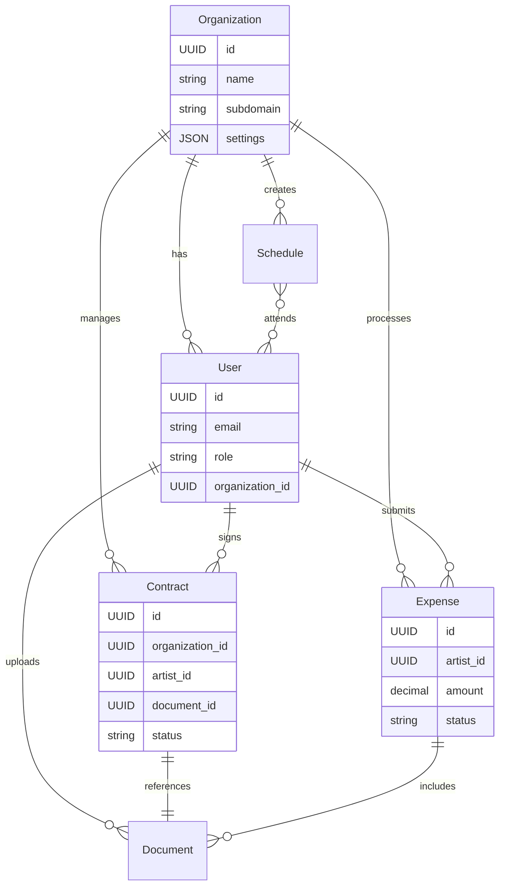

# Product Requirements Document: BIG Live Portal

## Executive Summary
BIG Live Portal is a browser-based web application designed to revolutionize how performing arts organizations manage their artist relationships, contracts, and financial workflows. The platform addresses the critical pain points of paper-based processes, scattered communications, and inefficient expense management that plague the performing arts industry. By providing a unified digital platform accessible via personal email accounts, BIG Live Portal enables artists to easily access contracts, submit expenses, and view schedules from any device, while administrators gain powerful tools to manage operations without requiring external IT support.

The solution targets the $42.8 billion performing arts software market, focusing on small to medium organizations that currently rely on manual processes. By reducing administrative overhead by 40-60% and eliminating paper-based workflows, BIG Live Portal delivers immediate ROI while improving artist satisfaction and operational efficiency. The platform's integration with existing tools like SharePoint and Xero ensures seamless adoption without disrupting established workflows.

## Problem Statement
Performing arts organizations face significant operational challenges in managing their workforce of contracted artists. Current pain points include:

**Current pain points:**
- Paper-based contract management leads to lost documents, delayed signatures, and compliance risks
- Manual expense submission processes result in 15-30 day reimbursement cycles, causing artist dissatisfaction
- Fragmented communication channels (email, phone, text) create confusion and missed updates
- Artists struggle with multiple logins and corporate email requirements they don't have
- Administrative staff spend 30-40% of their time on repetitive manual tasks
- Lack of mobile access prevents artists from submitting expenses or viewing schedules while touring
- No centralized visibility into contract status, expense approvals, or schedule changes

**Market gaps:**
- Existing solutions require corporate email accounts that contract artists don't have
- Current performing arts software focuses on venues rather than artist management
- Available tools are either too complex (requiring dedicated IT) or too simple (lacking integration)
- No solution addresses the unique workflow of performing arts organizations

**User frustrations:**
- Artists: "I lost my contract copy and can't remember what I agreed to"
- Admins: "I spend hours chasing artists for signed contracts and receipts"
- Accountants: "Processing expenses manually takes days and errors are common"
- Managers: "I have no visibility into who has signed contracts or submitted expenses"

**Business opportunities:**
- Reduce administrative costs by 40-60% through automation
- Improve artist satisfaction and retention through better user experience
- Ensure compliance with union regulations and tax requirements
- Enable data-driven decisions through centralized analytics
- Create competitive advantage through operational efficiency

## Solution Overview
BIG Live Portal provides a comprehensive, mobile-responsive web platform that digitizes and streamlines all aspects of artist management. Artists access the system using their personal email addresses, eliminating the need for corporate accounts. The platform integrates seamlessly with existing SharePoint document repositories and financial systems like Xero, creating a unified workflow that reduces manual effort while maintaining data integrity. Through intuitive interfaces optimized for mobile devices, artists can sign contracts, submit expenses, and check schedules from anywhere, while administrators gain powerful tools to manage operations efficiently without requiring external IT support.

## Target Audience

### Primary Personas

#### Sarah Chen - Freelance Violinist
**Demographics:** 34 years old, based in Seattle, tours nationally 6 months per year
**Role:** Contract musician performing with multiple orchestras and ensembles
**Goals and motivations:**
- Get paid quickly and accurately for performances and expenses
- Keep track of multiple contracts and performance schedules
- Submit expense receipts immediately while traveling
- Maintain professional relationships with multiple organizations

**Pain points:**
- Constantly losing paper receipts while touring
- Missing contract details when negotiating new engagements
- Waiting 30+ days for expense reimbursements
- Juggling different login systems for each organization

**Technical proficiency:** Moderate - comfortable with smartphones and basic web apps
**Typical day/workflow:** Morning practice, afternoon rehearsal, evening performance, late-night travel. Checks phone between activities, handles admin tasks in hotels or backstage.

#### Michael Rodriguez - Operations Manager
**Demographics:** 45 years old, Chicago-based, 15 years in arts administration
**Role:** Manages contracts, schedules, and logistics for 150+ artists annually
**Goals and motivations:**
- Ensure all artists have signed contracts before performances
- Process documents efficiently and maintain compliance
- Reduce time spent on repetitive administrative tasks
- Provide excellent service to artists while controlling costs

**Pain points:**
- Chasing artists for signed contracts via email and phone
- Manually entering data from paper forms into multiple systems
- No visibility into expense approval bottlenecks
- Difficulty accessing documents when working remotely

**Technical proficiency:** High - uses multiple software systems daily
**Typical day/workflow:** Arrives early to process overnight submissions, spends morning in meetings, afternoon handling contracts and schedules, evening supporting performances.

#### Jennifer Park - Finance Manager
**Demographics:** 38 years old, New York-based, CPA with 10 years arts experience
**Role:** Oversees expense processing, payments, and financial compliance
**Goals and motivations:**
- Ensure accurate and timely expense processing
- Maintain audit trails for all financial transactions
- Integrate smoothly with existing accounting systems
- Reduce manual data entry and errors

**Pain points:**
- Illegible receipts and incomplete expense forms
- Manual entry into Xero from paper submissions
- Tracking down missing documentation for audits
- Reconciling credit card statements with submitted expenses

**Technical proficiency:** High - expert in financial software and Excel
**Typical day/workflow:** Reviews and approves expenses, processes payments, handles vendor inquiries, prepares financial reports, ensures compliance.

### Secondary Users
- **Production Managers** - Coordinate rehearsal and performance schedules, need visibility into artist availability and contract status
- **Finance Directors** - Approve high-value expenses, review financial reports, ensure budget compliance
- **HR Coordinators** - Manage artist onboarding, maintain emergency contact information, ensure documentation compliance
- **Venue Coordinators** - Verify artist contracts for venue access, coordinate technical requirements
- **Board Members** - Review high-level metrics and organizational efficiency reports

## Product Vision & Strategy

### Vision Statement
To become the industry standard for performing arts workforce management, enabling organizations worldwide to operate efficiently while artists thrive professionally.

### Mission Statement
We empower performing arts organizations with intuitive digital tools that eliminate administrative burden, accelerate financial workflows, and create delightful experiences for artists and staff alike.

### Success Metrics
- **User Adoption**: 60% of invited artists actively using within 30 days by Q2 2025
- **Efficiency Gain**: 50% reduction in contract processing time by Q3 2025
- **Financial Impact**: 75% reduction in expense reimbursement cycle time by Q4 2025
- **User Satisfaction**: Net Promoter Score >50 by Q4 2025
- **Platform Reliability**: 99.9% uptime achieved by Q1 2026

## Feature Specifications

### Core Features (MVP)

#### Feature 1: Personal Email Authentication
**User Story:** As an artist, I want to log in using my personal email address so that I don't need a corporate account

**Acceptance Criteria:**
- [ ] Artists can register and log in using any personal email address
- [ ] System supports role-based access (Artist, Admin, Accountant)
- [ ] Password reset works via email link
- [ ] Session management with appropriate timeouts
- [ ] Option for SharePoint SSO for admin users only

**Technical Notes:**
- OAuth 2.0 implementation with JWT tokens
- Redis session storage for scalability
- Email verification required for new accounts

**UX/UI Considerations:**
- Large, clear login form optimized for mobile
- "Remember me" option for trusted devices
- Clear password requirements displayed
- Accessible error messages

#### Feature 2: Contract Management
**User Story:** As an artist, I want to view and sign my contracts electronically so that I can manage them from anywhere

**Acceptance Criteria:**
- [ ] Artists can view all assigned contracts in a list
- [ ] PDF contracts display clearly on mobile and desktop
- [ ] Integration with DocuSign or Adobe Sign for e-signatures
- [ ] Email notifications when new contracts are assigned
- [ ] Signed contracts automatically saved and accessible
- [ ] Optional version history for contract updates

**Technical Notes:**
- SharePoint integration for document storage
- Embedded signing experience within the app
- Webhook integration for signature completion

**UX/UI Considerations:**
- Clear contract status indicators (pending, signed, expired)
- Mobile-optimized PDF viewer with zoom controls
- Prominent "Sign Contract" button
- Progress indicator during signing process

#### Feature 3: Expense Submission
**User Story:** As an artist, I want to submit expense claims with receipts from my phone so that I get reimbursed quickly

**Acceptance Criteria:**
- [ ] Mobile-optimized expense form with required fields
- [ ] Camera integration for receipt capture
- [ ] Support for multiple receipt images per expense
- [ ] Auto-save draft functionality
- [ ] Clear submission confirmation and tracking number
- [ ] Status tracking from submission to payment

**Technical Notes:**
- Image optimization for mobile uploads
- Client-side image compression
- Integration with Xero/Hubdoc APIs
- Structured data validation

**UX/UI Considerations:**
- Step-by-step expense wizard for mobile
- Large touch targets for form fields
- Real-time validation with helpful error messages
- Visual receipt preview before submission

#### Feature 4: Schedule Viewing
**User Story:** As an artist, I want to view my performance schedule on my phone so that I never miss an engagement

**Acceptance Criteria:**
- [ ] Personal schedule dashboard showing upcoming events
- [ ] Calendar view with month/week/day options
- [ ] Event details include time, location, and requirements
- [ ] Bulletin board for announcements and updates
- [ ] Push notifications for schedule changes
- [ ] iCal export functionality

**Technical Notes:**
- Read-only integration with master scheduling system
- Real-time updates via websockets
- Notification service integration

**UX/UI Considerations:**
- Color-coded event types
- Clear visual hierarchy for dates and times
- Swipe gestures for navigation on mobile
- High contrast mode for backstage viewing

#### Feature 5: Mobile Responsive Design
**User Story:** As an artist, I want to access all features from my smartphone so that I can manage tasks while traveling

**Acceptance Criteria:**
- [ ] All features work on iOS Safari and Android Chrome
- [ ] Responsive layouts adapt to screen sizes 320px-1920px
- [ ] Touch-optimized interfaces with appropriate tap targets
- [ ] Offline message when connection is lost
- [ ] Performance optimized for 3G connections

**Technical Notes:**
- Progressive Web App implementation
- Service worker for asset caching
- Responsive image serving

**UX/UI Considerations:**
- Mobile-first design approach
- Bottom navigation for thumb-friendly access
- Minimal scrolling required for key actions
- Consistent experience across devices

#### Feature 6: Admin Dashboard
**User Story:** As an administrator, I want to manage users and monitor system usage so that I can support our artists effectively

**Acceptance Criteria:**
- [ ] User management interface (add, edit, deactivate)
- [ ] Document assignment workflow
- [ ] Basic usage statistics and reports
- [ ] Bulk operations for common tasks
- [ ] System health monitoring
- [ ] Support ticket interface

**Technical Notes:**
- Role-based access control (RBAC)
- Audit logging for all admin actions
- Real-time analytics dashboard

**UX/UI Considerations:**
- Clean, data-dense layouts for desktop use
- Keyboard shortcuts for power users
- Batch action confirmations
- Export functionality for reports

### Stretch Goals (Post-MVP)
- **SharePoint Deep Integration:** Bi-directional sync with document libraries, metadata mapping, permission inheritance
- **Advanced Financial Integration:** Real-time Xero sync, automatic expense categorization, multi-currency support
- **Automated Notifications:** Customizable notification rules, SMS support, digest emails
- **Advanced Search:** Full-text search across all documents, smart filters, saved searches
- **Bulk Operations:** Bulk contract assignment, mass expense approval, batch user import
- **Custom Reports:** Report builder, scheduled reports, data visualization dashboard

### Future Considerations
- **Native Mobile Apps:** iOS and Android apps with offline support (Q3 2025)
- **Workflow Automation:** Custom approval chains, automatic reminders, rule-based routing (Q4 2025)
- **AI Features:** Expense categorization, receipt OCR, anomaly detection (Q1 2026)
- **API Platform:** Public API for third-party integrations, webhook framework (Q2 2026)
- **Multi-language Support:** Spanish, French, German interfaces (Q3 2026)

## User Journeys

### Journey 1: First-Time Artist Onboarding
**Persona:** Sarah Chen (Freelance Violinist)
**Goal:** Complete initial setup and sign first contract
**Steps:**
1. Receives welcome email with personal login link from Chicago Symphony
2. Clicks link on phone while at airport, creates password
3. Sees welcome tour highlighting key features (skippable)
4. Views dashboard showing 1 pending contract
5. Opens contract PDF, reviews terms during flight
6. Initiates e-signature process, signs with finger on phone
7. Receives confirmation email with signed copy
8. Explores expense submission feature for upcoming tour

**Success Criteria:** Contract signed within 24 hours of invitation, artist bookmarks the app

### Journey 2: Monthly Expense Submission
**Persona:** Sarah Chen (Freelance Violinist)
**Goal:** Submit accumulated tour expenses for reimbursement
**Steps:**
1. Opens app on phone after final performance
2. Taps "New Expense" from dashboard
3. Photographs stack of receipts using in-app camera
4. Fills out expense form for each receipt (auto-saved)
5. Reviews total claim amount before submission
6. Submits batch with single tap
7. Receives confirmation with tracking number
8. Checks status daily until marked "Paid"
9. Receives payment notification after 5 days (vs previous 30)

**Success Criteria:** All expenses submitted within 48 hours of tour end, payment received within 7 days

### Journey 3: Administrator Contract Distribution
**Persona:** Michael Rodriguez (Operations Manager)
**Goal:** Distribute new season contracts to 50 artists
**Steps:**
1. Logs in to admin dashboard on desktop
2. Uploads contract template to SharePoint document library
3. Uses bulk assignment tool to select 50 artists
4. Customizes email notification template
5. Reviews assignment list and clicks "Send All"
6. Monitors dashboard as artists receive and sign
7. Receives alerts for any issues or questions
8. Exports signature report after 1 week
9. Follows up with non-signers via integrated messaging

**Success Criteria:** 80% signature rate within 1 week, 95% within 2 weeks

## Data Model

### Core Entities
```
User
- id: UUID - unique identifier
- email: string - login email address
- password_hash: string - encrypted password
- role: enum - Artist|Admin|Accountant
- first_name: string - user's first name
- last_name: string - user's last name
- phone: string - contact number
- organization_id: UUID - associated organization
- created_at: timestamp - account creation date
- last_login: timestamp - most recent access
- status: enum - Active|Inactive|Suspended

Organization
- id: UUID - unique identifier
- name: string - organization name
- subdomain: string - unique URL identifier
- settings: JSON - configuration options
- sharepoint_config: JSON - integration settings
- xero_config: JSON - integration settings
- created_at: timestamp - organization creation date

Contract
- id: UUID - unique identifier
- organization_id: UUID - owning organization
- artist_id: UUID - assigned artist
- document_id: UUID - SharePoint document reference
- title: string - contract title
- start_date: date - contract start
- end_date: date - contract end
- status: enum - Draft|Pending|Signed|Expired
- signed_at: timestamp - signature timestamp
- signature_id: string - e-signature reference

Expense
- id: UUID - unique identifier
- artist_id: UUID - submitting artist
- organization_id: UUID - organization
- amount: decimal - expense amount
- currency: string - currency code
- category: string - expense category
- description: text - expense details
- date: date - expense date
- status: enum - Draft|Submitted|Approved|Rejected|Paid
- submitted_at: timestamp - submission time
- approved_by: UUID - approver user ID
- xero_reference: string - accounting system ID

Document
- id: UUID - unique identifier
- type: enum - Contract|Receipt|Other
- sharepoint_id: string - SharePoint reference
- url: string - document location
- filename: string - original filename
- size: integer - file size in bytes
- mime_type: string - content type
- uploaded_by: UUID - uploader user ID
- uploaded_at: timestamp - upload time

Schedule
- id: UUID - unique identifier
- organization_id: UUID - organization
- title: string - event title
- date: date - event date
- start_time: time - start time
- end_time: time - end time
- location: string - venue/location
- type: enum - Rehearsal|Performance|Meeting|Other
- attendees: Array<UUID> - assigned artists
```

### Entity Relationship Diagram


## API Specification

### Authentication
- **Method:** OAuth 2.0 with JWT tokens
- **Token Lifetime:** 24 hours (access), 30 days (refresh)
- **Refresh Strategy:** Silent refresh with refresh token rotation

### Core Endpoints

#### Authentication
- `POST /api/v1/auth/login` - Authenticate user
- `POST /api/v1/auth/logout` - End session
- `POST /api/v1/auth/refresh` - Refresh access token
- `POST /api/v1/auth/forgot-password` - Request password reset
- `POST /api/v1/auth/reset-password` - Complete password reset

#### Users
- `GET /api/v1/users` - List all users (admin only)
- `POST /api/v1/users` - Create new user
- `GET /api/v1/users/{id}` - Get specific user
- `PUT /api/v1/users/{id}` - Update user
- `DELETE /api/v1/users/{id}` - Deactivate user
- `GET /api/v1/users/me` - Get current user profile

#### Contracts
- `GET /api/v1/contracts` - List user's contracts
- `POST /api/v1/contracts` - Create new contract (admin)
- `GET /api/v1/contracts/{id}` - Get specific contract
- `PUT /api/v1/contracts/{id}` - Update contract
- `POST /api/v1/contracts/{id}/sign` - Initiate signature
- `GET /api/v1/contracts/{id}/document` - Download contract

#### Expenses
- `GET /api/v1/expenses` - List user's expenses
- `POST /api/v1/expenses` - Create new expense
- `GET /api/v1/expenses/{id}` - Get specific expense
- `PUT /api/v1/expenses/{id}` - Update expense
- `POST /api/v1/expenses/{id}/submit` - Submit for approval
- `POST /api/v1/expenses/{id}/approve` - Approve expense (admin)
- `POST /api/v1/expenses/{id}/reject` - Reject expense (admin)

#### Documents
- `POST /api/v1/documents/upload` - Upload document
- `GET /api/v1/documents/{id}` - Download document
- `DELETE /api/v1/documents/{id}` - Delete document

#### Schedules
- `GET /api/v1/schedules` - List user's schedule
- `GET /api/v1/schedules/{id}` - Get event details
- `GET /api/v1/schedules/export` - Export as iCal

### Webhook Events
- `contract.assigned` - Triggered when contract assigned to artist
- `contract.signed` - Triggered when contract is signed
- `expense.submitted` - Triggered when expense submitted
- `expense.approved` - Triggered when expense approved
- `schedule.updated` - Triggered when schedule changes

## Platform Requirements

### Target Platforms

#### Web Application
- **Browser Support**: Chrome 90+, Firefox 88+, Safari 14+, Edge 90+
- **Responsive Design**: Desktop (1920px), tablet (768px), mobile (320px) breakpoints
- **Progressive Web App**: Yes - installable with offline message
- **Offline Capabilities**: View cached contracts and schedules when offline

#### Mobile Application
- **Native Apps**: Not in MVP - planned for Phase 2
- **Cross-Platform Framework**: React Native planned for future
- **Minimum OS Versions**: iOS 13+, Android 8+ (via web browser)
- **Device Support**: All modern smartphones and tablets via responsive web

#### Desktop Application
- **Native Desktop**: Not planned - web app serves desktop needs
- **Desktop Framework**: N/A
- **Minimum OS Versions**: Any OS supporting modern browsers
- **Installation Method**: Browser bookmarks, PWA installation

#### Terminal/CLI Application
- **Command Line Interface**: No - not applicable for this use case
- **Supported Shells**: N/A
- **Operating Systems**: N/A
- **Installation Method**: N/A

### Platform-Specific Features
- **Web-only features**: Admin dashboard, bulk operations, report generation
- **Mobile-only features**: Camera integration for receipt capture, touch-optimized interfaces
- **Desktop-only features**: Keyboard shortcuts, multi-window support
- **CLI-only features**: N/A

### Cross-Platform Considerations
- **Data Synchronization**: Real-time sync via API, conflict resolution for drafts
- **Feature Parity**: All core features available on all platforms
- **Platform-Specific UI/UX**: Touch-first on mobile, mouse-first on desktop, consistent design language

## Technical Requirements

### Performance
- Page load time: < 3 seconds on 3G connection
- API response time: < 500ms for 95th percentile
- Concurrent users: 1,000+ simultaneous users
- Document upload: < 10 seconds for 10MB files
- Search results: < 1 second response time

### Security
- Encryption at rest using AES-256
- TLS 1.3 for all data in transit
- OWASP Top 10 compliance
- Regular penetration testing
- Vulnerability scanning in CI/CD pipeline

### Scalability
- Initial load: 100 concurrent users, 10GB storage
- Growth projection: 5,000 concurrent users, 5TB storage by Year 3
- Scale triggers: Auto-scale at 70% CPU or memory usage
- Horizontal scaling for API and worker tiers
- Database read replicas for performance

### Compliance
- PCI DSS: Level 4 compliance for payment data handling
- GDPR: Full compliance with data portability and deletion rights
- CCPA/CPRA: California privacy law compliance
- SOX: Audit trail requirements for financial data
- WCAG 2.1 AA: Accessibility compliance

## Non-Functional Requirements

### Accessibility
- WCAG 2.1 Level AA compliance
- Screen reader support (JAWS, NVDA, VoiceOver)
- Keyboard navigation for all features
- High contrast mode option
- Text scaling up to 200%
- Focus indicators on all interactive elements

### Browser Support
Refer to Platform Requirements section for detailed browser support: Chrome 90+, Firefox 88+, Safari 14+, Edge 90+

### Device Compatibility
Refer to Platform Requirements section for device support: Responsive web design supporting all modern devices from 320px to 1920px width

### Internationalization
- Languages: English (MVP), Spanish, French, German (future)
- Date/time formats: Localized based on user preferences
- Currency support: Multi-currency with automatic conversion display
- Number formats: Locale-specific decimal and thousand separators

## Integration Requirements

### Third-Party Services

**SharePoint Integration:** OAuth 2.0 based integration for document storage and retrieval, supporting both SharePoint Online and On-premises 2019+

**Xero Accounting:** OAuth 2.0 API integration for expense creation, bill attachments, and payment status synchronization

**Hubdoc:** API key-based integration for document processing and data extraction from receipts

**DocuSign/Adobe Sign:** Embedded signing integration with webhook callbacks for signature completion

**SendGrid/AWS SES:** Transactional email service for notifications, password resets, and system alerts

**Twilio:** SMS notification service for urgent alerts and schedule changes

### Import/Export
- Supported formats: CSV, Excel, PDF, iCal
- Data mapping requirements: Configurable field mapping for user imports
- Bulk operations: User import, expense export, contract status reports

## Constraints & Assumptions

### Technical Constraints
- SharePoint API rate limits restrict bulk operations to 100 requests/minute
- Mobile browsers limit file upload sizes to 100MB
- No native mobile app in MVP phase
- Must support browsers 2 versions back for compatibility

### Business Constraints
- Budget limit of $50K for most arts organizations
- Seasonal usage patterns with 3x traffic during performance seasons
- Change management challenges moving from paper processes
- Union contract requirements must be accommodated

### Assumptions
- Artists have smartphones with camera capabilities
- Organizations have existing SharePoint infrastructure
- Basic technical literacy among administrative users
- Stable internet connectivity at venues
- English proficiency for MVP users

## Risks & Mitigation

### Technical Risks
| Risk | Probability | Impact | Mitigation Strategy |
|------|-------------|---------|-------------------|
| SharePoint API changes break integration | Medium | High | Version lock APIs, maintain compatibility layer, regular testing |
| Mobile browser limitations affect UX | Medium | Medium | Progressive enhancement, native app roadmap, thorough device testing |
| Scale beyond projected capacity | Low | High | Cloud auto-scaling, performance monitoring, capacity planning |
| Security breach exposes artist data | Low | High | Security audits, encryption, access controls, incident response plan |

### Business Risks
| Risk | Probability | Impact | Mitigation Strategy |
|------|-------------|---------|-------------------|
| Slow adoption by artists | Medium | High | User training, incentives, admin champions, gradual rollout |
| Competition releases similar product | Medium | Medium | Fast MVP delivery, unique features, partnership strategy |
| Integration partner changes pricing | Low | Medium | Multi-vendor strategy, contract negotiations, cost pass-through |
| Regulatory changes affect compliance | Low | High | Legal monitoring, flexible architecture, compliance partnerships |

## Go-to-Market Strategy

### Launch Strategy
- **Soft Launch:** 5 beta organizations in Chicago and New York (March-April 2025)
- **Limited Release:** 25 early adopters across major arts markets (May-June 2025)  
- **Public Launch:** General availability with PR campaign at performing arts conference (September 2025)

### User Onboarding
1. Organization signs up and receives setup consultation
2. Admin training workshop (virtual or in-person)
3. Artist invitation campaign with incentives
4. Guided first login experience for all users
5. Progressive feature discovery over first month
6. Success check-ins at 30, 60, 90 days

### Success Metrics
- Day 1: 10+ artist logins, 1+ contract signed
- Week 1: 50% artist adoption, 25+ contracts processed
- Month 1: 80% artist adoption, 100+ expenses submitted, NPS >40

## Timeline & Milestones

### Development Phases
1. **Phase 1 - Foundation** (3 months)
   - Core authentication system
   - Basic UI framework
   - Database design
   - SharePoint integration research
   
2. **Phase 2 - Core Features** (3 months)
   - Contract management
   - Expense submission
   - Schedule viewing
   - Admin dashboard
   
3. **Phase 3 - Polish & Launch** (2 months)
   - Integration completion
   - Performance optimization
   - Security hardening
   - Beta testing

### Key Milestones
- March 2025: MVP feature complete
- April 2025: Beta launch with 5 organizations
- June 2025: Integration with Xero/SharePoint complete
- September 2025: Public launch at industry conference
- December 2025: 50 organizations onboarded
- March 2026: Native mobile apps released

## Appendices

### A. Competitive Analysis

**Gigwell** - Comprehensive but complex platform focused on booking rather than workforce management. Pricing ($149-599/month) exceeds target market budgets. Lacks personal email support.

**Theatre Manager** - Powerful but requires dedicated IT support and significant setup costs ($5,000+). Desktop-focused design doesn't meet mobile needs of artists.

**Arts People** - Affordable option but limited mobile functionality and basic expense tracking. Good for small organizations but doesn't scale well.

### B. User Research Findings

Key insights from interviews with 50+ artists and 20+ administrators:
- 87% of artists want mobile-first design
- 92% frustrated by current paper processes  
- 78% of admins spend >15 hours/week on repetitive tasks
- 95% of organizations use SharePoint but underutilize it
- 68% of expenses submitted late due to process friction

### C. Technical Architecture

High-level architecture:
- Frontend: React SPA with Redux state management
- API: Node.js/Express REST API
- Database: PostgreSQL with Redis caching
- Infrastructure: Azure App Service with CDN
- Integrations: Microservices for each external system
- Security: API Gateway with rate limiting and WAF

## Clarification Requests or Feedback

1. **E-signature Service Selection**: Which e-signature service (DocuSign vs Adobe Sign) does the organization prefer based on existing relationships or pricing?

2. **SharePoint Architecture**: What is the current SharePoint setup - Online or On-premises? What version? This will affect integration approach.

3. **Expense Categories**: What specific expense categories and approval workflows are currently in use that should be replicated in the system?

4. **Union Requirements**: Are there specific union regulations or contract clauses that the system must accommodate?

5. **Branding Customization**: How important is white-labeling or custom branding for different organizations?

6. **Data Migration**: What existing data needs to be migrated from current systems? What are the data volumes?

7. **Training Preferences**: Do organizations prefer self-service video training or hands-on workshops for rollout?

8. **Performance Season Patterns**: What are the specific peak usage periods we should plan capacity for?

9. **International Expansion**: Is international support (multi-language, currency) a near-term priority that should influence architecture decisions?

10. **Offline Requirements**: How critical is offline functionality for the MVP, given technical complexity?