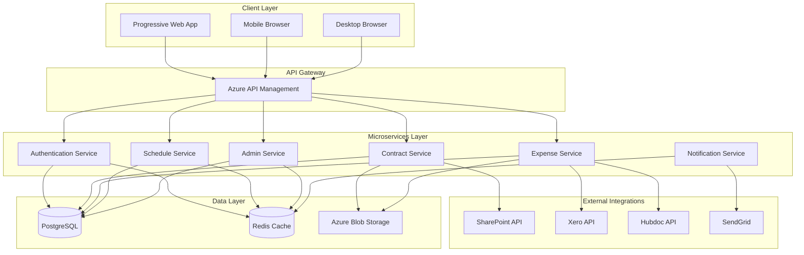

# BIG Live Portal - Comprehensive Technical Specification

## Table of Contents
1. [Executive Summary](#executive-summary)
2. [System Architecture](#system-architecture)
3. [Core Functionality](#core-functionality)
4. [Technology Stack](#technology-stack)
5. [Data Models](#data-models)
6. [API Specifications](#api-specifications)
7. [Security Architecture](#security-architecture)
8. [Performance Requirements](#performance-requirements)
9. [Infrastructure Requirements](#infrastructure-requirements)
10. [Critical Questions and Clarifications](#critical-questions-and-clarifications)

## 1. Executive Summary

### Project Overview
BIG Live Portal is a comprehensive web-based platform designed to streamline contractor management operations. The system provides a centralized hub for contract management, expense submission, schedule viewing, and administrative oversight.

### Key Objectives
- **Digitize Contract Management**: Eliminate paper-based contract processes through digital viewing, e-signing, and version control
- **Streamline Expense Processing**: Automate expense submission and integration with accounting systems
- **Improve Communication**: Provide real-time schedule visibility and announcement capabilities
- **Mobile-First Approach**: Ensure full functionality across all devices through PWA implementation
- **Administrative Efficiency**: Centralize user and document management with comprehensive analytics

### Target Users
- **Contractors**: Primary users who manage contracts, submit expenses, and view schedules
- **Administrators**: Internal staff who manage users, documents, and system configurations
- **Management**: Stakeholders who require analytics and reporting capabilities

### Success Metrics
- 80% reduction in contract processing time
- 90% mobile adoption rate
- 60% decrease in expense processing errors
- 95% system uptime
- Sub-2 second page load times

## 2. System Architecture

### High-Level Architecture Diagram



### Architectural Patterns

#### Microservices Architecture
- **Service Isolation**: Each core feature implemented as an independent service
- **API Gateway**: Centralized entry point for all client requests
- **Service Communication**: RESTful APIs with async messaging for non-critical operations
- **Data Isolation**: Each service maintains its own database schema

#### Caching Strategy
- **Redis Implementation**: Session storage, frequently accessed data, and real-time notifications
- **Cache Levels**:
  - L1: Browser cache for static assets
  - L2: CDN cache for global distribution
  - L3: Redis for application data
  - L4: Database query cache

#### Scalability Considerations
- **Horizontal Scaling**: All services designed for stateless operation
- **Load Balancing**: Azure Load Balancer with health checks
- **Auto-scaling**: Based on CPU, memory, and request metrics
- **Database Scaling**: Read replicas for heavy query operations

## 3. Core Functionality

### 3.1 User Authentication

#### Implementation Details
```typescript
// Authentication Service Interface
interface AuthenticationService {
  login(email: string, password: string): Promise<AuthToken>;
  logout(token: string): Promise<void>;
  refreshToken(refreshToken: string): Promise<AuthToken>;
  validateToken(token: string): Promise<boolean>;
  resetPassword(email: string): Promise<void>;
}

// JWT Token Structure
interface AuthToken {
  accessToken: string;
  refreshToken: string;
  expiresIn: number;
  userId: string;
  role: UserRole;
}
```

#### Authentication Flow
1. User submits personal email and password
2. System validates credentials against PostgreSQL
3. Generate JWT tokens (access + refresh)
4. Store session in Redis with 24-hour TTL
5. Return tokens to client for subsequent requests

#### Password Management
- **Hashing**: bcrypt with 12 rounds
- **Reset Flow**: Email-based with secure token
- **Password Requirements**: Minimum 8 characters, mixed case, numbers, special characters

### 3.2 Contract Management

#### Implementation Details
```typescript
// Contract Service Interface
interface ContractService {
  getContracts(userId: string, filters?: ContractFilters): Promise<Contract[]>;
  getContractById(contractId: string): Promise<Contract>;
  signContract(contractId: string, signature: SignatureData): Promise<void>;
  getContractVersions(contractId: string): Promise<ContractVersion[]>;
  downloadContract(contractId: string, format: 'pdf' | 'docx'): Promise<Blob>;
}

// Contract Data Model
interface Contract {
  id: string;
  title: string;
  status: ContractStatus;
  createdAt: Date;
  updatedAt: Date;
  version: number;
  documentUrl: string;
  signatures: Signature[];
  metadata: ContractMetadata;
}
```

#### E-Signature Implementation
- **Signature Capture**: HTML5 Canvas for drawing signatures
- **Verification**: Timestamp and IP address logging
- **Storage**: Base64 encoded signature image in PostgreSQL
- **Legal Compliance**: ESIGN Act and UETA compliant

#### Version Control
- **Tracking**: All contract modifications create new versions
- **Storage**: Immutable document storage in Azure Blob
- **Comparison**: Side-by-side diff view for changes
- **Audit Trail**: Complete history of all actions

### 3.3 Expense Submission

#### Implementation Details
```typescript
// Expense Service Interface
interface ExpenseService {
  submitExpense(expense: ExpenseSubmission): Promise<ExpenseRecord>;
  uploadReceipt(expenseId: string, receipt: File): Promise<void>;
  getExpenses(userId: string, dateRange: DateRange): Promise<ExpenseRecord[]>;
  syncWithXero(expenseId: string): Promise<XeroSyncResult>;
  syncWithHubdoc(expenseId: string): Promise<HubdocSyncResult>;
}

// Expense Data Model
interface ExpenseSubmission {
  amount: number;
  category: ExpenseCategory;
  description: string;
  date: Date;
  receipts: File[];
  projectId?: string;
}
```

#### Receipt Processing
- **Upload**: Direct to Azure Blob Storage with virus scanning
- **OCR Integration**: Azure Form Recognizer for data extraction
- **Validation**: Amount matching and duplicate detection
- **Storage**: Compressed images with thumbnail generation

#### Accounting Integration
- **Xero API**: Real-time expense creation and categorization
- **Hubdoc API**: Document management and auto-extraction
- **Error Handling**: Retry logic with exponential backoff
- **Sync Status**: Real-time updates via WebSocket

### 3.4 Schedule Management

#### Implementation Details
```typescript
// Schedule Service Interface
interface ScheduleService {
  getSchedule(userId: string, dateRange: DateRange): Promise<ScheduleEntry[]>;
  getAnnouncements(active: boolean): Promise<Announcement[]>;
  subscribeToUpdates(userId: string): Observable<ScheduleUpdate>;
}

// Schedule Data Model
interface ScheduleEntry {
  id: string;
  title: string;
  startTime: Date;
  endTime: Date;
  location: string;
  description: string;
  type: ScheduleType;
  participants: string[];
}
```

#### Real-time Updates
- **WebSocket Connection**: For live schedule changes
- **Push Notifications**: PWA service worker implementation
- **Caching**: Aggressive caching with intelligent invalidation
- **Offline Support**: Local storage for offline viewing

### 3.5 Mobile Responsiveness

#### PWA Implementation
```javascript
// Service Worker Registration
if ('serviceWorker' in navigator) {
  navigator.serviceWorker.register('/sw.js')
    .then(registration => {
      console.log('ServiceWorker registered');
      checkForUpdates(registration);
    });
}

// App Manifest
{
  "name": "BIG Live Portal",
  "short_name": "BIG Live",
  "start_url": "/",
  "display": "standalone",
  "background_color": "#ffffff",
  "theme_color": "#1976d2",
  "icons": [
    {
      "src": "/icon-192.png",
      "sizes": "192x192",
      "type": "image/png"
    }
  ]
}
```

#### Responsive Design
- **Breakpoints**: Mobile (<768px), Tablet (768-1024px), Desktop (>1024px)
- **Touch Optimization**: 44px minimum touch targets
- **Offline Functionality**: Critical features available offline
- **Performance**: Lazy loading and code splitting

### 3.6 Admin Dashboard

#### Implementation Details
```typescript
// Admin Service Interface
interface AdminService {
  getUsers(filters: UserFilters): Promise<PaginatedResult<User>>;
  updateUser(userId: string, updates: UserUpdate): Promise<User>;
  getDocuments(filters: DocumentFilters): Promise<Document[]>;
  uploadDocument(document: DocumentUpload): Promise<Document>;
  getAnalytics(dateRange: DateRange): Promise<AnalyticsData>;
}

// Analytics Data Model
interface AnalyticsData {
  userMetrics: UserMetrics;
  documentMetrics: DocumentMetrics;
  systemMetrics: SystemMetrics;
  expenseMetrics: ExpenseMetrics;
}
```

#### Dashboard Features
- **User Management**: CRUD operations with role assignment
- **Document Library**: Centralized document storage and categorization
- **Analytics**: Real-time dashboards with customizable widgets
- **Audit Logs**: Complete system activity tracking

## 4. Technology Stack

### Frontend Technologies

#### React 18+ with TypeScript
**Justification**: 
- Industry-leading component library with excellent ecosystem
- TypeScript provides type safety and better developer experience
- React 18's concurrent features improve performance
- Large talent pool for maintenance and updates

**Key Libraries**:
```json
{
  "react": "^18.2.0",
  "react-dom": "^18.2.0",
  "typescript": "^5.0.0",
  "react-router-dom": "^6.8.0",
  "react-hook-form": "^7.43.0"
}
```

#### Material-UI (MUI)
**Justification**:
- Comprehensive component library following Material Design
- Built-in accessibility features
- Excellent theming capabilities
- Strong TypeScript support

**Configuration**:
```typescript
const theme = createTheme({
  palette: {
    primary: {
      main: '#1976d2',
    },
    secondary: {
      main: '#dc004e',
    },
  },
  typography: {
    fontFamily: 'Roboto, Arial, sans-serif',
  },
});
```

#### Redux Toolkit
**Justification**:
- Simplified Redux implementation
- Built-in immutability and devtools
- RTK Query for API caching
- Excellent TypeScript integration

**Store Structure**:
```typescript
const store = configureStore({
  reducer: {
    auth: authSlice,
    contracts: contractsSlice,
    expenses: expensesSlice,
    schedule: scheduleSlice,
    admin: adminSlice,
  },
});
```

### Backend Technologies

#### Node.js 18+ with Express.js
**Justification**:
- JavaScript ecosystem consistency
- Excellent performance for I/O operations
- Large selection of middleware and packages
- Strong Azure support

**Core Dependencies**:
```json
{
  "express": "^4.18.0",
  "typescript": "^5.0.0",
  "cors": "^2.8.5",
  "helmet": "^7.0.0",
  "compression": "^1.7.4"
}
```

#### TypeScript
**Justification**:
- Type safety across full stack
- Better IDE support and autocomplete
- Easier refactoring and maintenance
- Reduced runtime errors

### Database Technologies

#### PostgreSQL
**Justification**:
- ACID compliance for financial data
- JSON support for flexible schemas
- Excellent performance at scale
- Strong Azure support

**Key Features Used**:
- JSONB for metadata storage
- Full-text search for documents
- Materialized views for analytics
- Partitioning for large tables

#### Redis
**Justification**:
- Sub-millisecond latency
- Pub/Sub for real-time features
- Session storage
- Caching layer

**Use Cases**:
- Session management
- API rate limiting
- Real-time notifications
- Cache for expensive queries

### Cloud Platform

#### Azure (Preferred)
**Justification**:
- Native SharePoint integration
- Comprehensive security features
- Global availability
- Enterprise support

**Services Used**:
- Azure App Service for hosting
- Azure Database for PostgreSQL
- Azure Cache for Redis
- Azure Blob Storage
- Azure API Management
- Azure Form Recognizer
- Azure Application Insights

## 5. Data Models

### User Schema
```sql
CREATE TABLE users (
    id UUID PRIMARY KEY DEFAULT gen_random_uuid(),
    email VARCHAR(255) UNIQUE NOT NULL,
    password_hash VARCHAR(255) NOT NULL,
    first_name VARCHAR(100) NOT NULL,
    last_name VARCHAR(100) NOT NULL,
    role VARCHAR(50) NOT NULL CHECK (role IN ('contractor', 'admin', 'super_admin')),
    status VARCHAR(50) NOT NULL DEFAULT 'active' CHECK (status IN ('active', 'inactive', 'suspended')),
    created_at TIMESTAMP WITH TIME ZONE DEFAULT CURRENT_TIMESTAMP,
    updated_at TIMESTAMP WITH TIME ZONE DEFAULT CURRENT_TIMESTAMP,
    last_login_at TIMESTAMP WITH TIME ZONE,
    metadata JSONB DEFAULT '{}'::jsonb
);

CREATE INDEX idx_users_email ON users(email);
CREATE INDEX idx_users_status ON users(status);
```

### Contract Schema
```sql
CREATE TABLE contracts (
    id UUID PRIMARY KEY DEFAULT gen_random_uuid(),
    user_id UUID NOT NULL REFERENCES users(id),
    title VARCHAR(500) NOT NULL,
    document_url VARCHAR(1000) NOT NULL,
    status VARCHAR(50) NOT NULL CHECK (status IN ('draft', 'pending', 'signed', 'expired', 'terminated')),
    version INTEGER NOT NULL DEFAULT 1,
    created_at TIMESTAMP WITH TIME ZONE DEFAULT CURRENT_TIMESTAMP,
    updated_at TIMESTAMP WITH TIME ZONE DEFAULT CURRENT_TIMESTAMP,
    signed_at TIMESTAMP WITH TIME ZONE,
    expires_at TIMESTAMP WITH TIME ZONE,
    metadata JSONB DEFAULT '{}'::jsonb
);

CREATE TABLE contract_signatures (
    id UUID PRIMARY KEY DEFAULT gen_random_uuid(),
    contract_id UUID NOT NULL REFERENCES contracts(id),
    user_id UUID NOT NULL REFERENCES users(id),
    signature_data TEXT NOT NULL,
    signed_at TIMESTAMP WITH TIME ZONE DEFAULT CURRENT_TIMESTAMP,
    ip_address INET NOT NULL,
    user_agent TEXT
);

CREATE INDEX idx_contracts_user_id ON contracts(user_id);
CREATE INDEX idx_contracts_status ON contracts(status);
```

### Expense Schema
```sql
CREATE TABLE expenses (
    id UUID PRIMARY KEY DEFAULT gen_random_uuid(),
    user_id UUID NOT NULL REFERENCES users(id),
    amount DECIMAL(10, 2) NOT NULL,
    category VARCHAR(100) NOT NULL,
    description TEXT,
    expense_date DATE NOT NULL,
    status VARCHAR(50) NOT NULL DEFAULT 'pending' CHECK (status IN ('pending', 'approved', 'rejected', 'reimbursed')),
    created_at TIMESTAMP WITH TIME ZONE DEFAULT CURRENT_TIMESTAMP,
    updated_at TIMESTAMP WITH TIME ZONE DEFAULT CURRENT_TIMESTAMP,
    xero_id VARCHAR(255),
    hubdoc_id VARCHAR(255),
    metadata JSONB DEFAULT '{}'::jsonb
);

CREATE TABLE expense_receipts (
    id UUID PRIMARY KEY DEFAULT gen_random_uuid(),
    expense_id UUID NOT NULL REFERENCES expenses(id),
    file_url VARCHAR(1000) NOT NULL,
    file_name VARCHAR(255) NOT NULL,
    file_size INTEGER NOT NULL,
    mime_type VARCHAR(100) NOT NULL,
    uploaded_at TIMESTAMP WITH TIME ZONE DEFAULT CURRENT_TIMESTAMP
);

CREATE INDEX idx_expenses_user_id ON expenses(user_id);
CREATE INDEX idx_expenses_date ON expenses(expense_date);
CREATE INDEX idx_expenses_status ON expenses(status);
```

### Schedule Schema
```sql
CREATE TABLE schedule_entries (
    id UUID PRIMARY KEY DEFAULT gen_random_uuid(),
    title VARCHAR(500) NOT NULL,
    description TEXT,
    start_time TIMESTAMP WITH TIME ZONE NOT NULL,
    end_time TIMESTAMP WITH TIME ZONE NOT NULL,
    location VARCHAR(500),
    type VARCHAR(50) NOT NULL,
    created_at TIMESTAMP WITH TIME ZONE DEFAULT CURRENT_TIMESTAMP,
    updated_at TIMESTAMP WITH TIME ZONE DEFAULT CURRENT_TIMESTAMP,
    metadata JSONB DEFAULT '{}'::jsonb
);

CREATE TABLE schedule_participants (
    schedule_entry_id UUID NOT NULL REFERENCES schedule_entries(id),
    user_id UUID NOT NULL REFERENCES users(id),
    PRIMARY KEY (schedule_entry_id, user_id)
);

CREATE TABLE announcements (
    id UUID PRIMARY KEY DEFAULT gen_random_uuid(),
    title VARCHAR(500) NOT NULL,
    content TEXT NOT NULL,
    priority VARCHAR(50) NOT NULL CHECK (priority IN ('low', 'normal', 'high', 'urgent')),
    active BOOLEAN DEFAULT true,
    created_by UUID NOT NULL REFERENCES users(id),
    created_at TIMESTAMP WITH TIME ZONE DEFAULT CURRENT_TIMESTAMP,
    expires_at TIMESTAMP WITH TIME ZONE
);

CREATE INDEX idx_schedule_entries_time ON schedule_entries(start_time, end_time);
CREATE INDEX idx_announcements_active ON announcements(active);
```

## 6. API Specifications

### Authentication Endpoints

#### POST /api/auth/login
```typescript
// Request
{
  "email": "user@example.com",
  "password": "securePassword123!"
}

// Response
{
  "accessToken": "eyJhbGciOiJIUzI1NiIs...",
  "refreshToken": "eyJhbGciOiJIUzI1NiIs...",
  "expiresIn": 3600,
  "user": {
    "id": "123e4567-e89b-12d3-a456-426614174000",
    "email": "user@example.com",
    "firstName": "John",
    "lastName": "Doe",
    "role": "contractor"
  }
}
```

#### POST /api/auth/refresh
```typescript
// Request
{
  "refreshToken": "eyJhbGciOiJIUzI1NiIs..."
}

// Response
{
  "accessToken": "eyJhbGciOiJIUzI1NiIs...",
  "expiresIn": 3600
}
```

### Contract Endpoints

#### GET /api/contracts
```typescript
// Query Parameters
{
  "status": "active" | "signed" | "pending",
  "page": 1,
  "limit": 20
}

// Response
{
  "data": [
    {
      "id": "123e4567-e89b-12d3-a456-426614174000",
      "title": "Service Agreement 2024",
      "status": "pending",
      "createdAt": "2024-01-15T10:30:00Z",
      "version": 1
    }
  ],
  "pagination": {
    "page": 1,
    "limit": 20,
    "total": 45,
    "pages": 3
  }
}
```

#### POST /api/contracts/{id}/sign
```typescript
// Request
{
  "signature": "data:image/png;base64,iVBORw0KGgo...",
  "timestamp": "2024-01-15T10:30:00Z"
}

// Response
{
  "success": true,
  "contractId": "123e4567-e89b-12d3-a456-426614174000",
  "signedAt": "2024-01-15T10:30:00Z"
}
```

### Expense Endpoints

#### POST /api/expenses
```typescript
// Request (multipart/form-data)
{
  "amount": 150.50,
  "category": "travel",
  "description": "Client meeting travel",
  "date": "2024-01-15",
  "receipts": [File, File] // Multiple file uploads
}

// Response
{
  "id": "123e4567-e89b-12d3-a456-426614174000",
  "amount": 150.50,
  "status": "pending",
  "receipts": [
    {
      "id": "456e7890-e89b-12d3-a456-426614174000",
      "fileName": "receipt1.jpg",
      "fileSize": 245678
    }
  ]
}
```

#### POST /api/expenses/{id}/sync-xero
```typescript
// Response
{
  "success": true,
  "xeroId": "XERO-123456",
  "syncedAt": "2024-01-15T10:30:00Z"
}
```

### Schedule Endpoints

#### GET /api/schedule
```typescript
// Query Parameters
{
  "startDate": "2024-01-01",
  "endDate": "2024-01-31"
}

// Response
{
  "entries": [
    {
      "id": "123e4567-e89b-12d3-a456-426614174000",
      "title": "Team Meeting",
      "startTime": "2024-01-15T10:00:00Z",
      "endTime": "2024-01-15T11:00:00Z",
      "location": "Conference Room A"
    }
  ],
  "announcements": [
    {
      "id": "789e0123-e89b-12d3-a456-426614174000",
      "title": "System Maintenance",
      "content": "Scheduled maintenance on Jan 20th",
      "priority": "high"
    }
  ]
}
```

### Admin Endpoints

#### GET /api/admin/users
```typescript
// Query Parameters
{
  "role": "contractor",
  "status": "active",
  "search": "john",
  "page": 1,
  "limit": 50
}

// Response
{
  "data": [
    {
      "id": "123e4567-e89b-12d3-a456-426614174000",
      "email": "john.doe@example.com",
      "firstName": "John",
      "lastName": "Doe",
      "role": "contractor",
      "status": "active",
      "lastLoginAt": "2024-01-15T10:30:00Z"
    }
  ],
  "pagination": {
    "page": 1,
    "limit": 50,
    "total": 234,
    "pages": 5
  }
}
```

#### GET /api/admin/analytics
```typescript
// Query Parameters
{
  "startDate": "2024-01-01",
  "endDate": "2024-01-31",
  "metrics": ["users", "expenses", "contracts"]
}

// Response
{
  "period": {
    "start": "2024-01-01",
    "end": "2024-01-31"
  },
  "metrics": {
    "users": {
      "total": 234,
      "active": 198,
      "new": 12
    },
    "expenses": {
      "count": 456,
      "totalAmount": 45678.90,
      "averageAmount": 100.17
    },
    "contracts": {
      "total": 123,
      "signed": 98,
      "pending": 25
    }
  }
}
```

## 7. Security Architecture

### Authentication & Authorization

#### JWT Implementation
```typescript
// JWT Configuration
const jwtConfig = {
  accessToken: {
    secret: process.env.JWT_ACCESS_SECRET,
    expiresIn: '1h',
    algorithm: 'HS256'
  },
  refreshToken: {
    secret: process.env.JWT_REFRESH_SECRET,
    expiresIn: '7d',
    algorithm: 'HS256'
  }
};

// Token Payload Structure
interface JWTPayload {
  sub: string; // User ID
  email: string;
  role: UserRole;
  iat: number;
  exp: number;
}
```

#### Role-Based Access Control (RBAC)
```typescript
// Permission Matrix
const permissions = {
  contractor: [
    'contracts:read:own',
    'contracts:sign:own',
    'expenses:create:own',
    'expenses:read:own',
    'schedule:read',
    'announcements:read'
  ],
  admin: [
    ...permissions.contractor,
    'users:read:all',
    'users:update:all',
    'documents:create',
    'documents:read:all',
    'analytics:read'
  ],
  super_admin: [
    ...permissions.admin,
    'system:configure',
    'users:delete:all'
  ]
};
```

### Data Protection

#### Encryption at Rest
- **Database**: Transparent Data Encryption (TDE) in PostgreSQL
- **File Storage**: Azure Storage Service Encryption (256-bit AES)
- **Backups**: Encrypted using Azure Backup

#### Encryption in Transit
- **HTTPS**: TLS 1.3 minimum for all connections
- **Certificate**: Managed SSL certificates via Azure
- **HSTS**: Strict Transport Security headers

#### Sensitive Data Handling
```typescript
// PII Encryption Service
class PIIEncryption {
  private algorithm = 'aes-256-gcm';
  private key: Buffer;
  
  async encryptField(data: string): Promise<EncryptedData> {
    const iv = crypto.randomBytes(16);
    const cipher = crypto.createCipheriv(this.algorithm, this.key, iv);
    
    const encrypted = Buffer.concat([
      cipher.update(data, 'utf8'),
      cipher.final()
    ]);
    
    return {
      encrypted: encrypted.toString('base64'),
      iv: iv.toString('base64'),
      tag: cipher.getAuthTag().toString('base64')
    };
  }
}
```

### Security Headers
```typescript
// Helmet Configuration
app.use(helmet({
  contentSecurityPolicy: {
    directives: {
      defaultSrc: ["'self'"],
      styleSrc: ["'self'", "'unsafe-inline'"],
      scriptSrc: ["'self'"],
      imgSrc: ["'self'", "data:", "blob:", "https:"],
      connectSrc: ["'self'", "wss:", "https:"],
      fontSrc: ["'self'"],
      objectSrc: ["'none'"],
      mediaSrc: ["'self'"],
      frameSrc: ["'none'"],
    },
  },
  hsts: {
    maxAge: 31536000,
    includeSubDomains: true,
    preload: true
  }
}));
```

### API Security

#### Rate Limiting
```typescript
const rateLimiter = rateLimit({
  windowMs: 15 * 60 * 1000, // 15 minutes
  max: 100, // Limit each IP to 100 requests per windowMs
  message: 'Too many requests from this IP',
  standardHeaders: true,
  legacyHeaders: false,
  store: new RedisStore({
    client: redis,
    prefix: 'rate_limit:'
  })
});

// Stricter limits for sensitive endpoints
const authLimiter = rateLimit({
  windowMs: 15 * 60 * 1000,
  max: 5, // Only 5 login attempts per 15 minutes
  skipSuccessfulRequests: true
});
```

#### Input Validation
```typescript
// Validation Middleware using Joi
const validateRequest = (schema: Joi.Schema) => {
  return (req: Request, res: Response, next: NextFunction) => {
    const { error } = schema.validate(req.body, {
      abortEarly: false,
      stripUnknown: true
    });
    
    if (error) {
      return res.status(400).json({
        error: 'Validation Error',
        details: error.details.map(d => ({
          field: d.path.join('.'),
          message: d.message
        }))
      });
    }
    
    next();
  };
};
```

### Audit Logging
```typescript
// Audit Log Schema
interface AuditLog {
  id: string;
  userId: string;
  action: string;
  resource: string;
  resourceId: string;
  ipAddress: string;
  userAgent: string;
  timestamp: Date;
  details: Record<string, any>;
}

// Audit Middleware
const auditLog = async (req: Request, res: Response, next: NextFunction) => {
  const startTime = Date.now();
  
  res.on('finish', async () => {
    await createAuditLog({
      userId: req.user?.id,
      action: req.method,
      resource: req.baseUrl,
      resourceId: req.params.id,
      ipAddress: req.ip,
      userAgent: req.get('user-agent'),
      statusCode: res.statusCode,
      duration: Date.now() - startTime
    });
  });
  
  next();
};
```

## 8. Performance Requirements

### Response Time Requirements
- **Page Load**: < 2 seconds for initial load
- **API Response**: < 200ms for 95th percentile
- **Search Operations**: < 500ms for complex queries
- **File Upload**: < 5 seconds for 10MB files

### Throughput Requirements
- **Concurrent Users**: Support 1,000 concurrent users
- **API Requests**: Handle 10,000 requests per minute
- **File Processing**: Process 100 documents per minute
- **Database Queries**: < 50ms for indexed queries

### Resource Utilization
- **CPU Usage**: < 70% under normal load
- **Memory Usage**: < 80% of allocated memory
- **Database Connections**: Connection pooling with 100 max connections
- **Storage Growth**: Plan for 100GB annual growth

### Optimization Strategies

#### Frontend Optimization
```typescript
// Code Splitting
const ContractModule = lazy(() => import('./modules/contracts'));
const ExpenseModule = lazy(() => import('./modules/expenses'));

// Image Optimization
const OptimizedImage = ({ src, alt, ...props }) => {
  const [loading, setLoading] = useState(true);
  
  return (
     setLoading(false)}
      style={{ 
        filter: loading ? 'blur(5px)' : 'none',
        transition: 'filter 0.3s'
      }}
      {...props}
    />
  );
};

// Bundle Optimization
// webpack.config.js
optimization: {
  splitChunks: {
    chunks: 'all',
    cacheGroups: {
      vendor: {
        test: /[\\/]node_modules[\\/]/,
        name: 'vendors',
        priority: 10
      },
      common: {
        minChunks: 2,
        priority: 5,
        reuseExistingChunk: true
      }
    }
  }
}
```

#### Backend Optimization
```typescript
// Query Optimization
class ContractRepository {
  async getContractsWithPagination(userId: string, page: number, limit: number) {
    return await db.query(`
      SELECT c.*, 
             COUNT(*) OVER() as total_count
      FROM contracts c
      WHERE c.user_id = $1
        AND c.status = 'active'
      ORDER BY c.created_at DESC
      LIMIT $2 OFFSET $3
    `, [userId, limit, (page - 1) * limit]);
  }
}

// Caching Strategy
const cacheMiddleware = (ttl: number = 300) => {
  return async (req: Request, res: Response, next: NextFunction) => {
    const key = `cache:${req.originalUrl}`;
    const cached = await redis.get(key);
    
    if (cached) {
      return res.json(JSON.parse(cached));
    }
    
    const originalJson = res.json;
    res.json = function(data) {
      redis.setex(key, ttl, JSON.stringify(data));
      return originalJson.call(this, data);
    };
    
    next();
  };
};
```

## 9. Infrastructure Requirements

### Compute Resources

#### Application Servers
- **Web Tier**: 3x Azure App Service (P2v3)
  - 4 vCPU, 14 GB RAM each
  - Auto-scaling 3-10 instances
  - Health check endpoints

#### Microservices
- **Container Instances**: Azure Container Instances
  - 2 vCPU, 4 GB RAM per service
  - Horizontal scaling based on metrics
  - Service mesh for communication

### Storage Requirements

#### Database
- **PostgreSQL**: Azure Database for PostgreSQL
  - Flexible Server
  - 8 vCores, 32 GB RAM
  - 500 GB SSD storage
  - Read replica for reporting

#### Cache
- **Redis**: Azure Cache for Redis
  - Premium tier
  - 6 GB cache size
  - Persistence enabled
  - Clustering for HA

#### File Storage
- **Blob Storage**: Azure Blob Storage
  - Hot tier for recent documents
  - Cool tier for archives
  - Lifecycle management policies
  - CDN integration

### Network Architecture

#### Load Balancing
```yaml
# Azure Application Gateway Configuration
applicationGateway:
  sku: WAF_v2
  capacity: 2
  frontendPorts:
    - 80
    - 443
  backendPools:
    - name: web-pool
      servers: ["web1", "web2", "web3"]
    - name: api-pool
      servers: ["api1", "api2", "api3"]
  healthProbes:
    - path: /health
      interval: 30
      timeout: 20
  wafPolicy:
    enabled: true
    mode: Prevention
```

#### CDN Configuration
- **Azure CDN**: Standard Microsoft tier
- **Caching Rules**:
  - Static assets: 30 days
  - API responses: 5 minutes (where applicable)
  - Dynamic content: No cache

### Monitoring & Logging

#### Application Insights
```typescript
// Telemetry Configuration
const appInsights = require('applicationinsights');

appInsights.setup(process.env.APPINSIGHTS_KEY)
  .setAutoDependencyCorrelation(true)
  .setAutoCollectRequests(true)
  .setAutoCollectPerformance(true)
  .setAutoCollectExceptions(true)
  .setAutoCollectDependencies(true)
  .setAutoCollectConsole(true)
  .setUseDiskRetryCaching(true)
  .start();

// Custom Metrics
const telemetryClient = appInsights.defaultClient;

telemetryClient.trackMetric({
  name: "ExpenseProcessingTime",
  value: processingTime
});

telemetryClient.trackEvent({
  name: "ContractSigned",
  properties: {
    contractId: contract.id,
    userId: user.id
  }
});
```

#### Log Aggregation
- **Azure Monitor Logs**: Centralized logging
- **Log Retention**: 90 days
- **Alert Rules**: Critical error monitoring
- **Dashboards**: Real-time system health

### Backup & Disaster Recovery

#### Backup Strategy
- **Database**: Daily automated backups, 30-day retention
- **File Storage**: Geo-redundant storage with versioning
- **Configuration**: Infrastructure as Code in Git

#### Disaster Recovery Plan
- **RTO**: 4 hours
- **RPO**: 1 hour
- **Failover**: Automated with Azure Traffic Manager
- **Testing**: Quarterly DR drills

### Deployment Pipeline

#### CI/CD Configuration
```yaml
# Azure DevOps Pipeline
trigger:
  branches:
    include:
      - main
      - develop

stages:
  - stage: Build
    jobs:
      - job: BuildAndTest
        steps:
          - task: NodeTool@0
            inputs:
              versionSpec: '18.x'
          - script: |
              npm ci
              npm run build
              npm run test:ci
          - task: Docker@2
            inputs:
              command: 'build'
              Dockerfile: '**/Dockerfile'
              tags: '$(Build.BuildId)'
              
  - stage: Deploy
    condition: and(succeeded(), eq(variables['Build.SourceBranch'], 'refs/heads/main'))
    jobs:
      - deployment: DeployToProduction
        environment: 'production'
        strategy:
          runOnce:
            deploy:
              steps:
                - task: AzureWebApp@1
                  inputs:
                    azureSubscription: 'Production'
                    appName: 'big-live-portal'
                    package: '$(Pipeline.Workspace)/drop/*.zip'
```

## 10. Critical Questions and Clarifications

### Business Logic Clarifications

1. **Contract Approval Workflow**
   - Q: Is there an approval process before contractors can sign?
   - Q: Who has the authority to upload/modify contract templates?
   - Q: What happens to existing signed contracts when a new version is created?

2. **Expense Approval Process**
   - Q: Is manager approval required for expenses above certain thresholds?
   - Q: How should rejected expenses be handled?
   - Q: What are the expense categories and limits?

3. **User Onboarding**
   - Q: How are new contractors invited to the system?
   - Q: Is there a verification process for personal emails?
   - Q: What information is required during initial registration?

### Technical Clarifications

4. **SharePoint Integration**
   - Q: What is the current SharePoint structure?
   - Q: Which document types need bidirectional sync?
   - Q: Are there existing SharePoint workflows to preserve?

5. **Accounting System Integration**
   - Q: What specific Xero/Hubdoc APIs are currently in use?
   - Q: How should sync conflicts be resolved?
   - Q: What financial data should remain in the portal vs. accounting system?

6. **Data Migration**
   - Q: What is the volume of existing data to migrate?
   - Q: Are there legacy system dependencies?
   - Q: What is the acceptable downtime for migration?

### Compliance & Legal

7. **Data Retention**
   - Q: What are the legal requirements for document retention?
   - Q: How long should audit logs be maintained?
   - Q: Are there industry-specific compliance requirements?

8. **E-Signature Compliance**
   - Q: Which jurisdictions need to be supported?
   - Q: Are there specific audit trail requirements?
   - Q: Do we need third-party signature verification?

### Performance & Scale

9. **Growth Projections**
   - Q: Expected number of users in 1, 3, and 5 years?
   - Q: Average number of documents per user?
   - Q: Peak usage patterns (time of day, month, year)?

10. **Business Continuity**
    - Q: What are the critical business functions that must remain available?
    - Q: Acceptable downtime for maintenance windows?
    - Q: Geographic distribution requirements?

### User Experience

11. **Offline Functionality**
    - Q: Which features must work offline?
    - Q: How long should offline data be preserved?
    - Q: Conflict resolution for offline changes?

12. **Notification Preferences**
    - Q: What events require immediate notification?
    - Q: User preference management for notifications?
    - Q: Integration with email/SMS providers?

---

## Document Version
- **Version**: 1.0
- **Date**: June 26, 2024
- **Status**: Draft - Pending Client Review

## Next Steps
1. Review and approve technical specification
2. Clarify critical questions listed above
3. Finalize technology stack and architecture
4. Begin detailed design phase
5. Establish development environment