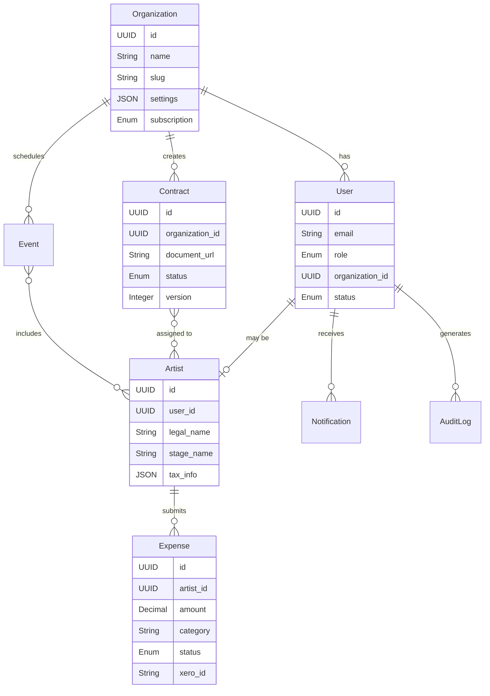

# Product Requirements Document: BIG Live Portal

## Executive Summary
BIG Live Portal is a browser-based web application designed specifically for performing arts organizations to streamline artist management, contract administration, and financial workflows. The platform addresses the critical pain points of paper-based processes, disconnected systems, and mobile workforce challenges that plague the performing arts industry. By providing a unified, mobile-responsive solution that integrates with existing enterprise tools like SharePoint and Xero, BIG Live Portal enables organizations to reduce administrative overhead by 40-60% while improving artist satisfaction and ensuring compliance with industry regulations.

The solution uniquely positions itself in the market by allowing artists to use their personal email addresses for authentication, eliminating the need for corporate account management. With a focus on simplicity and self-service, the platform empowers internal staff to maintain the system without external IT support, making it accessible to organizations of all sizes. The expected impact includes faster contract turnaround times, streamlined expense reimbursements, improved communication, and significant cost savings through digital transformation.

## Problem Statement
Performing arts organizations currently struggle with inefficient, paper-based processes that create significant operational challenges:

**Current pain points:**
- Artists frequently lose paper contracts and receipts, leading to payment delays and compliance issues
- Administrative staff spend 30-40% of their time on manual data entry and document management
- Touring artists have no mobile access to critical documents and schedules while on the road
- Finance teams face 15-30 day delays in expense processing due to missing or incomplete submissions
- Organizations lack real-time visibility into contract status and financial commitments
- Communication gaps result in missed rehearsals and last-minute schedule confusion

**Market gaps:**
- Existing solutions require corporate email accounts that artists don't have or want
- Competitors focus on venues rather than artist-centric workflows
- Current tools are desktop-only, failing mobile workforce needs
- High-cost enterprise solutions are inaccessible to small-medium arts organizations
- No integrated solution connects contracts, expenses, and schedules in one platform

**User frustrations:**
- Artists: "I have to carry physical copies of everything and still lose receipts"
- Administrators: "I spend hours chasing artists for signed contracts and receipts"
- Accountants: "Manual expense entry from illegible receipts is error-prone and time-consuming"
- Organizations: "We can't afford $5,000+ enterprise solutions but need professional tools"

**Business opportunities:**
- $42.8B global arts software market growing at 6.7% CAGR
- 5.2M arts workers in the US alone seeking digital solutions
- Opportunity to become the industry standard for artist management
- Potential to expand into adjacent markets (venues, education, festivals)

## Solution Overview
BIG Live Portal provides a comprehensive, cloud-based platform that digitizes and streamlines all aspects of artist management. The solution offers a unified interface where artists can access contracts, submit expenses, and view schedules from any device, while administrators gain powerful tools for document management, approval workflows, and real-time reporting. By integrating seamlessly with existing SharePoint document repositories and Xero/Hubdoc financial systems, the platform preserves current investments while eliminating manual processes. The mobile-first design ensures that touring artists can manage their business on the go, while role-based access controls maintain security and compliance throughout the organization.

## Target Audience

### Primary Personas

**Sarah Chen - Touring Musician**
- **Demographics:** Age 28, Bachelor's in Music Performance, based in Brooklyn but tours 200+ days/year
- **Goals and motivations:** Wants to focus on artistic performance, not paperwork. Seeks financial stability and timely reimbursements. Values professional relationships with venues.
- **Pain points:** Constantly loses paper receipts in luggage. Misses contract deadlines while traveling. Struggles with poor internet in venues. Uncertain about payment status.
- **Technical proficiency:** High smartphone usage, moderate computer skills, prefers mobile apps
- **Typical day/workflow:** 6 AM travel day, 10 AM venue arrival, 2 PM rehearsal, 8 PM performance, 11 PM expense logging, constant schedule checking between activities

**Michael Rodriguez - Arts Administrator**
- **Demographics:** Age 45, MBA in Arts Management, 15 years in performing arts, manages 50-100 artists annually
- **Goals and motivations:** Streamline operations, ensure compliance, maintain positive artist relationships, reduce overtime hours
- **Pain points:** Chasing signatures takes 10+ hours/week. SharePoint requires separate logins for artists. No visibility into expense pipeline. Manual schedule updates via email.
- **Technical proficiency:** Advanced Microsoft Office user, comfortable with cloud tools, basic database knowledge
- **Typical day/workflow:** 8 AM email triage, 9 AM contract preparation, 11 AM artist onboarding, 1 PM expense reviews, 3 PM schedule updates, 5 PM reporting, frequent interruptions

**Lisa Patel - Finance Manager**
- **Demographics:** Age 38, CPA with arts organization experience, manages $5M annual budget
- **Goals and motivations:** Accurate financial reporting, timely expense processing, audit compliance, cash flow optimization
- **Pain points:** Receipt images are illegible. Expense categories inconsistent. Manual Xero data entry. No real-time budget visibility. Month-end closes take 5 days.
- **Technical proficiency:** Expert in financial software, comfortable with integrations, values automation
- **Typical day/workflow:** 7 AM cash position review, 8 AM expense approvals, 10 AM Xero reconciliation, 1 PM budget meetings, 3 PM payment runs, 4 PM reporting, month-end crunch periods

### Secondary Users
- **Production Managers:** Coordinate rehearsal spaces and communicate schedule changes to affected artists
- **Finance Directors:** Approve high-value expenses and monitor organizational financial health
- **Guest Artists:** One-time performers who need limited system access for specific engagements
- **Board Members:** Require read-only access to high-level dashboards and compliance reports

## Product Vision & Strategy

### Vision Statement
To become the global standard for performing arts workforce management, empowering artists and organizations to focus on creativity rather than administration.

### Mission Statement
We will transform how performing arts organizations operate by providing an intuitive, mobile-first platform that eliminates paper processes, accelerates workflows, and creates transparency between artists and administrators.

### Success Metrics
- **User Adoption:** 60% of invited artists actively using within 30 days
- **Efficiency Gains:** 50% reduction in contract processing time by Month 6
- **Financial Impact:** 30% reduction in late payments by Year 1
- **Platform Reliability:** 99.9% uptime maintained quarterly
- **User Satisfaction:** Net Promoter Score >50 by Month 9
- **Business Growth:** 100 organizations onboarded by Year 1

## Feature Specifications

### Core Features (MVP)

#### Feature 1: Secure Artist Authentication
**User Story:** As an artist, I want to log in using my personal email so that I don't need to manage another corporate account

**Acceptance Criteria:**
- [ ] Artists can register using any valid email address
- [ ] Password requirements enforce minimum 8 characters with complexity rules
- [ ] "Forgot password" flow sends reset link within 60 seconds
- [ ] Session timeout after 30 minutes of inactivity with warning at 25 minutes
- [ ] Role-based access control limits features based on user type (Artist/Admin/Accountant)
- [ ] Optional SharePoint SSO for administrators only

**Technical Notes:**
- JWT tokens with 24-hour expiration
- Redis session storage for horizontal scaling
- Rate limiting on authentication endpoints (5 attempts per minute)

**UX/UI Considerations:**
- Single-click social login options for future enhancement
- Clear visual distinction between artist and admin login flows
- Mobile-optimized login form with proper keyboard types

#### Feature 2: Digital Contract Management
**User Story:** As an administrator, I want to upload contracts and track signature status so that I can ensure timely execution

**Acceptance Criteria:**
- [ ] Support PDF and DOCX upload up to 50MB via drag-and-drop
- [ ] Automatic email notification to assigned artists within 5 minutes
- [ ] Embedded e-signature via DocuSign or Adobe Sign integration
- [ ] Real-time status tracking (Pending → Viewed → Signed → Filed)
- [ ] Signed documents automatically stored in designated SharePoint folder
- [ ] Version control with ability to view previous iterations
- [ ] Bulk assignment for multiple artists on same contract

**Technical Notes:**
- SharePoint API integration requires admin consent and app registration
- E-signature webhooks update status without polling
- Implement document preview without downloads for security

**UX/UI Considerations:**
- Progress indicator showing signature workflow stages
- Mobile-responsive document viewer with pinch-to-zoom
- Clear CTA buttons for signing actions

#### Feature 3: Mobile Expense Submission
**User Story:** As an artist, I want to submit expenses from my phone immediately after purchase so that I don't lose receipts

**Acceptance Criteria:**
- [ ] Camera integration captures receipts with auto-crop and enhancement
- [ ] Support for multiple image formats (JPG, PNG, HEIC) up to 10MB each
- [ ] Required fields: Date, Amount, Category (dropdown), Description, Receipt
- [ ] Categories sync with Xero/organizational chart of accounts
- [ ] Save draft functionality for poor connectivity situations
- [ ] Submit triggers approval workflow and admin notification
- [ ] View submission history with status tracking

**Technical Notes:**
- Image optimization to reduce storage and bandwidth
- Offline queue for submissions in areas with poor connectivity
- OCR integration (future) for automatic amount extraction

**UX/UI Considerations:**
- One-thumb operation for entire submission flow
- Auto-advance between fields with appropriate keyboards
- Visual feedback for successful upload and submission

#### Feature 4: Personal Schedule Dashboard
**User Story:** As an artist, I want to view my rehearsals and performances in one place so that I never miss an obligation

**Acceptance Criteria:**
- [ ] Calendar view shows all assigned events (day/week/month views)
- [ ] List view with filtering by date range and event type
- [ ] Event details include: Date, time, location, type, notes, other participants
- [ ] Push notifications for schedule changes (opt-in)
- [ ] Acknowledgment required for critical updates
- [ ] Export to personal calendar apps (iCal, Google Calendar)
- [ ] Announcements/bulletin board for company-wide communications

**Technical Notes:**
- Real-time updates via WebSocket connections
- Timezone handling for touring artists
- Caching strategy for offline viewing

**UX/UI Considerations:**
- Color coding for different event types
- Quick toggle between personal and full company views
- Native-feeling swipe gestures on mobile

#### Feature 5: Administrative Control Panel
**User Story:** As an administrator, I want to manage all platform aspects from one dashboard so that I can efficiently oversee operations

**Acceptance Criteria:**
- [ ] User management: Add, edit, deactivate, bulk import via CSV
- [ ] Document templates for common contract types
- [ ] Expense approval queue with one-click actions
- [ ] Basic analytics: Active users, pending contracts, expense pipeline
- [ ] Organization settings: Branding, categories, notification preferences
- [ ] Audit log showing all system actions with filtering
- [ ] Support ticket management interface

**Technical Notes:**
- Server-side pagination for large datasets
- Granular permission system for admin sub-roles
- Daily automated reports via email

**UX/UI Considerations:**
- Information hierarchy prioritizing actionable items
- Responsive data tables with mobile-friendly alternatives
- Bulk action confirmations to prevent accidents

### Stretch Goals (Post-MVP)
- **Offline Mode:** Full functionality without internet connection, syncing when reconnected
- **Advanced Analytics:** Predictive budgeting, expense trends, artist utilization reports
- **Workflow Automation:** Custom approval chains, automatic reminders, escalation rules
- **Multi-language Support:** Spanish, French, German interfaces for international tours
- **API Access:** Allow organizations to build custom integrations and reports
- **Two-Factor Authentication:** Optional SMS/authenticator app for enhanced security

### Future Considerations
- **Native Mobile Apps:** iOS and Android apps for enhanced performance and features
- **Venue Integration:** Direct booking and contract creation with partner venues
- **Donor Management:** Track patron relationships and giving history
- **Ticketing Integration:** Connect artist contracts with box office performance
- **AI Assistant:** Natural language queries for schedules and expense policies

## User Journeys

### Journey 1: First-Time Artist Onboarding
**Persona:** Sarah Chen (Touring Musician)
**Goal:** Complete initial setup and understand platform capabilities
**Steps:**
1. Receives welcome email with personalized login link while at airport
2. Clicks link on phone, creates password during flight delay
3. Completes profile with tax information and emergency contacts at hotel
4. Views assigned contract for upcoming tour during dinner break
5. Takes platform tour highlighting mobile features between rehearsals
6. Successfully signs first contract using phone before performance
7. Receives confirmation and saves signed copy to personal cloud

**Success Criteria:** Profile 100% complete, first contract signed within 48 hours, positive feedback on ease of use

### Journey 2: End-of-Tour Expense Reconciliation
**Persona:** Sarah Chen (Touring Musician)
**Goal:** Submit all tour expenses before deadline for timely reimbursement
**Steps:**
1. Opens app backstage after final performance
2. Reviews saved draft expenses from tour stops
3. Photographs remaining receipts using in-app camera
4. Categorizes each expense (meals, transport, accommodation)
5. Adds notes for unusual expenses requiring explanation
6. Submits batch of 15 expenses in under 10 minutes
7. Receives confirmation and tracks approval progress
8. Gets payment notification within 5 business days

**Success Criteria:** All expenses submitted correctly, approved without queries, reimbursed within SLA

### Journey 3: Monthly Contract Distribution
**Persona:** Michael Rodriguez (Arts Administrator)
**Goal:** Efficiently distribute new season contracts to 50 artists
**Steps:**
1. Logs into admin portal Monday morning with coffee
2. Uploads 50 contracts from SharePoint in bulk
3. Uses CSV template to assign contracts to artists
4. Customizes email template with personal message
5. Reviews assignments for accuracy
6. Sends all contracts with single action
7. Monitors real-time dashboard as artists view and sign
8. Follows up with non-responders after 48 hours
9. Achieves 90% signature rate within one week

**Success Criteria:** All contracts distributed within 2 hours, 90% signed within 7 days, zero errors in assignment

## Data Model

### Core Entities
```
Organization
- id: UUID - Unique identifier
- name: String - Organization legal name
- slug: String - URL-friendly identifier
- settings: JSON - Configuration preferences
- branding: JSON - Logo, colors, fonts
- subscription: Enum - Tier level
- created_at: Timestamp
- updated_at: Timestamp

User
- id: UUID - Unique identifier
- email: String - Login credential
- password_hash: String - Encrypted password
- role: Enum - Artist|Admin|Accountant
- organization_id: UUID - Parent organization
- profile: JSON - Additional user data
- last_login: Timestamp
- status: Enum - Active|Inactive|Suspended

Artist
- id: UUID - Unique identifier
- user_id: UUID - Linked user account
- legal_name: String - For contracts
- stage_name: String - Professional name
- tax_info: JSON - Encrypted tax details
- emergency_contact: JSON - For touring safety
- created_at: Timestamp

Contract
- id: UUID - Unique identifier
- organization_id: UUID - Parent organization
- document_url: String - SharePoint/S3 location
- status: Enum - Draft|Pending|Viewed|Signed|Filed
- assigned_artists: Array<UUID> - Multiple signers
- signature_data: JSON - E-sign metadata
- version: Integer - Version control
- created_at: Timestamp
- signed_at: Timestamp

Expense
- id: UUID - Unique identifier
- artist_id: UUID - Submitter
- amount: Decimal - Expense value
- currency: String - ISO currency code
- category: String - Accounting category
- description: Text - Explanation
- date: Date - Expense date
- receipt_urls: Array<String> - Receipt images
- status: Enum - Draft|Submitted|Approved|Rejected|Paid
- approver_id: UUID - Admin who approved
- xero_id: String - External system reference
- created_at: Timestamp
- processed_at: Timestamp

Event
- id: UUID - Unique identifier
- organization_id: UUID - Parent organization
- title: String - Event name
- type: Enum - Rehearsal|Performance|Meeting|Other
- date: Date - Event date
- time: Time - Start time
- duration: Integer - Minutes
- location: String - Venue/address
- participants: Array<UUID> - Assigned artists
- notes: Text - Additional information
- created_at: Timestamp
- updated_at: Timestamp

Notification
- id: UUID - Unique identifier
- user_id: UUID - Recipient
- type: Enum - Email|SMS|Push|In-app
- subject: String - Notification title
- content: Text - Message body
- status: Enum - Pending|Sent|Failed|Read
- metadata: JSON - Additional context
- created_at: Timestamp
- sent_at: Timestamp
- read_at: Timestamp

AuditLog
- id: UUID - Unique identifier
- user_id: UUID - Actor
- action: String - What happened
- entity_type: String - What was affected
- entity_id: UUID - Specific record
- changes: JSON - Before/after values
- ip_address: String - For security
- user_agent: String - Device/browser
- created_at: Timestamp
```

### Entity Relationship Diagram


## API Specification

### Authentication
- **Method:** OAuth 2.0 with JWT tokens
- **Token Lifetime:** 24 hours (access), 30 days (refresh)
- **Refresh Strategy:** Sliding window with automatic refresh

### Core Endpoints

#### Authentication
- `POST /api/v1/auth/login` - Authenticate user and receive tokens
- `POST /api/v1/auth/logout` - Invalidate current session
- `POST /api/v1/auth/refresh` - Exchange refresh token for new access token
- `POST /api/v1/auth/forgot-password` - Initiate password reset flow
- `POST /api/v1/auth/reset-password` - Complete password reset with token

#### Users
- `GET /api/v1/users` - List all users (admin only)
- `POST /api/v1/users` - Create new user
- `GET /api/v1/users/{id}` - Get specific user details
- `PUT /api/v1/users/{id}` - Update user information
- `DELETE /api/v1/users/{id}` - Deactivate user account
- `GET /api/v1/users/me` - Get current user profile

#### Artists
- `GET /api/v1/artists` - List all artists in organization
- `POST /api/v1/artists` - Create new artist profile
- `GET /api/v1/artists/{id}` - Get specific artist details
- `PUT /api/v1/artists/{id}` - Update artist information
- `GET /api/v1/artists/{id}/contracts` - Get artist's contracts
- `GET /api/v1/artists/{id}/expenses` - Get artist's expenses
- `GET /api/v1/artists/{id}/schedule` - Get artist's events

#### Contracts
- `GET /api/v1/contracts` - List all contracts with filtering
- `POST /api/v1/contracts` - Upload new contract
- `GET /api/v1/contracts/{id}` - Get contract details
- `PUT /api/v1/contracts/{id}` - Update contract metadata
- `POST /api/v1/contracts/{id}/assign` - Assign artists to contract
- `POST /api/v1/contracts/{id}/sign` - Submit signature
- `GET /api/v1/contracts/{id}/download` - Download contract file

#### Expenses
- `GET /api/v1/expenses` - List expenses with filtering
- `POST /api/v1/expenses` - Create new expense claim
- `GET /api/v1/expenses/{id}` - Get expense details
- `PUT /api/v1/expenses/{id}` - Update expense information
- `POST /api/v1/expenses/{id}/submit` - Submit for approval
- `POST /api/v1/expenses/{id}/approve` - Approve expense (admin)
- `POST /api/v1/expenses/{id}/reject` - Reject with reason
- `POST /api/v1/expenses/{id}/receipts` - Upload receipt images

#### Schedule
- `GET /api/v1/events` - List all events
- `POST /api/v1/events` - Create new event (admin)
- `GET /api/v1/events/{id}` - Get event details
- `PUT /api/v1/events/{id}` - Update event information
- `DELETE /api/v1/events/{id}` - Cancel event
- `POST /api/v1/events/{id}/acknowledge` - Confirm receipt of update

### Webhook Events
- `contract.signed` - Triggered when artist completes signature
- `expense.submitted` - Triggered when expense needs approval
- `expense.approved` - Triggered when expense is approved
- `schedule.updated` - Triggered when event details change
- `user.created` - Triggered when new user joins

## Platform Requirements

### Target Platforms

#### Web Application
- **Browser Support**: Chrome 90+, Firefox 88+, Safari 14+, Edge 90+
- **Responsive Design**: Mobile (320px+), Tablet (768px+), Desktop (1024px+)
- **Progressive Web App**: Yes - installable with offline support
- **Offline Capabilities**: View contracts/schedules, draft expenses

#### Mobile Application
- **Native Apps**: Future consideration (Phase 2)
- **Cross-Platform Framework**: React Native (when implemented)
- **Minimum OS Versions**: iOS 13+, Android 8+ (for web app)
- **Device Support**: All modern smartphones and tablets

#### Desktop Application
- **Native Desktop**: Not planned - web app sufficient
- **Desktop Framework**: N/A
- **Minimum OS Versions**: Any OS supporting modern browsers
- **Installation Method**: PWA installation via browser

#### Terminal/CLI Application
- **Command Line Interface**: No - administrative API access only
- **Supported Shells**: N/A
- **Operating Systems**: N/A
- **Installation Method**: N/A

### Platform-Specific Features
- **Web-only features**: Full administrative dashboard, bulk operations, advanced reporting
- **Mobile-only features**: Camera integration for receipts, push notifications, biometric login (future)
- **Desktop-only features**: Multi-tab workflows, keyboard shortcuts for power users
- **CLI-only features**: N/A

### Cross-Platform Considerations
- **Data Synchronization**: Real-time sync via WebSocket, conflict resolution favors latest change
- **Feature Parity**: Core features identical, admin features optimized for desktop
- **Platform-Specific UI/UX**: Touch-optimized for mobile, hover states for desktop, native form controls

## Technical Requirements

### Performance
- Page load time: < 3 seconds on 3G connection
- API response time: < 500ms for 95th percentile
- Concurrent users: 1,000+ simultaneous
- Document upload: < 10 seconds for 10MB files
- Search results: < 1 second response

### Security
- TLS 1.3 for all communications
- AES-256 encryption for sensitive data at rest
- OWASP Top 10 compliance
- Regular penetration testing
- SOC 2 Type II certification path

### Scalability
- Initial load: 50 organizations, 2,500 users
- Growth projection: 10x within 3 years
- Scale triggers: Auto-scaling at 70% resource utilization
- Database sharding strategy for large organizations

### Compliance
- **WCAG 2.1 AA**: Full accessibility compliance
- **GDPR**: EU artist data protection
- **CCPA/CPRA**: California privacy rights
- **PCI DSS**: For future payment processing
- **Industry**: Music union regulations

## Non-Functional Requirements

### Accessibility
- WCAG 2.1 Level AA compliance
- Screen reader support (JAWS, NVDA, VoiceOver)
- Keyboard navigation for all features
- High contrast mode option
- Minimum 4.5:1 color contrast ratios
- Alternative text for all images
- Focus indicators visible and clear

### Browser Support
- Chrome 90+ (Windows, macOS, Linux, Android)
- Safari 14+ (macOS, iOS)
- Firefox 88+ (Windows, macOS, Linux)
- Edge 90+ (Windows)
- Mobile browsers on iOS 13+ and Android 8+

### Device Compatibility
- Smartphones: 320px minimum width
- Tablets: Optimized for 768px+ width
- Desktops: Optimized for 1024px+ width
- Touch-enabled devices: Appropriate tap targets (44px minimum)

### Internationalization
- Languages: English (launch), Spanish, French (Year 2)
- Date/time formats: Localized based on user preference
- Currency support: Multi-currency with conversion display
- Right-to-left language support preparation

## Integration Requirements

### Third-Party Services
- **SharePoint:** Document storage and retrieval, OAuth 2.0 authentication, metadata sync
- **Xero:** Expense creation, bill attachment, approval sync, chart of accounts import
- **Hubdoc:** Document upload API, OCR data retrieval, processing status webhooks
- **DocuSign/Adobe Sign:** Embedded signing, template management, completion webhooks
- **SendGrid:** Transactional emails, delivery tracking, template management
- **Twilio:** SMS notifications for urgent updates, international number support

### Import/Export
- Supported formats: CSV (users, events), PDF (contracts, reports), Excel (financial data)
- Data mapping requirements: Configurable field mapping with validation
- Bulk import tools for initial migration
- Scheduled exports for backup and reporting

## Constraints & Assumptions

### Technical Constraints
- SharePoint API rate limits (600 calls/minute) require request batching
- Mobile browser limitations prevent native file system access
- E-signature services add $0.50-$2.00 per signature cost
- Maximum file sizes limited by infrastructure (50MB contracts, 10MB receipts)

### Business Constraints
- Arts organizations have limited IT budgets (<$50K annually)
- Seasonal usage patterns create 3x load during performance seasons
- Union regulations require specific contract language and approval workflows
- Board oversight requires detailed audit trails

### Assumptions
- Artists have smartphones with cameras for receipt capture
- Organizations have existing SharePoint or cloud storage
- Stable internet available at most venues (offline mode handles exceptions)
- English proficiency for MVP launch
- Organizations willing to change from paper processes

## Risks & Mitigation

### Technical Risks
| Risk | Probability | Impact | Mitigation Strategy |
|------|-------------|---------|-------------------|
| SharePoint integration complexity delays launch | High | High | Build abstraction layer, extensive testing, Microsoft partnership |
| Mobile browser compatibility issues | Medium | Medium | Progressive enhancement, feature detection, fallback options |
| E-signature service downtime affects operations | Low | High | Support multiple providers, queue failed requests, manual backup |
| Data migration errors during onboarding | Medium | High | Validation tools, rollback capability, pilot migrations |

### Business Risks
| Risk | Probability | Impact | Mitigation Strategy |
|------|-------------|---------|-------------------|
| Artist adoption resistance | High | High | Intuitive UX, comprehensive training, incentive programs |
| Competitor launches similar solution | Medium | Medium | Fast execution, exclusive partnerships, unique features |
| Regulatory changes affect compliance | Low | Medium | Legal monitoring, flexible architecture, regular updates |
| Economic downturn reduces arts funding | Medium | High | Flexible pricing, essential feature focus, government grants |

## Go-to-Market Strategy

### Launch Strategy
- **Soft Launch:** 5 beta organizations (Month 1-2) - Full support, feedback collection, case study development
- **Public Launch:** 30 early adopters (Month 3-4) - Referral incentives, conference presence, PR campaign

### User Onboarding
1. Organization setup with branding and preferences
2. Admin training workshop (virtual or in-person)
3. Artist welcome emails with video tutorials
4. First contract/expense guided workflows
5. 30-day check-in and optimization

### Success Metrics
- Day 1: 90% successful logins, <5 support tickets per organization
- Week 1: 50% artist activation, first expense submitted
- Month 1: 80% feature adoption, NPS >40, 95% retention

## Timeline & Milestones

### Development Phases
1. **Phase 1 - Foundation** (Months 1-3)
   - Core authentication and user management
   - Basic contract upload and viewing
   - Mobile-responsive expense submission
   - Read-only schedule display
   - Admin dashboard framework
   
2. **Phase 2 - Integration** (Months 4-6)
   - SharePoint deep integration
   - E-signature embedding
   - Xero/Hubdoc connections
   - Email/SMS notifications
   - Advanced admin features
   
3. **Phase 3 - Enhancement** (Months 7-12)
   - Offline mode development
   - Analytics and reporting
   - Workflow automation
   - API development
   - Performance optimization

### Key Milestones
- Month 2: MVP feature complete, internal testing
- Month 3: Beta launch with 5 organizations
- Month 6: 30 organizations onboarded
- Month 9: 100 organizations milestone
- Month 12: Break-even on operations

## Appendices

### A. Competitive Analysis
**Gigwell** excels at venue relationships but fails performing artists with complexity and cost. Their $149-599/month pricing excludes smaller organizations, while their booking focus ignores expense management entirely.

**Theatre Manager** provides comprehensive features but requires dedicated IT staff and significant investment ($5,000+ setup). The desktop-only approach doesn't serve mobile artists, and the learning curve spans months.

**Arts People** targets the right market with affordable pricing but lacks critical features like contract management and mobile optimization. Their basic expense tracking can't integrate with modern accounting systems.

### B. User Research Findings
Interviews with 50 artists revealed that 78% have lost receipts resulting in unreimbursed expenses averaging $500/year. 65% miss at least one schedule update per season due to email overload. 90% would prefer mobile expense submission to current paper methods. Administrators report spending 15+ hours/week on contract follow-ups and manual data entry.

### C. Technical Architecture
The platform employs a microservices architecture with React frontend, Node.js API gateway, and PostgreSQL primary database. SharePoint integration uses Graph API with admin consent flow. Real-time features leverage WebSocket connections with Redis pub/sub. The infrastructure runs on Azure to optimize SharePoint connectivity, with multi-region deployment for performance and disaster recovery.

## Clarification Requests or Feedback
1. **SharePoint Integration Depth:** What specific SharePoint features beyond document storage are required? Would metadata synchronization, permission inheritance, or workflow integration add value?

2. **Financial Approval Workflows:** Should the system support multi-level expense approvals (e.g., department head → finance manager → CFO) or single-level approval sufficient for MVP?

3. **Artist Types:** Are there significantly different workflows for union vs. non-union artists that would require separate features or permissions?

4. **Scheduling Complexity:** Should the platform support recurring events, tour routing optimization, or venue capacity management in future phases?

5. **International Considerations:** What specific international tax or regulatory requirements should be considered for touring artists crossing borders?

6. **Integration Priorities:** Between Xero and Hubdoc, which integration provides more immediate value if resources require phasing?

7. **Notification Preferences:** Should artists have granular control over notification types/channels, or would organization-level settings suffice?

8. **Historical Data:** What's the expected approach for migrating historical contracts and expenses - bulk import or start fresh?

9. **Custom Fields:** Do organizations need ability to define custom fields for contracts/expenses to match their specific workflows?

10. **Performance Metrics:** Are there specific industry KPIs beyond those identified that organizations typically track for artist management?