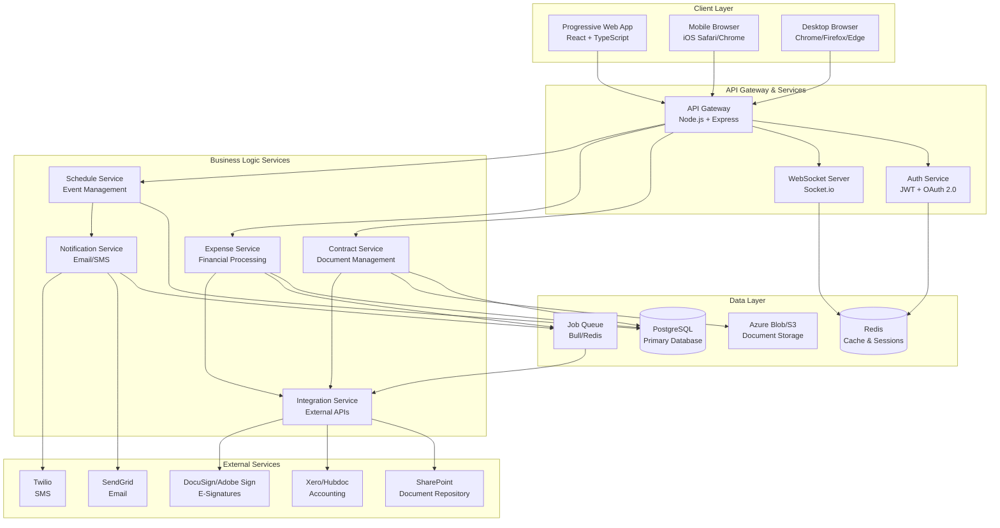

# Technical Overview & Architecture: BIG Live Portal

## Overview
The BIG Live Portal technical architecture is designed to support a cloud-based, mobile-first platform for performing arts organizations. The system leverages modern web technologies to deliver a responsive Progressive Web App (PWA) that seamlessly integrates with enterprise systems like SharePoint and Xero. The architecture prioritizes scalability, security, and maintainability while ensuring sub-3-second page loads on mobile connections and supporting 1,000+ concurrent users across distributed geographic locations.

## Features (MVP)

### Secure Artist Authentication
Artists and administrators need secure, role-based access to the platform without requiring corporate email accounts, enabling personal email authentication while maintaining enterprise-grade security.

#### Tech Involved
* Node.js with Express.js for authentication API
* JWT tokens with Redis session storage
* bcrypt for password hashing
* OAuth 2.0 for SharePoint SSO (admin only)
* SendGrid for transactional auth emails

#### Main Requirements
* Support personal email authentication without corporate accounts
* 24-hour access token lifetime with 30-day refresh tokens
* Session timeout after 30 minutes with 5-minute warning
* Rate limiting (5 attempts/minute) for brute force protection
* Role-based access control (Artist, Admin, Accountant) with granular permissions

### Digital Contract Management
The platform enables administrators to upload, distribute, and track contract signatures digitally, replacing paper-based workflows with integrated e-signature capabilities and automatic SharePoint synchronization.

#### Tech Involved
* SharePoint Graph API for document storage and retrieval
* DocuSign Connect or Adobe Sign API for embedded e-signatures
* PostgreSQL for contract metadata and status tracking
* Bull job queue for asynchronous document processing
* AWS S3/Azure Blob for temporary document caching

#### Main Requirements
* Support PDF/DOCX files up to 50MB with drag-and-drop upload
* Real-time signature status tracking via webhooks
* Automatic SharePoint synchronization upon signature completion
* Version control with audit trail for compliance
* Bulk assignment capabilities for multiple artists per contract

### Mobile Expense Submission
Artists can capture and submit expense claims immediately from their mobile devices, with integrated receipt imaging and direct submission to accounting systems for rapid reimbursement.

#### Tech Involved
* React with camera API integration for receipt capture
* Sharp/ImageMagick for image processing and optimization
* PostgreSQL for expense data with JSONB receipt metadata
* Xero API for expense creation and category synchronization
* Hubdoc API for document processing and OCR
* Redis queue for offline submission support

#### Main Requirements
* Camera integration with auto-crop and image enhancement
* Support for JPG, PNG, HEIC formats up to 10MB per image
* Offline queue for poor connectivity with automatic retry
* Real-time sync with Xero/Hubdoc chart of accounts
* Sub-10-second upload time for receipt images

### Personal Schedule Dashboard
Artists access a personalized view of their rehearsals, performances, and events with real-time updates and mobile-optimized calendar interfaces.

#### Tech Involved
* React with Material-UI calendar components
* WebSocket (Socket.io) for real-time schedule updates
* PostgreSQL with timezone-aware timestamp handling
* Redis pub/sub for event change notifications
* iCal/CalDAV for calendar app integration
* Twilio for SMS schedule alerts

#### Main Requirements
* Real-time updates without page refresh
* Support for multiple timezone display for touring artists
* Offline viewing capability with service worker caching
* Push notification support for schedule changes
* Export functionality to personal calendar applications

### Administrative Control Panel
Administrators manage all platform aspects through a comprehensive dashboard supporting user management, document templates, expense approvals, and system analytics.

#### Tech Involved
* React with Redux Toolkit for complex state management
* Material-UI data tables with server-side pagination
* PostgreSQL with optimized queries for large datasets
* Chart.js or Recharts for analytics visualization
* Node.js scheduled jobs for automated reporting
* Elasticsearch for audit log searching

#### Main Requirements
* Handle 50,000+ user records with sub-second response times
* Real-time analytics dashboard with <1 second data refresh
* Bulk operations supporting 1,000+ records simultaneously
* Granular permission system for admin sub-roles
* Daily automated email reports with customizable metrics

## System Diagram
Clean system architecture showing service relationships, data flow, and integration points for the MVP implementation.

## Platform-Specific Technical Considerations

### Web (Progressive Web App)
- **Technology Stack**: React 18+ with TypeScript, Material-UI v5, Redux Toolkit, React Query, Vite bundler
- **Performance Targets**: <3s page load on 3G, <500ms API responses, <100ms UI interactions
- **Security Considerations**: CSP headers, XSS protection, secure cookie handling, HTTPS-only
- **Deployment Strategy**: Azure Static Web Apps or AWS CloudFront with S3, CI/CD via GitHub Actions

### Mobile Web
- **Technology Stack**: Same React PWA with mobile-first responsive design, service workers for offline
- **Performance Targets**: <3s initial load, <1s subsequent navigation, minimal battery drain
- **Security Considerations**: Biometric authentication support (future), secure local storage encryption
- **Deployment Strategy**: PWA installation prompts, app store submission for PWA wrappers (future)

## Critical Questions and Clarifications

1. **SharePoint Integration Complexity** - Will the platform require deep SharePoint integration beyond basic document storage (e.g., metadata sync, permissions inheritance, workflow triggers)? This could significantly impact the integration timeline and require additional Microsoft Graph API scopes.

2. **Multi-Organization Architecture** - Should the system support true multi-tenancy with data isolation at the database level, or would logical separation be sufficient? This affects database design, query complexity, and compliance requirements.

3. **Peak Load Handling** - With 3x traffic during performance seasons and 10x document activity during contract periods, should we implement auto-scaling policies or pre-scale for known peak periods? This impacts infrastructure costs and architecture decisions.

4. **Offline Functionality Scope** - Which specific features must work offline beyond viewing contracts and drafting expenses? Full offline support would require significant local storage and sync logic implementation.

5. **E-Signature Integration Priority** - Between DocuSign and Adobe Sign, which provides better API stability and pricing for performing arts use cases? Should we abstract the integration to support both providers?

6. **Real-time Requirements** - Do schedule updates and notifications require true real-time delivery (<1 second) or would near-real-time (1-5 seconds) be acceptable? This affects WebSocket infrastructure and scaling approach.

7. **Data Retention and Archival** - With 7-year contract retention requirements, should we implement automatic archival to cold storage, or maintain all data in the primary database? This impacts query performance and storage costs.

8. **Integration Error Handling** - How should the system handle temporary failures in SharePoint, Xero, or e-signature services? Should we implement retry queues with exponential backoff and user notifications?

9. **Mobile Device Variations** - Should we optimize for specific older devices common among artists, or maintain a minimum device requirement? This affects performance optimization strategies and feature availability.

10. **Compliance Audit Requirements** - What level of audit logging detail is required for SOC 2 compliance? Should we log all data access or only modification events? This impacts database size and query performance.