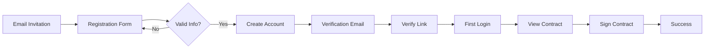
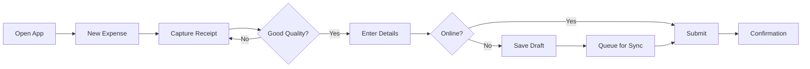
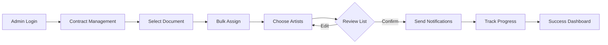
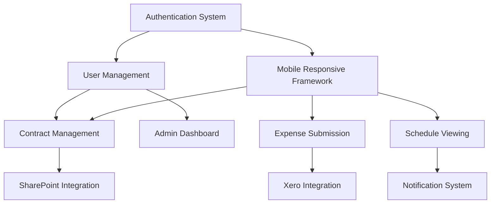

# Feature Stories and User Scenarios: BIG Live Portal

## Executive Summary
This document provides a comprehensive breakdown of the BIG Live Portal features into detailed user stories, covering all user-facing functionality for artists, administrators, and finance managers. The approach emphasizes mobile-first design, seamless integration workflows, and exceptional user experience across diverse technical proficiency levels. Each story includes specific acceptance criteria, edge cases, error handling, and accessibility requirements to ensure complete implementation coverage.

## Feature Analysis Framework

### User Story Format
All stories follow the pattern:
- **As a** [user type]
- **I want to** [action/goal]
- **So that** [benefit/value]

### Acceptance Criteria Standards
- Specific and measurable
- Testable by QA team
- Includes happy path and edge cases
- Addresses accessibility requirements
- Defines error handling

## Core Feature Breakdown

### Feature 1: Personal Email Authentication

#### Overview
Enable artists to access the platform using their personal email addresses without requiring corporate accounts, reducing barriers to adoption while maintaining security.

#### User Stories

##### Story 1.1: Artist Self-Registration
**As a** freelance artist
**I want to** register using my personal email address
**So that** I can access the platform without needing a corporate email account

**Acceptance Criteria:**
- [ ] Given I receive an invitation email, when I click the registration link, then I am directed to a registration form
- [ ] Given I enter my personal email and create a password, when I submit the form, then my account is created
- [ ] Given I have registered, when I check my email, then I receive a verification email within 5 minutes
- [ ] Given I click the verification link, when the page loads, then my email is verified and I can log in
- [ ] Given I try to register with an already-used email, when I submit, then I see a clear error message

**Edge Cases:**
- Expired invitation link: Display message with option to request new invitation
- Email already registered: Offer password reset option instead
- Invalid email format: Real-time validation with helpful error message
- Weak password: Display password requirements dynamically

**Error States:**
- Email service down: "We're having trouble sending emails. Please try again later or contact support."
- Registration timeout: "Your session has expired. Please start the registration process again."
- Database connection error: "We're experiencing technical difficulties. Please try again in a few minutes."

**Accessibility Requirements:**
- Form labels clearly associated with inputs
- Error messages announced by screen readers
- Password strength indicator with text description
- Tab order follows logical flow

**Performance Criteria:**
- Registration form loads within 2 seconds
- Account creation completes within 3 seconds
- Verification email sent within 30 seconds

##### Story 1.2: Secure Login Process
**As a** registered artist
**I want to** log in securely with my personal email
**So that** I can access my contracts and submit expenses

**Acceptance Criteria:**
- [ ] Given I enter valid credentials, when I click login, then I am authenticated within 2 seconds
- [ ] Given I check "Remember me", when I return within 30 days, then I am automatically logged in
- [ ] Given I enter incorrect credentials, when I attempt login, then I see a generic security message
- [ ] Given I fail login 5 times, when I try again, then my account is temporarily locked for 15 minutes
- [ ] Given I'm on a mobile device, when I view the login form, then all fields are easily tappable

**Edge Cases:**
- Account locked: Display countdown timer and support contact option
- Password expired: Force password reset flow
- Browser cookies disabled: Show helpful message about enabling cookies
- Multiple devices logged in: Allow viewing active sessions

**Error States:**
- Network timeout: "Connection lost. Please check your internet and try again."
- Server error: "We're having trouble logging you in. Please try again."
- Invalid session: "Your session has expired. Please log in again."

**Accessibility Requirements:**
- Login button clearly labeled
- Error messages don't reveal if email exists in system
- Focus management after failed login
- High contrast mode for form elements

**Performance Criteria:**
- Login page loads within 1 second
- Authentication completes within 2 seconds
- Session creation within 500ms after authentication

##### Story 1.3: Password Reset Flow
**As a** forgetful artist
**I want to** reset my password using my email
**So that** I can regain access to my account

**Acceptance Criteria:**
- [ ] Given I click "Forgot Password", when I enter my email, then I receive a reset link within 5 minutes
- [ ] Given I click the reset link, when I create a new password, then I can immediately log in
- [ ] Given the reset link is over 2 hours old, when I click it, then I see an expiration message
- [ ] Given I successfully reset my password, when complete, then all other sessions are logged out
- [ ] Given I'm on mobile, when I access the reset form, then it's optimized for touch input

**Edge Cases:**
- Multiple reset requests: Only honor the most recent link
- Email not in system: Show same success message (security)
- Reset during active session: Force re-authentication
- Password reuse: Prevent last 3 passwords

**Error States:**
- Email delivery failure: "If your email is registered, you'll receive a reset link. Check your spam folder."
- Invalid reset token: "This reset link is invalid or expired. Please request a new one."
- Network error during reset: "Connection lost. Your password was not changed. Please try again."

**Accessibility Requirements:**
- Clear instructions at each step
- Success/error messages announced
- Form validation accessible
- Logical tab order maintained

**Performance Criteria:**
- Reset email sent within 30 seconds
- Password update completes within 2 seconds
- Automatic login after reset within 1 second

#### Technical Considerations
- JWT tokens with 24-hour access, 30-day refresh
- Bcrypt password hashing with appropriate salt rounds
- Rate limiting on authentication endpoints
- Session storage in Redis for scalability

#### Success Metrics
- 95% successful registration completion rate
- <2% password reset requests per month
- Average login time under 5 seconds
- 60% of users utilize "Remember me" feature

### Feature 2: Contract Management

#### Overview
Digital contract lifecycle management allowing artists to view, review, and electronically sign contracts from any device, eliminating paper-based processes.

#### User Stories

##### Story 2.1: Contract Discovery and Viewing
**As a** performing artist
**I want to** see all my contracts in one place
**So that** I can track my commitments and obligations

**Acceptance Criteria:**
- [ ] Given I log in, when I navigate to contracts, then I see a list of all my contracts
- [ ] Given I have multiple contracts, when viewing the list, then they are sorted by status and date
- [ ] Given I click on a contract, when it loads, then I can read the full PDF clearly on my device
- [ ] Given I'm on mobile, when I view a PDF, then I can pinch to zoom and scroll smoothly
- [ ] Given a contract is near expiration, when I view my list, then it's highlighted with a warning

**Edge Cases:**
- No contracts assigned: Show helpful empty state with explanation
- Large PDF files: Progressive loading with progress indicator
- PDF loading fails: Offer download option as fallback
- Multiple contracts same day: Secondary sort by contract title

**Error States:**
- SharePoint unavailable: "Contract temporarily unavailable. Please try again later."
- PDF corrupted: "This contract file appears damaged. Please contact support."
- Network timeout: "Slow connection detected. Download contract for offline viewing?"

**Accessibility Requirements:**
- Contract status clearly indicated with text and color
- PDF viewer supports screen reader access
- Keyboard navigation for all controls
- Alternative text format available on request

**Performance Criteria:**
- Contract list loads within 2 seconds
- PDF preview appears within 3 seconds
- Smooth scrolling at 60fps on mobile
- Search results return within 1 second

##### Story 2.2: Electronic Signature Process
**As a** touring artist
**I want to** sign contracts electronically from my phone
**So that** I can complete agreements while traveling

**Acceptance Criteria:**
- [ ] Given I open an unsigned contract, when I click "Sign Contract", then the e-signature flow begins
- [ ] Given I'm in the signature flow, when prompted, then I can sign with finger/stylus or typed name
- [ ] Given I complete signing, when submitted, then I receive confirmation within 30 seconds
- [ ] Given I've signed, when I view the contract, then I see the signed version with timestamp
- [ ] Given signing is interrupted, when I return, then I can resume where I left off

**Edge Cases:**
- Signature already in progress: Resume from last position
- Contract modified during signing: Alert user and restart process
- Multiple signature fields: Guide through each required field
- Witness requirement: Support co-signer workflow

**Error States:**
- DocuSign service down: "Signature service temporarily unavailable. Please try again in 15 minutes."
- Session timeout during signing: "Your signing session expired. Please start again."
- Signature upload fails: "Signature not saved. Please check connection and retry."

**Accessibility Requirements:**
- Clear instructions for each signature field
- Alternative signature methods available
- Voice-guided signature process option
- High contrast mode for signature pad

**Performance Criteria:**
- Signature interface loads within 2 seconds
- Signature capture responsive with <50ms latency
- Signed document available within 30 seconds
- No data loss if connection drops

##### Story 2.3: Contract Status Tracking
**As an** organized artist
**I want to** track the status of all my contracts
**So that** I know what actions I need to take

**Acceptance Criteria:**
- [ ] Given I view my dashboard, when loaded, then I see contract status summary
- [ ] Given I have pending contracts, when I log in, then I see notification badges
- [ ] Given a contract status changes, when it occurs, then I receive email notification
- [ ] Given I filter by status, when applied, then only matching contracts appear
- [ ] Given I search for a contract, when typing, then results update in real-time

**Edge Cases:**
- Status change during viewing: Real-time update with notification
- Bulk status changes: Batched notifications to prevent spam
- Historical contracts: Archive section for expired contracts
- Duplicate contracts: Clear differentiation by date/version

**Error States:**
- Status sync failure: "Status may be outdated. Refreshing..."
- Filter malfunction: "Filter temporarily unavailable. Showing all contracts."
- Search index error: "Search is currently slow. Try browsing instead."

**Accessibility Requirements:**
- Status badges have text labels
- Color not sole indicator of status
- Keyboard shortcuts for common filters
- Screen reader announces status changes

**Performance Criteria:**
- Status updates reflect within 5 seconds
- Filters apply within 500ms
- Search returns results within 1 second
- Dashboard loads within 2 seconds

#### Technical Considerations
- SharePoint API integration for document storage
- DocuSign/Adobe Sign embedded signing
- Webhook handlers for signature completion
- Document versioning and audit trail

#### Success Metrics
- 80% contracts signed within 48 hours
- 95% successful signature completion rate
- <1% signature technical errors
- 90% mobile signature adoption

### Feature 3: Expense Submission

#### Overview
Mobile-optimized expense submission system allowing artists to capture receipts and submit reimbursement requests immediately, reducing processing time from 30 days to under 7 days.

#### User Stories

##### Story 3.1: Receipt Capture and Upload
**As a** traveling artist
**I want to** photograph receipts with my phone
**So that** I can submit expenses before losing receipts

**Acceptance Criteria:**
- [ ] Given I tap "New Expense", when camera opens, then I can capture receipt photos
- [ ] Given I take a photo, when captured, then I can retake or confirm quality
- [ ] Given I confirm photo, when uploaded, then I see upload progress
- [ ] Given upload completes, when successful, then receipt is attached to expense
- [ ] Given I have multiple receipts, when adding, then I can capture up to 10 per expense

**Edge Cases:**
- Camera permission denied: Show instructions to enable
- Poor image quality: Suggest retaking with quality tips
- Large image files: Automatic compression with quality preservation
- No camera available: Allow gallery upload option

**Error States:**
- Upload failure: "Upload failed. Receipt saved to drafts. Retry when connected."
- Storage full: "Device storage low. Clear space to continue."
- Invalid file type: "Please upload images only (JPG, PNG)."

**Accessibility Requirements:**
- Voice-guided capture process
- Alternative text description option
- Large capture button for motor impairments
- Audio feedback for successful capture

**Performance Criteria:**
- Camera launches within 1 second
- Image processing within 2 seconds
- Upload completes within 10 seconds on 4G
- Automatic retry for failed uploads

##### Story 3.2: Expense Form Completion
**As a** detail-oriented artist
**I want to** easily fill out expense details
**So that** I can ensure accurate reimbursement

**Acceptance Criteria:**
- [ ] Given I create an expense, when form loads, then all required fields are clearly marked
- [ ] Given I enter amounts, when typing, then currency formatting is automatic
- [ ] Given I select a category, when chosen, then relevant fields appear/hide
- [ ] Given I save as draft, when I return later, then all data is preserved
- [ ] Given I'm offline, when I save, then expense is queued for submission when connected

**Edge Cases:**
- Currency conversion: Auto-detect from receipt or manual selection
- Recurring expenses: Template option for common expenses
- Split expenses: Allocate across multiple categories
- Mileage calculation: Built-in calculator with standard rates

**Error States:**
- Validation failure: "Please check highlighted fields"
- Category loading error: "Categories unavailable. Enter manually."
- Save failure: "Could not save. Data preserved locally."

**Accessibility Requirements:**
- Form fields with clear labels
- Error messages associated with fields
- Logical tab order
- Voice input support for amounts

**Performance Criteria:**
- Form renders within 1 second
- Auto-save every 30 seconds
- Field validation within 200ms
- Category list loads instantly

##### Story 3.3: Expense Submission and Tracking
**As an** impatient artist
**I want to** track my expense reimbursement status
**So that** I know when to expect payment

**Acceptance Criteria:**
- [ ] Given I submit an expense, when confirmed, then I receive a tracking number
- [ ] Given I view submitted expenses, when loaded, then I see current status
- [ ] Given status changes, when it occurs, then I receive push/email notification
- [ ] Given I check status, when viewing, then I see expected payment date
- [ ] Given expense is rejected, when notified, then I see clear reason and next steps

**Edge Cases:**
- Partial approval: Clear breakdown of approved/rejected items
- Resubmission required: One-click resubmit with edits
- Payment delays: Proactive notification with explanation
- Bulk submission: Progress indicator for multiple expenses

**Error States:**
- Submission timeout: "Submission taking longer than usual. Check status in 5 minutes."
- Status unavailable: "Cannot check status now. Try again later."
- System maintenance: "Submissions paused for maintenance until [time]."

**Accessibility Requirements:**
- Status timeline with text descriptions
- Color-blind friendly status indicators
- Screen reader friendly tracking updates
- Keyboard navigation for all actions

**Performance Criteria:**
- Submission completes within 5 seconds
- Status updates within 10 seconds
- Push notifications within 1 minute
- Tracking page loads within 2 seconds

#### Technical Considerations
- Client-side image compression
- Offline queue with background sync
- Xero API integration for accounting
- Hubdoc integration for OCR

#### Success Metrics
- 90% expenses submitted within 48 hours
- Average submission time under 3 minutes
- 95% first-time approval rate
- Payment cycle reduced to 5 days average

### Feature 4: Schedule Viewing

#### Overview
Mobile-responsive schedule viewer providing artists with real-time access to rehearsals, performances, and other commitments with change notifications.

#### User Stories

##### Story 4.1: Personal Schedule Dashboard
**As a** busy artist
**I want to** see my upcoming commitments at a glance
**So that** I can plan my time effectively

**Acceptance Criteria:**
- [ ] Given I open the app, when dashboard loads, then I see next 7 days of events
- [ ] Given I have events today, when viewing, then they are prominently highlighted
- [ ] Given I tap an event, when it expands, then I see full details including location
- [ ] Given location is provided, when I tap address, then map app opens with directions
- [ ] Given schedule changes, when I next open app, then changes are highlighted

**Edge Cases:**
- No upcoming events: Show "No events scheduled" with calendar link
- Conflicting events: Visual overlap indicator with warning
- All-day events: Special formatting for workshops/masterclasses
- Recurring events: Series indicator with expansion option

**Error States:**
- Schedule load failure: "Schedule temporarily unavailable. Showing cached version."
- Location data missing: "Location details pending. Check back later."
- Sync error: "Schedule may be outdated. Pull to refresh."

**Accessibility Requirements:**
- Events announced with date, time, title
- High contrast mode for visibility
- Large touch targets for event selection
- Detailed text descriptions for visual elements

**Performance Criteria:**
- Dashboard loads within 1.5 seconds
- Event details expand instantly
- Calendar scrolls at 60fps
- Changes highlight for 3 seconds

##### Story 4.2: Calendar Views and Navigation
**As a** visual artist
**I want to** view my schedule in different formats
**So that** I can see the big picture or daily details

**Acceptance Criteria:**
- [ ] Given I'm in schedule view, when I swipe, then I navigate between months/weeks/days
- [ ] Given I select month view, when displayed, then I see dots for events on each day
- [ ] Given I select week view, when shown, then I see time blocks for each event
- [ ] Given I select list view, when displayed, then events are chronologically listed
- [ ] Given I search for an event, when typing, then results filter in real-time

**Edge Cases:**
- Dense scheduling: Compressed view with expansion
- Timezone changes: Clear timezone indicators
- Past events: Grayed out but still accessible
- Far future planning: Load more on scroll

**Error States:**
- View rendering error: "Display error. Try another view."
- Navigation failure: "Cannot load that period. Try again."
- Search index error: "Search is slow. Browse manually."

**Accessibility Requirements:**
- View selector clearly labeled
- Gesture alternatives for all swipe actions
- Keyboard navigation between dates
- Screen reader optimized event listings

**Performance Criteria:**
- View switches within 300ms
- Smooth swipe animations at 60fps
- Search results within 500ms
- No lag when scrolling through months

##### Story 4.3: Schedule Change Notifications
**As a** responsive artist
**I want to** be immediately notified of schedule changes
**So that** I don't miss important updates

**Acceptance Criteria:**
- [ ] Given a schedule change occurs, when processed, then I receive push notification
- [ ] Given I have notifications enabled, when changes occur, then I see in-app badges
- [ ] Given I view a changed event, when displayed, then changes are highlighted
- [ ] Given multiple changes occur, when notified, then they are batched intelligently
- [ ] Given I set quiet hours, when configured, then notifications respect preferences

**Edge Cases:**
- Notification permission denied: In-app alerts as fallback
- Mass cancellation: Single summary notification
- Minor time shifts: Configurable threshold for notifications
- Network offline: Queue notifications for delivery

**Error States:**
- Push service down: "Notification service interrupted. Check app for updates."
- Notification failure: Email fallback for critical changes
- Badge sync error: Force refresh on app open

**Accessibility Requirements:**
- Notification text includes all key details
- Vibration patterns for different change types
- Visual + audio notification options
- Clear notification management settings

**Performance Criteria:**
- Notifications sent within 30 seconds
- Badge updates within 5 seconds
- Change highlighting persists 24 hours
- Notification history loads instantly

#### Technical Considerations
- WebSocket connection for real-time updates
- iCal format export functionality
- Local caching for offline access
- Push notification service integration

#### Success Metrics
- 95% artists check schedule weekly
- <1% missed events due to app issues
- 90% enable push notifications
- Average session time 2-3 minutes

### Feature 5: Mobile Responsive Design

#### Overview
Ensuring all features work seamlessly across devices with touch-optimized interfaces and performance optimization for mobile networks.

#### User Stories

##### Story 5.1: Touch-Optimized Interface
**As a** mobile-first artist
**I want to** easily use all features with touch
**So that** I can work efficiently on my phone

**Acceptance Criteria:**
- [ ] Given I use touch, when tapping buttons, then touch targets are minimum 44x44 pixels
- [ ] Given I scroll lists, when swiping, then scrolling is smooth with momentum
- [ ] Given I need to select from options, when choosing, then selectors are touch-friendly
- [ ] Given I make an error, when tapping wrong item, then I can easily undo
- [ ] Given I use gestures, when swiping, then common patterns work (back, refresh)

**Edge Cases:**
- Fat finger errors: Confirmation for destructive actions
- Accidental taps: Debouncing for rapid taps
- Screen rotation: Maintain state during orientation change
- One-handed use: Critical actions within thumb reach

**Error States:**
- Touch not registered: Visual feedback for all interactions
- Gesture conflict: Clear gesture documentation
- Screen freeze: Force refresh option always available

**Accessibility Requirements:**
- Touch targets meet WCAG guidelines
- Alternative to all gestures
- Haptic feedback options
- Adjustable touch sensitivity

**Performance Criteria:**
- Touch response within 100ms
- No scroll jank at 60fps
- Instant visual feedback
- Gesture recognition within 200ms

##### Story 5.2: Responsive Layout Adaptation
**As a** multi-device artist
**I want to** use any device seamlessly
**So that** I have consistent experience everywhere

**Acceptance Criteria:**
- [ ] Given I resize browser, when viewport changes, then layout adapts smoothly
- [ ] Given I use a tablet, when viewing, then I see optimized tablet layout
- [ ] Given I use desktop, when viewing, then I see full feature set
- [ ] Given I switch devices, when logging in, then my context is preserved
- [ ] Given slow connection, when loading, then progressive enhancement works

**Edge Cases:**
- Ultra-wide screens: Maximum content width enforced
- Small phones (SE): Critical features still accessible
- Desktop touch screens: Touch and mouse both work
- Split screen iPad: Adapts to half-width

**Error States:**
- Layout break: Fallback to mobile view
- Asset loading failure: Text-only fallback
- JavaScript error: Core functions work without JS

**Accessibility Requirements:**
- Layouts work at 200% zoom
- Text remains readable at all sizes
- No horizontal scrolling required
- Focus indicators scale appropriately

**Performance Criteria:**
- Layout shift (CLS) < 0.1
- Responsive images load appropriately
- No reflow after initial paint
- Adaptation within 100ms

##### Story 5.3: Offline Capability
**As a** touring artist with poor connectivity
**I want to** access critical information offline
**So that** I can work without internet

**Acceptance Criteria:**
- [ ] Given I go offline, when using app, then I see clear offline indicator
- [ ] Given I viewed contracts, when offline, then previously viewed contracts are available
- [ ] Given I draft expenses, when offline, then drafts are saved locally
- [ ] Given I return online, when connected, then offline actions sync automatically
- [ ] Given sync conflicts, when detected, then I can resolve them easily

**Edge Cases:**
- Partial offline: Some features available indication
- Storage full: Clear cache options provided
- Extended offline: Data expiry warnings
- Sync conflicts: User chooses resolution

**Error States:**
- Sync failure: "Sync failed. Will retry automatically."
- Data corruption: "Local data error. Refreshing from server."
- Storage error: "Cannot save offline. Check device storage."

**Accessibility Requirements:**
- Offline status announced to screen readers
- Clear indication of what works offline
- Sync status clearly communicated
- Manual sync option available

**Performance Criteria:**
- Offline detection within 3 seconds
- Local storage operations < 100ms
- Background sync without UI impact
- Conflict resolution within 5 seconds

#### Technical Considerations
- Progressive Web App architecture
- Service Worker for offline functionality
- IndexedDB for local storage
- Responsive image serving

#### Success Metrics
- 80% of traffic from mobile devices
- Page load time < 3 seconds on 3G
- 95% successful offline draft recovery
- Zero data loss from sync conflicts

### Feature 6: Admin Dashboard

#### Overview
Comprehensive administrative interface for managing users, monitoring system usage, and handling support requests efficiently.

#### User Stories

##### Story 6.1: User Management
**As an** operations manager
**I want to** efficiently manage artist accounts
**So that** I can onboard and support users quickly

**Acceptance Criteria:**
- [ ] Given I access user management, when loaded, then I see searchable user list
- [ ] Given I add a new user, when submitted, then invitation email sends immediately
- [ ] Given I edit user details, when saved, then changes reflect immediately
- [ ] Given I deactivate a user, when confirmed, then access is revoked immediately
- [ ] Given I bulk import users, when uploaded, then CSV is processed with validation

**Edge Cases:**
- Duplicate email addresses: Clear error with merge option
- Bulk import errors: Row-by-row error report
- Role conflicts: Validation prevents invalid combinations
- Deactivation with pending items: Warning with resolution options

**Error States:**
- Email service down: "Invitations queued. Will send when service resumes."
- Import timeout: "Large import processing. Email notification when complete."
- Save failure: "Changes not saved. Please retry."

**Accessibility Requirements:**
- Keyboard navigation for all tables
- Screen reader friendly data tables
- Bulk action confirmations
- Clear status indicators

**Performance Criteria:**
- User list loads within 2 seconds
- Search returns results within 500ms
- Bulk operations process 100 users/second
- Real-time updates without page refresh

##### Story 6.2: Document Assignment Workflow
**As an** operations manager
**I want to** assign contracts to multiple artists
**So that** I can distribute documents efficiently

**Acceptance Criteria:**
- [ ] Given I select a document, when assigning, then I can choose multiple recipients
- [ ] Given I assign documents, when sent, then artists receive notifications
- [ ] Given I track assignments, when viewing, then I see status for each recipient
- [ ] Given assignment fails, when notified, then I see specific error details
- [ ] Given I use templates, when assigning, then common distributions are one-click

**Edge Cases:**
- SharePoint permissions: Validate before assignment
- Version control: Prevent assigning outdated versions
- Mass assignment limits: Batch large distributions
- Assignment to inactive users: Prevent with warning

**Error States:**
- SharePoint connection lost: "Cannot access documents. Try again later."
- Assignment partially fails: "X of Y assignments failed. View details."
- Notification failure: "Assigned but notifications pending."

**Accessibility Requirements:**
- Multi-select with keyboard
- Clear assignment status
- Progress announcements
- Batch operation summaries

**Performance Criteria:**
- Document list loads within 3 seconds
- Assignment completes within 5 seconds
- Status updates real-time
- Can assign to 500 users in one operation

##### Story 6.3: Analytics and Reporting
**As a** finance director
**I want to** monitor platform usage and efficiency
**So that** I can measure ROI and improvements

**Acceptance Criteria:**
- [ ] Given I view dashboard, when loaded, then I see key metrics summary
- [ ] Given I select date range, when applied, then all metrics update
- [ ] Given I export reports, when generated, then Excel file downloads
- [ ] Given I schedule reports, when configured, then emails send automatically
- [ ] Given I drill down, when clicking metrics, then I see detailed breakdowns

**Edge Cases:**
- Large date ranges: Pagination for performance
- No data periods: Clear empty states
- Comparative analysis: Period-over-period options
- Custom metrics: Builder for specific needs

**Error States:**
- Report generation timeout: "Large report. Email when ready."
- Export failure: "Export failed. Try smaller date range."
- Real-time data delay: "Live data delayed. Showing cached values."

**Accessibility Requirements:**
- Data tables with proper headers
- Chart alternatives in text
- Keyboard navigable visualizations
- Screen reader summaries

**Performance Criteria:**
- Dashboard loads within 3 seconds
- Reports generate within 10 seconds
- Real-time metrics update within 5 seconds
- Exports complete within 30 seconds

#### Technical Considerations
- Role-based access control (RBAC)
- Audit logging for all actions
- Real-time WebSocket updates
- Background job processing

#### Success Metrics
- Admin efficiency increased 50%
- User issues resolved within 24 hours
- 95% successful bulk operations
- Report generation time < 10 seconds

## User Experience Flows

### Flow 1: First-Time Artist Onboarding
**Primary Actor:** Freelance Artist (Sarah Chen)
**Goal:** Complete registration and sign first contract

#### Flow Steps
1. **Entry Point:** Receives email invitation with magic link
2. **Step 1:** Clicks link on mobile device → Registration form opens
   - Alternative path: Link expired → Request new invitation
   - Error handling: Network failure → Retry with offline message
3. **Step 2:** Enters personal email and creates password → Account created
   - Alternative path: Email already exists → Password reset flow
   - Error handling: Weak password → Show requirements
4. **Step 3:** Email verification sent → User checks email
   - Alternative path: Email not received → Resend option
   - Error handling: Email service down → Manual verification
5. **Step 4:** Clicks verification link → Account activated
6. **Step 5:** First login → Dashboard with pending contract
7. **Step 6:** Opens contract → PDF viewer loads
8. **Step 7:** Initiates signature → DocuSign embedded
9. **Success State:** Contract signed, confirmation received

#### Flow Diagram

### Flow 2: Expense Submission Journey
**Primary Actor:** Touring Artist (Sarah Chen)
**Goal:** Submit tour expenses for quick reimbursement

#### Flow Steps
1. **Entry Point:** Opens app after performance
2. **Step 1:** Taps "New Expense" → Camera opens
   - Alternative path: No camera permission → Gallery upload
   - Error handling: Camera fails → Manual entry option
3. **Step 2:** Photographs receipts → Preview shown
   - Alternative path: Blurry photo → Retake suggestion
   - Error handling: Upload fails → Save to draft
4. **Step 3:** Fills expense details → Form validation
   - Alternative path: Offline → Local save
   - Error handling: Missing fields → Highlight required
5. **Step 4:** Reviews and submits → Processing
   - Alternative path: High amount → Additional approval
   - Error handling: Submission fails → Retry queue
6. **Success State:** Confirmation with tracking number

#### Flow Diagram

### Flow 3: Admin Contract Distribution
**Primary Actor:** Operations Manager (Michael Rodriguez)
**Goal:** Distribute season contracts to all artists

#### Flow Steps
1. **Entry Point:** Logs into admin dashboard
2. **Step 1:** Navigates to contract management → Document list loads
   - Alternative path: SharePoint down → Cached list shown
   - Error handling: Permission error → Request access
3. **Step 2:** Selects contract template → Preview opens
   - Alternative path: Wrong version → Version selector
   - Error handling: Document corrupted → Use backup
4. **Step 3:** Clicks "Bulk Assign" → Artist selector opens
   - Alternative path: Search/filter artists → Refined list
   - Error handling: No artists found → Check filters
5. **Step 4:** Selects 50 artists → Review list
   - Alternative path: Save as template → Future reuse
   - Error handling: Inactive users → Warning shown
6. **Step 5:** Customizes notification → Preview email
7. **Step 6:** Confirms and sends → Progress indicator
8. **Success State:** All artists notified, tracking dashboard updates

#### Flow Diagram

## Cross-Feature Interactions

### Integration Points
| Feature A | Feature B | Interaction Type | Description |
|-----------|-----------|------------------|-------------|
| Authentication | All Features | Security | JWT token validates all API calls |
| Contract Management | Schedule View | Data Sync | Contract dates populate calendar |
| Expense Submission | Authentication | Session | Auto-save maintains session state |
| Admin Dashboard | All Features | Monitoring | Real-time updates from all modules |
| Mobile Design | All Features | UI/UX | Responsive layouts affect all screens |
| Schedule View | Notifications | Push | Schedule changes trigger alerts |

### Data Dependencies
| Feature | Required Data | Source | Update Frequency |
|---------|---------------|---------|------------------|
| Authentication | User credentials | Local DB | On change |
| Contract Management | Document files | SharePoint | Real-time |
| Expense Submission | Receipt images | Local upload | On submission |
| Schedule View | Event data | Master calendar | Every 5 minutes |
| Admin Dashboard | All system data | Aggregated APIs | Real-time |

## Edge Cases and Error Handling

### Global Edge Cases
1. **Network Connectivity Loss**
   - Scenario: User loses connection mid-action
   - Expected behavior: Graceful degradation, local save, queue for sync
   - User communication: "You're offline. Your work is saved and will sync when connected."

2. **Concurrent Editing**
   - Scenario: Multiple admins edit same user
   - Expected behavior: Last-write-wins with audit trail
   - User communication: "Another admin just updated this. Refreshing..."

3. **Session Timeout**
   - Scenario: User inactive for extended period
   - Expected behavior: Save state, require re-authentication
   - User communication: "Session expired for security. Please log in again."

4. **API Rate Limiting**
   - Scenario: SharePoint API limit reached
   - Expected behavior: Queue requests, retry with backoff
   - User communication: "System is busy. Your request is queued."

### Error Recovery Patterns
1. **Network Errors**
   - Retry mechanism: Exponential backoff (1s, 2s, 4s, 8s)
   - User feedback: Progress indicator with cancel option
   - Fallback option: Download for offline, email alternative

2. **Validation Errors**
   - Inline validation: Real-time as user types
   - Error messaging: Clear, actionable instructions
   - Field highlighting: Red border with error icon

3. **System Errors**
   - Graceful degradation: Core features remain available
   - Error logging: Automatic error reporting
   - User communication: Friendly error with support contact

## Accessibility Considerations

### WCAG 2.1 Compliance Matrix
| Feature | Level A | Level AA | Level AAA | Notes |
|---------|---------|----------|-----------|-------|
| Authentication | ✅ | ✅ | ⚠️ | AAA: Enhance error prevention |
| Contract Management | ✅ | ✅ | ⚠️ | AAA: Add PDF text extraction |
| Expense Submission | ✅ | ✅ | ❌ | Complex forms challenging for AAA |
| Schedule View | ✅ | ✅ | ✅ | Full compliance achieved |
| Mobile Design | ✅ | ✅ | ⚠️ | AAA: Enhanced touch targets |
| Admin Dashboard | ✅ | ✅ | ❌ | Complex data tables limit AAA |

### Assistive Technology Support
- **Screen Readers:** Full ARIA labeling, semantic HTML, skip navigation
- **Keyboard Navigation:** Tab order, shortcuts (J/K for next/prev), focus management
- **Voice Control:** Dragon NaturallySpeaking compatible, voice input for forms
- **High Contrast:** System preference detection, manual toggle, preserved preferences

## Localization and Internationalization

### Text Content Requirements
- **User-facing strings:** ~2,500 strings across all features
- **Date/time formats:** Locale-specific (MM/DD/YYYY vs DD/MM/YYYY)
- **Number formats:** Decimal separators (1,234.56 vs 1.234,56)
- **Currency display:** Symbol placement, conversion tooltips

### Cultural Considerations
- Name ordering: First/Last vs Last/First for Asian markets
- Color meanings: Red for errors universal, green varies by culture
- Icon comprehension: Test icons across cultures, provide labels
- Right-to-left: Hebrew/Arabic support planned for Phase 2

## Testing Scenarios

### Feature Test Coverage
| Feature | Unit Tests | Integration Tests | E2E Tests | Manual Tests |
|---------|------------|-------------------|-----------|--------------|
| Authentication | 95% | 90% | 85% | Login flows, edge cases |
| Contract Management | 90% | 85% | 80% | PDF rendering, signatures |
| Expense Submission | 92% | 88% | 85% | Camera, offline mode |
| Schedule View | 88% | 85% | 80% | Real-time updates |
| Mobile Design | N/A | N/A | 90% | Device testing matrix |
| Admin Dashboard | 85% | 80% | 75% | Bulk operations |

### Critical User Paths
1. **New Artist Onboarding:** Registration → Verification → First login → Contract signature
2. **Expense Submission:** Login → New expense → Receipt capture → Submit → Track status
3. **Contract Distribution:** Admin login → Select document → Bulk assign → Monitor completion
4. **Schedule Check:** Login → View schedule → Check details → Export to calendar

### Performance Test Scenarios
- **Load Test:** 1,000 concurrent users, 80% mobile, typical usage patterns
- **Stress Test:** 5,000 concurrent users, find breaking point, graceful degradation
- **Endurance Test:** 72-hour continuous operation, memory leaks, resource exhaustion
- **Spike Test:** 10x traffic in 5 minutes (performance day), queue management

## Analytics and Tracking

### Key Events to Track
| Event Name | Trigger | Properties | Purpose |
|------------|---------|------------|---------|
| user_registration | Account created | source, device_type | Measure onboarding funnel |
| contract_signed | Signature complete | time_to_sign, device | Track adoption speed |
| expense_submitted | Expense sent | amount, receipt_count | Understand usage patterns |
| schedule_viewed | Calendar opened | view_type, event_count | Engagement metrics |
| error_occurred | Any error | error_type, feature | Identify problem areas |

### User Behavior Metrics
- **Feature Adoption:** % users using each feature within 30 days
- **Task Completion:** Success rate for critical paths (target: >90%)
- **Error Rates:** Errors per session (target: <0.5)
- **Time to Complete:** Contract signature (target: <5 min), Expense submission (target: <3 min)

## Implementation Priority

### MoSCoW Analysis
#### Must Have
1. Personal Email Authentication: Core differentiator, enables all other features
2. Contract View & Sign: Primary value proposition, legal requirement
3. Mobile Responsive Design: 87% of artists are mobile-first
4. Basic Admin Dashboard: Required for operations

#### Should Have
1. Expense Submission: High value, quick ROI demonstration
2. Schedule Viewing: Frequently requested, improves engagement
3. Push Notifications: Enhances core features significantly
4. Bulk Operations: Critical for admin efficiency

#### Could Have
1. Offline Mode: Nice to have, complex implementation
2. Advanced Analytics: Valuable but not critical for MVP
3. Multi-language Support: Important for growth, not launch
4. API Access: Enables integrations, advanced use cases

#### Won't Have (This Release)
1. Native Mobile Apps: Web app sufficient for MVP
2. Advanced Workflow Automation: Complex, unclear requirements
3. AI-Powered Features: Premature optimization
4. White Labeling: Not requested by early customers

### Dependency Order

## Future Enhancements

### Phase 2 Candidates
1. **Native Mobile Apps:** iOS/Android apps with offline sync, biometric auth, push notifications
2. **Workflow Automation:** Custom approval chains, automatic reminders, smart routing
3. **Advanced Analytics:** Predictive insights, anomaly detection, custom dashboards
4. **API Platform:** Public REST API, webhook framework, third-party integrations

### Long-term Vision
The platform will evolve into a comprehensive performing arts operations suite, expanding beyond artist management to include venue coordination, ticketing integration, donor management, and audience engagement tools. Machine learning will optimize scheduling, predict expense patterns, and automate routine tasks. The ultimate goal is to become the operating system for performing arts organizations worldwide.

## Critical Questions and Clarifications

1. **SharePoint Architecture Details**: Need specific SharePoint version (Online vs 2019/2016) and current folder structure to optimize integration approach.

2. **E-Signature Service Selection**: DocuSign vs Adobe Sign decision impacts implementation. Need cost analysis and feature comparison.

3. **Expense Category Taxonomy**: Current expense categories and approval matrix needed to design workflow accurately.

4. **Union Compliance Requirements**: Specific union rules affecting contracts and payments must be documented.

5. **Peak Load Specifications**: Exact dates and expected traffic for performance seasons to plan capacity.

6. **Data Migration Scope**: Volume of historical data and format for import from existing systems.

7. **Branding Requirements**: Level of customization needed per organization (logos, colors, domains).

8. **Payment Integration**: Whether direct payment integration is needed or just Xero sync sufficient.

9. **Mobile Device Minimum**: Oldest devices we must support (impacts feature availability).

10. **Audit Requirements**: Specific compliance needs for financial data retention and access logs.