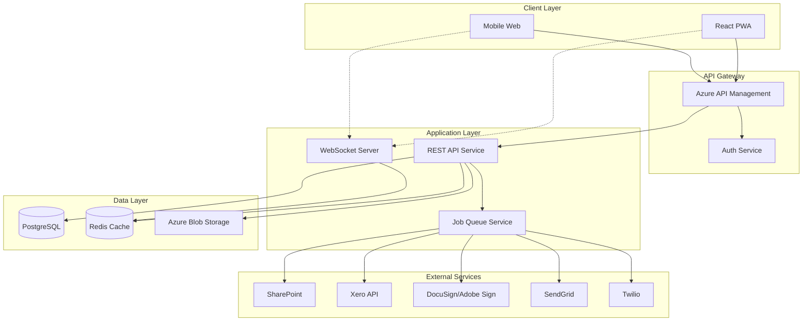
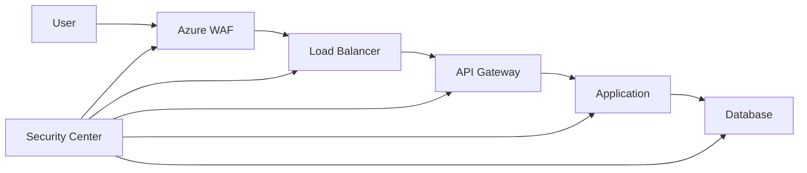
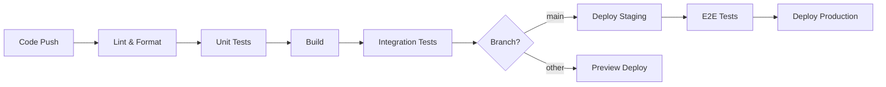

# Technical Overview: BIG Live Portal

## Executive Summary
BIG Live Portal's technical architecture leverages a modern cloud-native approach built on Azure infrastructure to ensure seamless integration with SharePoint while providing a scalable, secure platform for performing arts management. The solution employs a microservices architecture with React-based Progressive Web App frontend, Node.js REST APIs, and PostgreSQL database, all orchestrated through Docker containers. Key architectural decisions prioritize mobile responsiveness, offline capabilities, and maintainability by non-technical staff while supporting growth from 100 to 5,000+ concurrent users through horizontal scaling and intelligent caching strategies.

## System Architecture

### High-Level Architecture
The system follows a microservices architecture pattern with clear separation of concerns, enabling independent scaling and deployment of components while maintaining system integrity through well-defined APIs and event-driven communication.



### Component Architecture
The system is decomposed into specialized services that handle specific business domains, promoting maintainability and allowing teams to work independently on different features.

#### Frontend Components
- **React PWA Shell:** Core application framework providing offline support, routing, and state management
- **Authentication Module:** Handles personal email login, session management, and role-based access
- **Contract Management UI:** Document viewing, e-signature integration, version history display
- **Expense Submission UI:** Multi-step form wizard, camera integration, receipt preview and upload
- **Schedule Viewer:** Calendar components, event details, real-time updates via WebSocket
- **Admin Dashboard:** User management, analytics widgets, bulk operations interface

#### Backend Services
- **API Gateway Service:** Request routing, authentication, rate limiting, API versioning
- **Authentication Service:** User authentication, JWT token generation, session management
- **Core API Service:** Business logic for contracts, expenses, schedules, and users
- **Document Service:** File upload/download, SharePoint integration, document processing
- **Integration Service:** External API adapters for Xero, DocuSign, SendGrid, Twilio
- **Notification Service:** Email/SMS dispatch, template management, delivery tracking
- **Analytics Service:** Usage metrics, report generation, data aggregation

#### Data Services
- **PostgreSQL Primary:** Transactional data, user profiles, contracts, expenses
- **Redis Cache:** Session storage, real-time data, API response caching
- **Azure Blob Storage:** Document storage, receipt images, generated reports
- **Job Queue (Bull/Redis):** Async task processing, integration workflows

## Technology Stack

### Frontend Technologies
| Layer | Technology | Justification |
|-------|-----------|---------------|
| Framework | React 18+ | Industry standard, excellent mobile support, large ecosystem |
| State Management | Redux Toolkit | Predictable state updates, time-travel debugging, offline support |
| UI Components | Material-UI (MUI) | Accessible components, mobile-first design, customizable theming |
| Build Tools | Vite | Fast HMR, optimized production builds, ESM support |
| Testing | Jest + React Testing Library | Component testing, accessibility checks, snapshot testing |

### Backend Technologies
| Layer | Technology | Justification |
|-------|-----------|---------------|
| Runtime | Node.js 18+ LTS | JavaScript everywhere, excellent async I/O, mature ecosystem |
| Framework | Express.js | Lightweight, flexible, extensive middleware ecosystem |
| Database | PostgreSQL 14+ | ACID compliance, JSONB support, full-text search, reliable |
| Cache | Redis 7+ | In-memory performance, pub/sub for real-time, session storage |
| Queue | Bull (Redis-based) | Reliable job processing, retry logic, job prioritization |
| Testing | Jest + Supertest | API testing, mocking support, code coverage |

### Infrastructure & DevOps
| Component | Technology | Justification |
|-----------|-----------|---------------|
| Cloud Platform | Microsoft Azure | Native SharePoint integration, global presence, PaaS options |
| Container Orchestration | Azure Kubernetes Service | Managed K8s, auto-scaling, integrated monitoring |
| CI/CD | Azure DevOps | Integrated with Azure, pipeline as code, artifact management |
| Monitoring | Azure Monitor + App Insights | Full-stack observability, custom metrics, alerting |
| Logging | Azure Log Analytics | Centralized logging, query language, retention policies |

## Platform Strategy

### Web Application
- **Architecture:** Progressive Web App (PWA) with service workers
- **Browser Support:** Chrome 90+, Firefox 88+, Safari 14+, Edge 90+ (last 2 major versions)
- **Responsive Strategy:** Mobile-first design with breakpoints at 320px, 768px, 1024px, 1920px
- **Offline Capabilities:** View cached contracts and schedules, queue expense submissions for sync

### Mobile Strategy
- **Approach:** Responsive PWA with native app features (camera, push notifications)
- **Platform Coverage:** iOS 13+ Safari, Android 8+ Chrome
- **Native Features:** Camera API for receipts, Web Push API for notifications, Share API
- **Performance Targets:** < 3s Time to Interactive on 3G, < 100KB initial JS bundle

### API Strategy
- **Architecture Style:** RESTful with JSON responses, GraphQL considered for v2
- **Versioning Strategy:** URL versioning (/api/v1, /api/v2) with 6-month deprecation
- **Documentation:** OpenAPI 3.0 spec with Swagger UI, versioned docs
- **Client SDKs:** JavaScript/TypeScript SDK auto-generated from OpenAPI spec

## Data Architecture

### Data Model Design Principles
- **Normalized Structure**: 3NF for transactional data to ensure consistency
- **Audit Everything**: Comprehensive audit tables for compliance and debugging
- **Soft Deletes**: Logical deletion with archived_at timestamps for data recovery
- **Multi-tenancy**: Organization-based data isolation with row-level security

### Database Strategy
- **Primary Database:** PostgreSQL 14+ with connection pooling via PgBouncer
- **Read Replicas:** 2 read replicas for reporting and analytics queries
- **Sharding Strategy:** Future consideration - shard by organization_id if needed
- **Backup Strategy:** Daily automated backups with 30-day retention, point-in-time recovery

### Caching Strategy
- **Cache Layers:** CDN (static assets), Redis (API responses), Browser (service worker)
- **Cache Invalidation:** Event-based invalidation, versioned cache keys
- **TTL Policies:** User sessions (24h), API responses (5-60 min), static assets (1 year)

### File Storage Strategy
- **Storage Solution:** Azure Blob Storage with lifecycle management
- **CDN Strategy:** Azure CDN for global distribution of assets and documents
- **Backup and Replication:** Geo-redundant storage (GRS) with 99.99% durability

## Integration Architecture

### Integration Patterns
- **Adapter Pattern:** Isolate external API changes from core business logic
- **Queue-Based Processing:** Async handling of external API calls for resilience
- **Circuit Breaker:** Prevent cascade failures when external services are down
- **Webhook Pattern:** Real-time updates from external services

### External Service Integrations
#### SharePoint
- **Integration Method:** Microsoft Graph API with OAuth 2.0
- **Authentication:** Admin consent flow for organization-wide access
- **Data Flow:** Documents uploaded to designated libraries, metadata sync
- **Error Handling:** Exponential backoff, queue for retry, admin alerts
- **Rate Limits:** 120 requests/minute per app, request batching implemented

#### Xero Accounting
- **Integration Method:** Xero OAuth 2.0 API with webhook callbacks
- **Authentication:** OAuth 2.0 with refresh token rotation
- **Data Flow:** Create bills/expenses, attach receipts, sync approval status
- **Error Handling:** Retry with backoff, manual fallback option
- **Rate Limits:** 60 requests/minute, 5000 requests/day

#### DocuSign/Adobe Sign
- **Integration Method:** Embedded signing via JavaScript SDK
- **Authentication:** JWT authentication for server-side operations
- **Data Flow:** Template-based contracts, real-time signature status
- **Error Handling:** Webhook retry mechanism, email fallback
- **Rate Limits:** 1000 envelopes/hour standard limit

### Event-Driven Architecture
- **Message Bus:** Azure Service Bus for reliable message delivery
- **Event Types:** User events, Document events, Financial events, System events
- **Event Schema:** CloudEvents specification for standardization
- **Delivery Guarantees:** At-least-once delivery with idempotency keys

## Security Architecture

### Security Layers


### Authentication & Authorization
- **Authentication Method:** OAuth 2.0 with personal email + password
- **Session Management:** JWT tokens with Redis session store, sliding expiration
- **Authorization Model:** Role-Based Access Control (RBAC) with permissions
- **Token Strategy:** Short-lived access tokens (1h), refresh tokens (30d)

### Data Security
- **Encryption at Rest:** AES-256 for database, Azure Storage encryption
- **Encryption in Transit:** TLS 1.3 minimum, certificate pinning for mobile
- **Key Management:** Azure Key Vault for secrets and certificates
- **PII Handling:** Pseudonymization, field-level encryption for sensitive data

### Security Monitoring
- **Threat Detection:** Azure Security Center with custom rules
- **Vulnerability Scanning:** Weekly automated scans, OWASP ZAP in CI/CD
- **Incident Response:** Automated alerting, runbook procedures, 24h SLA
- **Audit Logging:** All API calls logged with correlation IDs, 2-year retention

## Performance Architecture

### Performance Requirements
| Metric | Target | Measurement Method |
|--------|--------|-------------------|
| Page Load Time | < 3 seconds on 3G | Real User Monitoring (RUM) |
| API Response Time | < 500ms p95 | Application Insights metrics |
| Concurrent Users | 1,000+ | Load testing with K6 |
| Uptime | 99.9% | Azure Monitor availability tests |

### Performance Optimization Strategies
- **Frontend Optimization:** Code splitting, lazy loading, image optimization, CDN
- **Backend Optimization:** Database indexing, query optimization, connection pooling
- **Database Optimization:** Materialized views, partitioning, query plan analysis
- **Caching Strategy:** Redis for hot data, CDN for assets, browser cache for offline

### Scalability Design
- **Horizontal Scaling:** Kubernetes HPA for pods based on CPU/memory metrics
- **Vertical Scaling:** Start with smaller instances, scale up as needed
- **Auto-scaling Triggers:** CPU > 70%, Memory > 80%, Request queue > 100
- **Load Balancing:** Azure Load Balancer with health checks, sticky sessions

## Development Architecture

### Development Environment
- **Local Development:** Docker Compose for full stack, hot reload enabled
- **Environment Parity:** Docker ensures dev/prod parity, feature flags for differences
- **Data Seeding:** Faker.js for test data, anonymized production snapshots
- **Secret Management:** Azure Key Vault references, local .env files (git-ignored)

### Code Organization
```
/
├── frontend/
│   ├── src/
│   │   ├── components/
│   │   ├── pages/
│   │   ├── services/
│   │   ├── store/
│   │   └── utils/
│   └── tests/
├── backend/
│   ├── src/
│   │   ├── controllers/
│   │   ├── services/
│   │   ├── models/
│   │   ├── middleware/
│   │   └── utils/
│   └── tests/
├── infrastructure/
│   ├── terraform/
│   ├── kubernetes/
│   └── scripts/
└── docs/
    ├── api/
    ├── architecture/
    └── deployment/
```

### Testing Strategy
- **Unit Testing:** 80% code coverage target, Jest for both frontend/backend
- **Integration Testing:** API endpoint tests, database integration tests
- **E2E Testing:** Cypress for critical user journeys, 10 key scenarios
- **Performance Testing:** K6 for load testing, Lighthouse for frontend metrics
- **Security Testing:** OWASP ZAP automated scans, Snyk for dependencies

### CI/CD Pipeline


## Infrastructure Architecture

### Environment Strategy
| Environment | Purpose | Infrastructure | Data |
|-------------|---------|---------------|------|
| Development | Local development | Docker Compose | Synthetic test data |
| Staging | Pre-production testing | 50% of production | Anonymized prod data |
| Production | Live system | Full scale, multi-region | Real user data |

### Deployment Architecture
- **Container Strategy:** Docker containers for all services, multi-stage builds
- **Orchestration:** Azure Kubernetes Service with Helm charts
- **Service Mesh:** Istio for advanced traffic management (future)
- **Blue-Green Deployments:** Zero-downtime deployments with traffic shifting

### Monitoring & Observability
- **Metrics:** Azure Monitor for infrastructure, App Insights for application
- **Logging:** Structured JSON logs, Azure Log Analytics aggregation
- **Tracing:** Distributed tracing with Application Insights
- **Alerting:** Multi-channel alerts (email, SMS, Slack) with escalation

### Disaster Recovery
- **RTO Target:** 4 hours for full recovery
- **RPO Target:** 1 hour maximum data loss
- **Backup Strategy:** Daily full + hourly incremental, tested monthly
- **Failover Process:** Automated failover to secondary region, manual failback

## Compliance & Governance

### Regulatory Compliance
- **PCI DSS Level 4:** Tokenization for payment data, no direct card storage
- **GDPR:** Data portability API, right to deletion, privacy by design
- **CCPA/CPRA:** California privacy compliance with opt-out mechanisms
- **SOX:** Audit trails for all financial transactions, separation of duties

### Data Governance
- **Data Classification:** Public, Internal, Confidential, Restricted
- **Retention Policies:** 7 years for contracts, 3 years for expenses, 90 days for logs
- **Data Deletion:** Soft delete with purge after retention period
- **Access Controls:** Principle of least privilege, regular access reviews

### Audit Requirements
- **Audit Logging:** Every data change logged with who/what/when/why
- **Log Retention:** 2 years for audit logs, immutable storage
- **Audit Reports:** Monthly compliance reports, real-time dashboards
- **Compliance Dashboards:** RBAC violations, data access patterns, security events

## Migration Strategy

### Data Migration
- **Source Systems:** Paper documents, Excel spreadsheets, legacy systems
- **Migration Approach:** Phased migration by organization, pilot program first
- **Data Validation:** Checksums, record counts, business rule validation
- **Rollback Plan:** Keep source systems running parallel for 3 months

### User Migration
- **Phasing Strategy:** Department by department, VIP users first
- **Training Requirements:** 2-hour admin training, 15-minute artist onboarding
- **Support During Migration:** Dedicated support team, office hours, chat support

## Risk Assessment

### Technical Risks
| Risk | Probability | Impact | Mitigation |
|------|-------------|---------|------------|
| SharePoint API changes | Medium | High | API version locking, abstraction layer, monitoring |
| Scalability beyond projections | Low | High | Cloud auto-scaling, performance testing, capacity planning |
| Browser compatibility issues | Medium | Medium | Progressive enhancement, polyfills, device testing lab |
| Integration service downtime | Medium | High | Circuit breakers, queues, manual fallback procedures |

### Operational Risks
| Risk | Probability | Impact | Mitigation |
|------|-------------|---------|------------|
| Slow user adoption | Medium | High | Intuitive UX, training programs, adoption incentives |
| Support ticket overload | Medium | Medium | Self-service help, video tutorials, tiered support |
| Data privacy breach | Low | High | Encryption, access controls, security audits, insurance |
| Peak season load | High | Medium | Auto-scaling, performance testing, CDN optimization |

## Future Architecture Considerations

### Planned Enhancements
1. **Native Mobile Apps (Q3 2025):** React Native implementation sharing 80% code with web
2. **GraphQL API Layer (Q4 2025):** Efficient data fetching for mobile apps
3. **AI-Powered Features (Q1 2026):** Expense categorization, receipt OCR, anomaly detection
4. **Microservices Decomposition (Q2 2026):** Split monolith into domain services

### Technology Radar
- **Adopt:** TypeScript, React 18, PostgreSQL 14, Redis 7, Azure PaaS
- **Trial:** GraphQL, React Native, Deno runtime, Edge computing
- **Assess:** Blockchain for contracts, WebAssembly, Serverless architecture
- **Hold:** jQuery, Server-side rendering only, Monolithic architecture

## Critical Questions and Clarifications

1. **SharePoint Version and Configuration**: What specific version of SharePoint is in use (Online vs On-premises 2019+)? This will determine the integration approach and available APIs.

2. **Expected Peak Loads**: What are the specific peak usage patterns during performance seasons? Need actual numbers to properly size infrastructure.

3. **Compliance Requirements**: Are there any industry-specific compliance requirements beyond standard financial regulations (union rules, etc.)?

4. **Disaster Recovery Requirements**: Is the 4-hour RTO acceptable for the business, or do we need to design for higher availability?

5. **Multi-language Timeline**: When is international expansion planned? This affects database design and architecture decisions.

6. **Legacy System Details**: What specific systems are currently in use that need data migration? What are the data volumes?

7. **E-signature Vendor Preference**: Strong preference between DocuSign and Adobe Sign based on existing relationships?

8. **Budget Constraints**: Specific budget allocation for infrastructure costs to ensure architecture fits financial constraints?

9. **Offline Requirements Criticality**: How important is offline functionality for the MVP given the technical complexity involved?

10. **Performance Season Patterns**: Specific dates and multipliers for peak season traffic to plan capacity appropriately?