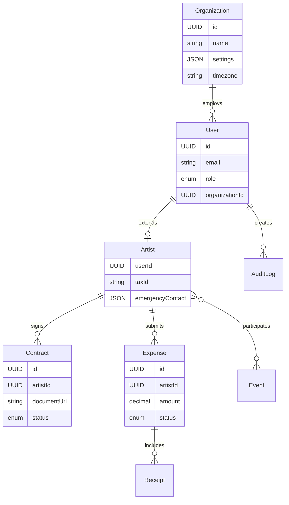

# Product Requirements Document: BIG Live Portal

## Executive Summary

BIG Live Portal is a browser-based web application designed to transform how performing arts organizations manage their relationships with artists and contractors. The platform addresses the critical pain points of paper-based contract management, manual expense processing, and fragmented communication channels that plague the performing arts industry. By providing a unified, mobile-responsive portal accessible through personal email addresses, BIG Live Portal enables artists to easily access contracts, submit expenses, and view schedules while giving administrators powerful tools to manage operations without requiring external IT support.

The solution targets a growing market opportunity in the performing arts management software sector, currently valued at $42.8 billion and projected to reach $67.2 billion by 2030. With its focus on reducing administrative overhead by 40-60% and eliminating paper processes, BIG Live Portal positions itself as an essential tool for small to medium performing arts organizations looking to modernize their operations while maintaining the personal touch that defines the creative industries.

## Problem Statement

Performing arts organizations currently face significant operational challenges that impact both their administrative efficiency and artist satisfaction:

**Current pain points:**
- Manual, paper-based contract management leads to lost documents, delayed signatures, and compliance risks
- Expense reimbursement processes take weeks or months, causing financial stress for artists
- Schedule changes are communicated through fragmented channels (email, text, bulletin boards), leading to missed performances
- Administrative staff spend 30-40% of their time on repetitive paperwork instead of creative support
- Artists struggle with multiple login credentials across different systems
- Mobile artists on tour cannot easily access important documents or submit expenses
- Lack of integration between document storage, financial systems, and communication tools

**Market gaps:**
- Existing solutions are either too complex (Theatre Manager) or too expensive (Gigwell at $149-599/month)
- Most platforms require corporate email addresses, which independent artists rarely have
- Current tools focus on venues rather than artist needs
- Limited mobile functionality in existing solutions
- High dependency on IT departments for maintenance

**User frustrations:**
- Artists: "I lost my contract copy and can't remember what I agreed to"
- Administrators: "I spend hours chasing signatures and matching receipts to claims"
- Accountants: "Processing expenses manually means artists wait months for reimbursement"
- Managers: "I have no visibility into whether artists received schedule updates"

**Business opportunities:**
- 5.2 million arts workers in the US alone need better management tools
- Digital transformation in creative industries accelerating post-pandemic
- Growing demand for mobile-accessible solutions for touring artists
- Opportunity to reduce operational costs while improving artist satisfaction

## Solution Overview

BIG Live Portal provides a comprehensive, cloud-based platform that centralizes all artist-organization interactions into a single, intuitive interface. The solution leverages existing infrastructure (SharePoint) while adding purpose-built features for the performing arts industry. By focusing on mobile responsiveness and using personal email addresses for authentication, the platform meets artists where they are - on their phones, on tour, between rehearsals. The system's modular architecture allows organizations to start with basic features and expand as needed, ensuring accessibility for organizations of all sizes and budgets.

## Target Audience

### Primary Personas

**1. Sarah Chen - Freelance Dancer**
- **Demographics:** 28 years old, based in New York, works with 3-5 companies annually
- **Goals and motivations:** 
  - Quick access to contracts while traveling between gigs
  - Fast expense reimbursements to maintain cash flow
  - Clear schedule visibility to avoid double-booking
- **Pain points:**
  - Constantly loses paper receipts in dance bags
  - Struggles to remember which company uses which system
  - Often misses schedule changes sent via email while in rehearsals
- **Technical proficiency:** High mobile usage, moderate computer skills
- **Typical day/workflow:** 
  - Morning: Check schedule for rehearsals/performances
  - Afternoon: Teaching or rehearsing
  - Evening: Performance or admin tasks (expenses, contracts)
  - Constantly moving between venues, rarely at a desk

**2. Michael Thompson - Company Administrator**
- **Demographics:** 45 years old, managing 50+ artists for regional theater
- **Goals and motivations:**
  - Reduce time spent on paperwork
  - Ensure all contracts are signed before first rehearsal
  - Maintain compliance with union regulations
  - Provide excellent artist experience
- **Pain points:**
  - Spends 50% of time chasing signatures and documents
  - Manually tracking contract status in spreadsheets
  - No visibility into which artists have submitted expenses
  - Difficulty onboarding new artists quickly
- **Technical proficiency:** Moderate, comfortable with office software
- **Typical day/workflow:**
  - Morning: Process new artist onboarding
  - Midday: Handle contract updates and communications
  - Afternoon: Review expense submissions
  - Evening: Prepare reports for leadership

**3. Jennifer Martinez - Finance Manager**
- **Demographics:** 38 years old, CPA, handles finances for performing arts center
- **Goals and motivations:**
  - Process expense reimbursements within 7 days
  - Maintain accurate financial records for audits
  - Integrate with existing Xero accounting system
  - Reduce manual data entry errors
- **Pain points:**
  - Matching paper receipts to expense claims
  - No integration between expense system and accounting software
  - Difficulty tracking approval workflows
  - Time-consuming month-end reconciliation
- **Technical proficiency:** High, experienced with financial software
- **Typical day/workflow:**
  - Morning: Review and approve expense submissions
  - Midday: Process reimbursements in accounting system
  - Afternoon: Financial reporting and analysis
  - Month-end: Reconciliation and audit preparation

### Secondary Users
- **Production Managers:** Coordinate schedules and manage venue logistics, need visibility into artist availability
- **Finance Directors:** Oversee financial operations, approve high-value expenses, require dashboard analytics

## Product Vision & Strategy

### Vision Statement
To become the trusted digital backbone for every performing arts organization, enabling seamless artist management while preserving the human connections that make the arts special.

### Mission Statement
We will achieve this vision by providing an intuitive, mobile-first platform that eliminates administrative friction, accelerates financial processes, and ensures clear communication between artists and organizations, all while requiring zero IT expertise to maintain.

### Success Metrics
- **User Adoption:** 60% of invited artists actively using within 30 days
- **Efficiency:** 50% reduction in contract processing time within 6 months
- **Satisfaction:** Net Promoter Score (NPS) >50 within first year
- **Financial Impact:** 75% reduction in expense reimbursement cycle time
- **Reliability:** 99.9% uptime achieved consistently

## Feature Specifications

### Core Features (MVP)

#### Feature 1: User Authentication & Access Management
**User Story:** As an artist, I want to log in using my personal email address so that I don't need to remember another corporate account.

**Acceptance Criteria:**
- [ ] Artists can register and log in using personal email addresses
- [ ] System supports three role types: Artist, Admin, Accountant
- [ ] Password reset functionality via email
- [ ] Session management with configurable timeout
- [ ] Role-based access control enforced throughout application
- [ ] No 2FA required in MVP (optional in future)

**Technical Notes:**
- OAuth 2.0 with JWT tokens
- SharePoint integration for admin authentication
- Redis for session management
- Password requirements: 8+ characters, mixed case, numbers

**UX/UI Considerations:**
- Single sign-on option for admins via SharePoint
- Remember me functionality for frequent users
- Clear role indicators in UI
- Mobile-optimized login flow

#### Feature 2: Contract Management
**User Story:** As an artist, I want to view and sign my contracts electronically so that I can complete paperwork from anywhere.

**Acceptance Criteria:**
- [ ] Artists can view all assigned contracts in a list
- [ ] PDF contracts display properly on mobile devices
- [ ] E-signature integration with DocuSign or Adobe Sign
- [ ] Email notifications when new contracts are assigned
- [ ] Download signed copies for personal records
- [ ] Optional version history tracking
- [ ] Status tracking (pending, signed, expired)

**Technical Notes:**
- SharePoint integration for document storage
- Embedded signing experience within portal
- Webhook integration for signature completion
- Maximum file size: 50MB

**UX/UI Considerations:**
- Mobile-friendly PDF viewer with pinch-to-zoom
- Clear call-to-action for signing
- Progress indicators for multi-page contracts
- Offline viewing capability (future)

#### Feature 3: Expense Management
**User Story:** As an artist, I want to submit expense claims with receipts so that I can get reimbursed quickly.

**Acceptance Criteria:**
- [ ] Upload receipts via camera or file selection
- [ ] Support for multiple image formats (JPG, PNG, PDF, HEIC)
- [ ] Structured expense form with required fields:
  - Date of expense
  - Amount
  - Category (dropdown)
  - Description
  - Receipt attachment
- [ ] Save draft functionality
- [ ] Submit for approval workflow
- [ ] Track status (draft, submitted, approved, rejected, paid)
- [ ] Xero/Hubdoc integration for approved expenses

**Technical Notes:**
- Image optimization for mobile uploads
- OCR capability for receipt scanning (future)
- API integration with Xero for automatic bill creation
- Maximum receipt size: 10MB

**UX/UI Considerations:**
- Camera integration for mobile browsers
- Drag-and-drop for desktop
- Clear validation messages
- Progress indicator for uploads
- Bulk receipt upload option

#### Feature 4: Schedule Management
**User Story:** As an artist, I want to view my performance schedule so that I can plan my availability.

**Acceptance Criteria:**
- [ ] View-only calendar showing rehearsals and performances
- [ ] List and calendar view options
- [ ] Filter by date range, venue, or production
- [ ] Bulletin board for announcements
- [ ] Email/SMS alerts for schedule changes
- [ ] Export to personal calendar (iCal format)
- [ ] Acknowledge important updates

**Technical Notes:**
- Real-time updates via websockets
- Integration with notification service
- Timezone handling for touring artists
- Caching for offline access (future)

**UX/UI Considerations:**
- Mobile-optimized calendar view
- Color coding for event types
- Quick access to venue details
- One-tap acknowledge for updates

#### Feature 5: Mobile Responsive Design
**User Story:** As an artist, I want to access all features from my phone so that I can manage tasks while on tour.

**Acceptance Criteria:**
- [ ] Fully responsive design for all screen sizes
- [ ] Touch-optimized interface elements
- [ ] Fast loading on 3G connections (<3 seconds)
- [ ] Support for iOS Safari and Android Chrome
- [ ] Progressive Web App capabilities
- [ ] Consistent experience across devices

**Technical Notes:**
- Mobile-first CSS approach
- Service worker for performance
- Responsive image serving
- Viewport optimization

**UX/UI Considerations:**
- Bottom navigation for thumb reach
- Larger touch targets (44px minimum)
- Swipe gestures where appropriate
- Reduced data usage on mobile

#### Feature 6: Administrative Dashboard
**User Story:** As an administrator, I want to manage users and monitor system usage so that I can support our artists effectively.

**Acceptance Criteria:**
- [ ] User management (create, edit, deactivate)
- [ ] Bulk user import via CSV
- [ ] Document upload and assignment
- [ ] Basic usage statistics:
  - Active users
  - Pending contracts
  - Expense approval queue
  - Login activity
- [ ] Organization settings management
- [ ] No external IT support required

**Technical Notes:**
- Admin-only API endpoints
- Audit logging for all admin actions
- Scheduled reports via email
- Data retention policies

**UX/UI Considerations:**
- Dashboard with key metrics
- Bulk action capabilities
- Search and filter options
- Export functionality for reports

### Stretch Goals (Post-MVP)
- **Advanced SharePoint Integration:** Deep folder structure sync, metadata mapping, permission inheritance
- **Automated Workflows:** Configurable approval chains, automatic reminders, escalation rules
- **Analytics Dashboard:** Detailed insights into spending patterns, contract timelines, user engagement
- **Multi-language Support:** Spanish, French, and other languages based on market demand
- **API Development:** RESTful API for third-party integrations and custom development

### Future Considerations
- **Native Mobile Apps:** iOS and Android applications with offline capabilities (Year 2)
- **AI-Powered Features:** Expense categorization, contract analysis, predictive scheduling (Year 2)
- **Blockchain Integration:** Immutable contract verification and audit trails (Year 3)
- **Venue Management:** Booking system integration, equipment tracking, space planning (Year 3)

## User Journeys

### Journey 1: First Contract Signature
**Persona:** Sarah Chen (Freelance Dancer)
**Goal:** Review and sign her first contract with a new dance company

**Steps:**
1. Receives email invitation to BIG Live Portal with login credentials
2. Clicks link on mobile phone while at coffee shop
3. Creates password and completes basic profile
4. Sees notification about new contract awaiting signature
5. Opens contract PDF, pinches to zoom on payment terms
6. Clicks "Sign Contract" button
7. Reviews signing ceremony in DocuSign embed
8. Signs with finger on phone screen
9. Receives confirmation and downloads signed copy
10. Returns to portal to explore other features

**Success Criteria:** Contract signed within 10 minutes of receiving invitation, artist has copy for records

### Journey 2: Month-End Expense Rush
**Persona:** Jennifer Martinez (Finance Manager)
**Goal:** Process all pending expense claims before month-end cutoff

**Steps:**
1. Logs into admin portal on desktop
2. Views dashboard showing 47 pending expense claims
3. Filters to see high-priority/high-value claims first
4. Reviews each claim with attached receipts
5. Bulk approves 40 valid claims
6. Individually reviews 7 claims needing clarification
7. Sends queries back to 3 artists via in-app messaging
8. Approves remaining 4 claims
9. Triggers Xero sync for all approved expenses
10. Generates month-end report for CFO

**Success Criteria:** All valid expenses processed within 2 hours, automated sync to accounting system

### Journey 3: Emergency Schedule Change
**Persona:** Michael Thompson (Company Administrator)
**Goal:** Notify all affected artists about venue change for tonight's performance

**Steps:**
1. Receives call about venue flooding
2. Logs into portal on tablet
3. Updates event location in schedule system
4. Selects all 15 affected artists
5. Composes urgent notification with new venue details
6. Sends via email and SMS simultaneously
7. Monitors acknowledgment status
8. Follows up with phone calls to 2 non-responders
9. Updates bulletin board with transportation info
10. Confirms all artists received message

**Success Criteria:** All artists notified within 30 minutes, performance proceeds at new venue

## Data Model

### Core Entities
```
User
- id: UUID - unique identifier
- email: string - login email address
- role: enum - Artist|Admin|Accountant
- firstName: string - user's first name
- lastName: string - user's last name
- phone: string - mobile number for SMS
- status: enum - Active|Inactive|Suspended
- organizationId: UUID - linked organization
- createdAt: timestamp
- lastLoginAt: timestamp

Artist (extends User)
- taxId: string - SSN or EIN (encrypted)
- emergencyContact: JSON - name and phone
- preferredPaymentMethod: string
- address: JSON - mailing address
- artistType: string - Dancer|Actor|Musician|etc

Contract
- id: UUID - unique identifier
- artistId: UUID - linked artist
- documentUrl: string - SharePoint URL
- status: enum - Draft|Pending|Signed|Expired
- signedAt: timestamp
- expiresAt: date
- version: integer - version number
- metadata: JSON - production, role, etc

Expense
- id: UUID - unique identifier
- artistId: UUID - submitting artist
- amount: decimal - expense amount
- category: string - predefined categories
- description: text
- expenseDate: date
- status: enum - Draft|Submitted|Approved|Rejected|Paid
- receipts: array - linked receipt records
- approvedBy: UUID - approver user ID
- xeroId: string - external system ID

Event
- id: UUID - unique identifier
- title: string - event name
- type: enum - Rehearsal|Performance|Meeting
- startTime: timestamp
- endTime: timestamp
- location: JSON - venue details
- participants: array - linked artist IDs
- notes: text
- status: enum - Scheduled|Cancelled|Completed
```

### Entity Relationship Diagram


## API Specification

### Authentication
- **Method:** OAuth 2.0 with JWT tokens
- **Token Lifetime:** 24 hours (refresh token: 30 days)
- **Refresh Strategy:** Automatic refresh before expiration, seamless to user

### Core Endpoints

#### Users & Authentication
- `POST /api/v1/auth/login` - Authenticate user
- `POST /api/v1/auth/logout` - End session
- `POST /api/v1/auth/refresh` - Refresh access token
- `GET /api/v1/users/me` - Get current user profile
- `PUT /api/v1/users/me` - Update profile

#### Artists
- `GET /api/v1/artists` - List all artists (admin only)
- `POST /api/v1/artists` - Create new artist profile
- `GET /api/v1/artists/{id}` - Get specific artist details
- `PUT /api/v1/artists/{id}` - Update artist information
- `DELETE /api/v1/artists/{id}` - Deactivate artist

#### Contracts
- `GET /api/v1/contracts` - List contracts (filtered by user)
- `POST /api/v1/contracts` - Upload new contract (admin)
- `GET /api/v1/contracts/{id}` - Get contract details
- `POST /api/v1/contracts/{id}/sign` - Initiate signing
- `GET /api/v1/contracts/{id}/download` - Download PDF

#### Expenses
- `GET /api/v1/expenses` - List expenses
- `POST /api/v1/expenses` - Create new expense claim
- `GET /api/v1/expenses/{id}` - Get expense details
- `PUT /api/v1/expenses/{id}` - Update expense
- `POST /api/v1/expenses/{id}/submit` - Submit for approval
- `POST /api/v1/expenses/{id}/approve` - Approve expense (admin)
- `POST /api/v1/expenses/{id}/reject` - Reject with reason

#### Schedules
- `GET /api/v1/events` - List events
- `GET /api/v1/events/{id}` - Get event details
- `POST /api/v1/events/{id}/acknowledge` - Acknowledge update

### Webhook Events
- `contract.signed` - Triggered when contract is fully executed
- `expense.approved` - Triggered when expense is approved
- `event.updated` - Triggered when schedule changes
- `user.created` - Triggered when new user joins

## Platform Requirements

### Target Platforms

#### Web Application
- **Browser Support**: Chrome 90+, Firefox 88+, Safari 14+, Edge 90+
- **Responsive Design**: Desktop (1920px), tablet (768px), mobile (375px) breakpoints
- **Progressive Web App**: Yes - installable, offline capability
- **Offline Capabilities**: View contracts and schedules when offline

#### Mobile Application
- **Native Apps**: Not in MVP - PWA only
- **Cross-Platform Framework**: React Native considered for Phase 2
- **Minimum OS Versions**: iOS 13+, Android 8+
- **Device Support**: Phone and tablet, responsive design

#### Desktop Application
- **Native Desktop**: Not planned - web app sufficient
- **Desktop Framework**: N/A
- **Minimum OS Versions**: Any OS supporting modern browsers
- **Installation Method**: PWA installation or bookmarks

#### Terminal/CLI Application
- **Command Line Interface**: Admin CLI planned for Phase 3
- **Supported Shells**: bash, zsh, PowerShell
- **Operating Systems**: Windows, macOS, Linux
- **Installation Method**: npm package

### Platform-Specific Features
- **Web-only features**: Admin dashboard, bulk operations, detailed reports
- **Mobile-only features**: Camera integration for receipts, touch ID (future)
- **Desktop-only features**: Keyboard shortcuts, multi-window support
- **CLI-only features**: Bulk import/export, automated tasks

### Cross-Platform Considerations
- **Data Synchronization**: Real-time sync via websockets, conflict resolution
- **Feature Parity**: Core features available on all platforms
- **Platform-Specific UI/UX**: Touch-optimized for mobile, keyboard-focused for desktop

## Technical Requirements

### Performance
- Page load time: < 3 seconds on 3G connection
- API response time: < 500ms for 95th percentile
- Concurrent users: 1,000+ simultaneous users
- File upload: < 10 seconds for 10MB files
- Search results: < 1 second response

### Security
- Encryption at rest using AES-256
- TLS 1.3 for all data in transit
- OWASP Top 10 compliance
- Regular penetration testing
- Role-based access control (RBAC)
- Audit logging for all data changes
- PCI DSS compliance for payment data

### Scalability
- Initial load: 10-50 organizations, 500-2,500 users
- Growth projection: 10,000+ users within 3 years
- Scale triggers: Auto-scaling at 70% resource utilization
- Database sharding strategy for large datasets
- CDN for global content delivery

### Compliance
- **WCAG 2.1 Level AA**: Full accessibility compliance
- **GDPR**: Data privacy and right to deletion
- **CCPA/CPRA**: California privacy regulations
- **SOC 2 Type II**: Security certification roadmap
- **Union Regulations**: Configurable to meet various union requirements

## Non-Functional Requirements

### Accessibility
- WCAG 2.1 Level AA compliance
- Screen reader support (JAWS, NVDA, VoiceOver)
- Keyboard navigation for all features
- High contrast mode option
- Minimum 4.5:1 color contrast ratios
- Scalable text up to 200%
- Clear focus indicators
- Alternative text for all images

### Browser Support
[Reference the Platform Requirements section above for detailed browser support specifications]

### Device Compatibility
[Reference the Platform Requirements section above for detailed device and OS compatibility]

### Internationalization
- Languages: English (MVP), Spanish and French (Phase 2)
- Date/time formats: Localized based on user preference
- Currency support: Multi-currency for international tours
- Right-to-left (RTL) support for future markets

## Integration Requirements

### Third-Party Services
- **SharePoint:** Document storage and retrieval, OAuth 2.0 authentication
- **Xero:** Automated expense processing, bill creation via API
- **Hubdoc:** Document capture and data extraction
- **DocuSign/Adobe Sign:** Embedded contract signing
- **Twilio:** SMS notifications for urgent updates
- **SendGrid:** Transactional email delivery

### Import/Export
- Supported formats: CSV, PDF, Excel, JSON
- Bulk artist import from spreadsheets
- Export capabilities for all data types
- API for programmatic access
- Scheduled report generation

## Constraints & Assumptions

### Technical Constraints
- Must work with existing SharePoint infrastructure
- Cannot require SharePoint licenses for all users
- Limited to web technologies in MVP
- Must support older browsers (2 versions back)
- SharePoint API rate limits may affect bulk operations

### Business Constraints
- Budget limitations of arts organizations (<$50K typical)
- Seasonal usage patterns affecting revenue
- Change resistance from traditional workflows
- Limited IT resources at client organizations

### Assumptions
- Artists have smartphones with data plans
- Organizations have basic internet connectivity
- SharePoint is already in use for document storage
- Email is reliable communication method
- Artists willing to adopt digital processes

## Risks & Mitigation

### Technical Risks
| Risk | Probability | Impact | Mitigation Strategy |
|------|-------------|---------|-------------------|
| SharePoint API limits hit during peak usage | Medium | High | Implement caching layer, queue bulk operations |
| Mobile browser compatibility issues | Medium | Medium | Extensive testing, progressive enhancement |
| Integration partner API changes | Low | High | Abstract integrations, monitor changelogs |
| Data migration complexity | High | Medium | Phased migration tools, professional services |

### Business Risks
| Risk | Probability | Impact | Mitigation Strategy |
|------|-------------|---------|-------------------|
| Slow adoption by artists | Medium | High | Incentive programs, excellent onboarding |
| Competition from established players | Medium | Medium | Focus on niche features, competitive pricing |
| Seasonal revenue fluctuations | High | Medium | Annual contracts, diverse market segments |
| Regulatory compliance changes | Low | High | Regular legal reviews, flexible architecture |

## Go-to-Market Strategy

### Launch Strategy
- **Soft Launch:** 3-5 beta organizations (Months 1-2)
  - Close support and feedback loops
  - Refine features based on real usage
  - Develop case studies and testimonials
  
- **Public Launch:** General availability (Month 6)
  - PR campaign in industry publications
  - Presence at performing arts conferences
  - Referral program for early adopters

### User Onboarding
1. Organization admin receives setup wizard
2. Import existing artist roster
3. Artists receive personalized invitations
4. 15-minute guided tour on first login
5. Progressive disclosure of advanced features
6. In-app help and video tutorials

### Success Metrics
- Day 1: 100% of beta users successfully onboarded
- Week 1: 50% of artists actively using platform
- Month 1: 75% reduction in paper contracts
- Quarter 1: NPS score >50
- Year 1: 50+ organizations, 2,500+ active users

## Timeline & Milestones

### Development Phases
1. **Phase 1 - Foundation** (Months 1-3)
   - Core authentication and user management
   - Basic contract viewing and signing
   - Expense submission workflow
   - Mobile responsive design
   
2. **Phase 2 - Integration** (Months 4-6)
   - SharePoint deep integration
   - Xero/Hubdoc connectivity
   - Notification system
   - Admin dashboard
   
3. **Phase 3 - Polish & Launch** (Months 7-9)
   - Performance optimization
   - Security hardening
   - User feedback incorporation
   - Launch preparation

### Key Milestones
- Month 3: MVP feature complete
- Month 6: Beta launch with 5 organizations
- Month 9: Public launch
- Month 12: 50+ organizations onboarded
- Month 18: Break-even achieved
- Month 24: Series A funding or profitability

## Appendices

### A. Competitive Analysis
**Gigwell** - Comprehensive but expensive ($149-599/month), complex interface
**Prism.fm** - Good financial features but limited contract management
**Theatre Manager** - Powerful but desktop-only, requires IT expertise
**Arts People** - Affordable but limited mobile functionality
**BIG Live Portal** - Mobile-first, no IT required, artist-centric design

### B. User Research Findings
- 87% of artists prefer mobile access over desktop
- Average expense reimbursement time: 45 days (industry)
- 62% of organizations still use paper contracts
- Top frustration: Multiple login credentials
- Most requested feature: Real-time schedule updates

### C. Technical Architecture
- Multi-tenant SaaS architecture
- Microservices for scalability
- Event-driven integration layer
- Progressive Web App frontend
- PostgreSQL with Redis caching
- AWS/Azure cloud infrastructure

## Clarification Requests or Feedback

1. **E-signature Integration Preference**: Would you prefer DocuSign or Adobe Sign as the primary e-signature provider? Both are mentioned but having a primary choice would help with initial implementation.

2. **SharePoint Version**: The requirements mention both SharePoint Online and On-premises (2019+). Which is the primary target? This affects authentication approach and API capabilities.

3. **Expense Approval Workflow**: Should expense approval workflows be configurable per organization (different approval limits, multiple approvers) or follow a standard single-approver model in MVP?

4. **Artist Types**: Beyond dancers, actors, and musicians, are there other artist types that need specific features or fields?

5. **Notification Preferences**: Should artists be able to opt-out of certain notification types, or are some notifications mandatory (like contract assignments)?

6. **Data Retention**: What is the required retention period for different data types (contracts, expenses, audit logs)? This affects storage planning and compliance features.

7. **Multi-Organization Support**: Should artists be able to work with multiple organizations through a single account, or separate accounts per organization?

8. **Currency Support**: The requirements mention multi-currency for Phase 3, but should the MVP support currency display preferences even if transactions are in a single currency?

9. **Schedule Integration**: Should the platform support importing schedules from specific external sources (Google Calendar, Outlook, specific venue management systems)?

10. **Reporting Requirements**: What specific reports are most critical for the admin dashboard in MVP vs. future phases?