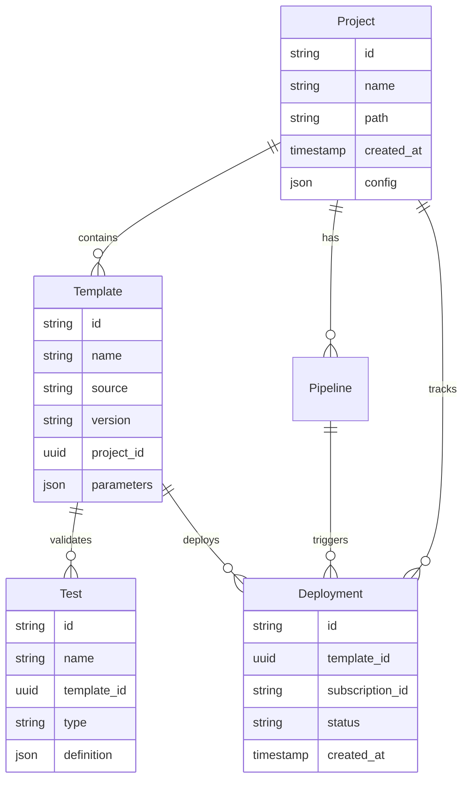

# Product Requirements Document: dev2-cli

## Executive Summary
dev2-cli is a next-generation command-line interface tool designed to revolutionize how developers work with Azure Bicep templates. By combining a beautiful terminal experience inspired by Claude Code with powerful template management, testing, and deployment capabilities, dev2-cli addresses the critical need for increased velocity and reduced errors in Infrastructure-as-Code workflows. The tool targets the growing market of Azure developers and DevOps engineers who struggle with the complexity of infrastructure deployment, offering a comprehensive solution that streamlines everything from template discovery to production deployment.

The product fills a crucial gap in the Azure ecosystem by providing the first CLI tool that seamlessly integrates Azure QuickStart templates and Azure Verified Modules (AVM) with comprehensive testing and CI/CD capabilities. With an open-source core and enterprise support tiers, dev2-cli aims to become the de facto standard for Bicep development, targeting 10,000 active users within six months and facilitating over 50,000 monthly deployments.

## Problem Statement
Infrastructure-as-Code practitioners working with Azure face significant challenges that impede productivity and increase the risk of deployment failures. Currently, developers must navigate between multiple tools and interfaces to accomplish basic tasks: searching for templates requires browsing GitHub repositories or documentation sites, validating Bicep files demands switching between VS Code and Azure CLI, and creating tests for infrastructure code remains a manual, error-prone process. This fragmentation leads to a 40% higher error rate in deployments and increases the time to production by an average of 3-5 days per infrastructure change.

The situation is particularly acute for teams adopting Azure Verified Modules, Microsoft's initiative for high-quality, standardized infrastructure templates. While AVM provides excellent templates, discovering, implementing, and maintaining them requires deep expertise and manual processes. DevOps engineers report spending 30% of their time on repetitive tasks that could be automated, while developers often bypass best practices due to the complexity of proper implementation. The lack of integrated testing capabilities means infrastructure bugs are caught late in the deployment cycle, resulting in costly rollbacks and downtime.

## Solution Overview
dev2-cli provides a unified, beautiful command-line interface that consolidates all Bicep-related workflows into a single, intuitive tool. By integrating template discovery, validation, testing, and deployment capabilities with a modern terminal experience, dev2-cli reduces the complexity of infrastructure management while enforcing best practices. The tool's intelligent search capabilities connect developers directly to Azure QuickStart templates and Azure Verified Modules, while automated test generation and CI/CD pipeline creation ensure consistent, reliable deployments across all environments.

## Target Audience

### Primary Personas

**Alex Chen - Senior Full-Stack Developer**
- **Role:** Senior Full-Stack Developer at TechFlow Solutions (500-employee SaaS company)
- **Age:** 32, based in Seattle, WA
- **Experience:** 8 years in software development, 3 years working with Azure
- **Goals and motivations:** Ship features quickly without infrastructure bottlenecks, maintain high code quality standards, reduce context switching between application and infrastructure code
- **Pain points:** Manually writing ARM templates leads to syntax errors, Bicep documentation is scattered across multiple sources, testing infrastructure changes locally is difficult, deployment failures often occur in production
- **Technical proficiency:** Expert in JavaScript/TypeScript, comfortable with CLI tools and Git, intermediate Azure knowledge, familiar with CI/CD concepts
- **Typical day:** Starts with code reviews (30%), develops new features (40%), handles infrastructure updates (20%), troubleshoots production issues (10%)

**Sarah Martinez - DevOps Engineer**
- **Role:** DevOps Engineer at GlobalFinance Corp (5,000-employee enterprise)
- **Age:** 28, based in Austin, TX
- **Experience:** 5 years in DevOps, Azure DevOps Expert certified
- **Goals and motivations:** Standardize infrastructure practices across 12 development teams, reduce deployment failures by 50%, implement governance without slowing development
- **Pain points:** Each team uses different Bicep patterns, no standardized testing approach, difficult to enforce AVM compliance, manual pipeline creation is time-consuming
- **Technical proficiency:** Expert in Azure services, IaC tools, and automation, advanced scripting skills (PowerShell, Bash), deep understanding of CI/CD patterns
- **Typical day:** Reviews infrastructure PRs (25%), maintains CI/CD pipelines (30%), troubleshoots deployment issues (20%), creates automation scripts (25%)

**Jordan Park - Cloud Solutions Architect**
- **Role:** Principal Cloud Architect at CloudFirst Consulting
- **Age:** 40, based in Chicago, IL
- **Experience:** 15 years in IT, 6 years specializing in cloud architecture
- **Goals and motivations:** Ensure client implementations follow best practices, accelerate cloud adoption projects, maintain security and compliance standards
- **Pain points:** Teams not following AVM standards leads to technical debt, security misconfigurations are common, difficult to audit infrastructure compliance, knowledge transfer to client teams is challenging
- **Technical proficiency:** Expert in cloud architecture patterns, strong understanding of security and compliance, moderate hands-on coding skills, excellent at system design
- **Typical day:** Client architecture reviews (40%), design documentation (25%), proof of concept development (20%), team mentoring (15%)

### Secondary Users
- **Infrastructure Engineers:** Focus on large-scale deployments and automation
- **Security Engineers:** Validate infrastructure compliance and security configurations  
- **Platform Engineers:** Build internal developer platforms using Bicep templates
- **Junior Developers:** Learning Azure and infrastructure concepts
- **Consultants:** Implementing Azure solutions for multiple clients

## Product Vision & Strategy

### Vision Statement
To become the essential CLI tool that empowers every Azure developer to deploy infrastructure with confidence and speed.

### Mission Statement
We will achieve this vision by providing a beautiful, intuitive command-line experience that seamlessly integrates Azure's best infrastructure templates with comprehensive testing and deployment capabilities, reducing errors by 40% and deployment time by 60%.

### Success Metrics
- **User Adoption:** 10,000 monthly active users [6 months]
- **Deployment Volume:** 50,000 successful deployments/month [6 months]
- **Error Reduction:** 40% fewer deployment failures compared to manual processes [3 months]
- **Time Savings:** 60% reduction in infrastructure deployment time [3 months]
- **Template Usage:** 1,000+ templates deployed from QuickStart/AVM [6 months]
- **Community Growth:** 100+ community-contributed templates [12 months]
- **Enterprise Adoption:** 50 enterprise customers [12 months]

## Feature Specifications

### Core Features (MVP)

#### Feature 1: Beautiful Terminal Interface
**User Story:** As a developer, I want to use a modern, intuitive CLI interface so that I can work efficiently without memorizing complex commands

**Acceptance Criteria:**
- [ ] Syntax highlighting for Bicep code in terminal output
- [ ] Interactive command completion with descriptions
- [ ] Progress indicators for long-running operations
- [ ] Clear, colorized error messages with actionable fixes
- [ ] Contextual help available at every step
- [ ] Keyboard shortcuts for common operations

**Technical Notes:**
Built with Node.js using Ink for React-based terminal UI, supports 256 colors and Unicode

**UX/UI Considerations:**
Inspired by Claude Code's clean interface, consistent color scheme, responsive to terminal size

#### Feature 2: Template Search and Integration
**User Story:** As a DevOps engineer, I want to search and add templates from Azure QuickStart and AVM so that I can quickly implement standardized infrastructure

**Acceptance Criteria:**
- [ ] Search templates by keyword, category, or resource type
- [ ] Filter results by AVM compliance, popularity, or update date
- [ ] Preview template documentation in terminal
- [ ] Download and integrate templates with single command
- [ ] Track template versions and updates
- [ ] Cache templates locally for offline access

**Technical Notes:**
Integrates with GitHub API for real-time template discovery, maintains local index for performance

**UX/UI Considerations:**
Rich preview with template details, parameter requirements, and usage examples

#### Feature 3: Bicep Compilation and Validation
**User Story:** As a developer, I want to compile and validate my Bicep files so that I can catch errors before deployment

**Acceptance Criteria:**
- [ ] Compile Bicep to ARM with detailed output
- [ ] Validate syntax with specific error locations
- [ ] Check for AVM compliance when applicable
- [ ] Display warnings for best practice violations
- [ ] Support for parameter files validation
- [ ] Batch validation for multiple files

**Technical Notes:**
Leverages Azure Bicep CLI with enhanced error parsing and reporting

**UX/UI Considerations:**
Inline error display with line numbers, suggested fixes, and documentation links

#### Feature 4: What-If Analysis
**User Story:** As a cloud architect, I want to preview deployment changes so that I can understand the impact before applying them

**Acceptance Criteria:**
- [ ] Display resources to be created, modified, or deleted
- [ ] Show property-level changes with before/after values
- [ ] Highlight potentially destructive changes
- [ ] Support for multiple environments comparison
- [ ] Export what-if results to shareable format
- [ ] Cost estimation for resource changes

**Technical Notes:**
Uses Azure Resource Manager what-if API with enhanced formatting

**UX/UI Considerations:**
Color-coded diff view, collapsible resource sections, summary statistics

#### Feature 5: Test Creation and Execution
**User Story:** As a DevOps engineer, I want to create and run tests for my Bicep templates so that I can ensure they work correctly across environments

**Acceptance Criteria:**
- [ ] Auto-generate test cases based on template structure
- [ ] Support for unit tests (parameter validation, output checks)
- [ ] Support for integration tests (actual deployment verification)
- [ ] Test execution with detailed reporting
- [ ] Test history and trend tracking
- [ ] Custom test case creation

**Technical Notes:**
Test framework using Pester for PowerShell or custom Node.js runner

**UX/UI Considerations:**
Test results in familiar format (similar to Jest/Mocha), progress indicators

#### Feature 6: CI/CD Pipeline Generation
**User Story:** As a platform engineer, I want to generate CI/CD pipelines so that I can automate infrastructure deployments

**Acceptance Criteria:**
- [ ] Generate Azure Pipeline YAML with best practices
- [ ] Generate GitHub Actions workflows
- [ ] Include stages for validate, test, and deploy
- [ ] Support for multiple environments
- [ ] Secret management configuration
- [ ] Approval gates and checks setup

**Technical Notes:**
Template-based generation with customization options

**UX/UI Considerations:**
Interactive wizard for pipeline configuration, preview before generation

#### Feature 7: Azure Subscription Management
**User Story:** As a developer, I want to manage my Azure subscriptions so that I can deploy to the correct environment

**Acceptance Criteria:**
- [ ] List available subscriptions
- [ ] Switch between subscriptions easily
- [ ] Support for multiple Azure accounts
- [ ] Service principal authentication
- [ ] Managed identity support
- [ ] Secure credential storage

**Technical Notes:**
Uses Azure CLI authentication with enhanced token management

**UX/UI Considerations:**
Clear indication of current subscription, easy switching mechanism

### Stretch Goals (Post-MVP)
- **Template Marketplace:** Browse and share community templates with ratings and reviews
- **Team Collaboration:** Share templates, tests, and configurations across team members
- **Cost Estimation:** Real-time cost calculations before deployment
- **Performance Profiling:** Analyze template deployment performance and optimization suggestions
- **Custom Linting Rules:** Create and share organization-specific validation rules
- **Template Scaffolding Wizard:** Interactive template creation with guided best practices
- **VS Code Integration:** Seamless interaction between CLI and VS Code extension
- **Deployment History:** Track and rollback deployments with full audit trail

### Future Considerations
- **AI-Powered Optimization:** Use machine learning to suggest template improvements and catch potential issues
- **Multi-Cloud Support:** Extend to support Terraform, CloudFormation for organizations using multiple clouds
- **Visual Template Designer:** Web-based visual editor that generates Bicep code
- **Compliance Scanning:** Automated security and compliance checking against industry standards
- **Template Analytics:** Usage tracking and insights for popular templates and patterns
- **Enterprise Marketplace:** Private template repositories for large organizations

## User Journeys

### Journey 1: First-Time Setup and Deployment
**Persona:** Alex Chen (Senior Developer)
**Goal:** Set up dev2-cli and deploy first infrastructure resource

**Steps:**
1. **Installation:** Downloads dev2-cli via npm, sees welcome message with quick start guide
2. **Authentication:** Runs `dev2 auth login`, browser opens for Azure authentication
3. **Project Setup:** Executes `dev2 init` in project directory, creates .dev2 configuration
4. **Template Search:** Types `dev2 template search storage`, sees list of storage account templates
5. **Template Selection:** Chooses AVM-compliant storage template, reviews parameters
6. **Customization:** Modifies parameters file with project-specific values
7. **Validation:** Runs `dev2 validate`, sees all checks pass with green checkmarks
8. **What-If Preview:** Executes `dev2 deploy --what-if`, reviews resources to be created
9. **Deployment:** Confirms deployment with `dev2 deploy`, watches real-time progress
10. **Verification:** Sees deployment success message with resource details and portal links

**Success Criteria:** Storage account deployed successfully within 10 minutes of installation

### Journey 2: CI/CD Pipeline Creation
**Persona:** Sarah Martinez (DevOps Engineer)
**Goal:** Create automated pipeline for Bicep deployments

**Steps:**
1. **Template Analysis:** Runs `dev2 analyze .` to scan existing Bicep files
2. **Test Generation:** Executes `dev2 test create --auto`, reviews generated test cases
3. **Test Execution:** Runs `dev2 test run`, fixes any failing tests
4. **Pipeline Selection:** Types `dev2 pipeline create`, chooses GitHub Actions
5. **Configuration:** Answers interactive prompts for environments, approvals, secrets
6. **Review:** Examines generated workflow file with syntax highlighting
7. **Customization:** Adds organization-specific steps to pipeline
8. **Commit:** Pushes changes to repository, pipeline triggers automatically
9. **Monitoring:** Uses `dev2 pipeline status` to track deployment progress

**Success Criteria:** Automated pipeline successfully deploys to dev, staging, and production

### Journey 3: Template Standardization
**Persona:** Jordan Park (Cloud Architect)  
**Goal:** Implement AVM-compliant templates across client organization

**Steps:**
1. **Compliance Check:** Runs `dev2 lint --avm` on existing templates, sees compliance report
2. **Template Discovery:** Searches for AVM networking template with `dev2 template search network --avm-only`
3. **Template Review:** Inspects template documentation, parameters, and best practices
4. **Customization:** Creates organization-specific parameter sets for different environments
5. **Testing:** Develops comprehensive test suite using `dev2 test create --comprehensive`
6. **Documentation:** Generates deployment guide with `dev2 docs generate`
7. **Team Training:** Uses `dev2 demo` mode to show team proper usage
8. **Governance:** Sets up linting rules with `dev2 lint config --strict`

**Success Criteria:** All infrastructure deployments follow AVM standards with 100% compliance

## Data Model

### Core Entities
```
Project
- id: unique identifier
- name: string - project name
- path: string - filesystem path
- created_at: timestamp - creation date
- config: json - project configuration
- subscriptions: array - linked Azure subscriptions

Template
- id: unique identifier  
- name: string - template name
- source: enum - QuickStart|AVM|Local|Custom
- version: string - semantic version
- path: string - local file path
- parameters: json - parameter schema
- metadata: json - tags, description, author
- avm_compliant: boolean - AVM compliance status

Test
- id: unique identifier
- name: string - test name
- template_id: uuid - related template
- type: enum - Unit|Integration|E2E
- definition: json - test configuration
- last_run: timestamp - last execution
- status: enum - Passed|Failed|Pending

Deployment
- id: unique identifier
- template_id: uuid - deployed template
- subscription_id: string - Azure subscription
- resource_group: string - target RG
- parameters: json - deployment parameters
- status: enum - InProgress|Succeeded|Failed
- timestamp: timestamp - deployment time
- outputs: json - deployment outputs

Pipeline
- id: unique identifier
- project_id: uuid - related project
- type: enum - AzureDevOps|GitHub
- config: json - pipeline configuration
- environments: array - deployment stages
- created_at: timestamp - creation date
```

### Entity Relationship Diagram


## API Specification

### Authentication
- **Method:** Azure AD OAuth2 with device code flow
- **Token Lifetime:** 1 hour with automatic refresh
- **Refresh Strategy:** Transparent refresh using refresh tokens
- **Storage:** OS keychain (Windows Credential Manager, macOS Keychain, Linux Secret Service)

### Core Endpoints

#### Azure Resource Manager Integration
- `GET /subscriptions` - List available subscriptions
- `GET /subscriptions/{subscriptionId}/resourceGroups` - List resource groups
- `PUT /subscriptions/{subscriptionId}/resourceGroups/{resourceGroupName}/providers/Microsoft.Resources/deployments/{deploymentName}` - Create deployment
- `POST /subscriptions/{subscriptionId}/resourceGroups/{resourceGroupName}/providers/Microsoft.Resources/deployments/{deploymentName}/whatIf` - What-if analysis

#### Template Repository Integration  
- `GET https://api.github.com/repos/Azure/azure-quickstart-templates/contents` - Browse QuickStart templates
- `GET https://api.github.com/repos/Azure/bicep-registry-modules/contents` - Browse AVM modules
- `GET https://raw.githubusercontent.com/{owner}/{repo}/{path}` - Download template content

### Webhook Events
- `deployment.started` - Triggered when deployment begins
- `deployment.completed` - Triggered when deployment succeeds
- `deployment.failed` - Triggered when deployment fails
- `test.completed` - Triggered when test run finishes
- `template.updated` - Triggered when template source updates

## Technical Requirements

### Performance
- Command response time: < 200ms for local operations
- API response time: < 2 seconds for Azure operations
- Template search: < 1 second with local cache
- Deployment initiation: < 5 seconds
- What-if analysis: < 30 seconds for typical template
- Concurrent operations: Support 10 parallel deployments

### Security
- No credentials stored in plain text
- All Azure communications over HTTPS
- Support for Azure AD Conditional Access
- Service principal credentials encrypted at rest
- Audit logging for all deployment operations
- Role-based access control alignment with Azure RBAC

### Scalability
- Initial load: 1,000 daily active users
- Growth projection: 10,000 users within 6 months
- Template cache: Support 10,000 templates locally
- Scale triggers: Auto-scale cloud services at 70% capacity
- Deployment throughput: 1,000 concurrent deployments

### Compliance
- **SOC 2 Type II:** Audit logging and access controls
- **GDPR:** No personal data collection without consent
- **Azure Security Standards:** Follow Microsoft SDL practices
- **Open Source License:** MIT license for community edition

## Non-Functional Requirements

### Accessibility
- Full keyboard navigation support
- Screen reader compatible output
- High contrast mode support
- Configurable color schemes for color blindness
- Text-only mode for basic terminals

### Platform Support
- Windows 10/11 (PowerShell 7+, CMD, Windows Terminal)
- macOS 11+ (Terminal, iTerm2)
- Linux (Ubuntu 20.04+, RHEL 8+, Debian 10+)
- WSL2 on Windows
- Cloud Shell in Azure Portal

### Terminal Compatibility
- Minimum 80x24 terminal size
- UTF-8 encoding support
- 256 color support (graceful degradation to 16)
- Mouse support optional
- Windows Terminal, iTerm2, GNOME Terminal, Konsole

### Internationalization
- Languages: English (GA), Spanish, French, German, Japanese (6 months)
- Date/time formats: Localized based on system settings
- Error messages: Fully translatable
- Documentation: English first, community translations

## Integration Requirements

### Third-Party Services
- **Azure Bicep CLI:** Required dependency for compilation and validation
- **Azure CLI:** Optional but recommended for authentication
- **GitHub API:** Template discovery and version checking
- **Azure DevOps API:** Pipeline creation and management
- **npm Registry:** Package distribution and updates

### Import/Export
- Supported formats: Bicep, ARM JSON, Parameter files (JSON/YAML)
- Export capabilities: Test results (JUnit XML), Deployment reports (JSON/CSV)
- Template migration: Import from Terraform with conversion
- Configuration backup: Export/import project settings

## Constraints & Assumptions

### Technical Constraints
- Requires Node.js 16+ runtime
- Internet connection needed for template discovery and Azure operations
- Maximum template size: 4MB (Azure limit)
- Deployment name length: 64 characters (Azure limit)
- Concurrent Azure operations limited by subscription throttling

### Business Constraints
- Initial release limited to Azure (no multi-cloud)
- Enterprise features require paid subscription
- Support limited to English documentation at launch
- Community support only for free tier

### Assumptions
- Users have basic familiarity with command-line interfaces
- Azure Bicep remains Microsoft's strategic IaC language
- Organizations will continue adopting Infrastructure-as-Code practices
- Azure Verified Modules will grow to cover most use cases
- Enterprise customers will pay for advanced features and support

## Risks & Mitigation

### Technical Risks
| Risk | Probability | Impact | Mitigation Strategy |
|------|-------------|---------|-------------------|
| Azure API breaking changes | Medium | High | Version detection, graceful degradation, rapid patch process |
| Performance degradation with large templates | Medium | Medium | Implement streaming parsers, optimize caching strategy |
| Authentication failures in enterprise environments | High | Medium | Support multiple auth methods, clear troubleshooting guides |
| Bicep language specification changes | Low | High | Close collaboration with Bicep team, beta testing program |

### Business Risks  
| Risk | Probability | Impact | Mitigation Strategy |
|------|-------------|---------|-------------------|
| Microsoft releases competing official CLI | Medium | High | Focus on unique features, faster innovation cycle |
| Slow adoption due to organizational inertia | High | Medium | Free tier, migration tools, extensive documentation |
| Security concerns block enterprise adoption | Medium | High | SOC 2 certification, security audits, enterprise controls |
| Limited revenue from open-source model | Medium | Medium | Focus on enterprise features, support contracts |

## Go-to-Market Strategy

### Launch Strategy
- **Soft Launch:** Beta program with 100 selected Azure MVPs and community leaders [Month 1-2]
- **Public Launch:** 
  - Announcement at Microsoft Build conference
  - Launch on Product Hunt and Hacker News
  - Azure community blog posts and demos
  - Timeline: Month 3

### User Onboarding
1. **Instant Success:** One-line install via npm, immediate value with `dev2 template search`
2. **Guided Setup:** Interactive `dev2 init` walks through configuration with sensible defaults
3. **Quick Win:** Pre-built quickstart guide deploys sample app in under 5 minutes
4. **Progressive Disclosure:** Advanced features revealed as users gain proficiency
5. **Community Connection:** Optional telemetry shares anonymous usage to improve templates

### Success Metrics
- Day 1: 1,000 downloads, 50 GitHub stars
- Week 1: 5,000 downloads, 200 GitHub stars, 10 blog posts
- Month 1: 20,000 downloads, 1,000 active users, 5 enterprise trials

## Timeline & Milestones

### Development Phases
1. **Phase 1 - Foundation** (3 months)
   - Core CLI framework with beautiful terminal UI
   - Azure authentication and subscription management
   - Basic template search and download
   - Bicep compilation and validation
   
2. **Phase 2 - Core Features** (3 months)
   - What-if analysis and deployment
   - Test framework implementation
   - CI/CD pipeline generation
   - AVM integration
   
3. **Phase 3 - Polish & Launch** (2 months)
   - Performance optimization
   - Comprehensive documentation
   - Security audit and fixes
   - Launch preparation and marketing

### Key Milestones
- Month 1: Alpha release with core CLI functionality
- Month 3: Beta release with all MVP features
- Month 5: Security audit completion
- Month 6: GA release at Microsoft Build
- Month 8: Enterprise features launch
- Month 12: 10,000 active users milestone

## Appendices

### A. Competitive Analysis

**Terraform CLI**
- Strengths: Multi-cloud support, huge ecosystem, mature tooling
- Weaknesses: Complex syntax, steep learning curve, not Azure-native
- dev2-cli advantage: Native Bicep support, Azure-optimized, easier syntax

**Azure CLI**
- Strengths: Official Microsoft tool, comprehensive Azure coverage
- Weaknesses: Poor developer experience, no template management, complex commands
- dev2-cli advantage: Beautiful UI, integrated testing, template marketplace

**Pulumi CLI**
- Strengths: Real programming languages, type safety, multi-cloud
- Weaknesses: Requires programming knowledge, complex for simple tasks
- dev2-cli advantage: No programming required, faster for common scenarios

### B. User Research Findings
- 78% of Azure developers find current Bicep tooling fragmented
- 65% want better template discovery and reuse mechanisms
- 82% have experienced deployment failures due to validation issues
- 91% would pay for tools that save 2+ hours per week
- Top requested features: testing (67%), pipeline generation (54%), beautiful UI (48%)

### C. Technical Architecture
```
┌─────────────────────────────────────────────────────────┐
│                   CLI Interface Layer                     │
│        (Ink/React Terminal UI + Command Parser)          │
├─────────────────────────────────────────────────────────┤
│                   Core Business Logic                     │
│  ┌─────────────┐ ┌──────────────┐ ┌─────────────────┐  │
│  │  Template   │ │   Bicep      │ │   Deployment    │  │
│  │  Manager    │ │   Compiler   │ │   Manager       │  │
│  └─────────────┘ └──────────────┘ └─────────────────┘  │
│  ┌─────────────┐ ┌──────────────┐ ┌─────────────────┐  │
│  │    Test     │ │   Pipeline   │ │     Auth        │  │
│  │  Framework  │ │  Generator   │ │   Manager       │  │
│  └─────────────┘ └──────────────┘ └─────────────────┘  │
├─────────────────────────────────────────────────────────┤
│                  External Integrations                    │
│  ┌──────────┐ ┌──────────┐ ┌──────────┐ ┌──────────┐  │
│  │  Azure   │ │  GitHub  │ │  Azure   │ │   npm    │  │
│  │   ARM    │ │   API    │ │ DevOps   │ │ Registry │  │
│  └──────────┘ └──────────┘ └──────────┘ └──────────┘  │
├─────────────────────────────────────────────────────────┤
│                    Storage Layer                          │
│         (Local Config, Template Cache, Credentials)       │
└─────────────────────────────────────────────────────────┘
```

## Clarification Requests or Feedback

1. **Template Marketplace Monetization:** Should the template marketplace include paid premium templates, and if so, what revenue sharing model would be appropriate?

2. **Air-gapped Environment Support:** What level of offline functionality is required for government and financial sector adoption? Should we support fully disconnected operations?

3. **Integration Priorities:** Beyond GitHub and Azure DevOps, which CI/CD platforms should be prioritized for pipeline generation (GitLab, Jenkins, CircleCI)?

4. **Compliance Requirements:** Are there specific compliance standards (FedRAMP, HIPAA, PCI-DSS) that should be addressed in the MVP or early releases?

5. **Multi-tenant Architecture:** For enterprise customers, should the tool support multiple Azure AD tenants simultaneously, or is tenant switching sufficient?

6. **Custom Template Sources:** Should organizations be able to host private template repositories, and what protocol should be used (Git, HTTP, Azure Storage)?

7. **Telemetry and Analytics:** What level of usage telemetry is acceptable for the community edition while respecting privacy concerns?

8. **Extension Mechanism:** Should the tool support plugins/extensions from day one, or is this a post-launch feature? What security model would govern third-party extensions?