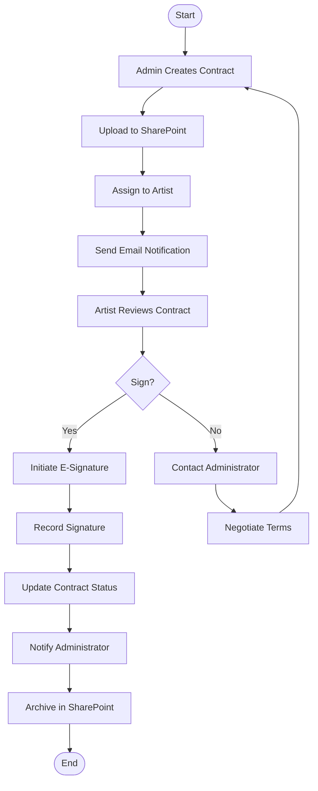
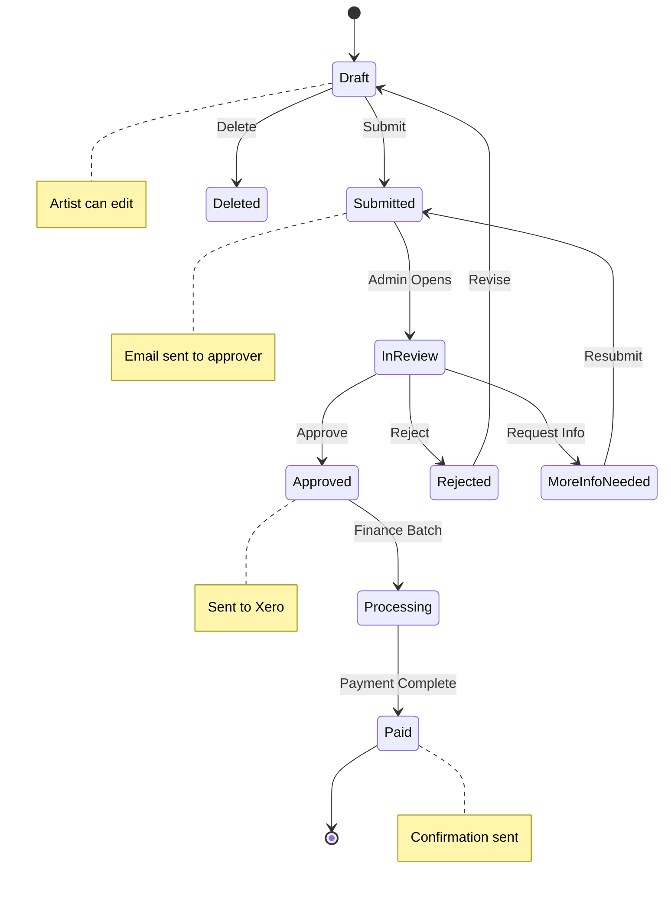

# Business Logic & Rules: BIG Live Portal

## Executive Summary

BIG Live Portal operates within the unique ecosystem of performing arts organizations, where artists work as independent contractors across multiple productions. The platform's business rules are designed to streamline administrative workflows while respecting the complex relationships between artists, administrators, finance teams, and production managers. Key business processes include contract lifecycle management, expense reimbursement workflows, schedule distribution, and artist communications. All rules adhere to contractor regulations, union requirements, data privacy laws, and organizational budget constraints while prioritizing transparency for artists and efficiency for administrators.

## Business Domain Model

### Core Entities
```
┌─────────────────┐         ┌─────────────────┐         ┌─────────────────┐
│      Artist     │ 1     * │    Contract     │ *     1 │   Production    │
│─────────────────│─────────│─────────────────│─────────│─────────────────│
│ - id           │         │ - id            │         │ - id            │
│ - email        │         │ - artist_id     │         │ - name          │
│ - first_name   │         │ - production_id │         │ - company_id    │
│ - last_name    │         │ - amount        │         │ - start_date    │
│ - tax_id       │         │ - status        │         │ - end_date      │
│ - status       │         │ - start_date    │         │ - is_active     │
└─────────────────┘         │ - end_date      │         └─────────────────┘
        │                   └─────────────────┘                 │
        │ 1                         │                           │
        │                           │                           │
        ▼ *                         ▼                           ▼ *
┌─────────────────┐         ┌─────────────────┐         ┌─────────────────┐
│     Expense     │         │    Signature    │         │    Schedule     │
│─────────────────│         │─────────────────│         │─────────────────│
│ - id           │         │ - contract_id   │         │ - id            │
│ - artist_id    │         │ - signed_at     │         │ - production_id │
│ - amount       │         │ - signature_id  │         │ - type          │
│ - status       │         │ - ip_address    │         │ - start_time    │
│ - expense_date │         └─────────────────┘         │ - location      │
└─────────────────┘                                     └─────────────────┘
        │                                                       │
        │                                                       │
        ▼ *                                                     ▼ *
┌─────────────────┐                                     ┌─────────────────┐
│     Receipt     │                                     │ScheduleAssignment│
│─────────────────│                                     │─────────────────│
│ - expense_id   │                                     │ - schedule_id   │
│ - file_url     │                                     │ - artist_id     │
│ - ocr_data     │                                     │ - confirmed     │
└─────────────────┘                                     └─────────────────┘
```

### Entity Relationships
| Relationship | Type | Rules |
|--------------|------|-------|
| Artist → Contract | 1:N | Artist can have multiple contracts across productions |
| Artist → Expense | 1:N | Artist submits expenses for reimbursement |
| Contract → Production | N:1 | Each contract belongs to one production |
| Production → Schedule | 1:N | Production has multiple scheduled events |
| Schedule → Artist | N:N | Artists assigned to specific events |
| Expense → Receipt | 1:N | Multiple receipts per expense claim |
| Company → Production | 1:N | Company runs multiple productions |
| Company → Artist | N:N | Artists work for multiple companies |

## Core Business Processes

### 1. Contract Management Process

#### Process Flow


#### Business Rules

##### BR001: Contract Creation Validation
```yaml
Rule: Valid Contract Requirements
Conditions:
  - production_id must exist and be active
  - artist must have completed profile (tax_id required)
  - start_date must be >= today
  - end_date must be > start_date
  - amount must be > 0
Actions:
  Success:
    - Generate unique contract ID
    - Set status to 'draft'
    - Create SharePoint metadata
  Failure:
    - Return specific validation errors
    - Log attempt for audit
Priority: Critical
Category: Validation
```

##### BR002: Contract Assignment Rules
```javascript
Rule: Artist Contract Assignment
Logic: |
  function canAssignContract(artist, contract) {
    // Artist must be active
    if (artist.status !== 'active') {
      return { allowed: false, reason: 'Artist account is not active' };
    }
    
    // Check for conflicting contracts
    const conflicts = await checkScheduleConflicts(
      artist.id, 
      contract.start_date, 
      contract.end_date
    );
    
    if (conflicts.length > 0) {
      return { 
        allowed: true, 
        warning: 'Artist has potential scheduling conflicts',
        conflicts: conflicts
      };
    }
    
    // Check union rules if applicable
    if (contract.union_contract && !artist.union_member) {
      return { allowed: false, reason: 'Union contract requires union membership' };
    }
    
    return { allowed: true };
  }
  
Exceptions:
  - Emergency replacements: Override with admin approval
  - Guest artists: Relaxed validation for one-time performers
```

##### BR003: E-Signature Workflow
```yaml
Rule: Electronic Signature Process
Trigger: Artist clicks "Sign Contract"
Process:
  1. Verify artist identity (logged-in session)
  2. Record consent to sign electronically
  3. Redirect to e-signature provider (Adobe Sign/DocuSign)
  4. Capture signature completion webhook
  5. Update contract status to 'active'
  6. Store signature reference
  
Validations:
  - Session must be active (not expired)
  - Contract must be in 'pending_signature' status
  - Artist must be the assigned party
  - Signature must be completed within 30 days
  
Audit Requirements:
  - Log IP address
  - Record timestamp
  - Store signature ID from provider
  - Maintain audit trail for 7 years
```

### 2. Expense Reimbursement Process

#### Pricing Rules Engine
```javascript
// Expense processing pipeline
const expenseProcessingPipeline = [
  { name: 'Receipt Validation', rule: 'BR010' },
  { name: 'Category Validation', rule: 'BR011' },
  { name: 'Amount Limits', rule: 'BR012' },
  { name: 'Duplicate Detection', rule: 'BR013' },
  { name: 'Production Association', rule: 'BR014' },
  { name: 'Approval Routing', rule: 'BR015' }
];

// Execute pipeline
async function processExpense(expense, artist) {
  let context = {
    expense,
    artist,
    receipts: [],
    validations: [],
    approvals_required: [],
    status: 'draft'
  };
  
  for (const step of expenseProcessingPipeline) {
    context = await executeRule(step.rule, context);
    if (context.status === 'rejected') break;
  }
  
  return context;
}
```

#### Expense Rules

##### BR010: Receipt Validation
```yaml
Rule: Valid Receipt Requirements
Validations:
  - File format: JPEG, PNG, PDF only
  - File size: Maximum 50MB per file
  - Image quality: Readable text and amounts
  - Date visible: Must show transaction date
  - Vendor visible: Merchant name required
  - Amount visible: Total amount clearly shown
  
OCR Processing:
  - Extract date, amount, vendor via Hubdoc
  - Confidence threshold: 80% for auto-population
  - Manual review if confidence < 80%
  
Constraints:
  - Receipt date cannot be > 90 days old
  - Receipt date cannot be future dated
  - Amount must be > $0
```

##### BR011: Expense Category Rules
```yaml
Rule: Expense Categorization
Categories:
  - Transportation:
      - Includes: taxi, rideshare, public transit, mileage
      - Requires: origin/destination for mileage
  - Meals:
      - Includes: restaurant, catering
      - Limit: $75/day without approval
  - Accommodation:
      - Includes: hotel, Airbnb
      - Requires: production approval for overnight stays
  - Supplies:
      - Includes: costume pieces, makeup, props
      - Limit: $200 without pre-approval
  - Professional Services:
      - Includes: coaching, training, healthcare
      - Requires: prior authorization
  - Other:
      - Requires: detailed description
      - Manual review required

Auto-categorization:
  - Use vendor name matching
  - Apply ML model based on description
  - Default to 'Other' if uncertain
```

##### BR012: Expense Approval Limits
```yaml
Rule: Approval Authority Matrix
Limits:
  Automatic Approval:
    - Amount: < $100
    - Categories: Transportation, Meals
    - Conditions: Within policy guidelines
    
  Admin Approval Required:
    - Amount: $100 - $500
    - Timeline: 48 hours SLA
    
  Finance Approval Required:
    - Amount: $500 - $1,000
    - Timeline: 72 hours SLA
    
  Director Approval Required:
    - Amount: > $1,000
    - Timeline: 5 business days SLA
    
Special Cases:
  - International expenses: Always require finance review
  - Alcohol: Requires production manager approval
  - Group expenses: Split equally among participants
```

### 3. Schedule Management Process

#### Schedule Distribution Workflow
```yaml
Workflow: Schedule Updates
Triggers:
  - New event created
  - Event time changed
  - Event location changed
  - Event cancelled

States:
  - Draft (visible to admins only)
  - Published (visible to assigned artists)
  - Updated (change notification sent)
  - Cancelled (marked with strikethrough)

Notification Rules:
  New Event:
    - Email: Immediately to assigned artists
    - SMS: If event within 48 hours
    - Dashboard: Update in real-time
    
  Time Change:
    - Email: Immediately with old/new times
    - SMS: Always, regardless of timeline
    - Confirmation: Request acknowledgment
    
  Cancellation:
    - Email: Immediately with reason
    - SMS: Always
    - Calendar: Send cancellation update

Escalation:
  - No acknowledgment in 4 hours: Resend
  - No acknowledgment in 8 hours: Call artist
  - Document all communication attempts
```

### 4. Artist Communication Workflow

#### Communication Preference Management
```yaml
Rule: Artist Notification Preferences
Channels:
  Email:
    - Default: Always enabled
    - Types: Contracts, expenses, schedules, announcements
    
  SMS:
    - Default: Opt-in required
    - Types: Urgent schedule changes only
    - Validation: Valid mobile number required
    
  In-App:
    - Default: Always enabled
    - Types: All notifications
    - Retention: 30 days

Frequency Controls:
  - Digest option: Daily summary instead of instant
  - Quiet hours: No non-urgent between 10 PM - 8 AM
  - Vacation mode: Hold non-urgent until return

Compliance:
  - CAN-SPAM: Unsubscribe link in all emails
  - TCPA: SMS opt-in documentation required
  - GDPR: Consent tracking and withdrawal option
```

## Validation Rules

### Data Validation Rules

#### VR001: Email Validation
```javascript
Rule: Valid Email Format
Pattern: /^[a-zA-Z0-9._%+-]+@[a-zA-Z0-9.-]+\.[a-zA-Z]{2,}$/
Additional Checks:
  - Not in organizational domain blacklist
  - Not a temporary email service
  - Has valid MX record (async check)
  - Unique in system (for artist accounts)
  
Special Cases:
  - Allow '+' addressing (user+tag@domain.com)
  - Case-insensitive comparison
  - Trim whitespace before validation
  
Error Messages:
  - Invalid format: "Please enter a valid email address"
  - Duplicate: "An account with this email already exists"
  - Blacklisted: "Please use a permanent email address"
```

#### VR002: Tax ID Validation
```javascript
Rule: Valid Tax Identifier
Types:
  - SSN: /^\d{3}-?\d{2}-?\d{4}$/
  - EIN: /^\d{2}-?\d{7}$/
  - ITIN: /^9\d{2}-?\d{2}-?\d{4}$/
  
Processing:
  - Strip all non-numeric characters
  - Validate format based on type
  - Encrypt immediately after validation
  - Never display full number (show last 4 only)
  
Security:
  - Encrypt at rest using AES-256
  - Limit access to finance role only
  - Audit all access attempts
  - PCI-compliant storage practices
```

#### VR003: Financial Amount Validation
```javascript
Rule: Valid Currency Amounts
Format: /^\d+\.?\d{0,2}$/
Constraints:
  - Minimum: $0.01
  - Maximum: $999,999.99
  - Precision: 2 decimal places
  - No negative amounts
  
Currency Support:
  - Default: USD
  - Supported: CAD, EUR, GBP
  - Display: Include currency symbol
  - Storage: Store as cents/pence to avoid float issues
```

### Business Constraint Rules

#### BC001: Contractor Classification
```yaml
Rule: Independent Contractor Compliance
Requirements:
  - No set working hours enforcement
  - No mandatory meeting attendance
  - Artist provides own tools/supplies
  - Payment per project, not hourly
  - No employee benefits offered
  
Validations:
  - Contract must specify project scope
  - Cannot require exclusive engagement
  - Must allow artist to work elsewhere
  - Clear start and end dates required
  
Documentation:
  - Form 1099 for payments > $600/year
  - Maintain contractor agreements
  - Track all payments by tax year
```

#### BC002: Union Regulations
```yaml
Rule: Union Contract Compliance
Union Types:
  - Actors' Equity Association (AEA)
  - American Guild of Musical Artists (AGMA)
  - Screen Actors Guild (SAG-AFTRA)
  
Requirements:
  - Minimum rates by union agreement
  - Mandatory breaks and turnaround times
  - Health and pension contributions
  - Working condition standards
  
Validations:
  - Artist union status verification
  - Rate meets or exceeds union minimum
  - Schedule complies with work rules
  - Proper categorization of work type
  
Reporting:
  - Weekly hours summary
  - Pension/health contribution reports
  - Union dues documentation
```

## Calculation Formulas

### Financial Calculations

#### FC001: Per Diem Calculation
```javascript
Function: calculatePerDiem(artist, dates, location)
Formula: |
  const baseDailyRate = getLocationRate(location);
  const travelDays = dates.filter(d => d.type === 'travel').length;
  const workDays = dates.filter(d => d.type === 'work').length;
  
  const travelPerDiem = travelDays * baseDailyRate * 0.75;
  const workPerDiem = workDays * baseDailyRate;
  
  const total = travelPerDiem + workPerDiem;
  
  // Apply union rules if applicable
  if (artist.union_member) {
    const unionMinimum = getUnionPerDiem(artist.union, location);
    return Math.max(total, unionMinimum);
  }
  
  return total;
  
Rates by Location:
  - Major cities (NYC, LA, Chicago): $75/day
  - Secondary cities: $60/day
  - Rural locations: $45/day
  - International: By government tables
```

#### FC002: Expense Reimbursement Timeline
```yaml
Function: calculateReimbursementDate(expense)
Process:
  1. Submission date = expense.submitted_at
  2. Approval deadline = submission + approval_SLA
  3. Processing time = 3 business days after approval
  4. Payment date = next payment run after processing
  
Payment Runs:
  - Weekly: Every Friday for amounts < $500
  - Bi-weekly: 1st and 15th for amounts >= $500
  
Business Days Calculation:
  - Exclude weekends
  - Exclude company holidays
  - Exclude production dark days
  
Communication:
  - Send estimated date on submission
  - Update if delayed
  - Confirm when payment processed
```

### Business Metrics Calculations

#### BM001: Artist Engagement Score
```sql
Function: calculateArtistEngagement(artistId)
Query: |
  WITH engagement_metrics AS (
    SELECT 
      -- Contract engagement
      COUNT(DISTINCT c.id) as total_contracts,
      AVG(DATEDIFF(day, c.created_at, c.signed_at)) as avg_signing_time,
      
      -- Expense engagement  
      COUNT(DISTINCT e.id) as total_expenses,
      AVG(e.amount) as avg_expense_amount,
      
      -- Schedule engagement
      COUNT(DISTINCT sa.schedule_id) as events_assigned,
      SUM(CASE WHEN sa.confirmed THEN 1 ELSE 0 END) as events_confirmed,
      
      -- Platform engagement
      COUNT(DISTINCT DATE(al.login_time)) as days_active,
      MAX(al.login_time) as last_login
      
    FROM artists a
    LEFT JOIN contracts c ON a.id = c.artist_id
    LEFT JOIN expenses e ON a.id = e.artist_id
    LEFT JOIN schedule_assignments sa ON a.id = sa.artist_id
    LEFT JOIN activity_logs al ON a.id = al.artist_id
    WHERE a.id = :artistId
      AND al.login_time >= DATEADD(day, -90, GETDATE())
  )
  SELECT 
    (days_active * 0.3 +
     CASE WHEN avg_signing_time < 2 THEN 0.3 ELSE 0.1 END +
     CASE WHEN events_confirmed > events_assigned * 0.8 THEN 0.2 ELSE 0 END +
     CASE WHEN last_login > DATEADD(day, -7, GETDATE()) THEN 0.2 ELSE 0 END
    ) * 100 as engagement_score
  FROM engagement_metrics
```

## State Machines

### Contract State Machine
```yaml
States:
  draft:
    description: Contract being prepared by admin
    allowed_transitions: [pending_signature, cancelled]
    permissions: [admin_edit, admin_delete]
    
  pending_signature:
    description: Awaiting artist signature
    allowed_transitions: [active, expired, cancelled]
    timeout: 30 days → expired
    permissions: [artist_view, artist_sign, admin_view]
    
  active:
    description: Signed and in effect
    allowed_transitions: [completed, terminated]
    permissions: [artist_view, admin_view]
    
  completed:
    description: Contract end date reached
    allowed_transitions: [archived]
    auto_transition: end_date reached → completed
    permissions: [artist_view, admin_view]
    
  expired:
    description: Signature period expired
    allowed_transitions: [pending_signature, cancelled]
    permissions: [admin_view, admin_renew]
    
  terminated:
    description: Contract ended early
    allowed_transitions: [archived]
    permissions: [admin_view]
    requires: termination_reason
    
  cancelled:
    description: Contract cancelled before signing
    allowed_transitions: []
    permissions: [admin_view]
    
  archived:
    description: Retained for records
    allowed_transitions: []
    retention: 7 years
    permissions: [admin_view, auditor_view]

Transition Rules:
  draft → pending_signature:
    conditions:
      - All required fields completed
      - Document uploaded to SharePoint
      - Artist assigned
    actions:
      - Send notification email to artist
      - Start 30-day timer
      - Log state change
      
  pending_signature → active:
    conditions:
      - Valid e-signature received
      - Within 30-day window
    actions:
      - Store signature reference
      - Update SharePoint metadata
      - Notify administrator
      - Calculate payment schedule
```

### Expense State Machine


## Event-Driven Rules

### Event Triggers

#### ET001: New Artist Onboarding
```yaml
Event: Artist Account Created
Trigger: 
  condition: user.role === 'artist' && user.created_at === now()
Actions:
  Immediate:
    - Send welcome email with login instructions
    - Create artist profile with default settings
    - Add to new artist dashboard segment
    
  After 1 hour:
    - Check if profile completed
    - Send reminder if incomplete
    
  After 24 hours:
    - Check for first login
    - Alert admin if not accessed
    
  After 7 days:
    - Send tips email if active
    - Send re-engagement if inactive
```

#### ET002: Contract Expiration Warning
```yaml
Event: Contract Approaching End Date
Trigger: 
  condition: contract.end_date - 30 days === today()
  check_frequency: Daily at 9 AM
Actions:
  - Notify administrator of upcoming expiration
  - Create task for renewal discussion
  - Generate contract performance summary
  - Check for upcoming productions with same artist
  
Additional Triggers:
  - 14 days before: Second notification
  - 7 days before: Mark as urgent
  - Day of expiration: Final notice
  - Day after: Auto-transition to completed
```

### Time-Based Rules

#### TB001: Payment Run Processing
```yaml
Rule: Automated Payment Processing
Schedule: 
  Regular Run: Every Friday at 2 PM
  Month-End Run: Last business day at 2 PM
  
Process: |
  FOR EACH expense WHERE status = 'approved' AND processed = false:
    - Group by artist_id
    - Calculate total per artist
    - Generate payment file for Xero
    - Create remittance advice
    
  FOR EACH payment IN payment_file:
    - Submit to Xero API
    - IF successful:
        - Update expense.status = 'processing'
        - Send payment notification
    - ELSE:
        - Flag for manual review
        - Notify finance team
        
  FOR EACH processed_payment WHERE confirmed:
    - Update expense.status = 'paid'
    - Record payment reference
    - Update artist payment history
    
Validation:
  - Minimum payment amount: $25
  - Maximum per run: $100,000
  - Require two-factor auth for amounts > $10,000
```

#### TB002: Schedule Reminder System
```yaml
Rule: Event Reminder Notifications
Schedule: 
  Daily Check: 6 AM local time
  
Process:
  24 Hour Reminder:
    - Find events starting tomorrow
    - Send email with event details
    - Include location and call time
    - Add preparation checklist
    
  2 Hour Reminder:
    - Find events starting in 2 hours
    - Send SMS if opted in
    - Include traffic conditions
    - Urgent flag in app
    
  Post-Event:
    - 1 hour after end time
    - Prompt for expense submissions
    - Reminder about per diem claims
    
Exceptions:
  - Dark days: No reminders
  - Cancelled events: Send cancellation notice instead
  - Holiday periods: Adjusted timing
```

## Integration Rules

### External System Rules

#### IR001: SharePoint Document Management
```yaml
Rule: SharePoint Integration Protocol
Connection:
  - Authentication: OAuth 2.0 with refresh
  - Timeout: 30 seconds
  - Retry: 3 attempts with exponential backoff
  
Folder Structure:
  /Contracts
    /{Year}
      /{Production}
        /{Artist_LastName_FirstName}
          - Contract_v{version}.pdf
          - Amendments/
          
Metadata:
  Required:
    - Title: "Contract - {Artist Name} - {Production}"
    - Artist_ID: {UUID}
    - Production_ID: {UUID}
    - Contract_Status: {active|completed|archived}
    - Start_Date: {ISO date}
    - End_Date: {ISO date}
    
Permissions:
  - Artists: Read own folder only
  - Admins: Read/Write all
  - Finance: Read all contracts
  - Auditors: Read archived only
  
Error Handling:
  - Connection failure: Queue for retry
  - Permission denied: Alert IT admin
  - Storage full: Alert operations
```

#### IR002: Xero Accounting Integration
```yaml
Rule: Xero Expense Processing
API Configuration:
  - Environment: Production
  - Authentication: OAuth 2.0
  - Rate Limit: 60 calls/minute
  
Expense Mapping:
  Portal → Xero:
    - expense.amount → Bill.Total
    - expense.description → Bill.Reference
    - expense.category → Bill.Account
    - artist.name → Bill.Contact
    - expense.date → Bill.Date
    
Account Codes:
  - Transportation: 6110
  - Meals: 6120
  - Accommodation: 6130
  - Supplies: 6140
  - Other: 6190
  
Processing Rules:
  - Create as draft bills initially
  - Attach receipt images
  - Use artist as contact
  - Reference portal expense ID
  
Error Recovery:
  - Duplicate detection: Check reference
  - Contact not found: Create new
  - Invalid account: Use default
  - Over rate limit: Queue and retry
```

## Reporting Rules

### Aggregation Rules

#### RR001: Financial Reporting
```yaml
Rule: Financial Data Aggregation
Timing:
  - Real-time: Dashboard metrics
  - Daily: Expense summaries
  - Weekly: Payment reports
  - Monthly: Full financial reports
  - Annually: 1099 preparation
  
Groupings:
  By Production:
    - Total contracts value
    - Total expenses paid
    - Average per artist
    - Budget vs actual
    
  By Artist:
    - YTD payments
    - Expense history
    - Contract history
    - Tax reporting data
    
  By Category:
    - Expense breakdown
    - Trending analysis
    - Policy compliance
    - Approval metrics
    
Calculations:
  - Exclude cancelled contracts
  - Include only paid expenses
  - Use payment date for period
  - Convert foreign currency at payment rate
```

### Data Quality Rules

#### DQ001: Profile Completeness
```yaml
Rule: Ensure Artist Profile Quality
Required Fields:
  Minimum (Can Login):
    - Email: Valid format
    - First Name: At least 2 characters
    - Last Name: At least 2 characters
    
  For Contracts:
    - Tax ID: Valid format
    - Phone: Valid number
    - Address: Complete mailing address
    
  For Payments:
    - Tax ID: Verified
    - Banking Details: If direct deposit
    - W-9 Form: On file
    
Enforcement:
  - Soft block: Warning on incomplete
  - Hard block: Cannot sign contracts without tax ID
  - Notifications: Remind to complete profile
  - Admin alerts: List of incomplete profiles
  
Quality Metrics:
  - Track completion percentage
  - Days to complete profile
  - Fields most often missing
```

## Authorization Rules

### Access Control Rules

#### AC001: Role-Based Permissions
```yaml
Rule: Define System Roles and Permissions
Roles:
  Artist:
    - View: Own contracts, expenses, schedules
    - Create: Expense claims, profile updates
    - Edit: Own profile, draft expenses
    - Delete: Draft expenses only
    - Cannot: Access other artist data
    
  Administrator:
    - View: All data except tax IDs
    - Create: Contracts, schedules, user accounts
    - Edit: All except financial data
    - Delete: Drafts and cancelled items
    - Cannot: Approve own expenses
    
  Finance:
    - View: All financial data including tax IDs
    - Create: Payment batches
    - Edit: Expense approvals
    - Delete: None
    - Cannot: Create contracts
    
  Production Manager:
    - View: Schedules, artist availability
    - Create: Schedule events
    - Edit: Schedule details
    - Delete: Draft schedules
    - Cannot: View financial data
    
  Auditor:
    - View: All historical data
    - Create: None
    - Edit: None
    - Delete: None
    - Special: Access audit logs
```

#### AC002: Data Access Boundaries
```javascript
Rule: Multi-Company Data Isolation
Logic: |
  function canAccessData(user, resource) {
    // System admins can access all
    if (user.role === 'system_admin') return true;
    
    // Artists can only see their own data
    if (user.role === 'artist') {
      return resource.artist_id === user.id;
    }
    
    // Company-based isolation
    if (user.company_id !== resource.company_id) {
      return false;
    }
    
    // Role-specific access within company
    switch(user.role) {
      case 'admin':
        return true;
      case 'finance':
        return resource.type === 'financial';
      case 'production_manager':
        return resource.type === 'schedule';
      default:
        return false;
    }
  }
```

## Exception Handling

### Business Exception Rules

#### EH001: Contract Signature Failures
```yaml
Exception Types:
  SignatureTimeout:
    - Trigger: 30 days elapsed without signature
    - Actions:
      - Transition contract to 'expired'
      - Notify administrator
      - Offer to resend or cancel
      - Log reason if known
    
  SignatureRejected:
    - Trigger: Artist explicitly declines
    - Actions:
      - Transition to 'cancelled'
      - Require reason from artist
      - Notify admin immediately
      - Flag for follow-up
    
  TechnicalFailure:
    - Trigger: E-signature provider error
    - Actions:
      - Retry 3 times over 24 hours
      - Offer alternative signing method
      - Allow manual upload if needed
      - Maintain pending status
```

#### EH002: Payment Processing Exceptions
```yaml
Exception Types:
  InsufficientBudget:
    - Check remaining budget before approval
    - Escalate to finance director
    - Allow partial payment option
    - Queue for next budget period
    
  XeroSyncFailure:
    - Retry with exponential backoff
    - Queue in local database
    - Send manual payment file
    - Daily reconciliation report
    
  DuplicateExpense:
    - Compare amount, date, vendor
    - Flag for manual review
    - Show potential duplicates
    - Require explanation if approved
```

## Rule Testing Scenarios

### Test Cases

#### TC001: Multi-Production Artist Workflow
```yaml
Scenario: Artist Working Multiple Productions
Given:
  - Artist contracted for 3 overlapping productions
  - Different rates per production
  - Shared expenses across productions
  
When: Artist submits mixed expenses
Then:
  - System prompts for production allocation
  - Calculates pro-rata split if needed
  - Routes to appropriate approvers
  - Maintains separate expense limits
  - Generates accurate tax documents
```

#### TC002: Union vs Non-Union Contract Rules
```yaml
Scenario: Mixed Union Status
Given:
  - Production has both union and non-union positions
  - Artist is union member
  - Contract offered is non-union rate
  
When: Contract assigned to artist
Then:
  - System detects union membership
  - Warns about rate discrepancy
  - Requires override reason
  - Documents decision
  - Notifies union compliance officer
```

## Rule Maintenance

### Rule Lifecycle
```yaml
States:
  - Draft: Under development and testing
  - Testing: Active in staging environment
  - Active: In production use
  - Deprecated: Scheduled for removal
  - Archived: Historical reference only

Change Process:
  1. Propose rule change with business case
  2. Impact analysis on related rules
  3. Create test scenarios
  4. Deploy to staging environment
  5. User acceptance testing
  6. Production deployment with monitoring
  7. Post-implementation review

Version Control:
  - Semantic versioning for rules
  - Changelog maintenance
  - Rollback procedures
  - A/B testing capability
```

### Rule Documentation
```yaml
Template:
  Rule ID: BR[Category][Number]
  Name: Descriptive business name
  Description: What the rule accomplishes
  Category: Business domain
  Priority: Execution order
  Version: Current version number
  Author: Business owner
  Created: Initial creation date
  Modified: Last update date
  Dependencies: Related rules
  Test Cases: Link to test scenarios
  Performance: Expected execution time
  Compliance: Regulatory requirements
```

## Business Intelligence Rules

### KPI Calculations

#### KPI001: Administrative Efficiency
```sql
Metric: Time to Contract Signature
Formula: |
  SELECT 
    AVG(DATEDIFF(hour, c.created_at, c.signed_at)) as avg_hours_to_sign,
    PERCENTILE_CONT(0.5) WITHIN GROUP (ORDER BY 
      DATEDIFF(hour, c.created_at, c.signed_at)) as median_hours,
    COUNT(CASE WHEN DATEDIFF(day, c.created_at, c.signed_at) <= 2 
      THEN 1 END) * 100.0 / COUNT(*) as within_48hr_pct
  FROM contracts c
  WHERE c.status = 'active'
    AND c.created_at >= DATEADD(day, -30, GETDATE())
    
Target: 80% signed within 48 hours
Alert: < 60% meeting target
```

#### KPI002: Expense Processing Speed
```sql
Metric: Expense Reimbursement Cycle
Formula: |
  WITH expense_timing AS (
    SELECT 
      e.id,
      e.submitted_at,
      e.approved_at,
      e.paid_at,
      DATEDIFF(day, e.submitted_at, e.paid_at) as total_days,
      DATEDIFF(day, e.submitted_at, e.approved_at) as approval_days,
      DATEDIFF(day, e.approved_at, e.paid_at) as payment_days
    FROM expenses e
    WHERE e.status = 'paid'
      AND e.submitted_at >= DATEADD(day, -90, GETDATE())
  )
  SELECT 
    AVG(total_days) as avg_reimbursement_days,
    AVG(approval_days) as avg_approval_days,
    AVG(payment_days) as avg_payment_days,
    COUNT(CASE WHEN total_days <= 7 THEN 1 END) * 100.0 / 
      COUNT(*) as within_week_pct
  FROM expense_timing
  
Target: Average < 7 days, 90% within 2 weeks
Alert: Average > 14 days
```

### Predictive Rules

#### PR001: Schedule Conflict Detection
```python
Rule: Identify Potential Scheduling Conflicts
Model: |
  def predict_conflicts(artist_id, proposed_schedule):
    # Get artist's historical patterns
    history = get_artist_schedule_history(artist_id)
    
    features = {
      'avg_daily_hours': history.avg_daily_hours,
      'max_consecutive_days': history.max_consecutive_days,
      'preferred_start_time': history.preferred_start_time,
      'travel_time_needed': calculate_travel_time(locations),
      'overlapping_commitments': check_other_companies(artist_id)
    }
    
    conflict_probability = ml_model.predict_proba(features)[0][1]
    
    if conflict_probability > 0.7:
      return {
        'high_risk': True,
        'reasons': identify_conflict_reasons(features),
        'suggestions': generate_alternatives(proposed_schedule)
      }
    
    return {'high_risk': False, 'probability': conflict_probability}
```

## Compliance Rules

### Regulatory Compliance

#### RC001: Data Privacy Compliance
```yaml
Rule: GDPR and CCPA Compliance
Requirements:
  Data Collection:
    - Explicit consent for all data collection
    - Clear purpose for each data field
    - Opt-in for non-essential processing
    - Age verification (must be 18+)
    
  Data Rights:
    - Access: Export all data within 30 days
    - Rectification: Edit profile directly
    - Erasure: Delete account option
    - Portability: Standard JSON export
    - Objection: Opt-out of processing
    
  Implementation:
    - Consent checkboxes on registration
    - Privacy settings in profile
    - Data export API endpoint
    - Deletion workflow with confirmation
    - Audit log of all data access
    
  Retention:
    - Active data: While account active
    - Financial records: 7 years (legal requirement)
    - Contracts: 7 years after completion
    - System logs: 90 days
    - Deleted data: 30 day recovery period
```

#### RC002: Financial Compliance
```yaml
Rule: Tax Reporting Requirements
US Requirements:
  - Form 1099-NEC for payments > $600/year
  - Backup withholding if missing TIN
  - State reporting where required
  - Electronic filing for 250+ forms
  
Implementation:
  - Track cumulative payments by tax year
  - Validate TIN format and checksum
  - Generate 1099s by January 31
  - Provide artist copy electronically
  - Submit to IRS by deadline
  
Record Keeping:
  - All payment records: 7 years
  - Tax forms: 7 years
  - Audit trails: 7 years
  - Support documentation: 3 years
```

## Clarification Requests or Feedback

1. **Union-Specific Rules:** While general union compliance is addressed, specific rules for each union (AEA, AGMA, SAG-AFTRA) would help create more detailed validation logic, especially around working hours, break requirements, and minimum rates.

2. **Multi-Currency Handling:** The system mentions support for CAD, EUR, and GBP, but more detail on exchange rate sources, update frequency, and financial reporting in multiple currencies would improve the accuracy of financial rules.

3. **Budget Integration:** Understanding how production budgets are tracked and enforced would enable more sophisticated approval workflows and spending alerts.

4. **Seasonal Variations:** More information about typical performance seasons and dark periods would help optimize payment runs, notification schedules, and system maintenance windows.

5. **Cross-Production Rules:** Clarification on how expenses shared across multiple productions should be allocated and approved would improve the expense management workflow.

6. **Emergency Procedures:** Details on emergency contact procedures and critical notification paths would help design escalation rules for urgent situations.

7. **Audit Requirements:** Specific audit trail requirements from funding bodies or governmental agencies would ensure compliance reporting meets all stakeholder needs.

8. **Integration Priorities:** Understanding which integrations (SharePoint, Xero, e-signature) are most critical would help prioritize error handling and recovery procedures.