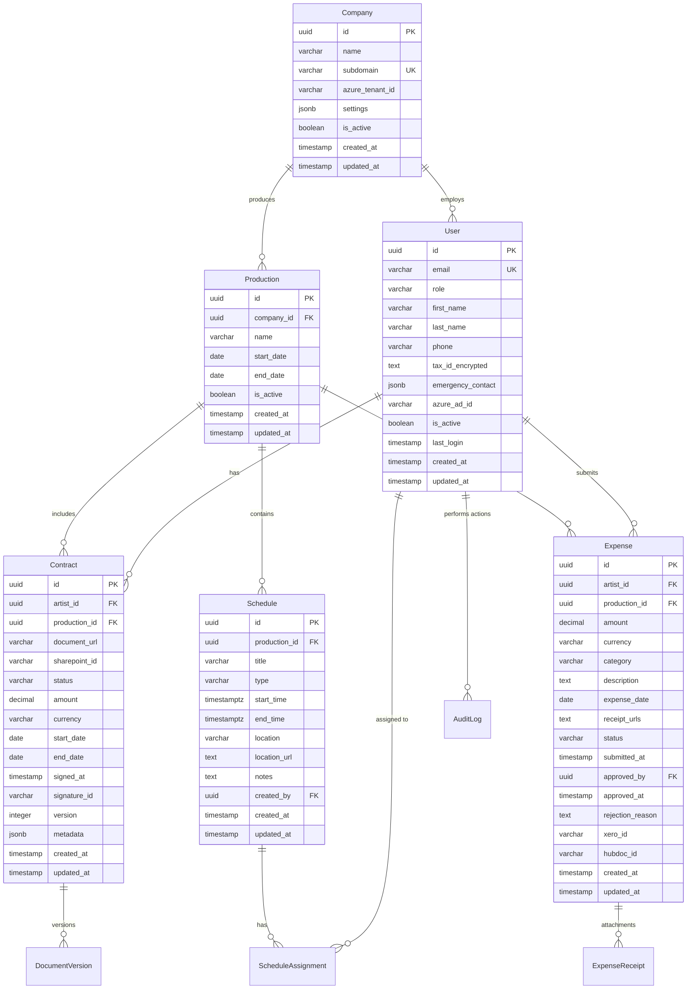

# Data Model & Database Design: BIG Live Portal

## Overview

The BIG Live Portal data model is designed to support a multi-tenant SaaS platform for performing arts organizations, focusing on efficient management of artist contractors, their contracts, expenses, and schedules. The model follows a relational database design using PostgreSQL 15+, optimized for the unique workflows of performing arts organizations where artists work as independent contractors across multiple productions.

The database architecture prioritizes data integrity, performance at scale, and compliance with financial regulations while maintaining flexibility for evolving business requirements. Key design decisions include:

- **Multi-tenant architecture** with company-level data isolation
- **Comprehensive audit trails** for regulatory compliance (7-year retention)
- **Optimized indexing** for common query patterns
- **JSONB fields** for flexible metadata storage
- **Encryption at rest** for sensitive PII data
- **Soft delete patterns** for data recovery and historical tracking

## Database Architecture

### Technology Stack
- **Primary Database**: PostgreSQL 15+ with read replicas
- **Cache Layer**: Redis 7+ for sessions and performance caching
- **Search Engine**: PostgreSQL full-text search with GIN indexes
- **File Storage**: SharePoint API integration (documents not stored in DB)
- **Data Warehouse**: Future consideration for analytics

### Design Principles
1. **Normalization First**: Maintain 3NF with strategic denormalization for performance
2. **Data Integrity**: Comprehensive foreign key constraints and check constraints
3. **Audit Everything**: Complete audit trails for compliance and troubleshooting
4. **Performance at Scale**: Indexes optimized for 1,000+ concurrent users
5. **Security by Design**: Encryption for PII, row-level security ready
6. **Flexible Metadata**: JSONB fields for evolving requirements without schema changes

## Entity Relationship Diagram

### High-Level ERD


### Relationship Definitions
| Relationship | Type | Description | Constraints |
|--------------|------|-------------|-------------|
| Company → User | 1:N | Company employs multiple users | RESTRICT DELETE |
| Company → Production | 1:N | Company produces multiple shows | CASCADE DELETE |
| User → Contract | 1:N | Artist has multiple contracts | RESTRICT DELETE |
| User → Expense | 1:N | Artist submits expenses | RESTRICT DELETE |
| Production → Contract | 1:N | Production has multiple artist contracts | RESTRICT DELETE |
| Production → Schedule | 1:N | Production has multiple scheduled events | CASCADE DELETE |
| Schedule → ScheduleAssignment | 1:N | Event has multiple assigned artists | CASCADE DELETE |
| Contract → DocumentVersion | 1:N | Contract may have amendments | CASCADE DELETE |
| Expense → ExpenseReceipt | 1:N | Expense has receipt attachments | CASCADE DELETE |

## Detailed Schema Design

### Core Entities

#### Companies Table
```sql
CREATE TABLE companies (
    -- Primary Key
    id UUID PRIMARY KEY DEFAULT gen_random_uuid(),
    
    -- Attributes
    name VARCHAR(255) NOT NULL,
    subdomain VARCHAR(100) UNIQUE,
    sharepoint_site_url TEXT,
    azure_tenant_id VARCHAR(255),
    
    -- Configuration
    settings JSONB DEFAULT '{
        "timezone": "America/New_York",
        "fiscal_year_start": "01-01",
        "default_currency": "USD",
        "expense_categories": ["Transportation", "Meals", "Accommodation", "Supplies", "Other"],
        "approval_limits": {"automatic": 100, "admin": 500, "finance": 1000}
    }',
    
    -- Status
    is_active BOOLEAN DEFAULT true,
    subscription_tier VARCHAR(50) DEFAULT 'standard',
    subscription_expires_at TIMESTAMP WITH TIME ZONE,
    
    -- Timestamps
    created_at TIMESTAMP WITH TIME ZONE NOT NULL DEFAULT CURRENT_TIMESTAMP,
    updated_at TIMESTAMP WITH TIME ZONE NOT NULL DEFAULT CURRENT_TIMESTAMP,
    
    -- Constraints
    CONSTRAINT chk_subdomain_format CHECK (subdomain ~ '^[a-z0-9-]+$'),
    CONSTRAINT chk_subdomain_length CHECK (LENGTH(subdomain) BETWEEN 3 AND 50)
);

-- Indexes
CREATE INDEX idx_companies_active ON companies(id) WHERE is_active = true;
CREATE INDEX idx_companies_subdomain ON companies(subdomain) WHERE is_active = true;
CREATE INDEX idx_companies_subscription ON companies(subscription_expires_at) WHERE is_active = true;

-- Triggers
CREATE TRIGGER update_companies_updated_at 
    BEFORE UPDATE ON companies
    FOR EACH ROW 
    EXECUTE FUNCTION update_updated_at_column();
```

#### Users Table
```sql
CREATE TABLE users (
    -- Primary Key
    id UUID PRIMARY KEY DEFAULT gen_random_uuid(),
    
    -- Authentication
    email VARCHAR(255) UNIQUE NOT NULL,
    password_hash VARCHAR(255),
    azure_ad_id VARCHAR(255),
    
    -- Profile
    first_name VARCHAR(100) NOT NULL,
    last_name VARCHAR(100) NOT NULL,
    phone VARCHAR(20),
    role VARCHAR(50) NOT NULL DEFAULT 'artist',
    
    -- Sensitive Data (Encrypted)
    tax_id_encrypted TEXT,
    tax_id_hash VARCHAR(64), -- For duplicate detection
    bank_account_encrypted TEXT,
    
    -- Contact Information
    mailing_address JSONB,
    emergency_contact JSONB DEFAULT '{}',
    
    -- Preferences
    notification_preferences JSONB DEFAULT '{
        "email": {"contracts": true, "expenses": true, "schedules": true},
        "sms": {"urgent_only": true},
        "timezone": "America/New_York"
    }',
    
    -- Status
    is_active BOOLEAN DEFAULT true,
    email_verified BOOLEAN DEFAULT false,
    last_login TIMESTAMP WITH TIME ZONE,
    failed_login_attempts INTEGER DEFAULT 0,
    locked_until TIMESTAMP WITH TIME ZONE,
    
    -- Metadata
    union_affiliations TEXT[],
    skills_tags TEXT[],
    
    -- Timestamps
    created_at TIMESTAMP WITH TIME ZONE NOT NULL DEFAULT CURRENT_TIMESTAMP,
    updated_at TIMESTAMP WITH TIME ZONE NOT NULL DEFAULT CURRENT_TIMESTAMP,
    deleted_at TIMESTAMP WITH TIME ZONE,
    
    -- Constraints
    CONSTRAINT chk_role CHECK (role IN ('artist', 'admin', 'accountant', 'production_manager', 'system_admin')),
    CONSTRAINT chk_email_format CHECK (email ~* '^[A-Za-z0-9._%+-]+@[A-Za-z0-9.-]+\.[A-Za-z]{2,}$'),
    CONSTRAINT chk_phone_format CHECK (phone IS NULL OR phone ~ '^\+?[1-9]\d{1,14}$')
);

-- Indexes
CREATE INDEX idx_users_email ON users(LOWER(email));
CREATE INDEX idx_users_role ON users(role) WHERE is_active = true;
CREATE INDEX idx_users_company ON users(id) WHERE is_active = true AND deleted_at IS NULL;
CREATE INDEX idx_users_tax_id_hash ON users(tax_id_hash) WHERE tax_id_hash IS NOT NULL;
CREATE INDEX idx_users_union ON users USING GIN(union_affiliations);
CREATE INDEX idx_users_deleted ON users(deleted_at) WHERE deleted_at IS NOT NULL;

-- Triggers
CREATE TRIGGER update_users_updated_at 
    BEFORE UPDATE ON users
    FOR EACH ROW 
    EXECUTE FUNCTION update_updated_at_column();
```

#### Productions Table
```sql
CREATE TABLE productions (
    -- Primary Key
    id UUID PRIMARY KEY DEFAULT gen_random_uuid(),
    
    -- Foreign Keys
    company_id UUID NOT NULL REFERENCES companies(id) ON DELETE RESTRICT,
    
    -- Attributes
    name VARCHAR(255) NOT NULL,
    code VARCHAR(50), -- Short code for reference
    description TEXT,
    
    -- Schedule
    start_date DATE NOT NULL,
    end_date DATE NOT NULL,
    
    -- Budget
    budget_amount DECIMAL(15,2),
    budget_currency VARCHAR(3) DEFAULT 'USD',
    
    -- Configuration
    settings JSONB DEFAULT '{}',
    
    -- Status
    is_active BOOLEAN DEFAULT true,
    status VARCHAR(50) DEFAULT 'planning',
    
    -- Timestamps
    created_at TIMESTAMP WITH TIME ZONE NOT NULL DEFAULT CURRENT_TIMESTAMP,
    updated_at TIMESTAMP WITH TIME ZONE NOT NULL DEFAULT CURRENT_TIMESTAMP,
    archived_at TIMESTAMP WITH TIME ZONE,
    
    -- Constraints
    CONSTRAINT chk_date_range CHECK (end_date >= start_date),
    CONSTRAINT chk_status CHECK (status IN ('planning', 'active', 'completed', 'cancelled', 'archived')),
    CONSTRAINT uk_company_production_code UNIQUE (company_id, code)
);

-- Indexes
CREATE INDEX idx_productions_company ON productions(company_id);
CREATE INDEX idx_productions_active ON productions(company_id, is_active) WHERE is_active = true;
CREATE INDEX idx_productions_dates ON productions(start_date, end_date);
CREATE INDEX idx_productions_status ON productions(status) WHERE status != 'archived';

-- Triggers
CREATE TRIGGER update_productions_updated_at 
    BEFORE UPDATE ON productions
    FOR EACH ROW 
    EXECUTE FUNCTION update_updated_at_column();
```

#### Contracts Table
```sql
CREATE TABLE contracts (
    -- Primary Key
    id UUID PRIMARY KEY DEFAULT gen_random_uuid(),
    
    -- Foreign Keys
    artist_id UUID NOT NULL REFERENCES users(id) ON DELETE RESTRICT,
    production_id UUID NOT NULL REFERENCES productions(id) ON DELETE RESTRICT,
    created_by_id UUID REFERENCES users(id),
    
    -- Document Management
    document_url TEXT NOT NULL,
    sharepoint_id VARCHAR(255),
    document_hash VARCHAR(64), -- SHA-256 for integrity
    
    -- Contract Details
    contract_number VARCHAR(100),
    title VARCHAR(255),
    amount DECIMAL(15,2) NOT NULL,
    currency VARCHAR(3) DEFAULT 'USD',
    payment_schedule JSONB DEFAULT '[]', -- Array of payment milestones
    
    -- Dates
    start_date DATE NOT NULL,
    end_date DATE NOT NULL,
    
    -- Signature Management
    status VARCHAR(50) NOT NULL DEFAULT 'draft',
    sent_for_signature_at TIMESTAMP WITH TIME ZONE,
    signed_at TIMESTAMP WITH TIME ZONE,
    signature_id VARCHAR(255),
    signature_provider VARCHAR(50), -- 'docusign', 'adobe_sign', etc.
    signer_ip_address INET,
    
    -- Versioning
    version INTEGER DEFAULT 1,
    parent_contract_id UUID REFERENCES contracts(id),
    amendment_reason TEXT,
    
    -- Union Information
    is_union_contract BOOLEAN DEFAULT false,
    union_name VARCHAR(100),
    union_contract_type VARCHAR(50),
    
    -- Metadata
    metadata JSONB DEFAULT '{}',
    tags TEXT[],
    
    -- Timestamps
    created_at TIMESTAMP WITH TIME ZONE NOT NULL DEFAULT CURRENT_TIMESTAMP,
    updated_at TIMESTAMP WITH TIME ZONE NOT NULL DEFAULT CURRENT_TIMESTAMP,
    expires_at TIMESTAMP WITH TIME ZONE,
    archived_at TIMESTAMP WITH TIME ZONE,
    
    -- Constraints
    CONSTRAINT chk_amount CHECK (amount > 0),
    CONSTRAINT chk_date_range CHECK (end_date >= start_date),
    CONSTRAINT chk_status CHECK (status IN ('draft', 'pending_signature', 'active', 'completed', 'expired', 'terminated', 'cancelled', 'archived')),
    CONSTRAINT chk_signature_provider CHECK (signature_provider IN ('docusign', 'adobe_sign', 'hellosign', 'manual', NULL))
);

-- Indexes
CREATE INDEX idx_contracts_artist ON contracts(artist_id, status);
CREATE INDEX idx_contracts_production ON contracts(production_id);
CREATE INDEX idx_contracts_status ON contracts(status) WHERE status NOT IN ('archived', 'cancelled');
CREATE INDEX idx_contracts_dates ON contracts(start_date, end_date);
CREATE INDEX idx_contracts_signature_pending ON contracts(sent_for_signature_at) WHERE status = 'pending_signature';
CREATE INDEX idx_contracts_union ON contracts(union_name) WHERE is_union_contract = true;
CREATE INDEX idx_contracts_tags ON contracts USING GIN(tags);
CREATE INDEX idx_contracts_parent ON contracts(parent_contract_id) WHERE parent_contract_id IS NOT NULL;

-- Triggers
CREATE TRIGGER update_contracts_updated_at 
    BEFORE UPDATE ON contracts
    FOR EACH ROW 
    EXECUTE FUNCTION update_updated_at_column();
```

#### Expenses Table
```sql
CREATE TABLE expenses (
    -- Primary Key
    id UUID PRIMARY KEY DEFAULT gen_random_uuid(),
    
    -- Foreign Keys
    artist_id UUID NOT NULL REFERENCES users(id) ON DELETE RESTRICT,
    production_id UUID REFERENCES productions(id) ON DELETE RESTRICT,
    approved_by UUID REFERENCES users(id),
    rejected_by UUID REFERENCES users(id),
    
    -- Financial Details
    amount DECIMAL(15,2) NOT NULL,
    currency VARCHAR(3) DEFAULT 'USD',
    exchange_rate DECIMAL(10,6) DEFAULT 1.0,
    amount_in_base_currency DECIMAL(15,2) GENERATED ALWAYS AS (amount * exchange_rate) STORED,
    
    -- Expense Details
    category VARCHAR(100) NOT NULL,
    subcategory VARCHAR(100),
    description TEXT,
    expense_date DATE NOT NULL,
    merchant_name VARCHAR(255),
    
    -- Receipt Management
    receipt_urls TEXT[],
    receipt_storage_type VARCHAR(50) DEFAULT 'sharepoint',
    ocr_extracted_data JSONB,
    ocr_confidence_score DECIMAL(3,2),
    
    -- Workflow
    status VARCHAR(50) NOT NULL DEFAULT 'draft',
    submitted_at TIMESTAMP WITH TIME ZONE,
    approved_at TIMESTAMP WITH TIME ZONE,
    rejected_at TIMESTAMP WITH TIME ZONE,
    paid_at TIMESTAMP WITH TIME ZONE,
    
    -- Rejection/Notes
    rejection_reason TEXT,
    admin_notes TEXT,
    
    -- External Systems
    xero_id VARCHAR(255),
    xero_sync_status VARCHAR(50),
    xero_last_sync_at TIMESTAMP WITH TIME ZONE,
    hubdoc_id VARCHAR(255),
    payment_batch_id UUID,
    
    -- Compliance
    requires_special_approval BOOLEAN DEFAULT false,
    special_approval_reason TEXT,
    
    -- Metadata
    tags TEXT[],
    is_reimbursable BOOLEAN DEFAULT true,
    is_billable BOOLEAN DEFAULT false,
    
    -- Timestamps
    created_at TIMESTAMP WITH TIME ZONE NOT NULL DEFAULT CURRENT_TIMESTAMP,
    updated_at TIMESTAMP WITH TIME ZONE NOT NULL DEFAULT CURRENT_TIMESTAMP,
    
    -- Constraints
    CONSTRAINT chk_amount CHECK (amount > 0),
    CONSTRAINT chk_expense_date CHECK (expense_date <= CURRENT_DATE AND expense_date > CURRENT_DATE - INTERVAL '90 days'),
    CONSTRAINT chk_status CHECK (status IN ('draft', 'submitted', 'in_review', 'approved', 'rejected', 'processing', 'paid', 'cancelled')),
    CONSTRAINT chk_category CHECK (category IN ('Transportation', 'Meals', 'Accommodation', 'Supplies', 'Professional Services', 'Other'))
);

-- Indexes
CREATE INDEX idx_expenses_artist ON expenses(artist_id, status);
CREATE INDEX idx_expenses_production ON expenses(production_id) WHERE production_id IS NOT NULL;
CREATE INDEX idx_expenses_approval_queue ON expenses(status, submitted_at) WHERE status = 'submitted';
CREATE INDEX idx_expenses_payment_queue ON expenses(status, approved_at) WHERE status = 'approved';
CREATE INDEX idx_expenses_date ON expenses(expense_date DESC);
CREATE INDEX idx_expenses_category ON expenses(category);
CREATE INDEX idx_expenses_xero ON expenses(xero_id) WHERE xero_id IS NOT NULL;
CREATE INDEX idx_expenses_batch ON expenses(payment_batch_id) WHERE payment_batch_id IS NOT NULL;
CREATE INDEX idx_expenses_tags ON expenses USING GIN(tags);

-- Triggers
CREATE TRIGGER update_expenses_updated_at 
    BEFORE UPDATE ON expenses
    FOR EACH ROW 
    EXECUTE FUNCTION update_updated_at_column();
```

#### Schedules Table
```sql
CREATE TABLE schedules (
    -- Primary Key
    id UUID PRIMARY KEY DEFAULT gen_random_uuid(),
    
    -- Foreign Keys
    production_id UUID NOT NULL REFERENCES productions(id) ON DELETE CASCADE,
    created_by UUID NOT NULL REFERENCES users(id),
    
    -- Event Details
    title VARCHAR(255) NOT NULL,
    type VARCHAR(50) NOT NULL,
    status VARCHAR(50) DEFAULT 'scheduled',
    
    -- Timing (with timezone support)
    start_time TIMESTAMPTZ NOT NULL,
    end_time TIMESTAMPTZ NOT NULL,
    duration_minutes INTEGER GENERATED ALWAYS AS (
        EXTRACT(EPOCH FROM (end_time - start_time)) / 60
    ) STORED,
    
    -- Location
    location VARCHAR(255),
    location_address TEXT,
    location_url TEXT,
    location_coordinates POINT, -- PostGIS extension for future use
    virtual_meeting_url TEXT,
    
    -- Details
    description TEXT,
    notes TEXT,
    call_time_notes TEXT, -- Special instructions for arrival
    
    -- Recurrence (for repeating events)
    is_recurring BOOLEAN DEFAULT false,
    recurrence_rule TEXT, -- RRULE format
    recurrence_end_date DATE,
    parent_schedule_id UUID REFERENCES schedules(id),
    
    -- Notifications
    reminder_sent_24h BOOLEAN DEFAULT false,
    reminder_sent_2h BOOLEAN DEFAULT false,
    
    -- Metadata
    required_roles TEXT[], -- Which artist types needed
    max_participants INTEGER,
    attachments JSONB DEFAULT '[]',
    
    -- Timestamps
    created_at TIMESTAMP WITH TIME ZONE NOT NULL DEFAULT CURRENT_TIMESTAMP,
    updated_at TIMESTAMP WITH TIME ZONE NOT NULL DEFAULT CURRENT_TIMESTAMP,
    cancelled_at TIMESTAMP WITH TIME ZONE,
    cancellation_reason TEXT,
    
    -- Constraints
    CONSTRAINT chk_time_range CHECK (end_time > start_time),
    CONSTRAINT chk_type CHECK (type IN ('rehearsal', 'performance', 'meeting', 'fitting', 'photo_call', 'other')),
    CONSTRAINT chk_status CHECK (status IN ('draft', 'scheduled', 'in_progress', 'completed', 'cancelled'))
);

-- Indexes
CREATE INDEX idx_schedules_production ON schedules(production_id);
CREATE INDEX idx_schedules_time ON schedules(start_time, end_time);
CREATE INDEX idx_schedules_date ON schedules(DATE(start_time));
CREATE INDEX idx_schedules_type ON schedules(type);
CREATE INDEX idx_schedules_status ON schedules(status) WHERE status != 'cancelled';
CREATE INDEX idx_schedules_recurring ON schedules(parent_schedule_id) WHERE parent_schedule_id IS NOT NULL;
CREATE INDEX idx_schedules_reminders ON schedules(start_time) WHERE status = 'scheduled' AND (reminder_sent_24h = false OR reminder_sent_2h = false);

-- Triggers
CREATE TRIGGER update_schedules_updated_at 
    BEFORE UPDATE ON schedules
    FOR EACH ROW 
    EXECUTE FUNCTION update_updated_at_column();
```

### Supporting Tables

#### Audit Log Table
```sql
CREATE TABLE audit_logs (
    -- Primary Key
    id BIGSERIAL PRIMARY KEY,
    
    -- Action Details
    table_name VARCHAR(50) NOT NULL,
    record_id UUID NOT NULL,
    action VARCHAR(20) NOT NULL,
    
    -- Change Tracking
    old_values JSONB,
    new_values JSONB,
    changed_fields TEXT[],
    
    -- User Context
    changed_by_id UUID REFERENCES users(id),
    impersonated_by_id UUID REFERENCES users(id),
    
    -- Request Context
    ip_address INET,
    user_agent TEXT,
    request_id UUID,
    session_id VARCHAR(255),
    
    -- Timestamp
    changed_at TIMESTAMP WITH TIME ZONE NOT NULL DEFAULT CURRENT_TIMESTAMP,
    
    -- Constraints
    CONSTRAINT chk_action CHECK (action IN ('INSERT', 'UPDATE', 'DELETE', 'VIEW', 'EXPORT'))
);

-- Indexes
CREATE INDEX idx_audit_logs_record ON audit_logs(table_name, record_id);
CREATE INDEX idx_audit_logs_user ON audit_logs(changed_by_id);
CREATE INDEX idx_audit_logs_timestamp ON audit_logs(changed_at DESC);
CREATE INDEX idx_audit_logs_action ON audit_logs(action);
CREATE INDEX idx_audit_logs_table_date ON audit_logs(table_name, changed_at DESC);

-- Partitioning by month for performance
CREATE TABLE audit_logs_y2024m01 PARTITION OF audit_logs
    FOR VALUES FROM ('2024-01-01') TO ('2024-02-01');
```

#### Notifications Table
```sql
CREATE TABLE notifications (
    -- Primary Key
    id UUID PRIMARY KEY DEFAULT gen_random_uuid(),
    
    -- Recipient
    user_id UUID NOT NULL REFERENCES users(id) ON DELETE CASCADE,
    
    -- Notification Details
    type VARCHAR(50) NOT NULL,
    channel VARCHAR(20) NOT NULL,
    priority VARCHAR(20) DEFAULT 'normal',
    
    -- Content
    subject VARCHAR(255),
    body TEXT NOT NULL,
    data JSONB DEFAULT '{}',
    
    -- Delivery
    status VARCHAR(20) DEFAULT 'pending',
    sent_at TIMESTAMP WITH TIME ZONE,
    delivered_at TIMESTAMP WITH TIME ZONE,
    read_at TIMESTAMP WITH TIME ZONE,
    error_message TEXT,
    retry_count INTEGER DEFAULT 0,
    
    -- Scheduling
    scheduled_for TIMESTAMP WITH TIME ZONE,
    expires_at TIMESTAMP WITH TIME ZONE,
    
    -- Timestamps
    created_at TIMESTAMP WITH TIME ZONE NOT NULL DEFAULT CURRENT_TIMESTAMP,
    
    -- Constraints
    CONSTRAINT chk_type CHECK (type IN ('contract_new', 'contract_signed', 'expense_approved', 'expense_rejected', 'schedule_change', 'announcement', 'reminder')),
    CONSTRAINT chk_channel CHECK (channel IN ('email', 'sms', 'in_app', 'push')),
    CONSTRAINT chk_priority CHECK (priority IN ('low', 'normal', 'high', 'urgent')),
    CONSTRAINT chk_status CHECK (status IN ('pending', 'sent', 'delivered', 'failed', 'cancelled'))
);

-- Indexes
CREATE INDEX idx_notifications_user ON notifications(user_id, created_at DESC);
CREATE INDEX idx_notifications_pending ON notifications(scheduled_for) WHERE status = 'pending';
CREATE INDEX idx_notifications_unread ON notifications(user_id) WHERE read_at IS NULL;
CREATE INDEX idx_notifications_type ON notifications(type, created_at DESC);
```

### Junction Tables

#### Schedule Assignments Table
```sql
CREATE TABLE schedule_assignments (
    -- Composite Primary Key
    schedule_id UUID REFERENCES schedules(id) ON DELETE CASCADE,
    artist_id UUID REFERENCES users(id) ON DELETE CASCADE,
    
    -- Assignment Details
    role VARCHAR(100),
    is_required BOOLEAN DEFAULT true,
    
    -- Confirmation
    confirmed BOOLEAN DEFAULT false,
    confirmed_at TIMESTAMP WITH TIME ZONE,
    confirmation_method VARCHAR(50),
    
    -- Attendance
    checked_in_at TIMESTAMP WITH TIME ZONE,
    checked_out_at TIMESTAMP WITH TIME ZONE,
    absence_reason VARCHAR(100),
    
    -- Notes
    notes TEXT,
    
    -- Timestamps
    created_at TIMESTAMP WITH TIME ZONE NOT NULL DEFAULT CURRENT_TIMESTAMP,
    updated_at TIMESTAMP WITH TIME ZONE NOT NULL DEFAULT CURRENT_TIMESTAMP,
    
    PRIMARY KEY (schedule_id, artist_id)
);

-- Indexes
CREATE INDEX idx_schedule_assignments_artist ON schedule_assignments(artist_id);
CREATE INDEX idx_schedule_assignments_unconfirmed ON schedule_assignments(schedule_id) WHERE confirmed = false;
CREATE INDEX idx_schedule_assignments_attendance ON schedule_assignments(schedule_id, checked_in_at);
```

#### Company Users Table
```sql
CREATE TABLE company_users (
    -- Foreign Keys
    company_id UUID REFERENCES companies(id) ON DELETE CASCADE,
    user_id UUID REFERENCES users(id) ON DELETE CASCADE,
    
    -- Relationship Details
    start_date DATE NOT NULL DEFAULT CURRENT_DATE,
    end_date DATE,
    
    -- Permissions
    company_role VARCHAR(50),
    department VARCHAR(100),
    
    -- Status
    is_primary_company BOOLEAN DEFAULT false,
    
    -- Timestamps
    created_at TIMESTAMP WITH TIME ZONE NOT NULL DEFAULT CURRENT_TIMESTAMP,
    
    PRIMARY KEY (company_id, user_id),
    
    -- Constraints
    CONSTRAINT chk_date_range CHECK (end_date IS NULL OR end_date >= start_date)
);

-- Indexes
CREATE INDEX idx_company_users_user ON company_users(user_id);
CREATE INDEX idx_company_users_active ON company_users(company_id) WHERE end_date IS NULL;
```

#### Expense Receipts Table
```sql
CREATE TABLE expense_receipts (
    -- Primary Key
    id UUID PRIMARY KEY DEFAULT gen_random_uuid(),
    
    -- Foreign Key
    expense_id UUID NOT NULL REFERENCES expenses(id) ON DELETE CASCADE,
    
    -- File Details
    file_name VARCHAR(255) NOT NULL,
    file_size INTEGER NOT NULL,
    file_type VARCHAR(50) NOT NULL,
    file_url TEXT NOT NULL,
    storage_provider VARCHAR(50) DEFAULT 'sharepoint',
    
    -- OCR Results
    ocr_processed BOOLEAN DEFAULT false,
    ocr_text TEXT,
    ocr_merchant VARCHAR(255),
    ocr_amount DECIMAL(15,2),
    ocr_date DATE,
    ocr_confidence DECIMAL(3,2),
    
    -- Metadata
    uploaded_by UUID REFERENCES users(id),
    uploaded_at TIMESTAMP WITH TIME ZONE NOT NULL DEFAULT CURRENT_TIMESTAMP,
    
    -- Constraints
    CONSTRAINT chk_file_type CHECK (file_type IN ('image/jpeg', 'image/png', 'application/pdf')),
    CONSTRAINT chk_file_size CHECK (file_size > 0 AND file_size <= 52428800) -- 50MB
);

-- Indexes
CREATE INDEX idx_expense_receipts_expense ON expense_receipts(expense_id);
CREATE INDEX idx_expense_receipts_ocr ON expense_receipts(expense_id) WHERE ocr_processed = false;
```

## Data Types & Constraints

### Standard Data Types
| Business Type | Database Type | Constraints | Example |
|---------------|---------------|-------------|---------|
| Identifier | UUID | PRIMARY KEY DEFAULT gen_random_uuid() | `123e4567-e89b-12d3-a456-426614174000` |
| Email | VARCHAR(255) | UNIQUE, LOWER, Email regex | user@example.com |
| Person Name | VARCHAR(100) | NOT NULL, Min 2 chars | John, Smith |
| Phone | VARCHAR(20) | E.164 format optional | +12125551234 |
| Money | DECIMAL(15,2) | CHECK >= 0 | 1234.56 |
| Currency | VARCHAR(3) | ISO 4217 codes | USD, CAD, EUR |
| Percentage | DECIMAL(5,2) | CHECK 0-100 | 85.50 |
| Status/Enum | VARCHAR(50) | CHECK constraint with values | active, pending |
| URL | TEXT | Valid URL pattern | https://example.com |
| Encrypted PII | TEXT | AES-256-GCM encrypted | (encrypted blob) |
| Timestamp | TIMESTAMPTZ | WITH TIME ZONE | 2024-01-01T12:00:00Z |
| Date Only | DATE | - | 2024-01-01 |
| JSON Data | JSONB | Valid JSON structure | {"key": "value"} |
| Tags/Arrays | TEXT[] | PostgreSQL arrays | {tag1, tag2} |

### Constraint Patterns
```sql
-- Email validation with RFC-compliant regex
CONSTRAINT chk_email CHECK (email ~* '^[A-Za-z0-9._%+-]+@[A-Za-z0-9.-]+\.[A-Za-z]{2,}$')

-- Phone validation (E.164 format - optional)
CONSTRAINT chk_phone CHECK (phone IS NULL OR phone ~ '^\+?[1-9]\d{1,14}$')

-- URL validation
CONSTRAINT chk_url CHECK (url IS NULL OR url ~* '^https?://[^\s/$.?#].[^\s]*$')

-- Date range validation
CONSTRAINT chk_date_range CHECK (end_date >= start_date)

-- Business rule constraints
CONSTRAINT chk_expense_date CHECK (expense_date <= CURRENT_DATE AND expense_date > CURRENT_DATE - INTERVAL '90 days')

-- Enum constraints with specific values
CONSTRAINT chk_status CHECK (status IN ('draft', 'active', 'completed', 'archived'))

-- Complex business rules
CONSTRAINT chk_signature_required CHECK (
    CASE 
        WHEN status = 'active' THEN signed_at IS NOT NULL
        ELSE true
    END
)

-- JSON structure validation
CONSTRAINT chk_settings_structure CHECK (
    settings ? 'timezone' AND 
    settings ? 'default_currency'
)
```

## Indexing Strategy

### Primary Indexes
```sql
-- Foreign key indexes (always create for JOINs)
CREATE INDEX idx_contracts_artist ON contracts(artist_id);
CREATE INDEX idx_contracts_production ON contracts(production_id);

-- Status-based indexes for common filters
CREATE INDEX idx_contracts_active ON contracts(artist_id, status) 
    WHERE status = 'active';

-- Date range indexes for temporal queries
CREATE INDEX idx_schedules_upcoming ON schedules(start_time) 
    WHERE start_time > CURRENT_TIMESTAMP AND status = 'scheduled';

-- Composite indexes for common query patterns
CREATE INDEX idx_expenses_approval_queue ON expenses(status, submitted_at) 
    WHERE status = 'submitted';

-- Partial indexes for active records
CREATE INDEX idx_users_active ON users(email) 
    WHERE is_active = true AND deleted_at IS NULL;

-- Full-text search indexes
CREATE INDEX idx_productions_search ON productions 
    USING GIN(to_tsvector('english', name || ' ' || COALESCE(description, '')));

-- Array/JSONB indexes
CREATE INDEX idx_users_tags ON users USING GIN(skills_tags);
CREATE INDEX idx_companies_settings ON companies USING GIN(settings);
```

### Performance Indexes
| Table | Index | Type | Purpose |
|-------|-------|------|---------|
| audit_logs | idx_audit_logs_timestamp | B-tree DESC | Recent activity queries |
| expenses | idx_expenses_date | B-tree DESC | Recent expenses |
| schedules | idx_schedules_time | B-tree | Calendar queries |
| users | idx_users_email | B-tree LOWER | Case-insensitive lookups |
| contracts | idx_contracts_tags | GIN | Tag-based filtering |
| notifications | idx_notifications_pending | B-tree Partial | Queue processing |

## Data Integrity Rules

### Referential Integrity
```sql
-- CASCADE: Delete related records when parent deleted
FOREIGN KEY (schedule_id) REFERENCES schedules(id) ON DELETE CASCADE

-- RESTRICT: Prevent deletion if dependencies exist
FOREIGN KEY (artist_id) REFERENCES users(id) ON DELETE RESTRICT

-- SET NULL: Clear reference when parent deleted
FOREIGN KEY (approved_by) REFERENCES users(id) ON DELETE SET NULL

-- Custom trigger for complex cascade rules
CREATE OR REPLACE FUNCTION cascade_production_deletion()
RETURNS TRIGGER AS $$
BEGIN
    -- Archive contracts instead of deleting
    UPDATE contracts 
    SET status = 'archived', archived_at = CURRENT_TIMESTAMP
    WHERE production_id = OLD.id;
    
    -- Cancel pending expenses
    UPDATE expenses 
    SET status = 'cancelled' 
    WHERE production_id = OLD.id AND status = 'draft';
    
    RETURN OLD;
END;
$$ LANGUAGE plpgsql;

CREATE TRIGGER before_production_delete
    BEFORE DELETE ON productions
    FOR EACH ROW
    EXECUTE FUNCTION cascade_production_deletion();
```

### Data Validation Functions
```sql
-- Validate tax ID format and uniqueness
CREATE OR REPLACE FUNCTION validate_tax_id()
RETURNS TRIGGER AS $$
DECLARE
    decrypted_tax_id TEXT;
    tax_id_pattern TEXT;
BEGIN
    IF NEW.tax_id_encrypted IS NOT NULL THEN
        -- Decrypt for validation (in secure context)
        decrypted_tax_id := decrypt_field(NEW.tax_id_encrypted);
        
        -- Validate format
        IF NOT (
            decrypted_tax_id ~ '^\d{3}-?\d{2}-?\d{4}$' OR  -- SSN
            decrypted_tax_id ~ '^\d{2}-?\d{7}$' OR         -- EIN
            decrypted_tax_id ~ '^9\d{2}-?\d{2}-?\d{4}$'    -- ITIN
        ) THEN
            RAISE EXCEPTION 'Invalid tax ID format';
        END IF;
        
        -- Generate hash for duplicate detection
        NEW.tax_id_hash := encode(digest(decrypted_tax_id, 'sha256'), 'hex');
        
        -- Check for duplicates
        IF EXISTS (
            SELECT 1 FROM users 
            WHERE tax_id_hash = NEW.tax_id_hash 
            AND id != COALESCE(NEW.id, gen_random_uuid())
        ) THEN
            RAISE EXCEPTION 'Tax ID already exists in system';
        END IF;
    END IF;
    
    RETURN NEW;
END;
$$ LANGUAGE plpgsql;

CREATE TRIGGER validate_user_tax_id
    BEFORE INSERT OR UPDATE ON users
    FOR EACH ROW
    WHEN (NEW.tax_id_encrypted IS DISTINCT FROM OLD.tax_id_encrypted)
    EXECUTE FUNCTION validate_tax_id();

-- Validate contract dates against production
CREATE OR REPLACE FUNCTION validate_contract_dates()
RETURNS TRIGGER AS $$
DECLARE
    prod_start DATE;
    prod_end DATE;
BEGIN
    SELECT start_date, end_date INTO prod_start, prod_end
    FROM productions
    WHERE id = NEW.production_id;
    
    IF NEW.start_date < prod_start OR NEW.end_date > prod_end THEN
        RAISE EXCEPTION 'Contract dates must be within production dates (% to %)', 
            prod_start, prod_end;
    END IF;
    
    RETURN NEW;
END;
$$ LANGUAGE plpgsql;

CREATE TRIGGER check_contract_dates
    BEFORE INSERT OR UPDATE ON contracts
    FOR EACH ROW
    EXECUTE FUNCTION validate_contract_dates();
```

## Audit & Versioning

### Audit Strategy
1. **Change Tracking**: All tables include created_at, updated_at via triggers
2. **Soft Deletes**: deleted_at column for users, archived_at for contracts
3. **Comprehensive Audit Log**: Separate table tracking all changes with before/after values
4. **Version Control**: Contracts maintain version numbers with parent references

### Versioning Implementation
```sql
-- Optimistic locking with version check
CREATE OR REPLACE FUNCTION update_with_version_check(
    p_table_name TEXT,
    p_id UUID,
    p_expected_version INTEGER,
    p_updates JSONB
) RETURNS BOOLEAN AS $$
DECLARE
    v_sql TEXT;
    v_updated_count INTEGER;
BEGIN
    -- Build dynamic UPDATE statement
    v_sql := format(
        'UPDATE %I SET %s, version = version + 1 WHERE id = $1 AND version = $2',
        p_table_name,
        (SELECT string_agg(format('%I = $3->>%L', key, key), ', ')
         FROM jsonb_object_keys(p_updates) AS key)
    );
    
    EXECUTE v_sql USING p_id, p_expected_version, p_updates;
    GET DIAGNOSTICS v_updated_count = ROW_COUNT;
    
    RETURN v_updated_count > 0;
END;
$$ LANGUAGE plpgsql;

-- Automatic audit logging
CREATE OR REPLACE FUNCTION audit_trigger_function()
RETURNS TRIGGER AS $$
BEGIN
    INSERT INTO audit_logs (
        table_name,
        record_id,
        action,
        old_values,
        new_values,
        changed_fields,
        changed_by_id,
        ip_address,
        user_agent
    ) VALUES (
        TG_TABLE_NAME,
        COALESCE(NEW.id, OLD.id),
        TG_OP,
        CASE WHEN TG_OP = 'DELETE' THEN row_to_json(OLD) ELSE NULL END,
        CASE WHEN TG_OP != 'DELETE' THEN row_to_json(NEW) ELSE NULL END,
        CASE 
            WHEN TG_OP = 'UPDATE' THEN 
                ARRAY(SELECT jsonb_object_keys(row_to_json(NEW)::jsonb - row_to_json(OLD)::jsonb))
            ELSE NULL 
        END,
        current_setting('app.current_user_id', true)::UUID,
        current_setting('app.client_ip', true)::INET,
        current_setting('app.user_agent', true)
    );
    
    RETURN NEW;
END;
$$ LANGUAGE plpgsql;

-- Apply audit triggers to all main tables
CREATE TRIGGER audit_trigger AFTER INSERT OR UPDATE OR DELETE ON users
    FOR EACH ROW EXECUTE FUNCTION audit_trigger_function();
CREATE TRIGGER audit_trigger AFTER INSERT OR UPDATE OR DELETE ON contracts
    FOR EACH ROW EXECUTE FUNCTION audit_trigger_function();
CREATE TRIGGER audit_trigger AFTER INSERT OR UPDATE OR DELETE ON expenses
    FOR EACH ROW EXECUTE FUNCTION audit_trigger_function();
```

## Migration Strategy

### Initial Schema Creation
```sql
-- Migration: 001_create_initial_schema.sql
BEGIN;

-- Enable required extensions
CREATE EXTENSION IF NOT EXISTS "uuid-ossp";
CREATE EXTENSION IF NOT EXISTS "pgcrypto";
CREATE EXTENSION IF NOT EXISTS "pg_trgm"; -- For fuzzy text search

-- Create enum types
CREATE TYPE user_role AS ENUM ('artist', 'admin', 'accountant', 'production_manager', 'system_admin');
CREATE TYPE contract_status AS ENUM ('draft', 'pending_signature', 'active', 'completed', 'expired', 'terminated', 'cancelled', 'archived');
CREATE TYPE expense_status AS ENUM ('draft', 'submitted', 'in_review', 'approved', 'rejected', 'processing', 'paid', 'cancelled');
CREATE TYPE schedule_type AS ENUM ('rehearsal', 'performance', 'meeting', 'fitting', 'photo_call', 'other');

-- Create update timestamp function
CREATE OR REPLACE FUNCTION update_updated_at_column()
RETURNS TRIGGER AS $$
BEGIN
    NEW.updated_at = CURRENT_TIMESTAMP;
    RETURN NEW;
END;
$$ LANGUAGE plpgsql;

-- Create tables in dependency order
CREATE TABLE companies (...);
CREATE TABLE users (...);
CREATE TABLE productions (...);
CREATE TABLE contracts (...);
CREATE TABLE expenses (...);
CREATE TABLE schedules (...);
CREATE TABLE schedule_assignments (...);
CREATE TABLE expense_receipts (...);
CREATE TABLE audit_logs (...);
CREATE TABLE notifications (...);
CREATE TABLE company_users (...);

-- Create all indexes
CREATE INDEX ...;

-- Create all triggers
CREATE TRIGGER ...;

-- Create initial audit log partitions
CREATE TABLE audit_logs_y2024m01 PARTITION OF audit_logs
    FOR VALUES FROM ('2024-01-01') TO ('2024-02-01');
-- ... create partitions for next 12 months

-- Grant permissions
GRANT SELECT, INSERT, UPDATE ON ALL TABLES IN SCHEMA public TO app_user;
GRANT SELECT ON ALL TABLES IN SCHEMA public TO readonly_user;
GRANT ALL ON ALL SEQUENCES IN SCHEMA public TO app_user;

COMMIT;
```

### Schema Evolution
```sql
-- Migration: 002_add_document_versioning.sql
BEGIN;

-- Add version tracking to contracts
ALTER TABLE contracts 
ADD COLUMN IF NOT EXISTS parent_contract_id UUID REFERENCES contracts(id),
ADD COLUMN IF NOT EXISTS amendment_reason TEXT;

-- Create document versions table
CREATE TABLE IF NOT EXISTS document_versions (
    id UUID PRIMARY KEY DEFAULT gen_random_uuid(),
    contract_id UUID NOT NULL REFERENCES contracts(id) ON DELETE CASCADE,
    version_number INTEGER NOT NULL,
    document_url TEXT NOT NULL,
    change_summary TEXT,
    created_by UUID REFERENCES users(id),
    created_at TIMESTAMP WITH TIME ZONE NOT NULL DEFAULT CURRENT_TIMESTAMP,
    UNIQUE(contract_id, version_number)
);

-- Backfill existing contracts as version 1
INSERT INTO document_versions (contract_id, version_number, document_url, change_summary)
SELECT id, 1, document_url, 'Original contract'
FROM contracts
WHERE NOT EXISTS (
    SELECT 1 FROM document_versions dv WHERE dv.contract_id = contracts.id
);

COMMIT;
```

## Data Seeding

### Development Seed Data
```sql
-- Seed essential data for development/testing
BEGIN;

-- Create test company
INSERT INTO companies (id, name, subdomain, settings) VALUES
    ('a0eebc99-9c0b-4ef8-bb6d-6bb9bd380a11', 'Test Theatre Company', 'test-theatre', 
     '{"timezone": "America/New_York", "default_currency": "USD"}');

-- Create test users with different roles
INSERT INTO users (id, email, password_hash, first_name, last_name, role, is_active) VALUES
    ('b0eebc99-9c0b-4ef8-bb6d-6bb9bd380a11', 'admin@example.com', '$2b$12$...', 'Admin', 'User', 'admin', true),
    ('c0eebc99-9c0b-4ef8-bb6d-6bb9bd380a11', 'artist1@example.com', '$2b$12$...', 'Jane', 'Doe', 'artist', true),
    ('d0eebc99-9c0b-4ef8-bb6d-6bb9bd380a11', 'artist2@example.com', '$2b$12$...', 'John', 'Smith', 'artist', true),
    ('e0eebc99-9c0b-4ef8-bb6d-6bb9bd380a11', 'finance@example.com', '$2b$12$...', 'Finance', 'Manager', 'accountant', true);

-- Link users to company
INSERT INTO company_users (company_id, user_id, is_primary_company) VALUES
    ('a0eebc99-9c0b-4ef8-bb6d-6bb9bd380a11', 'b0eebc99-9c0b-4ef8-bb6d-6bb9bd380a11', true),
    ('a0eebc99-9c0b-4ef8-bb6d-6bb9bd380a11', 'c0eebc99-9c0b-4ef8-bb6d-6bb9bd380a11', true),
    ('a0eebc99-9c0b-4ef8-bb6d-6bb9bd380a11', 'd0eebc99-9c0b-4ef8-bb6d-6bb9bd380a11', true),
    ('a0eebc99-9c0b-4ef8-bb6d-6bb9bd380a11', 'e0eebc99-9c0b-4ef8-bb6d-6bb9bd380a11', true);

-- Create test production
INSERT INTO productions (id, company_id, name, start_date, end_date) VALUES
    ('f0eebc99-9c0b-4ef8-bb6d-6bb9bd380a11', 'a0eebc99-9c0b-4ef8-bb6d-6bb9bd380a11', 
     'Hamlet', CURRENT_DATE + INTERVAL '30 days', CURRENT_DATE + INTERVAL '90 days');

-- Generate test schedules
INSERT INTO schedules (production_id, title, type, start_time, end_time, location, created_by)
SELECT 
    'f0eebc99-9c0b-4ef8-bb6d-6bb9bd380a11',
    CASE 
        WHEN extract(dow from d) IN (6,0) THEN 'Performance - ' || to_char(d, 'Day')
        ELSE 'Rehearsal - ' || to_char(d, 'Day')
    END,
    CASE 
        WHEN extract(dow from d) IN (6,0) THEN 'performance'
        ELSE 'rehearsal'
    END,
    d + TIME '19:00:00',
    d + TIME '22:00:00',
    'Main Theatre',
    'b0eebc99-9c0b-4ef8-bb6d-6bb9bd380a11'
FROM generate_series(
    CURRENT_DATE + INTERVAL '30 days',
    CURRENT_DATE + INTERVAL '60 days',
    '1 day'::interval
) AS d;

COMMIT;
```

## Performance Optimization

### Query Optimization
```sql
-- Use EXPLAIN ANALYZE to identify slow queries
EXPLAIN (ANALYZE, BUFFERS, FORMAT JSON)
SELECT 
    c.*, 
    u.first_name, 
    u.last_name,
    p.name as production_name
FROM contracts c
JOIN users u ON c.artist_id = u.id
JOIN productions p ON c.production_id = p.id
WHERE c.status = 'active'
    AND c.end_date >= CURRENT_DATE
ORDER BY c.start_date;

-- Create covering indexes for common queries
CREATE INDEX idx_contracts_active_covering 
ON contracts(artist_id, status, start_date, end_date) 
INCLUDE (amount, production_id)
WHERE status = 'active';

-- Use materialized views for complex aggregations
CREATE MATERIALIZED VIEW artist_statistics AS
SELECT 
    u.id as artist_id,
    u.first_name || ' ' || u.last_name as artist_name,
    COUNT(DISTINCT c.id) as total_contracts,
    COUNT(DISTINCT c.production_id) as total_productions,
    SUM(c.amount) as total_earnings,
    COUNT(DISTINCT e.id) as total_expenses,
    SUM(e.amount) as total_expense_amount,
    MAX(c.end_date) as last_contract_date
FROM users u
LEFT JOIN contracts c ON u.id = c.artist_id AND c.status = 'active'
LEFT JOIN expenses e ON u.id = e.artist_id AND e.status = 'paid'
WHERE u.role = 'artist'
GROUP BY u.id, u.first_name, u.last_name
WITH DATA;

CREATE UNIQUE INDEX ON artist_statistics(artist_id);
CREATE INDEX ON artist_statistics(last_contract_date DESC);

-- Refresh strategy
REFRESH MATERIALIZED VIEW CONCURRENTLY artist_statistics;
```

### Partitioning Strategy
```sql
-- Partition audit logs by month for better performance
CREATE TABLE audit_logs (
    id BIGSERIAL,
    table_name VARCHAR(50) NOT NULL,
    record_id UUID NOT NULL,
    action VARCHAR(20) NOT NULL,
    changed_at TIMESTAMP WITH TIME ZONE NOT NULL DEFAULT CURRENT_TIMESTAMP,
    -- ... other columns ...
    PRIMARY KEY (id, changed_at)
) PARTITION BY RANGE (changed_at);

-- Create partitions for next 12 months
DO $$
DECLARE
    start_date DATE := DATE_TRUNC('month', CURRENT_DATE);
    end_date DATE;
    partition_name TEXT;
BEGIN
    FOR i IN 0..11 LOOP
        end_date := start_date + INTERVAL '1 month';
        partition_name := 'audit_logs_' || TO_CHAR(start_date, 'YYYY_MM');
        
        EXECUTE format(
            'CREATE TABLE IF NOT EXISTS %I PARTITION OF audit_logs 
            FOR VALUES FROM (%L) TO (%L)',
            partition_name, start_date, end_date
        );
        
        start_date := end_date;
    END LOOP;
END $$;

-- Auto-create future partitions
CREATE OR REPLACE FUNCTION create_monthly_partition()
RETURNS void AS $$
DECLARE
    partition_date DATE;
    partition_name TEXT;
    start_date DATE;
    end_date DATE;
BEGIN
    partition_date := DATE_TRUNC('month', CURRENT_DATE + INTERVAL '1 month');
    partition_name := 'audit_logs_' || TO_CHAR(partition_date, 'YYYY_MM');
    start_date := partition_date;
    end_date := partition_date + INTERVAL '1 month';
    
    IF NOT EXISTS (
        SELECT 1 FROM pg_class 
        WHERE relname = partition_name
    ) THEN
        EXECUTE format(
            'CREATE TABLE %I PARTITION OF audit_logs 
            FOR VALUES FROM (%L) TO (%L)',
            partition_name, start_date, end_date
        );
    END IF;
END;
$$ LANGUAGE plpgsql;

-- Schedule monthly execution
SELECT cron.schedule('create-audit-partitions', '0 0 25 * *', 'SELECT create_monthly_partition()');
```

## Multi-Tenancy Design

### Approach: Shared Database, Shared Schema with Row-Level Security
```sql
-- Enable RLS on all tenant-specific tables
ALTER TABLE users ENABLE ROW LEVEL SECURITY;
ALTER TABLE productions ENABLE ROW LEVEL SECURITY;
ALTER TABLE contracts ENABLE ROW LEVEL SECURITY;
ALTER TABLE expenses ENABLE ROW LEVEL SECURITY;
ALTER TABLE schedules ENABLE ROW LEVEL SECURITY;

-- Create security policies
CREATE POLICY company_isolation_policy ON users
    FOR ALL
    USING (
        EXISTS (
            SELECT 1 FROM company_users cu
            WHERE cu.user_id = users.id
            AND cu.company_id = current_setting('app.current_company_id')::uuid
        )
        OR role = 'system_admin'
    );

CREATE POLICY production_company_policy ON productions
    FOR ALL
    USING (company_id = current_setting('app.current_company_id')::uuid);

-- Function to set tenant context
CREATE OR REPLACE FUNCTION set_tenant_context(p_company_id UUID, p_user_id UUID)
RETURNS void AS $$
BEGIN
    PERFORM set_config('app.current_company_id', p_company_id::text, false);
    PERFORM set_config('app.current_user_id', p_user_id::text, false);
END;
$$ LANGUAGE plpgsql SECURITY DEFINER;

-- Automatic tenant filtering for queries
CREATE OR REPLACE VIEW v_active_contracts AS
SELECT c.*
FROM contracts c
JOIN productions p ON c.production_id = p.id
WHERE p.company_id = current_setting('app.current_company_id')::uuid
    AND c.status = 'active';
```

## Backup & Recovery

### Backup Strategy
1. **Full Backups**: Daily at 2 AM UTC via pg_dump
2. **Incremental**: WAL archiving every 5 minutes to S3
3. **Retention**: 
   - Daily backups: 30 days
   - Weekly backups: 12 weeks  
   - Monthly backups: 12 months
   - Yearly backups: 7 years (compliance)
4. **Testing**: Automated monthly restore testing

### Recovery Procedures
```bash
# Point-in-time recovery to specific timestamp
pg_basebackup -h backup-server -D /var/lib/postgresql/restore -P -U replication -W
pg_ctl start -D /var/lib/postgresql/restore
psql -c "SELECT pg_wal_replay_pause();"
psql -c "SELECT pg_wal_replay_resume();"

# Selective table restore
pg_restore --dbname=biglive --table=contracts --data-only backup_20240101.dump

# Verify backup integrity
pg_restore --list backup_20240101.dump | grep -c "TABLE DATA"
```

## Data Privacy & Security

### PII Handling
```sql
-- Encryption functions for sensitive data
CREATE OR REPLACE FUNCTION encrypt_sensitive_data(plain_text TEXT) 
RETURNS TEXT AS $$
BEGIN
    RETURN pgp_sym_encrypt(
        plain_text, 
        current_setting('app.encryption_key'),
        'cipher-algo=aes256'
    );
END;
$$ LANGUAGE plpgsql SECURITY DEFINER;

CREATE OR REPLACE FUNCTION decrypt_sensitive_data(encrypted_text TEXT) 
RETURNS TEXT AS $$
BEGIN
    RETURN pgp_sym_decrypt(
        encrypted_text::bytea,
        current_setting('app.encryption_key')
    );
END;
$$ LANGUAGE plpgsql SECURITY DEFINER;

-- Apply encryption to sensitive columns
CREATE TRIGGER encrypt_user_pii
    BEFORE INSERT OR UPDATE ON users
    FOR EACH ROW
    WHEN (NEW.tax_id_encrypted IS NOT NULL)
    EXECUTE FUNCTION encrypt_tax_id();
```

### Data Masking
```sql
-- Create masked views for non-privileged access
CREATE VIEW users_masked AS
SELECT 
    id,
    first_name,
    last_name,
    regexp_replace(email, '(.{2})(.*)(@.*)', '\1***\3') as email,
    CASE 
        WHEN phone IS NOT NULL 
        THEN regexp_replace(phone, '(\+\d{1,3}).*(d{4})', '\1***\2')
        ELSE NULL
    END as phone,
    role,
    CASE 
        WHEN tax_id_encrypted IS NOT NULL 
        THEN 'XXX-XX-' || right(decrypt_sensitive_data(tax_id_encrypted), 4)
        ELSE NULL
    END as tax_id_masked,
    is_active,
    created_at
FROM users;

-- Grant appropriate permissions
GRANT SELECT ON users_masked TO app_readonly;
REVOKE SELECT ON users FROM app_readonly;
```

## Monitoring & Maintenance

### Key Metrics
```sql
-- Database size monitoring
SELECT 
    schemaname AS schema,
    tablename AS table,
    pg_size_pretty(pg_total_relation_size(schemaname||'.'||tablename)) AS size,
    pg_size_pretty(pg_relation_size(schemaname||'.'||tablename)) AS table_size,
    pg_size_pretty(pg_indexes_size(schemaname||'.'||tablename)) AS indexes_size
FROM pg_tables
WHERE schemaname NOT IN ('pg_catalog', 'information_schema')
ORDER BY pg_total_relation_size(schemaname||'.'||tablename) DESC;

-- Slow query identification
SELECT 
    query,
    calls,
    total_exec_time,
    mean_exec_time,
    stddev_exec_time,
    rows
FROM pg_stat_statements
WHERE mean_exec_time > 100 -- queries taking more than 100ms
ORDER BY mean_exec_time DESC
LIMIT 20;

-- Index usage statistics
SELECT 
    schemaname,
    tablename,
    indexname,
    idx_scan,
    idx_tup_read,
    idx_tup_fetch,
    pg_size_pretty(pg_relation_size(indexrelid)) as index_size
FROM pg_stat_user_indexes
WHERE schemaname NOT IN ('pg_catalog', 'information_schema')
ORDER BY idx_scan ASC, pg_relation_size(indexrelid) DESC;

-- Connection monitoring
SELECT 
    pid,
    usename,
    application_name,
    client_addr,
    state,
    state_change,
    query_start,
    NOW() - query_start as query_duration,
    query
FROM pg_stat_activity
WHERE state != 'idle'
ORDER BY query_start;
```

### Maintenance Tasks
1. **VACUUM**: Nightly autovacuum with custom settings for high-churn tables
2. **ANALYZE**: After bulk imports and daily for frequently updated tables
3. **Reindex**: Monthly for tables with heavy updates (expenses, audit_logs)
4. **Archival**: Quarterly move of old audit logs to archive tables
5. **Partition Maintenance**: Monthly creation of new partitions, yearly drop of old ones

## Schema Documentation

### Table Documentation
```sql
-- Add comprehensive table comments
COMMENT ON TABLE companies IS 'Multi-tenant organizations using the platform. Each company has isolated data access.';
COMMENT ON TABLE users IS 'All system users including artists, administrators, and staff. Artists may work for multiple companies.';
COMMENT ON TABLE contracts IS 'Legal agreements between artists and productions, with e-signature integration and version tracking.';
COMMENT ON TABLE expenses IS 'Artist-submitted reimbursement requests with receipt management and approval workflow.';
COMMENT ON TABLE schedules IS 'Production events including rehearsals, performances, and meetings with timezone support.';
COMMENT ON TABLE audit_logs IS 'Comprehensive audit trail of all data changes for compliance and troubleshooting.';

-- Add column comments
COMMENT ON COLUMN users.tax_id_encrypted IS 'AES-256 encrypted tax identification number (SSN/EIN/ITIN) for 1099 reporting';
COMMENT ON COLUMN users.tax_id_hash IS 'SHA-256 hash of tax ID for duplicate detection without exposing PII';
COMMENT ON COLUMN contracts.signature_id IS 'External reference from e-signature provider (DocuSign, Adobe Sign, etc)';
COMMENT ON COLUMN expenses.ocr_confidence_score IS 'OCR accuracy score 0-1, amounts below 0.8 require manual verification';
```

### Data Dictionary
| Table | Purpose | Key Relationships | Growth Pattern |
|-------|---------|-------------------|----------------|
| companies | Multi-tenant organizations | Has many users, productions | Linear - 10-20 per year |
| users | System users and artists | Belongs to companies, has contracts/expenses | 50-200 initial, 1000+ in 2 years |
| productions | Theatrical productions | Belongs to company, has contracts/schedules | 5-10 per company per year |
| contracts | Artist agreements | Links artists to productions | 3-5 per artist per year |
| expenses | Reimbursement requests | Submitted by artists | 10-20 per artist per month |
| schedules | Events and rehearsals | Belongs to production | 100-200 per production |
| audit_logs | Change tracking | References all tables | 1000+ per day, partitioned |
| notifications | User communications | Sent to users | 100-500 per day |

## Clarification Requests or Feedback

1. **SharePoint Integration Details**: While the PRD mentions SharePoint for document storage, specific details about the folder structure, permissions model, and metadata requirements would help optimize the document reference design and ensure seamless integration.

2. **Multi-Company Artist Handling**: The requirements suggest artists may work with multiple organizations. Clarification on whether they should have separate accounts per company or a single account with multi-company access would impact the user model and authentication design.

3. **Performance Metrics**: While initial scale is 50-200 artists growing to 1,000+, more specific metrics on expected concurrent users, peak transaction volumes (especially during payment runs), and query patterns would help fine-tune indexes and partitioning strategies.

4. **Compliance Requirements**: The 7-year retention is mentioned for financial records, but clarification on specific compliance standards (SOX, GDPR implementation details, union-specific requirements) would ensure the audit and data retention strategies meet all regulatory needs.

5. **Currency Handling**: Multiple currencies are mentioned (USD, CAD, EUR, GBP) but the approach to exchange rates, whether to store amounts in original currency vs. base currency, and reporting requirements for multi-currency transactions needs clarification.

6. **Backup Recovery Objectives**: Specific RPO (Recovery Point Objective) and RTO (Recovery Time Objective) requirements would help design appropriate backup frequencies and high-availability configurations.

7. **Search Requirements**: Whether full-text search is needed across contracts, artist names, or other fields would determine if PostgreSQL's built-in search is sufficient or if Elasticsearch integration should be considered.

8. **Historical Data Migration**: If there's existing data to migrate from current systems, understanding the volume, format, and quality would impact the migration strategy and initial data seeding approach.