# Information Architecture: BIG Live Portal

## Overview
The BIG Live Portal information architecture is designed to provide intuitive navigation and content organization for a diverse user base in the performing arts industry. The IA follows a role-based, task-oriented approach that prioritizes the most frequent workflows while maintaining scalability for future features. The architecture emphasizes mobile-first navigation patterns, progressive disclosure of complexity, and clear wayfinding to reduce cognitive load for artists who primarily access the platform between rehearsals and performances.

## IA Principles

1. **Role-Based Visibility**: Content and navigation adapt based on user permissions (Artist, Admin, Accountant, Production Manager), showing only relevant features to reduce complexity
2. **Task-Oriented Organization**: Primary navigation reflects key workflows rather than data types, enabling users to quickly accomplish their goals
3. **Mobile-First Hierarchy**: Navigation structure prioritizes thumb-friendly access patterns and reduces depth for critical artist functions
4. **Progressive Disclosure**: Advanced features and administrative functions are revealed contextually, keeping the interface simple for basic users

## User Mental Models

### Artist (Sarah Chen)
- **Primary Goals**: View contracts, submit expenses, check schedule, get paid quickly
- **Mental Model**: Thinks in terms of productions and time - "What do I need to do today?" and "When will I get paid?"
- **Key Paths**: Dashboard → Contracts/Expenses/Schedule (single-click access to all critical functions)
- **Terminology**: Production names, rehearsal/performance, reimbursement (not "expense claim")

### Operations Administrator (Michael Thompson)
- **Primary Goals**: Process contracts, manage artists, update schedules, maintain smooth operations
- **Mental Model**: Workflow-based thinking - queues of tasks to complete, status tracking, bulk operations
- **Key Paths**: Admin Dashboard → Approval Queues → User Management
- **Terminology**: Contracts, artists (not "users"), productions, approval workflows

### Finance Administrator (Priya Patel)
- **Primary Goals**: Approve expenses quickly, maintain audit trail, integrate with accounting systems
- **Mental Model**: Financial periods and approval hierarchies - monthly cycles, verification requirements
- **Key Paths**: Dashboard → Expense Approvals → Reports
- **Terminology**: Claims, reimbursements, approval queue, payment batch

### Production Manager
- **Primary Goals**: Communicate schedule changes, post announcements, manage production-specific information
- **Mental Model**: Production-centric view - everything organized by show
- **Key Paths**: Dashboard → Schedule Management → Announcements
- **Terminology**: Call times, rehearsals, performances, cast communications

## Site Map

### High-Level Structure


### Detailed Navigation Structure

#### Primary Navigation
1. **Dashboard**
   - Purpose: Central hub for overview and quick access
   - Priority: Highest
   - Icon: 🏠 (Home)
   - Mobile: Visible
   - Permissions: All users

2. **Contracts**
   - Purpose: View and sign performance contracts
   - Priority: High
   - Icon: 📄 (Document)
   - Mobile: Visible
   - Permissions: All users
   - Subsections:
     - My Contracts: List of assigned contracts
     - Pending Signature: Contracts requiring action
     - Active Contracts: Currently in effect
     - Contract History: Archived contracts

3. **Expenses**
   - Purpose: Submit and track expense reimbursements
   - Priority: High
   - Icon: 💰 (Money)
   - Mobile: Visible
   - Permissions: Artists, Admins
   - Subsections:
     - Submit Expense: New claim form
     - Pending: Awaiting approval
     - Approved: Ready for payment
     - Paid: Completed reimbursements

4. **Schedule**
   - Purpose: View rehearsals, performances, and announcements
   - Priority: High
   - Icon: 📅 (Calendar)
   - Mobile: Visible
   - Permissions: All users
   - Subsections:
     - Calendar View: Monthly/weekly view
     - List View: Chronological list
     - Announcements: Production updates

5. **Administration** (Admin/Manager only)
   - Purpose: Manage system and users
   - Priority: Medium
   - Icon: ⚙️ (Gear)
   - Mobile: Hidden in "More"
   - Permissions: Admin, Accountant, Production Manager
   - Subsections:
     - User Management: Add/edit artists
     - Contract Management: Upload and assign
     - Expense Approvals: Process claims
     - Schedule Management: Update events
     - Reports: Analytics and exports

6. **Profile**
   - Purpose: Personal settings and information
   - Priority: Low
   - Icon: 👤 (Person)
   - Mobile: In user menu
   - Permissions: All users

#### Secondary Navigation
- **User Menu**
  - Profile Settings
  - Notification Preferences
  - Help & Support
  - Sign Out

- **Utility Menu**
  - Search (global)
  - Notifications (bell icon)
  - Quick Add (+ button for new expense/event)

#### Contextual Navigation
- Breadcrumbs: [Home > Section > Subsection > Page]
- Related Actions: Context-specific buttons
- Status Filters: Quick filtering within sections

## URL Structure

### URL Patterns
```
/                                    # Dashboard
/contracts/                         # Contracts list
/contracts/pending/                 # Pending signatures
/contracts/[id]/                    # Contract detail
/contracts/[id]/sign/              # E-signature flow

/expenses/                         # Expenses list
/expenses/new/                     # New expense form
/expenses/[id]/                    # Expense detail
/expenses/[id]/edit/              # Edit draft expense

/schedule/                         # Schedule calendar
/schedule/list/                    # Schedule list view
/schedule/announcements/           # Production announcements
/schedule/export/                  # Export options

/admin/                           # Admin dashboard
/admin/users/                     # User management
/admin/users/new/                 # Add new user
/admin/users/import/              # Bulk import
/admin/contracts/                 # Contract management
/admin/expenses/                  # Expense approvals
/admin/schedule/                  # Schedule management

/profile/                         # User profile
/profile/tax/                     # Tax information
/profile/notifications/           # Notification settings
```

### URL Design Principles
- Human-readable and predictable
- Hierarchical structure matching navigation
- Consistent patterns across sections
- Short and memorable for frequent pages
- Support for filters via query parameters (?status=pending&production=swan-lake)

## Navigation Patterns

### Desktop Navigation

```mermaid
block-beta
  columns 12
  A["Logo"]:2
  B["Dashboard | Contracts | Expenses | Schedule | Admin"]:8
  C["🔔 👤"]:2
  D["Sidebar<br/>Contextual<br/>Navigation"]:2
  E["Main Content Area<br/>Home > Contracts > Swan Lake Contract"]:10
```


### Mobile Navigation

```mermaid
block-beta
  columns 4
  A["☰"]:1
  B["BIG Live"]:2
  C["🔔"]:1
  D["Content Area"]:4
  E["🏠"]:1
  F["📄"]:1
  G["💰"]:1
  H["📅"]:1
```


### Progressive Disclosure
1. **Level 1**: Primary sections always visible
2. **Level 2**: Subsections appear on section landing pages
3. **Level 3**: Filters and actions contextual to current view
4. **Level 4**: Advanced options in dropdown menus

## Content Organization

### Content Types & Locations
| Content Type | Primary Location | Secondary Access |
|--------------|------------------|------------------|
| Contracts | /contracts/ | Dashboard pending actions |
| Expenses | /expenses/ | Dashboard summary, Profile history |
| Schedule Events | /schedule/ | Dashboard today's events |
| Announcements | /schedule/announcements/ | Dashboard notifications |
| User Profiles | /admin/users/ | Individual profile pages |
| Productions | Contextual throughout | Filter option in all sections |

### Taxonomy & Metadata

#### Categories
- **Contract Status**: Draft, Pending Signature, Active, Completed, Archived
- **Expense Status**: Draft, Submitted, Approved, Rejected, Paid
- **Event Types**: Rehearsal, Performance, Meeting, Other
- **User Roles**: Artist, Admin, Accountant, Production Manager

#### Tags
- Purpose: Production association, categorization
- User-generated: No (predefined by admins)
- Predefined options: Production names, expense categories, event types

#### Filters
- **Global Filters**: Production (available everywhere)
- **Section Filters**: 
  - Contracts: Status, date range, amount
  - Expenses: Status, date range, category
  - Schedule: Date range, event type, location
- **Smart Filters**: "My pending items", "This week", "Needs action"

## Search Architecture

### Search Scope
- **Global Search**: All accessible content types
- **Section Search**: Limited to current section
- **Quick Search**: Recent items and common actions

### Search Results Organization


### Search Filters
- Content Type (Contracts, Expenses, Schedule, Users)
- Date Range (Last 30 days, This month, Custom)
- Status (Active, Pending, Completed)
- Production (Current productions)
- Amount Range (for contracts and expenses)

## Permission-Based Architecture

### Role-Based Visibility
| Section | Artist | Admin | Accountant | Production Manager |
|---------|--------|-------|------------|-------------------|
| Dashboard | Personal view | Operations view | Financial view | Production view |
| Contracts | Own only | All contracts | View only | Production specific |
| Expenses | Own only | All expenses | Approval queue | View only |
| Schedule | Assigned events | All events | None | Edit capability |
| Admin Tools | None | Full access | Expense approvals | Schedule management |
| Reports | None | Full access | Financial only | Production only |

### Adaptive Navigation
- Hide unavailable sections based on role
- Show role-specific quick actions
- Contextual help based on permissions
- Permission-based data filtering

## Mobile IA Considerations

### Mobile-First Sections
Priority order for mobile navigation:
1. Dashboard (home/overview)
2. Contracts (critical for artists)
3. Expenses (frequent use)
4. Schedule (daily reference)
5. More... (Profile, Help, Admin if applicable)

### Mobile-Specific Patterns
- Bottom tab navigation for top 4 sections
- Hamburger menu for full navigation
- Swipe gestures for date navigation in schedule
- Pull-to-refresh for real-time updates
- Contextual actions in sticky headers

## Growth & Scalability

### IA Extension Points
1. **New Features**: Add as subsections under logical parent
2. **New Content Types**: Create primary section if significant
3. **Integrations**: Add under Admin tools
4. **Advanced Features**: Progressive disclosure in existing sections

### Future Considerations
- [ ] Multi-organization support (organization switcher)
- [ ] Advanced reporting module (dedicated section)
- [ ] Messaging system (new primary section)
- [ ] Resource booking (under Schedule)
- [ ] Training modules (under Help)

## Navigation Labels

### Primary Navigation Labels
| Section | Label | Mobile Label | Icon |
|---------|-------|--------------|------|
| Dashboard | Dashboard | Home | 🏠 |
| Contracts | Contracts | Contracts | 📄 |
| Expenses | Expenses | Expenses | 💰 |
| Schedule | Schedule | Schedule | 📅 |
| Administration | Admin | More | ⚙️ |
| Profile | Profile | (in menu) | 👤 |

### Terminology Glossary
| System Term | User-Facing Label | Description |
|-------------|-------------------|-------------|
| User | Artist | Performing artist using the system |
| Expense Claim | Expense | Reimbursement request |
| E-signature | Sign Contract | Electronic signature process |
| Production | Show/Production | Theatrical production |
| Schedule Event | Rehearsal/Performance | Calendar items |
| Approval Queue | Pending Approvals | Items awaiting review |

## Wayfinding Elements

### Breadcrumbs
Format: `Home > Section > Subsection > Current Page`
- Always present on desktop
- Collapsible on mobile (show current page only)
- Clickable for navigation
- Show production context when applicable

### Page Titles
- Clear, descriptive titles matching navigation
- Include production name when relevant
- Show status for time-sensitive items
- Support for subtitles with metadata

### Status Indicators
- Pending action badges on navigation items
- Color-coded status throughout
- Countdown timers for deadlines
- Progress indicators for multi-step processes

## Cross-Linking Strategy

### Related Content
- Production-based relationships (all items for Swan Lake)
- Temporal relationships (this week's items)
- Status-based groupings (all pending items)
- User-based connections (all of Sarah's items)

### Quick Actions
From any page, users can:
- Submit new expense (artists)
- View today's schedule
- Check pending actions
- Access recent items
- Search within context

## Implementation Guidelines

### Navigation Components
1. **Persistent Elements**: Top header and primary nav
2. **Contextual Elements**: Section-specific sidebars
3. **Responsive Elements**: Collapsible menus and adaptive layouts
4. **Accessible Elements**: Skip links and keyboard navigation

### Performance Considerations
- Lazy load secondary navigation items
- Cache navigation state locally
- Preload likely destinations
- Minimize navigation depth (max 3 levels)

## Success Metrics

### Navigation Effectiveness
- **Task Completion Rate**: >90% find what they need
- **Time to Find**: <15 seconds for common tasks
- **Navigation Errors**: <5% wrong turns
- **Search Reliance**: <20% resort to search

### IA Health Indicators
- Click depth to complete tasks (target: ≤3)
- Bounce rate from landing pages (<10%)
- Time spent in navigation vs. content
- User feedback on findability

## Testing & Validation

### Card Sorting Results
[To be conducted with target users to validate categorization]

### Tree Testing Results
[To be conducted to validate navigation paths]

### Navigation Testing Checklist
- [ ] All primary tasks accessible within 3 clicks
- [ ] Labels understood by 90%+ of users
- [ ] Mobile navigation works with one thumb
- [ ] Search returns relevant results
- [ ] Permissions properly restrict access
- [ ] Production context maintained throughout
- [ ] Status indicators visible at all times

## Clarification Requests or Feedback

1. **Multi-Production Artists**: Additional detail on how navigation should adapt for artists working multiple simultaneous productions would help optimize the filtering and context-switching experience.

2. **Notification Architecture**: Clarification on the notification system's scope (in-app only vs. email/SMS routing) would inform whether notifications deserve a dedicated section or remain utility-level.

3. **Archive Strategy**: Guidance on when contracts and expenses move to archive status and how users access historical data would help design the archive navigation pattern.

4. **Production Hierarchy**: Understanding if productions have sub-categories (e.g., main stage vs. workshop) would inform whether additional navigation hierarchy is needed.

5. **Dashboard Customization**: Confirmation on whether users should be able to customize their dashboard widgets would impact the IA's flexibility requirements.

6. **Cross-Organization Access**: For artists working with multiple organizations using the platform, clarification on organization switching patterns would inform the global navigation design.

7. **Seasonal Navigation**: Details on how navigation might adapt during peak seasons vs. off-seasons would help design temporal navigation patterns.