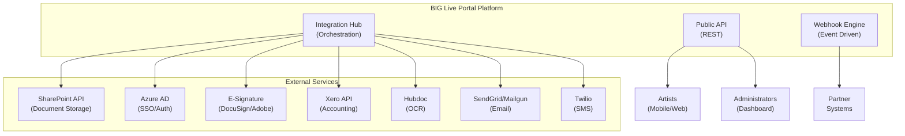

# Integration Specifications: BIG Live Portal

## Overview

The BIG Live Portal integration architecture is designed to seamlessly connect performing arts organizations with their existing enterprise systems while providing a unified, mobile-first experience for artists. The platform acts as an intelligent orchestration layer that bridges document management (SharePoint), financial systems (Xero), authentication services (Azure AD), electronic signatures (Microsoft/Adobe Sign), and communication channels (SendGrid/Twilio). This architecture ensures that organizations can leverage their existing technology investments while providing artists with a simplified, consolidated interface that requires no knowledge of the underlying systems.

## Integration Architecture

### High-Level Architecture


### Integration Patterns
1. **Synchronous REST API**: Real-time operations for document retrieval, authentication
2. **Asynchronous Webhooks**: Event notifications for signature completions, expense approvals
3. **Batch Processing**: Scheduled synchronization for Xero reconciliation
4. **Stream Processing**: Real-time contract status updates
5. **File-based Import/Export**: Bulk user imports, schedule uploads

## Core Integrations

### 1. Authentication & SSO

#### Azure AD Integration
```yaml
Supported Flows:
  - Authorization Code (web apps)
  - OpenID Connect (user authentication)
  - SAML 2.0 (enterprise SSO)
  
Endpoints:
  - Authorization: https://login.microsoftonline.com/{tenant}/oauth2/v2.0/authorize
  - Token: https://login.microsoftonline.com/{tenant}/oauth2/v2.0/token
  - UserInfo: https://graph.microsoft.com/v1.0/me

Scopes:
  - User.Read - Basic profile information
  - Directory.Read.All - Organization directory access
  - SharePoint.ReadWrite.All - Document management
  
Configuration:
  - Multi-tenant: false (organization-specific)
  - Reply URLs: https://portal.biglive.com/auth/callback
  - Logout URL: https://portal.biglive.com/logout
```

#### JWT Token Management
```javascript
// Token Structure
{
  "sub": "user_uuid",
  "email": "artist@example.com",
  "role": "artist",
  "company_id": "company_uuid",
  "permissions": ["contracts.view", "expenses.create"],
  "iat": 1234567890,
  "exp": 1234567890
}

// Refresh Token Strategy
POST /api/v1/auth/refresh
{
  "refresh_token": "encrypted_refresh_token"
}

Response:
{
  "access_token": "new_jwt_token",
  "expires_in": 86400,
  "refresh_token": "new_refresh_token"
}
```

#### Supported Identity Providers
| Provider | Protocol | Configuration |
|----------|----------|---------------|
| Azure AD | OAuth 2.0/SAML | Tenant ID, Client ID, Client Secret |
| Direct Login | JWT | Email/Password with Argon2id hashing |
| Magic Link | Email Token | Passwordless authentication option |

### 2. Document Management

#### SharePoint Integration
```yaml
Configuration:
  SITE_URL: https://{tenant}.sharepoint.com/sites/BIGLivePortal
  CLIENT_ID: SharePoint App Registration
  CLIENT_SECRET: Encrypted in environment
  
Folder Structure:
  /Contracts
    /{ProductionName}
      /{ArtistName}
        - Contract_v1.pdf
        - Contract_v2_amended.pdf
  /Expenses
    /{Year}
      /{Month}
        /{ArtistName}
          - Receipt_001.jpg
          - Receipt_002.pdf
  /Reports
    /{Year}
      - Financial_Summary.xlsx
      - Artist_Hours.csv

Permissions Model:
  - Admin: Full control on site
  - Accountant: Read/Write on Expenses, Read on Contracts
  - Artist: Read own folder only
  - System Account: Read/Write all folders
```

#### Document Operations
```javascript
// Upload Contract
POST /api/sharepoint/upload
{
  "file": Buffer,
  "metadata": {
    "artist_id": "uuid",
    "production_id": "uuid",
    "document_type": "contract",
    "version": 1
  }
}

// Response includes SharePoint ID for tracking
{
  "sharepoint_id": "01AZGK7N3Y2GOVW7725BZO354PWSELRRZ",
  "web_url": "https://sharepoint.com/sites/.../Contract.pdf",
  "download_url": "https://api.sharepoint.com/v2.0/drives/.../download"
}

// Retrieve Document
GET /api/sharepoint/document/{sharepoint_id}
Response: Pre-signed URL valid for 1 hour
```

### 3. E-Signature Integration

#### DocuSign Integration
```javascript
// Create Signature Request
POST /api/esign/create
{
  "contract_id": "uuid",
  "signers": [{
    "email": "artist@example.com",
    "name": "John Doe",
    "role": "contractor"
  }],
  "document_url": "sharepoint_url",
  "callback_url": "https://portal.biglive.com/webhooks/docusign"
}

// Webhook Events Handled
- envelope-sent
- envelope-delivered
- envelope-signed
- envelope-completed
- envelope-declined
- envelope-voided

// Status Mapping
DocuSign Status -> Portal Status
"sent" -> "pending_signature"
"delivered" -> "pending_signature"
"completed" -> "active"
"declined" -> "draft"
"voided" -> "archived"
```

#### Adobe Sign Integration (Alternative)
```yaml
Configuration:
  INTEGRATION_KEY: Adobe Sign application key
  CLIENT_SECRET: OAuth client secret
  REDIRECT_URI: https://portal.biglive.com/auth/adobesign/callback

Agreement Workflow:
  1. Upload document to Adobe Sign
  2. Create agreement with signers
  3. Send for signature
  4. Monitor via webhooks
  5. Download signed copy
  6. Store in SharePoint
```

### 4. Financial Integration

#### Xero Integration
```javascript
// Expense Submission Flow
POST /api/xero/expense
{
  "artist_id": "uuid",
  "amount": 150.00,
  "currency": "USD",
  "category": "Travel",
  "description": "Uber to rehearsal",
  "receipts": ["hubdoc_id_1", "hubdoc_id_2"],
  "production_code": "PROD_2024_01"
}

// Creates draft bill in Xero
Response:
{
  "xero_id": "a1b2c3d4-e5f6-7890-abcd-ef1234567890",
  "status": "DRAFT",
  "approval_url": "https://go.xero.com/organisationlogin/default.aspx?shortcode=..."
}

// Approval Webhook from Xero
POST /webhooks/xero
{
  "events": [{
    "resourceId": "a1b2c3d4-e5f6-7890-abcd-ef1234567890",
    "eventType": "UPDATE",
    "eventDateUtc": "2024-01-20T10:30:00",
    "tenantId": "xero_tenant_id",
    "tenantType": "ORGANISATION"
  }]
}
```

#### Hubdoc OCR Integration
```yaml
Receipt Processing:
  1. Artist uploads receipt image
  2. Send to Hubdoc API for processing
  3. Receive extracted data:
     - Vendor name
     - Date
     - Total amount
     - Tax breakdown
  4. Pre-populate expense form
  5. Link Hubdoc document to Xero bill

API Flow:
  POST /v1/documents
  - Upload receipt
  - Set category hints
  
  GET /v1/documents/{id}
  - Poll for OCR completion
  - Retrieve extracted data
  
  POST /v1/documents/{id}/publish
  - Send to Xero when approved
```

### 5. Communication Services

#### Email Integration (SendGrid)
```yaml
Configuration:
  API_KEY: SG.xxxxxxxxxxxxxxxxxxxxxx
  FROM_EMAIL: noreply@biglive.com
  REPLY_TO: support@biglive.com
  
Templates:
  welcome:
    ID: d-9876543210abcdef
    Variables: {first_name, organization_name, login_url}
    
  contract_ready:
    ID: d-1234567890abcdef
    Variables: {artist_name, contract_title, view_url}
    
  expense_approved:
    ID: d-0987654321abcdef
    Variables: {amount, approval_date, payment_eta}
    
  schedule_change:
    ID: d-abcdef1234567890
    Variables: {event_title, old_time, new_time, location}

Rate Limits:
  - Transactional: 10,000/day
  - Burst: 100/second
  - Retry: Exponential backoff
```

#### SMS Integration (Twilio)
```javascript
// SMS Configuration
{
  "accountSid": "AC1234567890abcdef1234567890abcdef",
  "authToken": "[ENCRYPTED]",
  "messagingServiceSid": "MG1234567890abcdef1234567890abcdef",
  "phoneNumbers": {
    "US": "+12125551234",
    "CA": "+14165551234"
  },
  "templates": {
    "urgent_schedule": "URGENT: {{event}} moved to {{time}}. Reply STOP to opt out.",
    "contract_reminder": "Reminder: Contract pending signature. View at {{url}}",
    "payment_sent": "Your expense payment of {{amount}} has been processed."
  }
}

// Usage Example
POST /api/notifications/sms
{
  "to": "+19175551234",
  "template": "urgent_schedule",
  "data": {
    "event": "Romeo & Juliet Rehearsal",
    "time": "6 PM today"
  },
  "priority": "high"
}
```

### 6. Cloud Storage (Temporary)

#### S3-Compatible Storage for Processing
```yaml
Buckets:
  - temp-uploads: Receipt images before Hubdoc processing
  - processed-docs: OCR results cache (24h TTL)
  - export-queue: Generated reports before delivery
  
Security:
  - Encryption: AES-256 at rest
  - Access: IAM roles only
  - Lifecycle: Auto-delete after 24 hours
  - CORS: Configured for direct browser upload

Integration:
  - Pre-signed POST for browser uploads
  - Lambda triggers for processing
  - CloudFront for fast delivery
```

## Webhook System

### Webhook Architecture
```
Event Occurs → Event Queue (SQS) → Webhook Processor → Delivery
                    ↓                      ↓                ↓
              Dead Letter           Retry Queue      Success/Fail
                 Queue              (Exponential)       Logging
```

### Webhook Configuration
```json
{
  "id": "webhook_123",
  "url": "https://portal.biglive.com/webhooks/external",
  "events": [
    "contract.signed",
    "expense.approved",
    "schedule.updated"
  ],
  "headers": {
    "X-BIG-Live-Signature": "sha256=..."
  },
  "secret": "whsec_1234567890abcdef",
  "active": true,
  "api_version": "2024-01-01"
}
```

### Webhook Security
```javascript
// Signature Verification
const crypto = require('crypto');

function verifyWebhookSignature(payload, signature, secret) {
  const timestamp = signature.split(',')[0].split('=')[1];
  const receivedSig = signature.split(',')[1].split('=')[1];
  
  // Prevent replay attacks (5-minute window)
  if (Date.now() - timestamp > 300000) {
    throw new Error('Webhook timestamp too old');
  }
  
  const expectedSig = crypto
    .createHmac('sha256', secret)
    .update(`${timestamp}.${payload}`)
    .digest('hex');
  
  return crypto.timingSafeEqual(
    Buffer.from(receivedSig),
    Buffer.from(expectedSig)
  );
}
```

### Event Catalog
| Event | Description | Payload Schema |
|-------|-------------|----------------|
| `contract.created` | New contract uploaded | `{contract_id, artist_id, production_id}` |
| `contract.signed` | E-signature completed | `{contract_id, signed_at, signature_id}` |
| `expense.submitted` | Expense pending approval | `{expense_id, amount, artist_id}` |
| `expense.approved` | Expense approved | `{expense_id, approved_by, xero_id}` |
| `schedule.updated` | Schedule modified | `{schedule_id, changes, affected_artists}` |
| `payment.processed` | Xero payment confirmed | `{expense_id, payment_id, amount}` |

### Delivery Guarantees
```yaml
Retry Strategy:
  - Initial delay: 30 seconds
  - Max attempts: 5
  - Backoff: Exponential (30s, 1m, 5m, 15m, 1h)
  - Max delay: 6 hours
  
Failure Handling:
  - Store failed deliveries in DLQ
  - Admin notification after 3 failures
  - Manual retry option in admin panel
  - Webhook health dashboard
  - Auto-disable after 10 consecutive failures
```

## Data Import/Export

### Import Formats

#### CSV Import - Artists
```csv
# Artists Import Template
email,first_name,last_name,role,phone,tax_id,emergency_contact_name,emergency_contact_phone
john.doe@email.com,John,Doe,artist,+12125551234,123-45-6789,Jane Doe,+12125555678
jane.smith@email.com,Jane,Smith,artist,+14165551234,987-65-4321,Bob Smith,+14165555678
```

#### CSV Import - Schedules
```csv
# Schedule Import Template
date,start_time,end_time,type,title,location,location_url,assigned_artists,notes
2024-02-01,09:00,12:00,rehearsal,Act 1 Blocking,Main Studio,https://maps.google.com/?q=...,john.doe@email.com;jane.smith@email.com,Bring scripts
2024-02-01,14:00,17:00,rehearsal,Music Rehearsal,Orchestra Pit,,jane.smith@email.com,With orchestra
```

#### JSON Import - Productions
```json
{
  "version": "1.0",
  "type": "productions",
  "data": [
    {
      "name": "Romeo and Juliet",
      "start_date": "2024-03-01",
      "end_date": "2024-04-15",
      "artists": [
        {
          "email": "john.doe@email.com",
          "role": "Romeo",
          "contract_amount": 5000.00
        },
        {
          "email": "jane.smith@email.com",
          "role": "Juliet",
          "contract_amount": 5000.00
        }
      ]
    }
  ]
}
```

### Export Capabilities
```yaml
Formats:
  - CSV: User lists, expense reports, schedule dumps
  - JSON: Full data export with relationships
  - PDF: Formatted reports, contract compilations
  - Excel: Financial summaries with formulas
  
Options:
  - Date range filtering
  - Field selection
  - Relationship inclusion (e.g., include artist details with expenses)
  - Compression (zip for multiple files)
  
Delivery:
  - Direct download (pre-signed URLs)
  - Email attachment (under 10MB)
  - SharePoint upload (automated reports)
  - SFTP delivery (enterprise option)
```

### Bulk Operations API
```javascript
// Bulk Create Artists
POST /api/v1/bulk/artists
{
  "data": [
    {
      "email": "artist1@email.com",
      "first_name": "Artist",
      "last_name": "One",
      "role": "artist"
    },
    // ... up to 100 records
  ],
  "options": {
    "validate_only": false,
    "skip_welcome_email": false,
    "return_ids": true
  }
}

// Bulk Update Contracts
PATCH /api/v1/bulk/contracts
{
  "filter": {
    "production_id": "prod_123",
    "status": "draft"
  },
  "updates": {
    "status": "pending_signature"
  },
  "options": {
    "dry_run": false,
    "notify": true
  }
}
```

## Third-Party Integrations

### SharePoint Document Library
```yaml
Connection:
  - Type: OAuth 2.0 with Certificate
  - Tenant: {organization}.onmicrosoft.com
  - Site: /sites/BIGLivePortal
  - API Version: v2.0
  
Document Metadata:
  - Title: Contract/Expense name
  - Artist: Linked to artist email
  - Production: Production name
  - DocumentType: Contract/Expense/Report
  - Status: Active/Archived
  - CreatedDate: ISO 8601
  - ModifiedDate: ISO 8601
  
Permissions Sync:
  - Admin: Site Owners group
  - Artists: Read permission on own folder
  - Accountants: Contribute on Expenses
  - System: Full Control (app-only)
```

### Xero Accounting Sync
```yaml
Connection:
  - Type: OAuth 2.0
  - Scopes: accounting.transactions, accounting.contacts
  - Webhook: https://portal.biglive.com/webhooks/xero
  
Sync Settings:
  - Direction: Bidirectional for expenses
  - Frequency: Real-time via webhooks
  - Batch: Nightly reconciliation
  
Field Mapping:
  Artist -> Xero Contact:
    - Name: {first_name} {last_name}
    - Email: {email}
    - Tax Number: {tax_id}
    - Contact Group: "Artists"
  
  Expense -> Xero Bill:
    - Contact: Artist (matched by email)
    - Date: {expense_date}
    - Due Date: {expense_date} + 30 days
    - Line Items: Single line with description
    - Reference: BIG-{expense_id}
    - Status: DRAFT (pending approval)
    - Account Code: Based on category mapping
```

## API Client SDKs

### SDK Architecture
```
SDKs/
├── javascript/
│   ├── src/
│   │   ├── client.ts
│   │   ├── resources/
│   │   │   ├── contracts.ts
│   │   │   ├── expenses.ts
│   │   │   └── schedules.ts
│   │   └── webhooks/
│   ├── tests/
│   └── package.json
├── python/
│   ├── biglive/
│   │   ├── __init__.py
│   │   ├── client.py
│   │   └── resources/
│   ├── tests/
│   └── setup.py
└── postman/
    └── BIG_Live_Portal.postman_collection.json
```

### JavaScript SDK Example
```javascript
// Installation
npm install @biglive/portal-sdk

// Usage
import { BIGLivePortal } from '@biglive/portal-sdk';

const client = new BIGLivePortal({
  apiKey: 'blp_live_...',
  environment: 'production' // or 'sandbox'
});

// Get artist contracts
const contracts = await client.contracts.list({
  artistId: 'artist_123',
  status: 'pending_signature'
});

// Submit expense
const expense = await client.expenses.create({
  amount: 150.00,
  category: 'travel',
  description: 'Taxi to venue',
  receipts: [file1, file2],
  productionId: 'prod_123'
});

// Handle webhooks
const event = client.webhooks.constructEvent(
  request.body,
  request.headers['x-big-live-signature'],
  endpointSecret
);

switch(event.type) {
  case 'contract.signed':
    // Handle signed contract
    break;
}
```

### SDK Features
| Feature | JavaScript | Python | Postman |
|---------|------------|--------|---------|
| Authentication | ✓ | ✓ | ✓ |
| Retry Logic | ✓ | ✓ | - |
| File Uploads | ✓ | ✓ | ✓ |
| Webhooks | ✓ | ✓ | - |
| TypeScript | ✓ | - | - |
| Async/Await | ✓ | ✓ | - |

## Integration Testing

### Test Scenarios
```yaml
Authentication Tests:
  - Azure AD SSO flow
  - JWT token refresh
  - Permission validation
  - Session timeout

SharePoint Tests:
  - Document upload/download
  - Permission inheritance
  - Metadata updates
  - Folder creation

E-Signature Tests:
  - Contract sending
  - Signature completion
  - Webhook receipt
  - Status synchronization

Financial Tests:
  - Expense creation in Xero
  - Approval workflow
  - Payment confirmation
  - OCR accuracy

Communication Tests:
  - Email delivery
  - SMS delivery
  - Template rendering
  - Bounce handling
```

### Mock Services
```javascript
// Mock Server Configuration
{
  "services": {
    "sharepoint": {
      "baseUrl": "http://localhost:4001",
      "responses": {
        "upload": { "id": "mock_123", "url": "http://..." }
      }
    },
    "xero": {
      "baseUrl": "http://localhost:4002",
      "responses": {
        "createBill": { "InvoiceID": "mock_inv_123" }
      }
    },
    "docusign": {
      "baseUrl": "http://localhost:4003",
      "webhooks": true
    }
  }
}
```

### Integration Health Monitoring
```yaml
Health Checks:
  - SharePoint API connectivity (every 5 min)
  - Azure AD token validation (every 15 min)
  - Xero API status (every 10 min)
  - Email service availability (every 5 min)
  - SMS credits remaining (hourly)

Metrics:
  - API response times by service
  - Webhook delivery success rate
  - Integration error rate by type
  - Document upload/download speeds
  - OCR processing accuracy

Alerts:
  - Service unavailable > 5 minutes
  - Error rate > 5% for 10 minutes
  - Response time > 2s for 5 minutes
  - Failed webhook deliveries > 10
  - Low SMS credits < 100
```

## Error Handling

### Error Response Format
```json
{
  "error": {
    "type": "integration_error",
    "code": "SHAREPOINT_UNAUTHORIZED",
    "message": "Failed to access SharePoint document library",
    "service": "sharepoint",
    "details": {
      "http_status": 401,
      "sharepoint_error": "Access denied"
    },
    "request_id": "req_abc123",
    "documentation": "https://docs.biglive.com/errors/sharepoint-unauthorized"
  }
}
```

### Retry Strategies
| Service | Error Type | Retry Strategy | Max Attempts |
|---------|------------|----------------|--------------|
| SharePoint | 429 Too Many Requests | Exponential backoff | 3 |
| SharePoint | 503 Service Unavailable | Linear backoff (1min) | 5 |
| Xero | 429 Rate Limit | Honor Retry-After header | 3 |
| DocuSign | Network Timeout | Exponential backoff | 3 |
| SendGrid | 503 Service Error | Exponential backoff | 3 |
| Twilio | 429 Rate Limit | Linear backoff (30s) | 2 |

### Circuit Breaker Implementation
```javascript
class IntegrationCircuitBreaker {
  constructor(service, options = {}) {
    this.service = service;
    this.failureThreshold = options.failureThreshold || 5;
    this.resetTimeout = options.resetTimeout || 60000;
    this.halfOpenRequests = options.halfOpenRequests || 3;
    this.state = 'CLOSED';
    this.failures = 0;
    this.nextAttempt = Date.now();
  }

  async call(operation) {
    if (this.state === 'OPEN') {
      if (Date.now() < this.nextAttempt) {
        throw new Error(`Circuit breaker OPEN for ${this.service}`);
      }
      this.state = 'HALF_OPEN';
    }

    try {
      const result = await operation();
      this.onSuccess();
      return result;
    } catch (error) {
      this.onFailure();
      throw error;
    }
  }

  onSuccess() {
    this.failures = 0;
    if (this.state === 'HALF_OPEN') {
      this.state = 'CLOSED';
    }
  }

  onFailure() {
    this.failures++;
    if (this.failures >= this.failureThreshold) {
      this.state = 'OPEN';
      this.nextAttempt = Date.now() + this.resetTimeout;
      // Notify monitoring system
      monitor.alert(`Circuit breaker opened for ${this.service}`);
    }
  }
}
```

## Documentation

### API Reference Structure
```
/docs
├── getting-started/
│   ├── authentication.md
│   ├── quickstart.md
│   └── sdks.md
├── integrations/
│   ├── sharepoint/
│   │   ├── setup.md
│   │   ├── permissions.md
│   │   └── troubleshooting.md
│   ├── xero/
│   │   ├── configuration.md
│   │   ├── field-mapping.md
│   │   └── reconciliation.md
│   ├── e-signatures/
│   │   ├── docusign.md
│   │   └── adobe-sign.md
│   └── webhooks/
│       ├── setup.md
│       ├── security.md
│       └── events.md
├── api-reference/
│   ├── endpoints/
│   └── errors.md
└── examples/
    ├── javascript/
    ├── python/
    └── postman/
```

### Interactive Documentation
- OpenAPI 3.0 specification with examples
- Postman collection with environment variables
- Integration testing sandbox
- Code examples for all SDKs
- Video tutorials for common integrations

## Security Considerations

### API Security
```yaml
Authentication:
  - API keys for server-side integrations
  - OAuth 2.0 for user context operations
  - JWT for session management
  - Certificate-based auth for SharePoint

Authorization:
  - Scope-based permissions
  - Resource-level access control
  - Service account restrictions
  - IP allowlisting for webhooks

Rate Limiting:
  - Per API key: 1000 req/hour
  - Per endpoint: Varies by operation
  - Webhook delivery: 100/minute
  - Bulk operations: 10/minute

Encryption:
  - TLS 1.3 required for all connections
  - Field-level encryption for sensitive data
  - Webhook payload signing (HMAC-SHA256)
  - API key encryption at rest
```

### Data Privacy
```yaml
PII Handling:
  - Tax IDs encrypted in database
  - PII masked in logs
  - Audit trail for data access
  - Right to deletion implementation

Compliance:
  - GDPR data portability via export API
  - CCPA compliance for CA residents
  - SOC 2 audit logging
  - PCI DSS N/A (no payment processing)

Data Residency:
  - SharePoint data remains in tenant region
  - Application data in US-East
  - Backups in same region
  - No cross-border transfers
```

## Migration Support

### Migration from Legacy Systems
```bash
# Migration CLI Tool
biglive-migrate import --source workflowmax --config migration.yml

# Migration configuration
source:
  type: workflowmax
  api_key: "legacy_api_key"
  endpoint: "https://api.workflowmax.com"
  
mapping:
  staff: users
  jobs: productions
  timesheets: schedules
  invoices: expenses
  
transforms:
  - field: staff.email
    to: users.email
    transform: lowercase
  - field: jobs.name
    to: productions.name
    transform: trim
    
options:
  batch_size: 50
  skip_errors: true
  dry_run: true
  start_date: "2023-01-01"
```

### Migration Phases
1. **Assessment**: Analyze source data quality and volume
2. **Test Migration**: Run against sandbox with subset
3. **Data Validation**: Verify mapping accuracy
4. **Full Migration**: Execute with monitoring
5. **Reconciliation**: Compare source and target
6. **Cutover**: Switch to new system
7. **Archive**: Retain legacy data per policy

## Clarification Requests or Feedback

1. **SharePoint Permissions Model**: Detailed understanding of the existing SharePoint site structure, security groups, and permission inheritance would optimize the integration to match current organizational practices while maintaining security.

2. **Xero Approval Workflow**: Clarification on whether expenses should create draft bills requiring manual approval in Xero, or if approved expenses should automatically create approved bills ready for payment would help define the exact integration flow.

3. **E-signature Provider Selection**: While both DocuSign and Adobe Sign are supported, identifying the primary provider would allow for deeper integration features and potentially better pricing through committed volume agreements.

4. **OCR Accuracy Requirements**: Understanding the acceptable accuracy threshold for Hubdoc OCR extraction would help set appropriate validation rules and determine when manual review is required.

5. **SMS Usage Patterns**: Knowing the expected volume of urgent notifications requiring SMS would help design appropriate rate limiting and cost management strategies.

6. **Bulk Operation Limits**: Understanding typical bulk import sizes (e.g., artist rosters, schedule uploads) would inform API design and performance optimization strategies.

7. **Integration Failover Requirements**: Defining acceptable downtime for each external service would help prioritize which integrations need active-active failover versus simple retry mechanisms.

8. **Custom Metadata Requirements**: Additional SharePoint metadata fields or Xero tracking categories specific to performing arts organizations would enhance the integration value.

9. **Audit Trail Retention**: Specific compliance requirements for integration audit logs would inform data retention policies and storage strategies.

10. **Multi-Currency Support**: Understanding if international productions require multi-currency expense handling would impact the Xero integration complexity.