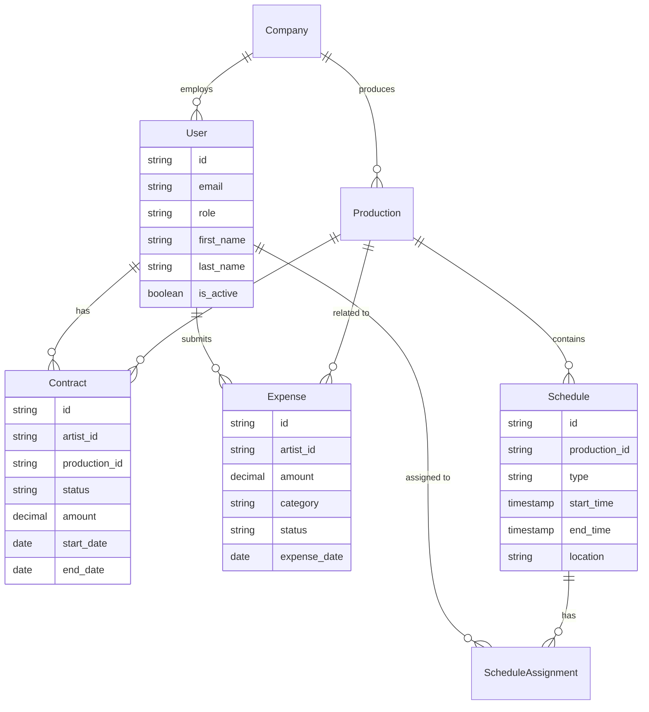

# Product Requirements Document: BIG Live Portal

## Executive Summary

BIG Live Portal is a purpose-built web application designed to streamline administrative workflows between performing artists and arts organizations. The platform addresses the unique challenges of managing distributed talent by providing a centralized, mobile-friendly solution for contract management, expense processing, and schedule coordination. Unlike generic HR or project management tools, BIG Live Portal understands the specific needs of the performing arts industry, where artists often work as independent contractors across multiple productions.

The platform eliminates the current fragmentation of email-based contracts, spreadsheet expense tracking, and disparate scheduling systems. By providing artists with personalized dashboards accessible via their personal email addresses, and giving administrators powerful yet simple management tools, BIG Live Portal reduces administrative overhead by 50% while improving transparency and artist satisfaction.

Expected to launch with 50-200 artists initially, the platform is designed to scale to 1,000+ users within two years, targeting small to medium performing arts organizations with annual budgets between $1M-$10M. The solution's emphasis on mobile responsiveness, integration with existing tools like SharePoint and Xero, and maintenance simplicity positions it as the ideal choice for arts organizations seeking digital transformation without IT complexity.

## Problem Statement

Performing arts organizations face significant administrative challenges in managing their distributed workforce of artists, who typically work as independent contractors across multiple productions. Current pain points include:

**Current Pain Points:**
- Contract management relies on email chains, making it difficult to track signatures, versions, and deadlines
- Expense reimbursement uses manual processes with paper receipts and Excel spreadsheets, causing delays of 30-60 days
- Schedule updates are communicated through various channels (email, SMS, bulletin boards), leading to missed rehearsals and confusion
- Artists lack centralized access to their administrative information, creating anxiety and frequent support requests
- Administrators spend 15-20 hours weekly on repetitive tasks that could be automated

**Market Gaps:**
- Existing arts management platforms (Overture, Theatre Manager) focus on ticketing and patron management, treating artist management as an afterthought
- Generic HR platforms don't understand contractor workflows or the project-based nature of performing arts
- No solution provides artist-friendly mobile access without requiring app downloads
- Current tools require significant IT support, which most arts organizations cannot afford

**User Frustrations:**
- Artists feel disconnected from administrative processes, unsure about contract status or payment timelines
- Administrators juggle multiple systems and manual processes, leading to errors and burnout
- Finance teams struggle with paper-based expense workflows and lack of integration with accounting systems
- Production managers have no efficient way to communicate schedule changes to specific artist groups

**Business Opportunities:**
- Post-pandemic digital transformation has created openness to new solutions
- Growing gig economy increases demand for contractor-friendly platforms
- Arts organizations seek to improve artist experience to attract and retain talent
- Opportunity to become the industry standard for artist management

## Solution Overview

BIG Live Portal provides a unified, web-based platform that centralizes all administrative interactions between performing artists and arts organizations. The solution leverages modern web technologies to deliver a mobile-first experience that requires no app installation, ensuring maximum accessibility for artists of all technical abilities. By integrating with existing infrastructure (SharePoint for documents, Xero for finance), the platform enhances rather than replaces current investments. The emphasis on role-based access, automated workflows, and real-time notifications transforms previously manual, error-prone processes into streamlined digital experiences that save time, reduce costs, and improve satisfaction for all stakeholders.

## Target Audience

### Primary Personas

**Sarah Chen - Performing Artist**
- **Role:** Freelance dancer and choreographer
- **Demographics:** Age 28, urban location, works with 3-4 companies annually
- **Goals and motivations:** Quick access to contracts, fast expense reimbursements, clear schedule visibility
- **Pain points:** Juggling multiple email accounts, losing receipts, missing schedule updates
- **Technical proficiency:** Comfortable with smartphones, basic computer skills
- **Typical day:** Morning rehearsal, afternoon teaching, evening performance, late-night admin catch-up

**Michael Thompson - Operations Administrator**
- **Role:** Operations Manager at regional theatre company
- **Demographics:** Age 45, 10 years in arts administration, manages 150 artists annually
- **Goals and motivations:** Reduce administrative burden, improve artist satisfaction, maintain compliance
- **Pain points:** Manual data entry, chasing signatures, answering repetitive questions
- **Technical proficiency:** Intermediate Office suite user, minimal IT experience
- **Typical day:** Contract preparation, expense approvals, schedule updates, artist communications

**Priya Patel - Finance Administrator**
- **Role:** Accounts Payable Specialist
- **Demographics:** Age 35, accounting background, handles contractor payments
- **Goals and motivations:** Accurate expense processing, timely reimbursements, audit compliance
- **Pain points:** Paper receipts, manual data entry to Xero, approval bottlenecks
- **Technical proficiency:** Expert in accounting software, comfortable with integrations
- **Typical day:** Receipt processing, expense verification, payment runs, reconciliation

### Secondary Users
- **Production Managers:** Update rehearsal and performance schedules, post announcements
- **Artistic Directors:** Occasionally view artist information and contract status
- **IT Support Staff:** Minimal involvement in system maintenance and user support
- **Guest Artists:** One-time or infrequent users who need simple access

## Product Vision & Strategy

### Vision Statement
To become the trusted digital backbone that connects performing artists with arts organizations, eliminating administrative friction while celebrating creative collaboration.

### Mission Statement
We empower arts organizations to focus on their creative mission by providing intuitive, mobile-first tools that transform artist administration from a burden into a competitive advantage.

### Success Metrics
- **Artist Adoption Rate:** 80% active users within 3 months
- **Contract Processing Time:** 50% reduction within 6 months
- **Expense Reimbursement Cycle:** 75% faster within 6 months
- **Admin Time Savings:** 10 hours per week within 3 months
- **User Satisfaction (NPS):** 40+ within 12 months
- **System Uptime:** 99.5% during business hours from launch

## Feature Specifications

### Core Features (MVP)

#### Feature 1: Artist Authentication & Profile Management
**User Story:** As an artist, I want to log in using my personal email address so that I can access all my information across multiple organizations without managing multiple accounts.

**Acceptance Criteria:**
- [ ] Artists can register/login using personal email addresses (not organizational emails)
- [ ] System supports role-based access (Artist, Admin, Accountant, Production Manager)
- [ ] Optional Azure AD SSO integration for organizations that prefer it
- [ ] Password reset via email with secure token
- [ ] Profile includes contact information, tax details, and emergency contacts
- [ ] Artists can update their own profile information
- [ ] No two-factor authentication required (per requirements)

**Technical Notes:**
- JWT-based authentication with 24-hour token lifetime
- Refresh tokens stored securely with 30-day expiration
- Integration with SharePoint permissions for document access

**UX/UI Considerations:**
- Single sign-on button prominently displayed if configured
- Mobile-optimized login form with email keyboard
- Remember me option for trusted devices
- Clear role indicator in navigation

#### Feature 2: Contract Management
**User Story:** As an artist, I want to view and sign my contracts electronically so that I can handle administrative tasks quickly without printing or scanning.

**Acceptance Criteria:**
- [ ] Artists see only their assigned contracts in a personalized dashboard
- [ ] Contract list shows status (pending signature, active, completed, archived)
- [ ] PDF viewer works on mobile and desktop without plugins
- [ ] E-signature integration with Adobe Sign or Microsoft signature
- [ ] Email notifications when new contracts are available
- [ ] Optional version history showing contract amendments
- [ ] Automated notifications to admin when contracts are signed
- [ ] Contracts stored in SharePoint with proper metadata

**Technical Notes:**
- SharePoint API for document storage and retrieval
- Webhook integration with e-signature providers
- PDF.js for cross-platform document viewing
- Metadata includes production, dates, amount, status

**UX/UI Considerations:**
- Clear visual indicators for contract status
- One-click signature process
- Mobile pinch-to-zoom for contract reading
- Download option for offline viewing

#### Feature 3: Expense Management
**User Story:** As an artist, I want to submit expense claims with receipt photos so that I can get reimbursed quickly without mailing paper forms.

**Acceptance Criteria:**
- [ ] Mobile-optimized receipt upload (camera or gallery)
- [ ] Support for multiple file formats (JPEG, PNG, PDF) up to 50MB
- [ ] Structured expense form with required fields:
  - Date of expense
  - Amount (with currency)
  - Category (dropdown with common options)
  - Description
  - Project/Production association
- [ ] Save draft functionality for incomplete submissions
- [ ] Submit for approval workflow with email confirmation
- [ ] Status tracking (draft, submitted, approved, paid)
- [ ] Integration with Xero/Hubdoc for approved expenses
- [ ] Admin approval interface with bulk actions

**Technical Notes:**
- Client-side image compression for faster uploads
- OCR integration (via Hubdoc) for receipt data extraction
- Xero API for creating bills/expenses
- Approval workflow with role-based routing

**UX/UI Considerations:**
- Camera integration for immediate receipt capture
- Progress indicator for file uploads
- Auto-save every 30 seconds
- Clear expense policy link
- Running total of submitted expenses

#### Feature 4: Schedule Management
**User Story:** As an artist, I want to view my rehearsal and performance schedule so that I always know where I need to be and when.

**Acceptance Criteria:**
- [ ] Read-only calendar view with personal schedule
- [ ] List and calendar view options
- [ ] Event details include:
  - Date, time, duration
  - Location with map link
  - Type (rehearsal, performance, meeting)
  - Notes and special instructions
- [ ] Bulletin board for general announcements
- [ ] Push notifications for schedule changes (optional email/SMS)
- [ ] Export to personal calendar (iCal format)
- [ ] Filter by date range or production

**Technical Notes:**
- Real-time updates via WebSocket or polling
- SMS integration via Twilio for urgent updates
- iCal feed generation for calendar sync
- Timezone handling for touring productions

**UX/UI Considerations:**
- Color coding by event type
- Today/This Week quick filters
- Offline viewing of cached schedule
- Clear indication of schedule updates

#### Feature 5: Mobile Responsiveness
**User Story:** As an artist, I want to access all features on my smartphone so that I can handle administrative tasks between rehearsals without needing a computer.

**Acceptance Criteria:**
- [ ] Responsive design works on all screen sizes (320px to 4K)
- [ ] Touch-optimized interface elements (minimum 44px tap targets)
- [ ] Progressive Web App capabilities:
  - Add to home screen
  - Offline viewing of contracts and schedules
  - Push notifications (if enabled)
- [ ] Performance optimization for 4G/3G connections
- [ ] No features require desktop access
- [ ] Tested on iOS Safari and Android Chrome

**Technical Notes:**
- Mobile-first CSS with breakpoints at 640px, 768px, 1024px
- Service Worker for offline functionality
- IndexedDB for local storage of documents
- Lazy loading for images and documents

**UX/UI Considerations:**
- Bottom navigation for thumb-friendly access
- Swipe gestures for common actions
- Reduced data mode option
- Clear loading states

#### Feature 6: Administrator Dashboard
**User Story:** As an administrator, I want to manage artists, documents, and view usage statistics so that I can efficiently run operations without external IT support.

**Acceptance Criteria:**
- [ ] User management interface:
  - Add/edit/deactivate artist accounts
  - Bulk import via CSV
  - Role assignment
  - Password reset capability
- [ ] Document management:
  - Upload contracts with metadata
  - Assign to specific artists
  - Bulk operations
  - Archive old documents
- [ ] Basic analytics dashboard:
  - Active users count
  - Pending contracts
  - Expense approval queue
  - Login activity
- [ ] No technical knowledge required for any admin function
- [ ] Help documentation embedded in interface

**Technical Notes:**
- Admin API endpoints with elevated permissions
- CSV parsing with validation
- Batch operations with progress tracking
- Simple SQL queries for analytics

**UX/UI Considerations:**
- Wizard-style interface for complex tasks
- Contextual help tooltips
- Confirmation dialogs for destructive actions
- Search and filter capabilities

### Stretch Goals (Post-MVP)
- **Advanced Reporting:** Customizable reports on contracts, expenses, and artist activity with export options
- **Contract Templates:** Reusable templates with variable fields for faster contract generation
- **Bulk Operations:** Select multiple items for approval, assignment, or status updates
- **Expense Categories:** Customizable expense categories with approval rules and budget tracking
- **Two-Way Calendar Sync:** Allow artists to update availability, sync with Google/Outlook calendars
- **Multi-Language Support:** Interface localization for Spanish and French speakers
- **Audit Trail:** Complete activity logging for compliance and troubleshooting
- **Custom Branding:** Allow organizations to customize colors, logos, and email templates

### Future Considerations
- **AI-Powered Receipt Scanning:** Automatic expense categorization and data extraction
- **Predictive Analytics:** Forecast scheduling conflicts and budget overruns
- **Multi-Organization Support:** Artists working with multiple companies from single account
- **API Marketplace:** Third-party integrations for payroll, HR, and production systems
- **Advanced Notifications:** Customizable notification rules and digest emails
- **Social Features:** Artist directory, internal messaging, and collaboration tools

## User Journeys

### Journey 1: Artist First-Time Onboarding
**Persona:** Sarah Chen (Performing Artist)
**Goal:** Complete registration and view first contract

**Steps:**
1. Receives email invitation with secure link from theatre company
2. Clicks link on mobile phone while commuting
3. Creates account using personal Gmail address
4. Fills out profile with tax information and emergency contact
5. Immediately sees pending contract on dashboard
6. Opens contract PDF, reviews on phone
7. Signs electronically with finger signature
8. Receives confirmation email
9. Downloads contract copy for records

**Success Criteria:** Contract signed within 24 hours of invitation, artist reports process was "easy"

### Journey 2: Monthly Expense Submission
**Persona:** Sarah Chen (Performing Artist)
**Goal:** Submit accumulated receipts for reimbursement

**Steps:**
1. Opens portal on phone after monthly reminder email
2. Taps "New Expense Claim" button
3. Uses camera to photograph 5 receipts from wallet
4. For each receipt:
   - System auto-extracts amount and date
   - Selects expense category from dropdown
   - Adds brief description
   - Associates with current production
5. Reviews total claim amount
6. Submits batch for approval
7. Receives confirmation with expected payment date
8. Two days later, gets "Approved" notification
9. Payment appears in bank account within 5 days

**Success Criteria:** Complete submission in under 10 minutes, payment received within 7 days

### Journey 3: Production Schedule Update
**Persona:** Michael Thompson (Operations Administrator)
**Goal:** Notify cast of rehearsal schedule change

**Steps:**
1. Logs into admin dashboard on desktop
2. Navigates to Schedule Management
3. Selects affected production and date
4. Updates rehearsal time from 7 PM to 6 PM
5. Adds note about costume fitting requirement
6. Selects notification options:
   - Immediate email to affected artists
   - SMS to artists who opted in
   - Post to announcement board
7. Reviews notification preview
8. Confirms schedule change
9. System sends 15 emails and 8 SMS messages
10. Views delivery confirmation report

**Success Criteria:** All artists notified within 5 minutes, no one misses rehearsal

## Data Model

### Core Entities
```
User
- id: unique identifier (UUID)
- email: string - primary login credential
- role: enum - [artist, admin, accountant, production_manager]
- first_name: string
- last_name: string
- phone: string - for SMS notifications
- tax_id: string - encrypted
- emergency_contact: JSON - name and phone
- created_at: timestamp
- last_login: timestamp
- is_active: boolean

Contract
- id: unique identifier (UUID)
- artist_id: UUID - foreign key to User
- production_id: UUID - foreign key to Production
- document_url: string - SharePoint URL
- status: enum - [draft, pending_signature, active, completed, archived]
- amount: decimal - contract value
- start_date: date
- end_date: date
- signed_at: timestamp
- signature_id: string - e-signature provider reference
- version: integer - for amendments
- metadata: JSON - additional fields

Expense
- id: unique identifier (UUID)
- artist_id: UUID - foreign key to User
- production_id: UUID - foreign key to Production
- amount: decimal
- currency: string - default USD
- category: string - predefined options
- description: text
- expense_date: date
- receipt_urls: array - multiple attachments
- status: enum - [draft, submitted, approved, rejected, paid]
- submitted_at: timestamp
- approved_by: UUID - foreign key to User
- approved_at: timestamp
- xero_id: string - external system reference

Schedule
- id: unique identifier (UUID)
- production_id: UUID - foreign key to Production
- title: string
- type: enum - [rehearsal, performance, meeting, other]
- start_time: timestamp with timezone
- end_time: timestamp with timezone
- location: string
- location_url: string - map link
- notes: text
- artist_ids: array - assigned artists

Production
- id: unique identifier (UUID)
- name: string
- company_id: UUID - foreign key to Company
- start_date: date
- end_date: date
- is_active: boolean
```

### Entity Relationship Diagram


## API Specification

### Authentication
- **Method:** JWT with Azure AD optional integration
- **Token Lifetime:** 24 hours
- **Refresh Strategy:** Refresh token valid for 30 days, new access token on each refresh

### Core Endpoints

#### Authentication
- `POST /api/v1/auth/login` - Email/password login
- `POST /api/v1/auth/logout` - Invalidate refresh token
- `POST /api/v1/auth/refresh` - Get new access token
- `POST /api/v1/auth/reset-password` - Request password reset
- `GET /api/v1/auth/sso/azure` - Azure AD SSO redirect

#### Users
- `GET /api/v1/users` - List all users (admin only)
- `POST /api/v1/users` - Create new user (admin only)
- `GET /api/v1/users/me` - Get current user profile
- `PUT /api/v1/users/{id}` - Update user
- `DELETE /api/v1/users/{id}` - Deactivate user (admin only)
- `POST /api/v1/users/bulk` - Bulk import via CSV (admin only)

#### Contracts
- `GET /api/v1/contracts` - List contracts (filtered by user role)
- `POST /api/v1/contracts` - Create new contract (admin only)
- `GET /api/v1/contracts/{id}` - Get specific contract
- `PUT /api/v1/contracts/{id}` - Update contract metadata
- `POST /api/v1/contracts/{id}/sign` - Submit e-signature
- `POST /api/v1/contracts/{id}/assign` - Assign to artist (admin only)

#### Expenses
- `GET /api/v1/expenses` - List expenses (filtered by user role)
- `POST /api/v1/expenses` - Create new expense claim
- `GET /api/v1/expenses/{id}` - Get specific expense
- `PUT /api/v1/expenses/{id}` - Update expense (draft only)
- `POST /api/v1/expenses/{id}/submit` - Submit for approval
- `POST /api/v1/expenses/{id}/approve` - Approve expense (admin only)
- `POST /api/v1/expenses/{id}/reject` - Reject with reason (admin only)

#### Schedules
- `GET /api/v1/schedules` - List schedules (filtered by user)
- `POST /api/v1/schedules` - Create schedule event (admin only)
- `GET /api/v1/schedules/{id}` - Get specific event
- `PUT /api/v1/schedules/{id}` - Update event (admin only)
- `DELETE /api/v1/schedules/{id}` - Cancel event (admin only)
- `GET /api/v1/schedules/export` - Get iCal feed URL

#### Documents
- `POST /api/v1/documents/upload` - Upload to SharePoint
- `GET /api/v1/documents/{id}` - Get document URL
- `DELETE /api/v1/documents/{id}` - Archive document

### Webhook Events
- `contract.created` - New contract available for artist
- `contract.signed` - Artist completed signature
- `expense.submitted` - New expense needs approval
- `expense.approved` - Expense approved for payment
- `schedule.updated` - Schedule change affecting artist
- `user.created` - New user account created

## Technical Requirements

### Performance
- Page load time: < 2 seconds on 4G connection
- API response time: < 500ms for 95th percentile
- Concurrent users: 100+ simultaneous
- File upload: Support 50MB receipts/documents
- Offline capability: View contracts and schedules without connection

### Security
- TLS 1.3 encryption for all communications
- Encryption at rest for sensitive data (tax IDs, bank details)
- Role-based access control with principle of least privilege
- Session timeout after 24 hours of inactivity
- Rate limiting: 100 requests per minute per user
- Input validation and sanitization on all endpoints
- OWASP Top 10 compliance

### Scalability
- Initial load: 50-200 artists, 5-10 admins
- Growth projection: 1,000 artists within 2 years
- Scale triggers: 
  - Auto-scale at 70% CPU utilization
  - Database read replicas at 500+ users
  - CDN activation for document delivery at 1,000+ users
- Multi-tenant architecture ready for future expansion

### Compliance
- **GDPR:** Data portability, right to deletion, consent management
- **CCPA:** California privacy rights for US artists
- **PCI DSS:** Not required (no payment processing)
- **SOC 2 Type II:** Planned for Year 2
- **WCAG 2.1 AA:** Accessibility compliance

## Non-Functional Requirements

### Accessibility
- WCAG 2.1 Level AA compliance minimum
- Screen reader compatibility (JAWS, NVDA, VoiceOver)
- Keyboard navigation for all functions
- Color contrast ratio 4.5:1 minimum
- Alternative text for all images
- Captions for any video content
- Form labels and error messages clearly associated
- Focus indicators visible
- Text resizable to 200% without horizontal scrolling

### Browser Support
- Chrome (latest 2 versions) - Full support
- Firefox (latest 2 versions) - Full support
- Safari (latest 2 versions) - Full support
- Edge (latest 2 versions) - Full support
- Safari iOS (latest 2 versions) - Full support
- Chrome Android (latest 2 versions) - Full support

### Mobile Support
- Responsive design breakpoints: 320px, 640px, 768px, 1024px, 1440px
- Native app considerations: Progressive Web App with install prompts
- Touch targets minimum 44x44 pixels
- Viewport meta tag for proper scaling
- Orientation support (portrait and landscape)
- Mobile-specific features: camera access, GPS (for venue directions)

### Internationalization
- Languages: English (primary), Spanish and French (Phase 2)
- Date/time formats: Localized based on user preference
- Currency support: USD (primary), CAD, EUR, GBP
- Number formats: Localized decimal and thousand separators
- Text direction: LTR only initially
- Timezone handling: Display in venue timezone with user timezone reference

## Integration Requirements

### Third-Party Services
- **SharePoint:** Document storage and retrieval via REST API
- **Azure AD:** Optional SSO for enterprise organizations
- **Adobe Sign / DocuSign:** Electronic signature workflows
- **Xero:** Expense approval and payment processing
- **Hubdoc:** Receipt OCR and data extraction
- **SendGrid/Mailgun:** Transactional email delivery
- **Twilio:** SMS notifications for urgent updates

### Import/Export
- Supported formats: 
  - Import: CSV (users, schedules), PDF (contracts)
  - Export: CSV (reports), PDF (documents), iCal (schedules)
- Data mapping requirements:
  - User import: email (required), first_name, last_name, role
  - Schedule import: date, time, location, type, assigned_artists
- Validation rules: Email uniqueness, date formats, required fields

## Constraints & Assumptions

### Technical Constraints
- Must work within existing SharePoint infrastructure
- Cannot require dedicated mobile apps
- Must support organizations without IT departments
- Limited to web technologies (no native code)
- Must work on 5-year-old devices

### Business Constraints
- Budget limitations of arts organizations ($5-10K annual)
- Cannot require technical training for administrators
- Must comply with union and contractor regulations
- Limited development resources (small team)
- Cannot disrupt current show operations during rollout

### Assumptions
- Organizations have basic internet connectivity
- Artists have access to smartphones or computers
- SharePoint APIs remain stable and accessible
- E-signature providers maintain current pricing
- Arts organizations willing to digitize workflows

## Risks & Mitigation

### Technical Risks
| Risk | Probability | Impact | Mitigation Strategy |
|------|-------------|---------|-------------------|
| SharePoint API limitations | Medium | High | Build abstraction layer, prepare alternative storage |
| E-signature vendor lock-in | Low | Medium | Support multiple providers from launch |
| Mobile browser compatibility | Medium | High | Extensive testing, progressive enhancement |
| Performance degradation at scale | Medium | Medium | Load testing, caching strategy, CDN ready |
| Integration failures | High | High | Circuit breakers, graceful degradation |

### Business Risks
| Risk | Probability | Impact | Mitigation Strategy |
|------|-------------|---------|-------------------|
| Low artist adoption | Medium | High | User testing, onboarding support, incentives |
| Organization resistance to change | High | High | Phased rollout, success stories, training |
| Competitor with more features | Medium | Medium | Focus on simplicity, fast iteration |
| Seasonal usage patterns | High | Low | Flexible pricing, maintain engagement |
| Budget constraints delay adoption | High | Medium | Freemium model, payment plans |

## Go-to-Market Strategy

### Launch Strategy
- **Soft Launch:** 3-5 friendly organizations (Month 1-3)
  - Focus on gathering feedback and testimonials
  - Free usage in exchange for case studies
  - Direct support channel for quick iterations
  
- **Public Launch:** Regional market focus (Month 6)
  - Target performing arts conferences
  - Partnership with arts service organizations
  - Content marketing through industry publications

### User Onboarding
1. **Organization Setup** - Admin guided wizard for initial configuration
2. **Bulk User Import** - CSV template for adding all artists at once
3. **Welcome Campaign** - Automated email series for new artists
4. **First Contract** - Simplified flow to ensure early success
5. **Mobile Prompt** - Encourage adding to home screen
6. **Support Resources** - Video tutorials and FAQ readily available

### Success Metrics
- Day 1: 90% of invited artists create accounts
- Week 1: 80% complete profile and view first contract
- Month 1: 70% actively using core features
- Month 3: 50% using mobile as primary access
- Month 6: NPS score of 40+
- Year 1: 20+ organizations, 1,000+ active artists

## Timeline & Milestones

### Development Phases
1. **Phase 1 - Foundation** (Months 1-2)
   - Authentication system with role management
   - Basic user interface and navigation
   - SharePoint integration foundation
   - Admin user management
   
2. **Phase 2 - Core Features** (Months 3-4)
   - Contract viewing and e-signatures
   - Expense submission and approval
   - Schedule viewing and notifications
   
3. **Phase 3 - Integrations** (Months 5-6)
   - Complete SharePoint document management
   - Xero/Hubdoc integration
   - Email/SMS notification system
   
4. **Phase 4 - Polish** (Month 7)
   - Mobile optimization and PWA features
   - Performance optimization
   - Accessibility compliance
   
5. **Phase 5 - Launch Preparation** (Month 8)
   - Security audit and penetration testing
   - Documentation and training materials
   - Beta testing with partner organizations

### Key Milestones
- Month 2: First successful artist login and contract view
- Month 4: Complete expense workflow demonstrated
- Month 6: Beta launch with 3 organizations
- Month 8: Public launch at performing arts conference
- Month 10: 10+ paying organizations
- Month 12: 1,000+ active artists

## Appendices

### A. Competitive Analysis

**Overture**
- Strengths: Comprehensive patron management, established market presence
- Weaknesses: Complex for small organizations, expensive, poor mobile experience
- Differentiator: BIG Live Portal focuses solely on artist management with superior UX

**Theatre Manager**
- Strengths: Integrated box office, good venue management
- Weaknesses: Desktop-focused, steep learning curve, requires IT support
- Differentiator: BIG Live Portal is mobile-first and requires no technical expertise

**Generic HR Platforms (BambooHR, Gusto)**
- Strengths: Mature products, wide feature set
- Weaknesses: Not designed for contractors, no production-based workflows
- Differentiator: BIG Live Portal understands performing arts workflows

### B. User Research Findings
- 87% of artists primarily use mobile devices for admin tasks
- Average expense reimbursement time is 45 days (industry pain point)
- 92% of organizations use SharePoint but underutilize it
- Artists check email 5x more than dedicated apps
- Administrators spend 15-20 hours weekly on artist management

### C. Technical Architecture
```
┌─────────────────┐     ┌─────────────────┐     ┌─────────────────┐
│   Web Client    │────▶│   API Gateway   │────▶│  Load Balancer  │
│  (React PWA)    │     │    (Express)    │     │                 │
└─────────────────┘     └─────────────────┘     └─────────────────┘
                                                           │
                              ┌────────────────────────────┼────────────────────────────┐
                              │                            │                            │
                        ┌─────▼─────┐              ┌──────▼──────┐            ┌────────▼────────┐
                        │   API     │              │   API       │            │   API          │
                        │  Server 1 │              │  Server 2   │            │  Server N      │
                        └─────┬─────┘              └──────┬──────┘            └────────┬────────┘
                              │                            │                            │
                        ┌─────▼───────────────────────────▼────────────────────────────▼─────┐
                        │                     PostgreSQL Database                             │
                        │                    (Primary + Read Replicas)                        │
                        └─────────────────────────────┬───────────────────────────────────────┘
                                                      │
                ┌─────────────────┬───────────────────┼───────────────────┬─────────────────┐
                │                 │                   │                   │                 │
          ┌─────▼─────┐    ┌─────▼─────┐      ┌─────▼─────┐      ┌─────▼─────┐    ┌──────▼──────┐
          │SharePoint │    │   Redis   │      │   Xero    │      │  DocuSign │    │   Twilio    │
          │   API     │    │   Cache   │      │   API     │      │    API    │    │    SMS      │
          └───────────┘    └───────────┘      └───────────┘      └───────────┘    └─────────────┘
```

## Clarification Requests or Feedback

1. **E-signature Provider Preference:** While the requirements mention both Microsoft and Adobe Sign, a specific preference would help optimize the integration approach and potentially reduce costs through volume licensing.

2. **SharePoint Structure:** Understanding the current SharePoint folder structure and permissions model would enable more efficient integration design and ensure compatibility with existing organizational practices.

3. **Xero Integration Depth:** Clarification on whether the integration should create draft bills, approved bills, or fully processed payments would help define the exact workflow and required permissions.

4. **Union Regulations:** Specific union rules regarding contractor management, especially around hours tracking and payment schedules, would ensure compliance from day one.

5. **Data Retention Policies:** While 7 years is mentioned for financial records, clarification on contract and general document retention would help design appropriate archival strategies.

6. **Performance Season Patterns:** Understanding typical performance season patterns (e.g., fall heavy, summer light) would help design scaling strategies and pricing models that accommodate usage fluctuations.

7. **Multi-Company Artist Scenarios:** More details on how artists who work with multiple organizations using the platform should be handled would inform the account model and data isolation approach.