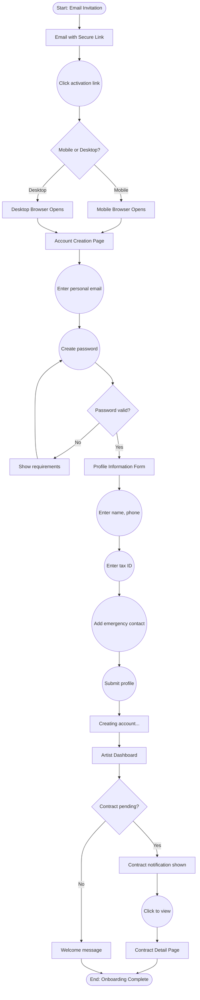
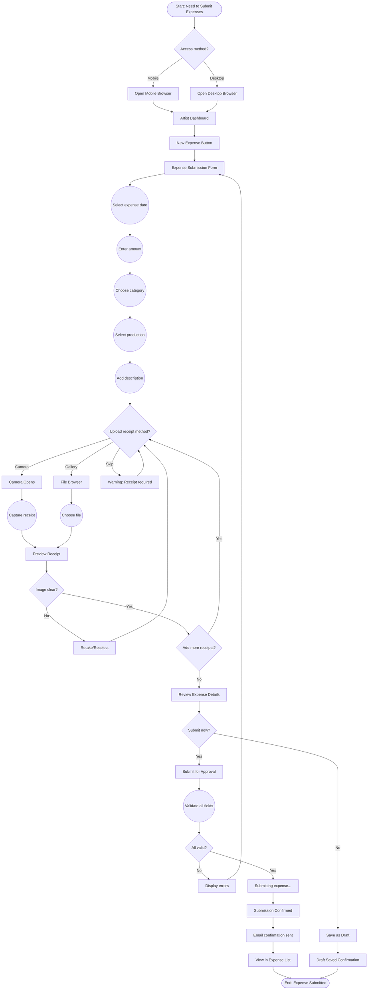
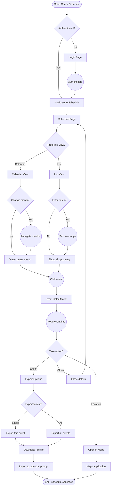
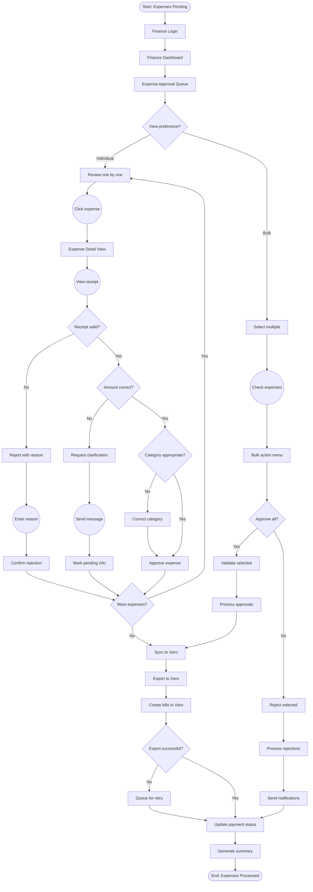

```mermaid
flowchart TD
    Start([Start: Contract Assigned]) --> Notification((Email notification sent))
    Notification --> Login{Already logged in?}
    Login -->|No| LoginPage[Login Page]
    Login -->|Yes| Dashboard[Artist Dashboard]
    LoginPage --> Auth((Authenticate))
    Auth --> Dashboard
    Dashboard --> ContractAlert[Contract Alert Card]
    ContractAlert --> ClickContract((Click contract))
    ClickContract --> ContractList[Contracts Page]
    ContractList --> PendingFilter{View pending only?}
    PendingFilter -->|Yes| FilteredList[Filtered Contract List]
    PendingFilter -->|No| FullList[All Contracts]
    FilteredList --> SelectContract((Select Swan Lake))
    FullList --> SelectContract
    SelectContract --> ContractDetail[Contract Detail View]
    ContractDetail --> PDFLoad[Load PDF Document]
    PDFLoad --> Review((Review contract terms))
    Review --> ScrollComplete{Reviewed all pages?}
    ScrollComplete -->|No| ContinueReview[Continue scrolling]
    ContinueReview --> Review
    ScrollComplete -->|Yes| SignButton[Sign Contract Button]
    SignButton --> SignatureModal[E-Signature Modal]
    SignatureModal --> DrawSignature((Draw signature))
    DrawSignature --> SignatureValid{Signature acceptable?}
    SignatureValid -->|No| ClearSignature[Clear and retry]
    ClearSignature --> DrawSignature
    SignatureValid -->|Yes| ConfirmSign[Confirm Signature]
    ConfirmSign --> Processing[Processing signature...]
    Processing --> Success[Success Confirmation]
    Success --> EmailConfirm[Email confirmation sent]
    EmailConfirm --> UpdatedDashboard[Return to Dashboard]
    UpdatedDashboard --> End([End: Contract Signed])
```

```mermaid
flowchart TD
    Start([Start: Contracts Ready]) --> AdminLogin[Admin Login]
    AdminLogin --> AdminDash[Admin Dashboard]
    AdminDash --> ContractMgmt[Contract Management]
    ContractMgmt --> UploadChoice{Upload method?}
    UploadChoice -->|Single| SingleUpload[Upload Contract]
    UploadChoice -->|Bulk| BulkUpload[Bulk Upload]
    SingleUpload --> SelectFile((Choose PDF file))
    BulkUpload --> SelectMultiple((Choose multiple PDFs))
    SelectFile --> FileValidation{Valid PDF?}
    SelectMultiple --> FileValidation
    FileValidation -->|No| FileError[Show error message]
    FileValidation -->|Yes| MetadataForm[Contract Metadata Form]
    FileError --> UploadChoice
    MetadataForm --> Production((Select production))
    Production --> ContractType((Choose contract type))
    ContractType --> DateRange((Set start/end dates))
    DateRange --> Amount((Enter contract amount))
    Amount --> AssignArtist{Assign to artists?}
    AssignArtist -->|Now| ArtistSelection[Select Artists]
    AssignArtist -->|Later| SaveUnassigned[Save for later]
    ArtistSelection --> SearchArtist((Search/filter artists))
    SearchArtist --> SelectArtists((Check artist names))
    SelectArtists --> ReviewAssign[Review Assignments]
    SaveUnassigned --> UploadProcess[Upload to SharePoint]
    ReviewAssign --> ConfirmAssign{Assignments correct?}
    ConfirmAssign -->|No| ArtistSelection
    ConfirmAssign -->|Yes| UploadProcess
    UploadProcess --> Processing[Processing uploads...]
    Processing --> SharePointSave[Save to SharePoint]
    SharePointSave --> DatabaseUpdate[Update database]
    DatabaseUpdate --> NotifyArtists{Send notifications?}
    NotifyArtists -->|Yes| EmailQueue[Queue email notifications]
    NotifyArtists -->|No| SkipNotify[Skip notifications]
    EmailQueue --> SendEmails[Send notification emails]
    SkipNotify --> Success[Upload successful]
    SendEmails --> Success
    Success --> ContractList[View in contract list]
    ContractList --> End([End: Contracts Uploaded])
```

# User Flows: BIG Live Portal

## Overview
This user flow documentation maps the complete journey paths for all user types within the BIG Live Portal platform. The flows cover critical workflows including artist onboarding, contract management, expense submission, schedule access, and administrative operations. Each flow is designed to minimize friction while ensuring data accuracy and compliance. The documentation serves as a blueprint for development teams to implement intuitive navigation patterns and for QA teams to validate user experience across all touchpoints.

## User Personas & Goals

### Primary Users
1. **Sarah Chen - Performing Artist**
   - Role: Freelance dancer and choreographer working with multiple companies
   - Primary Goals: Quick contract signing, fast expense reimbursements, clear schedule visibility
   - Technical Proficiency: Intermediate (comfortable with smartphones, basic computer skills)
   - Usage Frequency: Weekly for expenses, daily during production periods

2. **Michael Thompson - Operations Administrator**
   - Role: Operations Manager overseeing 150+ artists annually
   - Primary Goals: Efficient contract distribution, streamlined approvals, reduced administrative burden
   - Technical Proficiency: Intermediate (Office suite proficient, minimal IT experience)
   - Usage Frequency: Daily for all administrative tasks

3. **Priya Patel - Finance Administrator**
   - Role: Accounts Payable Specialist handling contractor payments
   - Primary Goals: Accurate expense processing, timely reimbursements, audit compliance
   - Technical Proficiency: Advanced in accounting software, comfortable with integrations
   - Usage Frequency: Daily for expense processing and approvals

### User Goals Matrix
| User Type | Goal | Priority | Frequency |
|-----------|------|----------|-----------|
| Artist | Sign contracts electronically | High | Monthly |
| Artist | Submit expense claims with receipts | High | Weekly |
| Artist | View rehearsal/performance schedule | High | Daily |
| Artist | Update personal information | Medium | Quarterly |
| Admin | Upload and assign contracts | High | Weekly |
| Admin | Manage artist accounts | High | Daily |
| Admin | View operational metrics | Medium | Daily |
| Finance | Approve expense claims | High | Daily |
| Finance | Export data to Xero | High | Weekly |
| Finance | Generate compliance reports | Medium | Monthly |

## Flow Notation Legend
Using Mermaid flowchart syntax:
- `[Start/End]` = Terminal points (rounded rectangles)
- `[Screen/Page]` = UI screens (rectangles)
- `{Decision?}` = Decision points (diamonds)
- `((Process))` = Actions/processes (circles)
- `-->` = Flow direction
- `-.-` = Alternative/optional paths

## Core User Flows

### 1. Artist Onboarding: Account Creation and First Login

**User**: Sarah Chen (Performing Artist)
**Trigger**: Receives email invitation from theatre company
**Success Criteria**: Profile completed and first contract viewed within 24 hours

#### Flow Diagram


#### Step-by-Step Description
1. **Entry Point**: Artist receives email invitation with secure activation link
2. **Link Activation**: Clicking link opens portal in default browser
3. **Account Creation**: Enter personal email and create password
4. **Profile Setup**: Complete required fields (name, phone, tax ID, emergency contact)
5. **Dashboard Access**: Automatically logged in and directed to personalized dashboard
6. **Contract Discovery**: Pending contract alert prompts immediate action
7. **Completion**: Artist views first contract, completing onboarding

#### Screen Sequence
1. □ **Email Client**
   - Purpose: Receive and open invitation
   - Key Actions: Click activation link
   - Next: Account creation page

2. □ **Account Creation**
   - Purpose: Set login credentials
   - Key Actions: Enter email, create password
   - Next: Profile form

3. □ **Profile Form**
   - Purpose: Collect required information
   - Key Actions: Fill all fields, submit
   - Next: Dashboard

4. □ **Artist Dashboard**
   - Purpose: Central hub for all features
   - Key Actions: View alerts, access features
   - Next: Contract detail or other features

#### Edge Cases
- **Invalid activation link**: Show error with support contact
- **Email already registered**: Redirect to login with password reset option
- **Session timeout**: Save progress and allow continuation
- **Network interruption**: Auto-save form data locally

### 2. Contract Management: Electronic Signature Workflow

**User**: Sarah Chen (Performing Artist)
**Trigger**: New contract assigned by administrator
**Success Criteria**: Contract signed and confirmation received

#### Flow Diagram


#### Step-by-Step Description
1. **Notification**: Email alert when new contract assigned
2. **Authentication**: Login if not already authenticated
3. **Dashboard Alert**: Prominent display of pending contract
4. **Contract List**: Navigate to contracts section
5. **Contract Selection**: Choose specific contract to review
6. **Document Review**: Read through all pages of PDF
7. **E-Signature**: Draw signature in modal interface
8. **Confirmation**: Receive success message and email
9. **Status Update**: Contract marked as signed in system

#### Screen Sequence
1. □ **Email Notification**
   - Purpose: Alert artist to new contract
   - Key Actions: Click to view contract
   - Next: Login or Dashboard

2. □ **Contracts List**
   - Purpose: Show all contracts with status
   - Key Actions: Filter, search, select
   - Next: Contract detail

3. □ **Contract Detail**
   - Purpose: Review document terms
   - Key Actions: Read PDF, click sign
   - Next: E-signature modal

4. □ **E-Signature Modal**
   - Purpose: Capture legal signature
   - Key Actions: Draw signature, confirm
   - Next: Success confirmation

#### Edge Cases
- **PDF loading failure**: Offer download option and retry
- **Signature rejection**: Clear instructions for acceptable signatures
- **Session timeout during signing**: Save progress, require re-authentication
- **Network failure during submission**: Queue for retry with local confirmation

### 3. Expense Submission: Receipt Upload and Claim Process

**User**: Sarah Chen (Performing Artist)
**Trigger**: Monthly expense submission reminder or immediate need
**Success Criteria**: Expense claim submitted with all receipts attached

#### Flow Diagram


#### Step-by-Step Description
1. **Access Point**: Open portal on mobile or desktop device
2. **Navigation**: Click "New Expense" from dashboard or expense section
3. **Form Entry**: Complete all required fields (date, amount, category, production)
4. **Receipt Capture**: Use camera or upload existing image
5. **Image Review**: Ensure receipt is clear and readable
6. **Multiple Receipts**: Add additional receipts if needed
7. **Final Review**: Verify all information is correct
8. **Submission**: Submit for approval or save as draft
9. **Confirmation**: Receive confirmation with tracking number

#### Screen Sequence
1. □ **Expense Form**
   - Purpose: Collect expense details
   - Key Actions: Fill fields, add receipts
   - Next: Receipt upload

2. □ **Camera/File Upload**
   - Purpose: Capture receipt documentation
   - Key Actions: Take photo or select file
   - Next: Preview screen

3. □ **Review Screen**
   - Purpose: Verify all information
   - Key Actions: Edit, submit, or save
   - Next: Confirmation

4. □ **Confirmation Page**
   - Purpose: Provide submission confirmation
   - Key Actions: View details, return to list
   - Next: Expense list or dashboard

#### Edge Cases
- **Poor image quality**: Prompt to retake with tips for better photos
- **Large file size**: Automatic compression with quality check
- **Network interruption**: Queue for submission when connection restored
- **Invalid amount format**: Real-time validation with format hints
- **Missing production**: Allow "General" category for non-production expenses

### 4. Schedule Access: View and Export Calendar Events

**User**: Sarah Chen (Performing Artist)
**Trigger**: Daily schedule check or schedule change notification
**Success Criteria**: View current schedule and export to personal calendar

#### Flow Diagram


#### Step-by-Step Description
1. **Authentication Check**: Ensure user is logged in
2. **Navigation**: Access schedule from menu or dashboard
3. **View Selection**: Choose between calendar or list view
4. **Time Navigation**: Browse different months or filter dates
5. **Event Selection**: Click specific event for details
6. **Detail Review**: View time, location, and special notes
7. **Export Option**: Download individual or all events
8. **Calendar Import**: Add to personal calendar application
9. **Location Access**: Open venue in maps for directions

#### Screen Sequence
1. □ **Schedule Main View**
   - Purpose: Display all assigned events
   - Key Actions: Toggle view, filter, select event
   - Next: Event details or export

2. □ **Event Detail Modal**
   - Purpose: Show complete event information
   - Key Actions: View details, export, get directions
   - Next: Export dialog or maps

3. □ **Export Options**
   - Purpose: Choose export preferences
   - Key Actions: Select format and scope
   - Next: File download

4. □ **Download Confirmation**
   - Purpose: Confirm successful export
   - Key Actions: Open file, return to schedule
   - Next: Calendar app or schedule view

#### Edge Cases
- **No upcoming events**: Show message with date of last event
- **Schedule conflicts**: Highlight overlapping events in red
- **Timezone changes**: Display in venue timezone with user timezone reference
- **Offline access**: Cache current month for offline viewing
- **Calendar app detection**: Provide app-specific import instructions

### 5. Admin Contract Upload: Bulk Contract Assignment

**User**: Michael Thompson (Operations Administrator)
**Trigger**: New production contracts ready for distribution
**Success Criteria**: All contracts uploaded and assigned to correct artists

#### Flow Diagram


#### Step-by-Step Description
1. **Admin Access**: Login with administrator credentials
2. **Navigation**: Access contract management section
3. **Upload Selection**: Choose single or bulk upload method
4. **File Selection**: Browse and select PDF contract files
5. **Metadata Entry**: Add production, dates, and amount details
6. **Artist Assignment**: Search and select recipient artists
7. **Review**: Verify all assignments are correct
8. **Processing**: Upload to SharePoint with metadata
9. **Notifications**: Send email alerts to assigned artists
10. **Confirmation**: View uploaded contracts in system

#### Screen Sequence
1. □ **Contract Management**
   - Purpose: Central contract administration
   - Key Actions: Upload, view all, filter
   - Next: Upload interface

2. □ **Upload Form**
   - Purpose: Collect file and metadata
   - Key Actions: Select files, enter details
   - Next: Artist assignment

3. □ **Artist Assignment**
   - Purpose: Link contracts to artists
   - Key Actions: Search, select multiple
   - Next: Review screen

4. □ **Review & Confirm**
   - Purpose: Verify before processing
   - Key Actions: Edit, confirm upload
   - Next: Success confirmation

#### Edge Cases
- **Duplicate contract detection**: Warn if similar contract exists
- **Invalid PDF format**: Provide format requirements and retry
- **Artist not found**: Option to add new artist inline
- **Upload failure**: Retry mechanism with progress preservation
- **Bulk assignment limits**: Process in batches if >50 artists

### 6. Expense Approval: Finance Review and Processing

**User**: Priya Patel (Finance Administrator)
**Trigger**: New expenses submitted for approval
**Success Criteria**: Expenses reviewed, approved/rejected, and synced to Xero

#### Flow Diagram


#### Step-by-Step Description
1. **Queue Access**: View all pending expense approvals
2. **Review Method**: Choose individual or bulk processing
3. **Receipt Verification**: Check each receipt for validity
4. **Amount Validation**: Ensure amounts match receipts
5. **Category Review**: Verify correct categorization
6. **Approval Decision**: Approve, reject, or request info
7. **Batch Processing**: Handle multiple expenses efficiently
8. **Xero Sync**: Export approved expenses to accounting
9. **Status Update**: Mark as paid in system
10. **Notifications**: Alert artists of decisions

#### Screen Sequence
1. □ **Approval Queue**
   - Purpose: List all pending expenses
   - Key Actions: Filter, sort, select
   - Next: Detail view or bulk actions

2. □ **Expense Detail**
   - Purpose: Review complete expense
   - Key Actions: View receipt, approve/reject
   - Next: Next expense or queue

3. □ **Bulk Actions**
   - Purpose: Process multiple expenses
   - Key Actions: Select all, approve/reject batch
   - Next: Confirmation dialog

4. □ **Xero Sync Status**
   - Purpose: Show export progress
   - Key Actions: View results, retry failures
   - Next: Completion summary

#### Edge Cases
- **Unclear receipt**: Request better image from artist
- **Duplicate submission**: Flag and merge duplicates
- **Xero sync failure**: Queue for manual retry with error details
- **Currency conversion**: Handle non-USD expenses appropriately
- **Approval limits**: Escalate high-value expenses if needed

## Common Flow Patterns

### Authentication Flow
```
◇ Authenticated?
  ├─No──→ □ Login → ◯ Verify → ◇ Success?
  │                               ├─No──→ Error
  │                               └─Yes─→ Continue
  └─Yes─→ Continue with flow
```

### CRUD Operations Flow
```
□ List View
    ↓
◇ User Action?
  ├─Create─→ □ Create Form → ◯ Submit → ◇ Valid? → Save
  ├─Read───→ □ Detail View → ◇ Actions? → Edit/Delete
  ├─Update─→ □ Edit Form → ◯ Submit → ◇ Valid? → Update
  └─Delete─→ ◇ Confirm? → ◯ Delete → □ Success
```

### Search and Filter Flow
```
□ List/Grid View
    ↓
◯ Enter search/filter criteria
    ↓
◇ Results found?
  ├─Yes─→ □ Filtered Results
  │         ↓
  │     ◯ Select item
  │         ↓
  │     □ Detail View
  └─No──→ □ No Results Message
            ↓
        ◯ Modify search
            ↓
        (return to search)
```

## Cross-Functional Flows

### Notification-Triggered Flow
```
[Trigger: System Event]
        ↓
◯ Generate Notification
        ↓
    ┌───┴───┐
    ↓       ↓
Email   In-App
    ↓       ↓
□ Email  □ Notification
Client    Center
    ↓       ↓
◯ Click  ◯ Click
Link     Notification
    ↓       ↓
    └───┬───┘
        ↓
□ Relevant Screen
        ↓
◯ Take Action
```

### Multi-User Collaboration Flow
```
Admin                     Artist
  ↓                         ↓
□ Upload Contract       (waiting)
  ↓                         ↓
◯ Assign to Artist  →  □ Email Notification
  ↓                         ↓
(waiting)              □ View Contract
  ↓                         ↓
□ Notification    ←    ◯ Sign Contract
  ↓                         ↓
□ Update Records          (done)
  ↓                         
□ Process Payment      
```

## Mobile vs Desktop Flow Variations

### Mobile-Specific Flows
- **Navigation**: Hamburger menu instead of sidebar
- **Forms**: Single column, stepped approach
- **Tables**: Card view instead of table view
- **Actions**: Touch-optimized with larger targets
- **File Upload**: Camera-first for receipts

### Desktop-Specific Flows
- **Multi-tasking**: Multiple panels open simultaneously
- **Bulk actions**: Easier selection with mouse
- **Keyboard shortcuts**: Tab navigation and hotkeys
- **Hover states**: Additional information on hover
- **Drag-and-drop**: For file uploads

## Error Handling Flows

### Validation Error Flow
```
◯ User submits form
        ↓
◇ Client-side validation?
  ├─Fail──→ □ Inline error messages
  │           ↓
  │       ◯ User corrects
  │           ↓
  │       (return to submit)
  └─Pass──→ ◯ Server validation
              ↓
          ◇ Server validation?
            ├─Fail──→ □ Error messages
            │           ↓
            │       ◯ User corrects
            └─Pass──→ □ Success
```

### System Error Flow
```
◯ User action
    ↓
◇ System available?
  ├─No──→ □ Error page
  │         ↓
  │     ◇ Can retry?
  │       ├─Yes─→ ◯ Retry action
  │       └─No──→ □ Contact support
  └─Yes─→ Continue flow
```

## Metrics & Success Indicators

### Flow Completion Rates
| Flow | Target Completion | Drop-off Points |
|------|------------------|-----------------|
| Artist Onboarding | 90% | Profile form (5%), Tax info (5%) |
| Contract Signing | 95% | PDF loading (2%), Signature (3%) |
| Expense Submission | 85% | Receipt upload (10%), Form completion (5%) |
| Schedule Export | 90% | Export options (10%) |
| Admin Upload | 95% | Artist assignment (5%) |

### Time to Complete
| Flow | Target Time | Current Baseline |
|------|------------|------------------|
| Onboarding | < 5 minutes | 7 minutes |
| Contract Signing | < 3 minutes | 5 minutes |
| Expense Submission | < 2 minutes | 4 minutes |
| Schedule Check | < 30 seconds | 45 seconds |
| Bulk Approval | < 1 min/expense | 2 minutes |

## Implementation Priorities

### Phase 1: Core Flows
1. Authentication and basic profile management
2. Contract viewing and e-signature
3. Basic expense submission
4. Schedule viewing (read-only)

### Phase 2: Enhanced Flows
1. Bulk operations for admins
2. Advanced filtering and search
3. Receipt OCR integration
4. Calendar export functionality

### Phase 3: Optimization
1. Offline mode for critical flows
2. Predictive form filling
3. Smart notifications
4. Batch processing improvements

## Flow Testing Checklist

### Usability Testing
- [ ] Can users complete primary goals without assistance?
- [ ] Are decision points clear and logical?
- [ ] Is error recovery intuitive and helpful?
- [ ] Are there unnecessary steps that can be removed?
- [ ] Do users understand the next action at each step?

### Technical Validation
- [ ] Are all API endpoints available for each flow?
- [ ] Are permissions properly checked at each step?
- [ ] Is data consistency maintained throughout?
- [ ] Are edge cases handled gracefully?
- [ ] Do flows work across all supported devices?

## Clarification Requests or Feedback

1. **Offline Flow Behavior**: While offline viewing is mentioned for contracts and schedules, specific behavior for form submissions and data sync when returning online would help design robust offline-first flows, particularly for artists with poor connectivity.

2. **Approval Delegation**: Clarification on whether finance administrators can delegate approval authority or set auto-approval rules for certain expense categories/amounts would enable more sophisticated workflow designs.

3. **Contract Amendment Flow**: The process for handling contract amendments and version control needs definition - should artists re-sign amended contracts or is there a simpler amendment acknowledgment flow?

4. **Batch Size Limits**: Specific limits for bulk operations (e.g., maximum artists per contract assignment, expenses per bulk approval) would help design appropriate UI feedback and prevent system overload.

5. **Session Management**: Detailed requirements for session timeout handling during critical flows (especially multi-step forms and signature processes) would improve error recovery design.

6. **Schedule Conflict Resolution**: How should the system handle when artists are double-booked? Should it prevent conflicts, warn users, or allow overrides? This affects both the admin scheduling flow and artist visibility.

7. **Multi-Organization Flow**: For artists working with multiple organizations using the platform, how should the account model work? Single login with organization switching or separate accounts? This significantly impacts the authentication and navigation flows.