# Wireframes & Screen Mockups: BIG Live Portal

## Overview
This wireframe documentation provides comprehensive visual representations for all key screens in the BIG Live Portal application. The designs follow a mobile-first approach, ensuring optimal experience for artists accessing the platform primarily via smartphones while maintaining full functionality on desktop devices. All wireframes incorporate the established style guide's vibrant orange (#EA580C) primary color and Inter font family, emphasizing clarity, accessibility, and ease of use for the performing arts community.

## Design Principles
- **Grid System**: 12-column grid on desktop, 8-column on tablet, 4-column on mobile with 16px gutters
- **Responsive Strategy**: Mobile-first design with progressive enhancement for larger screens
- **Component Usage**: Consistent application of cards, buttons, and form elements from style guide
- **Accessibility**: WCAG 2.1 AA compliant with 44px minimum touch targets and clear focus indicators

## Screen Inventory

### Core Screens
1. Login/Authentication - Secure access with personal email or SSO
2. Artist Dashboard - Personalized home screen with key information
3. Contract List - View all contracts with status indicators
4. Contract Detail - Read and sign contracts electronically
5. Expense List - Track all submitted expenses and reimbursements
6. Expense Submission - Upload receipts and submit claims
7. Schedule View - Calendar and list views of events
8. Profile Management - Update personal and tax information
9. Admin Dashboard - Operations overview and quick actions
10. User Management - Add and manage artist accounts
11. Document Management - Upload and assign contracts
12. Expense Approval Queue - Review and approve expense claims

### Modal/Overlay Screens
1. E-Signature Modal - Sign contracts electronically
2. Receipt Upload Modal - Capture or select receipt images
3. Schedule Export Modal - Download calendar to personal devices
4. Bulk User Import Modal - CSV upload for multiple artists
5. Notification Settings Modal - Configure email/SMS preferences

## Detailed Wireframes

### 1. Login/Authentication Screen

**Purpose**: Secure entry point for all users with support for email login and optional SSO
**User Access**: Public access point for all registered users
**Key Features**: Email/password login, SSO option, password reset, remember me

#### Desktop View (1280px)
```mermaid
block-beta
  columns 12
  space:3
  A["BIG Live Portal Logo"]:6
  space:3
  space:3
  B["Welcome back to BIG Live Portal"]:6
  space:3
  space:3
  C["Email Address<br/>___________________"]:6
  space:3
  space:3
  D["Password<br/>___________________"]:6
  space:3
  space:3
  E["☐ Remember me"]:3
  F["Forgot password?"]:3
  space:3
  space:3
  G["Sign In →"]:6
  space:3
  space:3
  H["──── OR ────"]:6
  space:3
  space:3
  I["Sign in with Microsoft"]:6
  space:3
```

#### Tablet View (768px)
```mermaid
block-beta
  columns 8
  space:2
  A["BIG Live Portal<br/>Logo"]:4
  space:2
  space:2
  B["Welcome back"]:4
  space:2
  space:2
  C["Email<br/>_____________"]:4
  space:2
  space:2
  D["Password<br/>_____________"]:4
  space:2
  space:1
  E["☐ Remember"]:2
  F["Forgot?"]:2
  space:1
  space:2
  G["Sign In →"]:4
  space:2
  space:2
  H["Sign in with<br/>Microsoft"]:4
  space:2
```

#### Mobile View (375px)
```mermaid
block-beta
  columns 4
  A["BIG Live<br/>Portal"]:4
  B["Welcome back"]:4
  C["Email<br/>__________"]:4
  D["Password<br/>__________"]:4
  E["☐ Remember"]:2
  F["Forgot?"]:2
  G["Sign In →"]:4
  H["Sign in with<br/>Microsoft"]:4
```

#### Component Specifications
- **Logo**: 120px height on desktop, 80px on mobile
- **Input Fields**: 40px height, 8px border radius, #D1D5DB border
- **Primary Button**: #EA580C background, white text, 40px height
- **SSO Button**: White background, #374151 text, Microsoft logo
- **Typography**: H1 30px for welcome, Body 16px for labels

#### Interactive Elements
- **Email Field**: Email keyboard on mobile, validation on blur
- **Password Field**: Secure input with show/hide toggle
- **Sign In Button**: Loading state during authentication
- **SSO Button**: Redirects to Microsoft login flow

#### States
- **Empty State**: Clean form ready for input
- **Loading State**: Button shows spinner, form disabled
- **Error State**: Red border on invalid fields, error message below

### 2. Artist Dashboard

**Purpose**: Central hub for artists to access all key features and information
**User Access**: Authenticated artists immediately after login
**Key Features**: Contract alerts, expense summary, upcoming schedule, quick actions

#### Desktop View (1280px)
```mermaid
block-beta
  columns 12
  A["☰"]:1
  B["BIG Live Portal"]:3
  space:4
  C["🔔 3"]:1
  D["Sarah Chen ▼"]:3
  E["Welcome back, Sarah!"]:6
  F["Thursday, Jan 20"]:6
  space:12
  G["Pending Actions"]:12
    G1["⚠ Contract<br/>Swan Lake<br/>Sign by Jan 25"]:3
    G2["📄 Expense<br/>$234.50<br/>Submitted"]:3
    G3["📅 Rehearsal<br/>Tomorrow 2PM<br/>Studio B"]:3
    space:3
  space:12
  H["Quick Actions"]:4
  space:8
  I["+ New Expense"]:3
  J["View Schedule"]:3
  K["My Contracts"]:3
  space:3
  space:12
  L["Recent Activity"]:12
    L1["✓ Contract signed - Nutcracker - Jan 15"]:12
    L2["💰 Expense approved - $156.78 - Jan 14"]:12
    L3["📅 Schedule updated - Romeo & Juliet - Jan 13"]:12
```

#### Tablet View (768px)
```mermaid
block-beta
  columns 8
  A["☰"]:1
  B["BIG Live"]:2
  space:2
  C["🔔"]:1
  D["Sarah ▼"]:2
  E["Welcome back!"]:4
  F["Jan 20"]:4
  G["Pending Actions"]:8
    G1["Contract<br/>Swan Lake"]:4
    G2["Expense<br/>$234.50"]:4
    G3["Rehearsal<br/>Tomorrow"]:4
    G4["View All"]:4
  H["Quick Actions"]:8
    I["+ Expense"]:4
    J["Schedule"]:4
  K["Recent Activity"]:8
    K1["✓ Nutcracker signed"]:8
    K2["💰 $156.78 approved"]:8
```

#### Mobile View (375px)
```mermaid
block-beta
  columns 4
  A["☰"]:1
  B["BIG"]:1
  C["🔔"]:1
  D["👤"]:1
  E["Hi Sarah!"]:4
  F["Pending (3)"]:4
  G["Contract<br/>Swan Lake<br/>Sign soon"]:4
  H["Expense<br/>$234.50<br/>Submitted"]:4
  I["[+ New Expense]"]:4
  J["[View Schedule]"]:4
  K["Recent"]:4
  L["✓ Contract signed"]:4
  M["💰 Expense approved"]:4
```

#### Component Specifications
- **Navigation**: Collapsible sidebar on desktop, hamburger menu on mobile
- **Cards**: White background, 12px border radius, 1px #E5E7EB border
- **Action Buttons**: #EA580C primary buttons, consistent 40px height
- **Notification Badge**: #06B6D4 background with white text

#### Interactive Elements
- **Pending Action Cards**: Clickable to respective detail pages
- **Quick Action Buttons**: Direct navigation to key workflows
- **Notification Bell**: Opens notification dropdown
- **User Menu**: Profile, settings, logout options

#### States
- **Empty State**: "No pending actions - you're all caught up!"
- **Loading State**: Skeleton screens for cards while data loads
- **Error State**: Retry button if data fails to load

### 3. Contract Management

**Purpose**: View, filter, and manage all artist contracts in one place
**User Access**: Authenticated artists and administrators
**Key Features**: Status filtering, search, bulk actions (admin), signature tracking

#### Desktop View with Data Table
```mermaid
block-beta
  columns 12
  A["☰"]:1
  B["Contracts"]:3
  C["+ New Contract"]:2
  D["Filter ▼"]:2
  E["Search..."]:4
  F["Status Filter"]:12
    F1["All (12)"]:2
    F2["Pending (3)"]:2
    F3["Active (7)"]:2
    F4["Completed (2)"]:2
    space:4
  G["Contract List"]:12
    G1["Production"]:3
    G2["Status"]:2
    G3["Dates"]:3
    G4["Amount"]:2
    G5["Actions"]:2
    H1["Swan Lake"]:3
    H2["🟡 Pending"]:2
    H3["Feb 1 - Apr 30"]:3
    H4["$12,500"]:2
    H5["Sign →"]:2
    I1["Nutcracker"]:3
    I2["🟢 Active"]:2
    I3["Dec 1 - Dec 31"]:3
    I4["$8,000"]:2
    I5["View"]:2
    J1["Romeo & Juliet"]:3
    J2["🟢 Active"]:2
    J3["Jan 15 - Mar 15"]:3
    J4["$10,000"]:2
    J5["View"]:2
  K["Showing 1-10 of 12"]:6
  L["← Previous | Next →"]:6
```

#### Mobile View (375px)
```mermaid
block-beta
  columns 4
  A["☰"]:1
  B["Contracts"]:2
  C["🔍"]:1
  D["All ▼"]:2
  E["Pending ▼"]:2
  F["Swan Lake<br/>🟡 Pending<br/>Feb-Apr • $12,500<br/>[Sign →]"]:4
  G["Nutcracker<br/>🟢 Active<br/>Dec • $8,000<br/>[View]"]:4
  H["Romeo & Juliet<br/>🟢 Active<br/>Jan-Mar • $10,000<br/>[View]"]:4
  I["Load More"]:4
```

#### Component Specifications
- **Table**: Responsive with horizontal scroll on mobile
- **Status Badges**: Color-coded with icons (🟡 pending, 🟢 active, ⚫ completed)
- **Action Buttons**: Primary for urgent actions (Sign), secondary for view
- **Filters**: Dropdown on mobile, button group on desktop

#### Interactive Elements
- **Row Click**: Opens contract detail view
- **Sign Button**: Opens e-signature modal for pending contracts
- **Filter Buttons**: Update list in real-time
- **Search**: Live filtering as user types

#### States
- **Empty State**: "No contracts found" with clear filters option
- **Loading State**: Table skeleton with animated rows
- **Filtered State**: Clear indication of active filters

### 4. Contract Detail & E-Signature

**Purpose**: View contract details and complete electronic signature
**User Access**: Artists with assigned contracts
**Key Features**: PDF viewer, pinch-to-zoom, e-signature integration

#### Desktop View (1280px)
```mermaid
block-beta
  columns 12
  A["← Back"]:2
  B["Swan Lake Contract"]:6
  C["Download PDF"]:2
  D["Sign Contract"]:2
  E["Contract Details"]:4
  F["PDF Viewer"]:8
    F1["━━━━━━━━━━━━━━━━"]:8
    F2["Contract Terms..."]:8
    F3["Lorem ipsum dolor"]:8
    F4["sit amet consectetur"]:8
    F5["━━━━━━━━━━━━━━━━"]:8
    F6["Page 1 of 12"]:8
  G["Status: Pending Signature"]:4
  H["Production: Swan Lake"]:4
  I["Dates: Feb 1 - Apr 30, 2024"]:4
  J["Amount: $12,500"]:4
  K["Uploaded: Jan 15, 2024"]:4
  L["Sign by: Jan 25, 2024"]:4
```

#### E-Signature Modal
```mermaid
block-beta
  columns 6
  A["Sign Contract"]:4
  B["[×]"]:2
  C["Draw your signature below"]:6
  D["┌─────────────────┐<br/>│                 │<br/>│  _Sarah Chen_   │<br/>│                 │<br/>└─────────────────┘"]:6
  E["Clear"]:2
  F["Cancel"]:2
  G["Sign & Submit →"]:2
```

#### Mobile View (375px)
```mermaid
block-beta
  columns 4
  A["← Back"]:2
  B["☰ Menu"]:2
  C["Swan Lake"]:4
  D["PDF Viewer<br/>━━━━━━━━<br/>Contract...<br/>━━━━━━━━<br/>Page 1/12"]:4
  E["[↓ Download]"]:2
  F["[Sign →]"]:2
  G["Details ▼"]:4
```

#### Component Specifications
- **PDF Viewer**: PDF.js integration, supports pinch-to-zoom
- **Signature Canvas**: 300px x 150px, touch-optimized
- **Action Buttons**: Sticky positioning on mobile for easy access
- **Details Panel**: Collapsible on mobile, always visible on desktop

#### Interactive Elements
- **PDF Navigation**: Swipe or click to change pages
- **Zoom Controls**: Pinch on mobile, buttons on desktop
- **Signature Canvas**: Touch/mouse drawing with undo
- **Submit Button**: Validates signature before submission

#### States
- **Loading State**: PDF skeleton while document loads
- **Signing State**: Modal with canvas and instructions
- **Success State**: Green checkmark with "Contract Signed Successfully"

### 5. Expense Management List

**Purpose**: Track all expense submissions and reimbursement status
**User Access**: Artists view their expenses, admins see all pending approvals
**Key Features**: Status tracking, receipt preview, filtering, bulk actions

#### Desktop View (1280px)
```mermaid
block-beta
  columns 12
  A["☰"]:1
  B["Expenses"]:3
  C["+ New Expense"]:2
  D["Filter ▼"]:2
  E["Export CSV"]:2
  space:2
  F["Total Pending: $567.89"]:4
  G["Total Approved: $2,345.67"]:4
  H["Search..."]:4
  I["Expense List"]:12
    I1["Date"]:2
    I2["Description"]:3
    I3["Amount"]:2
    I4["Status"]:2
    I5["Receipt"]:1
    I6["Actions"]:2
    J1["Jan 18"]:2
    J2["Costume cleaning"]:3
    J3["$45.00"]:2
    J4["🟡 Submitted"]:2
    J5["📎"]:1
    J6["View"]:2
    K1["Jan 15"]:2
    K2["Travel - Uber"]:3
    K3["$23.50"]:2
    K4["🟢 Approved"]:2
    K5["📎"]:1
    K6["View"]:2
    L1["Jan 12"]:2
    L2["Props purchase"]:3
    L3["$156.78"]:2
    L4["✓ Paid"]:2
    L5["📎"]:1
    L6["View"]:2
```

#### Mobile View (375px)
```mermaid
block-beta
  columns 4
  A["☰"]:1
  B["Expenses"]:2
  C["+"]:1
  D["Pending: $567.89"]:4
  E["Jan 18<br/>Costume cleaning<br/>$45.00 • 🟡 Submitted<br/>[📎] [View]"]:4
  F["Jan 15<br/>Travel - Uber<br/>$23.50 • 🟢 Approved<br/>[📎] [View]"]:4
  G["Jan 12<br/>Props purchase<br/>$156.78 • ✓ Paid<br/>[📎] [View]"]:4
  H["Load More"]:4
```

#### Component Specifications
- **Status Indicators**: 🟡 Submitted, 🟢 Approved, ❌ Rejected, ✓ Paid
- **Summary Cards**: Display totals by status prominently
- **Receipt Icon**: Clickable to view attached receipts
- **Mobile Cards**: Condensed view with all key information

#### Interactive Elements
- **New Expense Button**: Primary CTA to submission form
- **Receipt Preview**: Click to view full receipt image
- **Status Filters**: Quick toggle between status types
- **Export**: Download CSV for record keeping

#### States
- **Empty State**: "No expenses yet - submit your first expense claim"
- **Loading State**: Skeleton cards while data loads
- **Filtered State**: Show active filters with clear option

### 6. Expense Submission Form

**Purpose**: Submit new expense claims with receipt documentation
**User Access**: Authenticated artists
**Key Features**: Mobile camera integration, multiple receipts, auto-save

#### Desktop View (1280px)
```mermaid
block-beta
  columns 12
  A["← Back"]:2
  B["New Expense Claim"]:8
  C["Save Draft"]:2
  D["Expense Details"]:12
  E["Date *"]:4
  F["[Date picker]"]:8
  G["Amount *"]:4
  H["[$___________]"]:8
  I["Category *"]:4
  J["[Select category ▼]"]:8
  K["Production"]:4
  L["[Select production ▼]"]:8
  M["Description"]:4
  N["[Text area____<br/>_____________<br/>_____________]"]:8
  O["Receipt Upload"]:12
  P["┌─────────────┐<br/>│   📷 📁     │<br/>│  Upload or  │<br/>│   Camera    │<br/>└─────────────┘"]:4
  Q["receipt1.jpg<br/>✓ Uploaded"]:4
  R["+ Add another"]:4
  S["Cancel"]:2
  space:8
  T["Submit Claim →"]:2
```

#### Mobile View (375px)
```mermaid
block-beta
  columns 4
  A["← Back"]:2
  B["💾"]:2
  C["New Expense"]:4
  D["Date *<br/>[_________]"]:4
  E["Amount *<br/>[$________]"]:4
  F["Category *<br/>[Select ▼]"]:4
  G["Production<br/>[Select ▼]"]:4
  H["Description<br/>[_________<br/>__________]"]:4
  I["[📷 Camera]"]:2
  J["[📁 Files]"]:2
  K["receipt1.jpg ✓"]:4
  L["[Submit →]"]:4
```

#### Component Specifications
- **Form Fields**: 40px height, proper input types (date, number)
- **Camera Button**: Large touch target for mobile capture
- **Receipt Preview**: Thumbnail with delete option
- **Auto-save**: Every 30 seconds, indicated by icon

#### Interactive Elements
- **Date Picker**: Native on mobile, custom calendar on desktop
- **Amount Field**: Number keyboard on mobile, format as currency
- **Category Dropdown**: Common expense types (Travel, Meals, Supplies, etc.)
- **Camera Integration**: Direct capture on mobile devices

#### States
- **Draft State**: Auto-saved with timestamp shown
- **Validation State**: Red borders and error messages for required fields
- **Upload Progress**: Progress bar for receipt uploads
- **Success State**: Confirmation with claim reference number

### 7. Schedule View

**Purpose**: Display rehearsal and performance schedule with venue information
**User Access**: Artists see their assigned events, admins see all
**Key Features**: Calendar/list toggle, event details, export options

#### Calendar View - Desktop (1280px)
```mermaid
block-beta
  columns 12
  A["☰"]:1
  B["Schedule"]:3
  C["Calendar"]:2
  D["List"]:2
  E["Export"]:2
  F["Today"]:2
  G["◄ January 2024 ►"]:12
  H["Calendar Grid"]:12
    H1["Sun"]:2
    H2["Mon"]:2
    H3["Tue"]:2
    H4["Wed"]:2
    H5["Thu"]:2
    H6["Fri/Sat"]:2
    I1["15"]:2
    I2["16<br/>• Swan Lake<br/>  Rehearsal<br/>  2-5 PM"]:2
    I3["17"]:2
    I4["18<br/>• Nutcracker<br/>  Performance<br/>  7:30 PM"]:2
    I5["19"]:2
    I6["20-21"]:2
  J["Upcoming Events"]:12
    J1["Tomorrow • Jan 21 • 2:00 PM<br/>Swan Lake Rehearsal<br/>Studio B • Bring pointe shoes"]:12
    J2["Jan 23 • 7:30 PM<br/>Nutcracker Performance<br/>Main Stage • Call time 6:30 PM"]:12
```

#### List View - Mobile (375px)
```mermaid
block-beta
  columns 4
  A["☰"]:1
  B["Schedule"]:2
  C["📅"]:1
  D["[Calendar]"]:2
  E["[List]"]:2
  F["Today, Jan 20"]:4
  G["2:00 PM<br/>Swan Lake<br/>Rehearsal<br/>Studio B →"]:4
  H["Tomorrow, Jan 21"]:4
  I["7:30 PM<br/>Nutcracker<br/>Performance<br/>Main Stage →"]:4
  J["[Export Calendar]"]:4
```

#### Component Specifications
- **Calendar Cells**: Color-coded by event type (rehearsal, performance)
- **Event Cards**: Include time, production, type, and location
- **Navigation**: Month switcher with today button
- **View Toggle**: Persistent selection across sessions

#### Interactive Elements
- **Event Click**: Expands to show full details and notes
- **Location Link**: Opens maps application
- **Export Button**: Downloads .ics file
- **View Toggle**: Smooth transition between calendar and list

#### States
- **Empty State**: "No scheduled events this month"
- **Loading State**: Calendar skeleton while fetching data
- **Today Indicator**: Highlighted current date
- **Past Events**: Grayed out for visual hierarchy

### 8. Admin Dashboard

**Purpose**: Operations overview with key metrics and administrative actions
**User Access**: Administrators and operations managers
**Key Features**: Metrics dashboard, pending actions, quick management tools

#### Desktop View (1280px)


#### Mobile View (375px)
```mermaid
block-beta
  columns 4
  A["☰"]:1
  B["Admin"]:2
  C["👤"]:1
  D["Metrics"]:4
  E["156<br/>Artists"]:2
  F["23<br/>Contracts"]:2
  G["$4,567<br/>Expenses"]:2
  H["42<br/>Events"]:2
  I["Pending (4)"]:4
  J["⚠ 8 contracts"]:4
  K["💰 18 expenses"]:4
  L["[+ Artist]"]:2
  M["[Contract]"]:2
```

#### Component Specifications
- **Metric Cards**: Large numbers with trend indicators
- **Action Items**: Clickable cards leading to respective queues
- **Activity Feed**: Real-time updates with timestamps
- **Quick Actions**: Primary buttons for common tasks

#### Interactive Elements
- **Metric Cards**: Click for detailed breakdown
- **Pending Items**: Direct navigation to respective queues
- **Date Range**: Dropdown to change reporting period
- **Activity Items**: Click to view details

#### States
- **Real-time Updates**: Activity feed auto-refreshes
- **Loading State**: Skeleton cards for metrics
- **Empty Queues**: Celebration message when all caught up

### 9. User Management

**Purpose**: Add, edit, and manage artist accounts
**User Access**: Administrators only
**Key Features**: Bulk import, role assignment, account status management

#### Desktop View (1280px)
```mermaid
block-beta
  columns 12
  A["☰"]:1
  B["User Management"]:4
  C["+ Add Artist"]:2
  D["Import CSV"]:2
  E["Export"]:2
  F["Search..."]:3
  G["Filter: All Users ▼"]:3
  H["Active (148)"]:2
  I["Inactive (23)"]:2
  space:2
  J["User List"]:12
    J1["☐"]:1
    J2["Name"]:3
    J3["Email"]:3
    J4["Role"]:2
    J5["Status"]:2
    J6["Actions"]:1
    K1["☐"]:1
    K2["Sarah Chen"]:3
    K3["sarah@email.com"]:3
    K4["Artist"]:2
    K5["Active"]:2
    K6["⋮"]:1
    L1["☐"]:1
    L2["Michael Thompson"]:3
    L3["michael@theatre.org"]:3
    L4["Admin"]:2
    L5["Active"]:2
    L6["⋮"]:1
  M["Bulk Actions"]:3
  N["[Deactivate]"]:2
  O["[Reset Password]"]:2
  space:5
```

#### Add/Edit User Modal
```mermaid
block-beta
  columns 6
  A["Add New Artist"]:5
  B["[×]"]:1
  C["First Name *<br/>[__________]"]:3
  D["Last Name *<br/>[__________]"]:3
  E["Email *<br/>[____________________]"]:6
  F["Role *<br/>[Artist ▼]"]:3
  G["Send Welcome Email<br/>☑"]:3
  H["Cancel"]:2
  space:2
  I["Add Artist →"]:2
```

#### Mobile View (375px)
```mermaid
block-beta
  columns 4
  A["☰"]:1
  B["Users"]:2
  C["+"]:1
  D["Search..."]:4
  E["Sarah Chen<br/>Artist • Active<br/>sarah@email.com<br/>[Edit]"]:4
  F["Michael T.<br/>Admin • Active<br/>michael@theatre.org<br/>[Edit]"]:4
  G["[Import CSV]"]:4
```

#### Component Specifications
- **User Table**: Sortable columns, checkbox selection
- **Action Menu**: Dropdown with edit, deactivate, reset password
- **Bulk Selection**: Select all checkbox, action buttons appear
- **Role Badge**: Color-coded by permission level

#### Interactive Elements
- **Add Artist Button**: Opens modal with form
- **Import CSV**: File picker with template download
- **Bulk Actions**: Enable when users selected
- **Search**: Live filtering across name and email

#### States
- **Import Progress**: Show progress bar during CSV processing
- **Validation Errors**: Highlight duplicate emails or invalid data
- **Success State**: Green toast notification for actions
- **Deactivated Users**: Grayed out with reactivation option

### 10. Expense Approval Queue

**Purpose**: Review and process pending expense claims
**User Access**: Administrators and finance team
**Key Features**: Receipt viewing, bulk approval, rejection with notes

#### Desktop View (1280px)
```mermaid
block-beta
  columns 12
  A["☰"]:1
  B["Expense Approvals"]:4
  C["Pending (18)"]:2
  D["Process All"]:2
  E["Filter ▼"]:2
  F["Export"]:1
  G["Total Pending: $4,567.89"]:4
  H["Average: $253.77"]:4
  I["Oldest: 5 days"]:4
  J["Approval Queue"]:12
    J1["☐"]:1
    J2["Artist"]:2
    J3["Date"]:2
    J4["Description"]:3
    J5["Amount"]:2
    J6["Receipt"]:1
    J7["Action"]:1
    K1["☐"]:1
    K2["S. Chen"]:2
    K3["Jan 18"]:2
    K4["Costume cleaning"]:3
    K5["$45.00"]:2
    K6["[📎]"]:1
    K7["[→]"]:1
    L1["☐"]:1
    L2["J. Smith"]:2
    L3["Jan 17"]:2
    L4["Travel - Uber x3"]:3
    L5["$67.50"]:2
    L6["[📎]"]:1
    L7["[→]"]:1
  M["Selected (0)"]:3
  N["[Approve Selected]"]:3
  O["[Reject Selected]"]:3
  space:3
```

#### Expense Detail Sidebar
```mermaid
block-beta
  columns 6
  A["Expense Details"]:5
  B["[×]"]:1
  C["Sarah Chen • Jan 18, 2024"]:6
  D["Receipt Image<br/>┌────────┐<br/>│ Receipt│<br/>│ $45.00 │<br/>└────────┘"]:6
  E["Category: Wardrobe"]:6
  F["Production: Swan Lake"]:6
  G["Description:<br/>Dry cleaning for<br/>costume after<br/>dress rehearsal"]:6
  H["[Reject]"]:2
  I["[Request Info]"]:2
  J["[Approve →]"]:2
```

#### Mobile View (375px)
```mermaid
block-beta
  columns 4
  A["☰"]:1
  B["Approvals"]:2
  C["18"]:1
  D["Pending: $4,567"]:4
  E["☐ Sarah Chen<br/>   Jan 18 • $45.00<br/>   Costume cleaning<br/>   [📎] [Details →]"]:4
  F["☐ John Smith<br/>   Jan 17 • $67.50<br/>   Travel - Uber<br/>   [📎] [Details →]"]:4
  G["[Approve All]"]:4
```

#### Component Specifications
- **Queue Table**: Checkbox selection, sortable by date/amount
- **Receipt Preview**: Thumbnail with full view on click
- **Action Buttons**: Approve (green), Reject (red), Info (blue)
- **Bulk Actions**: Appear when items selected

#### Interactive Elements
- **Select All**: Toggle all checkboxes
- **Receipt Click**: Opens full image viewer
- **Details Arrow**: Slides out detail panel
- **Approve/Reject**: Confirmation dialog for actions

#### States
- **Processing State**: Show progress during bulk actions
- **Empty Queue**: "All caught up! No expenses pending"
- **Rejection Modal**: Requires reason for audit trail
- **Success State**: Items removed from queue with toast

## Common Patterns

### Navigation Pattern
```mermaid
flowchart TD
    subgraph Desktop
        D1[Sidebar Always Visible] --> D2[Logo]
        D2 --> D3[Dashboard]
        D2 --> D4[Contracts]
        D2 --> D5[Expenses]
        D2 --> D6[Schedule]
        D2 --> D7[Profile]
    end
    
    subgraph Mobile
        M1[Hamburger Menu] --> M2[Slide-out Drawer]
        M2 --> M3[Dashboard]
        M2 --> M4[Contracts]
        M2 --> M5[Expenses]
        M2 --> M6[Schedule]
        M2 --> M7[Profile]
    end
```

### Form Pattern
```mermaid
block-beta
  columns 1
  A["Form Title"]
  B["Field Label *<br/>Input Field<br/>Helper text"]
  C["Field Label<br/>Input Field<br/>Optional helper"]
  D["Error Label *<br/>Input Field<br/>⚠ Error message"]
  E["[Cancel] [Save Draft] [Submit →]"]
```

### Modal Pattern
```mermaid
block-beta
  columns 3
  A["Dark Overlay Background"]:3
  B["Modal Title"]:2
  C["[×]"]:1
  D["Modal Content<br/>Lorem ipsum dolor<br/>sit amet"]:3
  E["[Cancel]"]:1
  space:1
  F["[Primary →]"]:1
```

### Empty State Pattern
```mermaid
block-beta
  columns 1
  A["🎭"]
  B["No items found"]
  C["Get started by adding<br/>your first item"]
  D["[Add Item →]"]
```

## Responsive Behavior

### Breakpoint Transitions
- **Desktop → Tablet**: Sidebar collapses to icons, tables compress columns
- **Tablet → Mobile**: Navigation becomes hamburger menu, tables convert to cards

### Component Adaptations
| Component | Desktop | Tablet | Mobile |
|-----------|---------|--------|--------|
| Navigation | Full sidebar | Icon sidebar | Hamburger drawer |
| Data Table | Full columns | Essential columns | Stacked cards |
| Forms | 2-column layout | Single column | Single column |
| Cards Grid | 4 columns | 2 columns | 1 column |
| Modals | 600px width | 80% width | Full width |
| Date Picker | Custom calendar | Custom calendar | Native picker |

## Interaction Specifications

### Click/Tap Targets
- Minimum size: 44x44px (mobile), 32x32px (desktop)
- Spacing between targets: minimum 8px
- Touch-friendly padding on all interactive elements

### Hover States
- Buttons: Scale 1.02 with #DC2626 background
- Links: Underline appears with color #3B82F6
- Cards: Elevate with shadow 0 4px 6px rgba(0, 0, 0, 0.1)
- Table rows: Background #F9FAFB

### Focus States
- All interactive elements: 2px #EA580C outline with 2px offset
- Tab order follows visual hierarchy top-to-bottom, left-to-right
- Skip links available for keyboard navigation

## Accessibility Considerations

### Screen Reader Flow
1. Skip to main content link
2. Main navigation
3. Page title and breadcrumbs
4. Primary actions
5. Main content area
6. Secondary actions
7. Footer information

### Keyboard Navigation
- Tab: Move forward through interactive elements
- Shift+Tab: Move backward
- Enter/Space: Activate buttons and links
- Arrow keys: Navigate within menus and tables
- Escape: Close modals and dropdowns

### ARIA Implementation
- Live regions for dynamic updates
- Proper heading hierarchy (h1-h4)
- Form labels associated with inputs
- Error messages linked to fields
- Status messages announced

## Implementation Notes

### CSS Grid/Flexbox Strategy
- Main layout: CSS Grid with named areas
- Component layouts: Flexbox for flexibility
- Card grids: CSS Grid with auto-fit/minmax
- Mobile navigation: Transform translateX

### Component Reusability
- Card component with variants (metric, action, content)
- Table component with responsive behavior
- Form field component with validation states
- Button component with size and style variants
- Modal component with customizable content

### Performance Considerations
- Lazy load images and receipts below fold
- Virtual scrolling for lists over 100 items
- Skeleton screens during data fetching
- Debounced search inputs (300ms)
- Optimistic UI updates for better perceived performance

## Clarification Requests or Feedback

1. **Receipt Image Quality**: Specific requirements for receipt image compression and storage limits would help optimize the upload experience while maintaining readability for approval workflows.

2. **Offline Functionality**: While PWA capabilities are mentioned, specific features that should work offline (beyond viewing cached contracts/schedules) would guide the service worker implementation.

3. **Bulk Operation Limits**: Guidance on maximum number of items for bulk operations (e.g., bulk approve expenses, bulk import users) would help design appropriate UI feedback and prevent timeout issues.

4. **Schedule Conflict Resolution**: More detail on how schedule conflicts should be visually indicated and resolved would improve the calendar interface design, especially for artists working multiple productions.

5. **Mobile Signature Experience**: Confirmation on whether finger-drawn signatures are sufficient or if typed signatures should be offered as an alternative would enhance the mobile signing experience.

6. **Admin Analytics Depth**: The level of detail needed in the admin dashboard analytics (e.g., trends over time, comparisons, drill-downs) would inform whether to design more comprehensive reporting interfaces.

7. **Accessibility Testing Tools**: Preferred screen readers and assistive technology for testing would ensure the wireframes translate into compliant implementations.